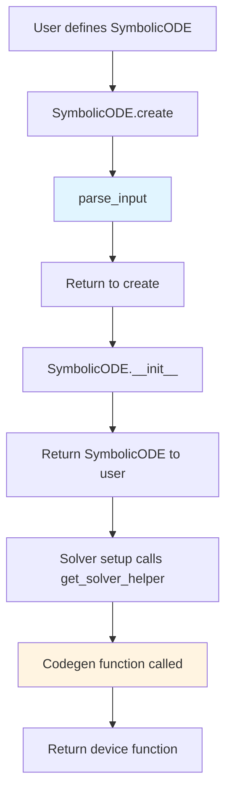

# Codegen and Parsing Timing Instrumentation

## User Stories

### Story 1: Developer Performance Analysis
**As a** CuBIE developer  
**I want** timing data for code generation and parsing operations  
**So that** I can identify performance bottlenecks in the symbolic compilation pipeline

**Acceptance Criteria:**
- Parsing time is recorded from the start of `parse_input()` to the return of the `SymbolicODE` object in `SymbolicODE.create()`
- Each codegen function registers a timing event with category "codegen" and appropriate description
- Codegen timing events are started at function entry and stopped at function return
- Timing data is collected through the existing `TimeLogger` infrastructure
- All timing events respect the global timing verbosity setting (no output when verbosity is None)

### Story 2: Solver Helper Timing
**As a** CuBIE developer  
**I want** timing data for solver helper generation  
**So that** I can understand which helper functions contribute most to compilation overhead

**Acceptance Criteria:**
- Each call to `get_solver_helper()` in the `SymbolicODE` class is timed individually
- Helper timing events use descriptive names that identify which helper is being generated
- Timing includes the full codegen and factory instantiation process
- Multiple calls to the same helper type are tracked separately with cumulative duration available

## Overview

This feature adds comprehensive timing instrumentation to the symbolic ODE compilation pipeline, specifically targeting code generation and parsing operations. The implementation leverages the existing `TimeLogger` infrastructure that was recently added to CuBIE, extending timing coverage from runtime operations to the compile-time symbolic processing phase.

### Architecture Context



### Timing Points

**Parsing Phase:**
- **Start**: Entry to `parse_input()` function
- **Stop**: Return from `SymbolicODE.create()` classmethod
- **Event Name**: `"symbolic_ode_parsing"`
- **Category**: `"codegen"`

**Codegen Phase (per function):**
Each of the following functions will have timing instrumentation:
- `generate_dxdt_fac_code()`
- `generate_observables_fac_code()`
- `generate_operator_apply_code()`
- `generate_cached_operator_apply_code()`
- `generate_prepare_jac_code()`
- `generate_cached_jvp_code()`
- `generate_neumann_preconditioner_code()`
- `generate_neumann_preconditioner_cached_code()`
- `generate_stage_residual_code()`
- `generate_time_derivative_fac_code()`
- `generate_n_stage_residual_code()`
- `generate_n_stage_linear_operator_code()`
- `generate_n_stage_neumann_preconditioner_code()`

**Solver Helper Calls:**
- Timing in `get_solver_helper()` method wraps each complete helper generation

### Data Flow

```mermaid
sequenceDiagram
    participant User
    participant Create as SymbolicODE.create()
    participant Parser as parse_input()
    participant GetHelper as get_solver_helper()
    participant Codegen as Codegen Functions
    participant Logger as TimeLogger
    
    User->>Create: create(dxdt, states, ...)
    Create->>Logger: start_event("symbolic_ode_parsing")
    Create->>Parser: parse_input(...)
    Parser-->>Create: return parsed components
    Create->>Create: __init__(equations, ...)
    Create->>Logger: stop_event("symbolic_ode_parsing")
    Create-->>User: return SymbolicODE instance
    
    User->>GetHelper: get_solver_helper("linear_operator", ...)
    GetHelper->>Logger: start_event("solver_helper_linear_operator")
    GetHelper->>Codegen: generate_operator_apply_code(...)
    Codegen->>Logger: start_event("codegen_generate_operator_apply_code")
    Codegen-->>GetHelper: return code string
    Codegen->>Logger: stop_event("codegen_generate_operator_apply_code")
    GetHelper->>GetHelper: compile factory
    GetHelper->>Logger: stop_event("solver_helper_linear_operator")
    GetHelper-->>User: return device function
```

### Key Technical Decisions

**1. Global TimeLogger Access**
- Use the existing `_default_logger` instance from `cubie.time_logger`
- No need to pass logger instances through the call stack
- Maintains consistency with existing timing in `CUDAFactory` base class

**2. Event Registration Strategy**
- Register parsing event once in `SymbolicODE.create()` before first use
- Register codegen events at module level (executed once on import)
- Register solver helper events lazily in `get_solver_helper()` on first call per helper type

**3. Event Naming Convention**
- Parsing: `"symbolic_ode_parsing"`
- Codegen: `"codegen_{function_name}"` (e.g., `"codegen_generate_dxdt_fac_code"`)
- Solver helpers: `"solver_helper_{func_type}"` (e.g., `"solver_helper_linear_operator"`)

**4. Non-invasive Implementation**
- Timing calls added at function boundaries only
- No modification to core logic or algorithms
- Respects existing `verbosity=None` for zero-overhead when disabled

### Expected Impact

**Minimal Performance Overhead:**
- When `verbosity=None`: No-op function calls with negligible cost
- When enabled: Microsecond-level overhead per timing point (acceptable for compilation phase)

**Developer Insights:**
- Identify which codegen functions dominate compilation time
- Distinguish parsing time from code generation time
- Track solver helper generation overhead per helper type
- Support future optimization efforts with data-driven profiling

### Trade-offs Considered

**Alternative 1: Decorator-based timing**
- **Pros**: Cleaner, more declarative syntax
- **Cons**: Harder to provide descriptive event names, additional complexity for conditional registration
- **Decision**: Rejected in favor of explicit timing calls for clarity and control

**Alternative 2: Context manager timing**
- **Pros**: Automatic stop on exception, guaranteed cleanup
- **Cons**: Requires indentation changes, less obvious in flat function structure
- **Decision**: Rejected to minimize code changes and maintain existing style

**Alternative 3: Separate timing category for parsing**
- **Pros**: Clearer separation of concerns
- **Cons**: Parsing is fundamentally part of code generation pipeline
- **Decision**: Rejected; using "codegen" category for both parsing and generation maintains logical grouping
