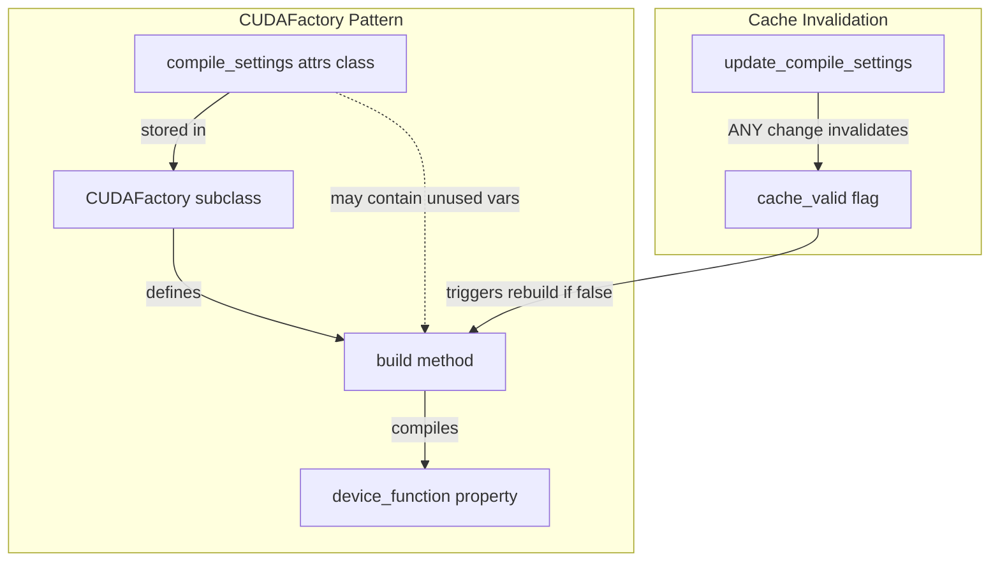
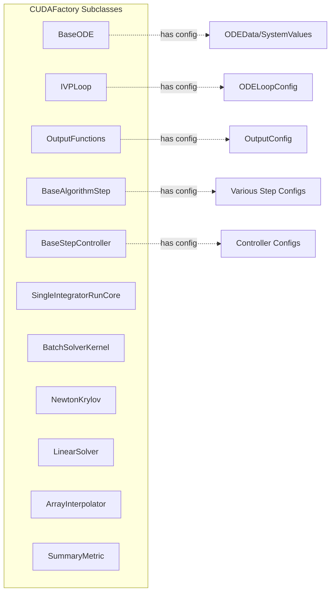

# Compile Settings Cleanup - Human Overview

## User Stories

### User Story 1: Minimal Compile Settings for Caching
**As a** CuBIE developer implementing the caching system  
**I want** compile_settings objects to contain only variables actually used in build chains  
**So that** cache invalidation triggers only when truly relevant parameters change

**Acceptance Criteria:**
- Every variable in a compile_settings object must be either:
  1. Directly used in the build() method, OR
  2. Used to derive a parameter that IS used in the build() chain, OR
  3. Part of a base class where subclasses use it in their build() chains
- All other variables are removed from compile_settings objects
- Properties that pass through deleted variables are either rerouted to child objects or deleted
- The codebase builds and passes all existing tests after cleanup

### User Story 2: Correct Cache Invalidation Behavior
**As a** user of the CuBIE library  
**I want** CUDA device functions to recompile only when parameters affecting compilation actually change  
**So that** I get optimal performance without unnecessary recompilations

**Acceptance Criteria:**
- Changing a parameter used in build() chains invalidates the cache (existing behavior maintained)
- Changing a parameter NOT used in build() chains does NOT invalidate the cache (new behavior after cleanup)
- No false cache invalidations occur due to unrelated parameter changes

### User Story 3: Preparation for Caching Implementation
**As a** CuBIE developer  
**I want** compile_settings objects to be minimal before implementing the caching system  
**So that** the caching implementation can proceed without dealing with legacy cruft

**Acceptance Criteria:**
- All CUDAFactory subclasses are analyzed and cleaned up
- Documentation clearly indicates which variables are compile-critical vs runtime-configurable
- The cleanup is complete before the caching system implementation begins

## Overview

This feature systematically removes redundant variables from all `compile_settings` attrs classes used by CUDAFactory subclasses throughout the CuBIE codebase. The cleanup is critical preparation for the upcoming caching implementation, which requires minimal compile_settings to ensure cache invalidation only occurs when compilation-relevant parameters change.

### Current Architecture



### Problem

Many compile_settings objects contain variables that are NOT used in their respective build() chains. When these variables change, the cache is invalidated unnecessarily, causing expensive CUDA recompilations. This happens because the CUDAFactory base class compares entire compile_settings objects for equality.

**Example Problem Pattern:**
```python
@define
class SomeConfig:
    precision: PrecisionDType  # Used in build()
    n: int  # Used in build()
    some_flag: bool  # NOT used anywhere - REDUNDANT
    helper_data: array  # Used to derive X, but X not used - REDUNDANT
```

### Solution Approach

1. **Analyze each CUDAFactory subclass** to identify its build chain
2. **Trace variable usage** from compile_settings through build() and any methods it calls
3. **Categorize variables** as:
   - **Keep**: Directly used in build chain
   - **Keep**: Used to derive parameters that ARE used in build chain  
   - **Keep**: Part of base class used by subclasses
   - **Delete**: Everything else
4. **Handle properties** that reference deleted variables:
   - Reroute to child object properties if applicable
   - Delete if no alternative source exists
5. **Update ALL_*_PARAMETERS sets** to remove deleted parameter names

### Affected Components



### Technical Decisions

**Decision 1: Conservative Deletion**
- Rationale: Better to keep a borderline variable than delete one that's subtly used
- Implementation: When in doubt, mark for manual review rather than auto-delete

**Decision 2: Properties Rerouting**
- Rationale: Maintain API compatibility where possible
- Implementation: If a child object has equivalent property, reroute parent property to child

**Decision 3: Test Coverage Priority**
- Rationale: Ensure no behavior changes
- Implementation: All existing tests must pass after cleanup

### Expected Impact

**Benefits:**
- Reduced false cache invalidations → faster iteration during development
- Cleaner, more maintainable compile_settings definitions
- Foundation for efficient caching system implementation
- Clearer separation of compile-time vs runtime configuration

**Risks:**
- Potential to delete a subtly-used variable (mitigated by careful analysis)
- Properties may break if they reference deleted variables (requires rerouting or deletion)
- Tests may need updates if they explicitly set redundant parameters

### Research Findings

**CUDAFactory Subclasses Identified:**
1. `BaseODE` - ODE system definitions
2. `IVPLoop` - Integration loop orchestration
3. `OutputFunctions` - Output and summary management
4. `BaseAlgorithmStep` and children - Integration algorithms
5. `BaseStepController` and children - Step size control
6. `SingleIntegratorRunCore` - Run coordination
7. `BatchSolverKernel` - Batch execution
8. `NewtonKrylov` - Nonlinear solver
9. `LinearSolver` - Linear solver
10. `ArrayInterpolator` - Driver interpolation
11. `SummaryMetric` and children - Metric calculations

**Common Patterns:**
- Many configs have buffer location parameters (`*_location`) - these ARE used via buffer_registry
- Precision-related fields typically used (precision, numba_precision, simsafe_precision)
- Device function references (callbacks) are used in build chains
- Size parameters (n_states, n_parameters, etc.) typically used
- Some timing parameters may be unused if not referenced in device code

**Key Files:**
- `/src/cubie/integrators/loops/ode_loop_config.py` - Loop configuration
- `/src/cubie/outputhandling/output_config.py` - Output configuration
- Algorithm-specific config classes in `/src/cubie/integrators/algorithms/`
- Controller config classes in `/src/cubie/integrators/step_control/`
