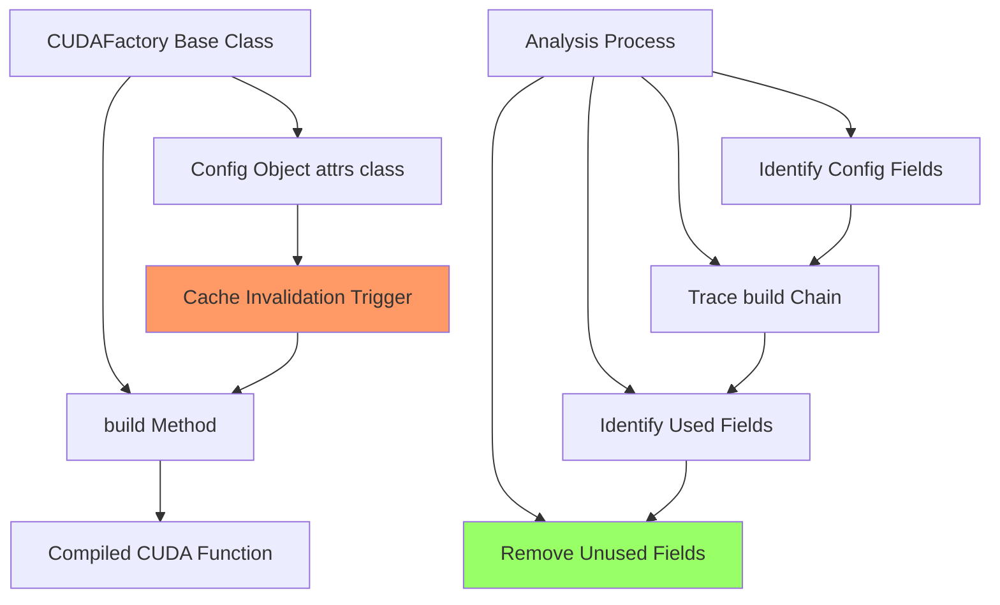
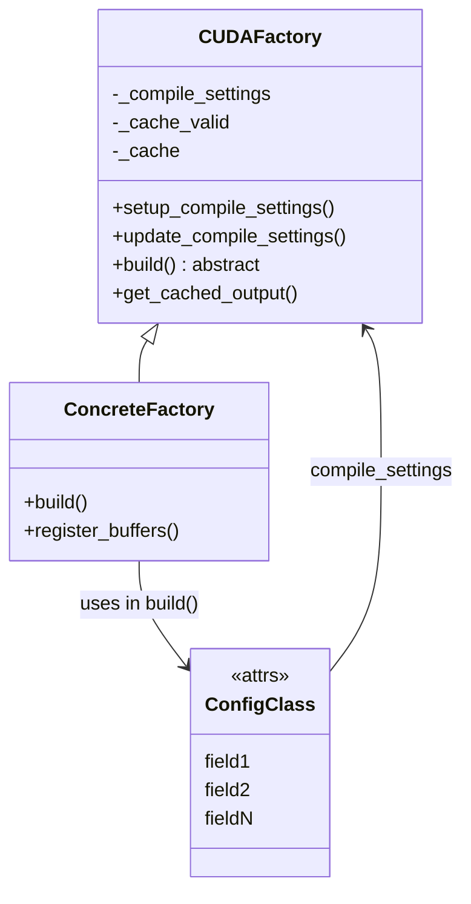
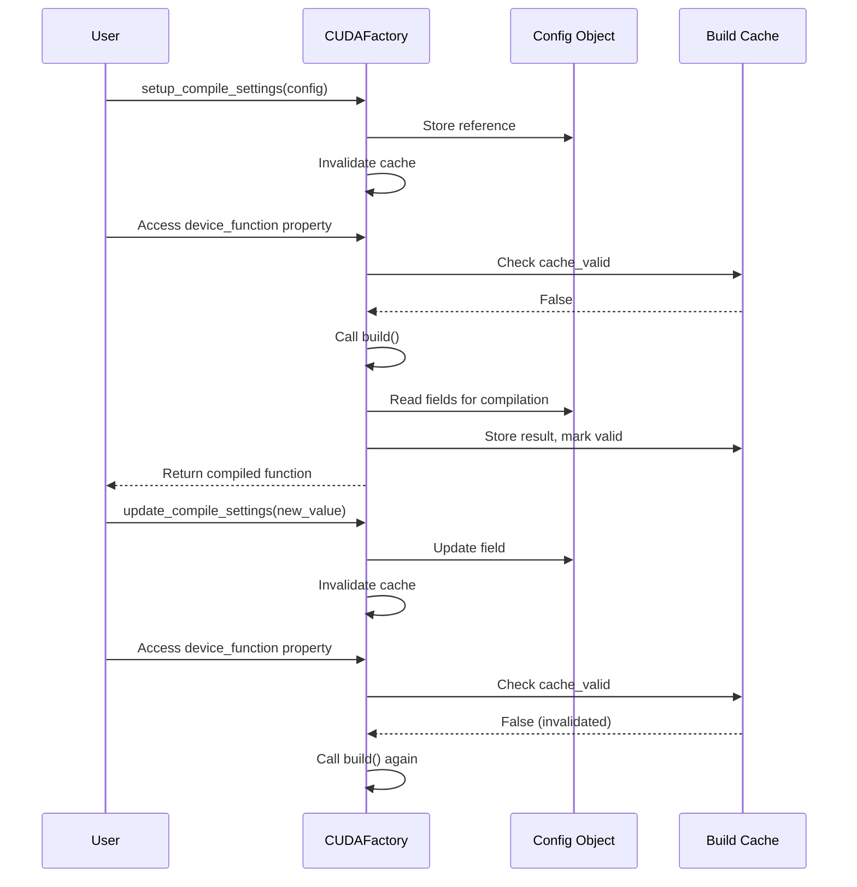

# Compile Settings Cleanup for Caching Implementation

## User Stories

### User Story 1: Minimal Cache Invalidation
**As a** CuBIE developer implementing caching,  
**I want** compile settings to contain only the variables that actually affect compilation,  
**So that** cache invalidation only occurs when truly necessary, maximizing cache hit rates.

**Acceptance Criteria:**
- Each config object contains only fields used in its corresponding build() chain
- No redundant fields remain in any config object
- All tests pass after cleanup
- Codebase documentation accurately reflects the minimal config objects

### User Story 2: Clear Compilation Dependencies
**As a** developer maintaining the CuBIE codebase,  
**I want** compile settings to clearly show what parameters affect compilation,  
**So that** I can understand compilation dependencies without tracing through complex code paths.

**Acceptance Criteria:**
- Every field in a config object is demonstrably used in compilation
- The relationship between config fields and build() usage is traceable
- Config objects serve as clear documentation of compilation parameters

### User Story 3: Isolated Analysis Per Factory
**As a** developer analyzing compilation dependencies,  
**I want** each CUDAFactory/config pair analyzed in complete isolation,  
**So that** I don't accidentally conflate usage from different factories or confuse shared base class fields with subclass-specific usage.

**Acceptance Criteria:**
- Analysis tracks each CUDAFactory subclass separately
- Base class config fields are only removed if they're unused across all subclasses that share that base
- No cross-contamination between different factory analyses

## Overview

### Executive Summary

This task prepares the CuBIE codebase for caching implementation by removing redundant compile settings from all CUDAFactory config objects. The CUDAFactory pattern uses attrs classes as compile settings, and changes to these settings trigger cache invalidation. Currently, config objects may contain fields that are not used during compilation, which could cause spurious cache invalidations.

The cleanup involves systematically analyzing each CUDAFactory subclass, identifying which config fields are actually used in the build() method chain, and removing unused fields. This will minimize false cache invalidations when caching is implemented.

### Architectural Context

### CUDAFactory Architecture

### Data Flow: Compilation and Caching

### Analysis Approach

The analysis will follow this systematic approach for each CUDAFactory subclass:

1. **Isolation**: Analyze each factory completely independently
2. **Config Identification**: Locate the config class used by the factory
3. **Build Chain Tracing**: Follow build() → any helper methods → nested build() calls
4. **Usage Detection**: Identify all config fields accessed in the build chain
5. **Derived Parameter Handling**: Keep fields used to derive other used parameters
6. **Base Class Consideration**: For shared base configs, only remove if unused across all subclasses
7. **Removal**: Delete fields not used anywhere in the chain

### Known CUDAFactory Subclasses

The codebase contains these CUDAFactory subclasses (each requires independent analysis):

**Core Infrastructure:**
- `CUDAFactory` (base class, no analysis needed)
- `BaseODE` → `ODEData` (system data container)

**Integration Components:**
- `SingleIntegratorRunCore` → `SingleIntegratorRunCache`
- `IVPLoop` → `ODELoopConfig`
- `ArrayInterpolator` → `ArrayInterpolatorConfig`

**Algorithm Steps:**
- `BaseAlgorithmStep` → `BaseStepConfig`
- Various algorithm subclasses (ERK, DIRK, FIRK, RosenbrockW, etc.)

**Step Controllers:**
- `BaseStepController` → `BaseStepControllerConfig`
- `FixedStepController` → `FixedStepControlConfig`
- Adaptive controllers (I, PI, PID, Gustafsson)

**Matrix-Free Solvers:**
- `NewtonKrylov` → `NewtonKrylovConfig`
- `LinearSolver` → `LinearSolverConfig`

**Output Handling:**
- `OutputFunctions` → `OutputConfig`
- `SummaryMetric` → `MetricConfig`

**Batch Solving:**
- `BatchSolverKernel` → (uses `BatchSolverConfig`)

### Expected Impact

**Benefits:**
1. Reduced spurious cache invalidations
2. Clearer documentation of compilation dependencies
3. Smaller config objects (less memory, faster comparison)
4. Preparation for efficient caching implementation

**Risks:**
1. Incorrect removal could break compilation
2. Shared base class configs need careful analysis
3. Must not break existing tests

**Mitigation:**
- Complete test suite execution after each factory cleanup
- Conservative approach: when in doubt, keep the field
- Document removal decisions for future reference

### Trade-offs and Alternatives

**Considered Alternatives:**

1. **Keep all fields, use @frozen for immutability**
   - Pro: No risk of incorrect removal
   - Con: Spurious cache invalidations remain
   - Decision: Rejected - defeats caching optimization

2. **Manual inspection without systematic process**
   - Pro: Faster initial pass
   - Con: High error rate, inconsistent results
   - Decision: Rejected - too risky

3. **Automated static analysis tool**
   - Pro: Fast, comprehensive
   - Con: Complex to implement, may miss dynamic usage
   - Decision: Considered for future but manual for now

4. **Systematic manual analysis (chosen)**
   - Pro: Thorough, controlled, documentable
   - Con: Time-intensive
   - Decision: **SELECTED** - best balance of thoroughness and safety

### Key Technical Decisions

**Decision 1: Isolated Analysis Per Factory**
- Rationale: Prevents cross-contamination, ensures correctness
- Impact: More work but higher confidence

**Decision 2: Conservative Removal Criteria**
- Keep fields if:
  - Directly used in build() chain
  - Used to derive parameters used in build() chain
  - Part of shared base config used by any subclass
- Remove only if provably unused
- Rationale: Safety over optimization

**Decision 3: Complete Test Validation**
- Run full test suite after each factory cleanup
- Rationale: Catch breaks immediately, isolate problems

### Integration with Existing Architecture

The cleanup integrates with CuBIE's existing patterns:

- **Buffer Registry**: Location parameters (e.g., `state_location`) are used by buffer registry, NOT directly in build() - these ARE used and must be kept
- **Attrs Classes**: All config objects use attrs for equality comparison
- **Property Wrapping**: Precision-based properties must keep their underlying fields
- **Nested Updates**: Config objects may have nested attrs or dicts - analysis must follow these

### Research Findings

From examining `OutputFunctions` and `IVPLoop`:

1. **Pattern**: Config fields accessed via `self.compile_settings.field_name` in build()
2. **Buffer locations**: Used by `register_buffers()`, which affects build() through allocators
3. **Derived values**: Properties that derive from config fields must keep those fields
4. **Flags**: Boolean compile flags are typically all used (control conditional compilation)
5. **Indices**: Arrays like `saved_state_indices` are used in factory functions

**Example from OutputConfig:**
- All index arrays are used (passed to factory functions)
- All buffer heights are used (sizing calculations)
- `compile_flags` is used (conditional compilation)
- `precision` is used (type conversions)
- `sample_summaries_every` is used (passed to metrics)

**Example from ODELoopConfig:**
- All size parameters (`n_states`, etc.) are used (loop bounds, allocations)
- All location parameters are used (buffer registry)
- All function parameters are used (called in loop)
- All timing parameters are used (loop control)
