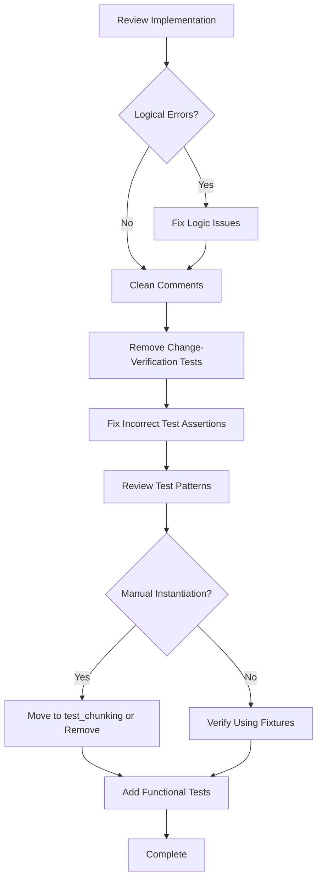

# Complete Array Coupling Refactor - Human Overview

## User Stories

### US1: Clean Refactored Codebase
**As a** developer working on CuBIE  
**I want** the array coupling refactor to be fully complete with no remnants of the change process  
**So that** the codebase is clean, maintainable, and documentation accurately reflects current behavior

**Acceptance Criteria:**
- No comments in source code reference the refactoring process or old implementation
- No tests exist that verify "this field was removed" or "this method no longer exists"
- All test files follow the established fixture pattern (no manual solver instantiation)
- Tests focus on verifying desired functionality, not the fact that changes occurred

### US2: Correct Chunking Behavior
**As a** user of CuBIE  
**I want** array chunking to work correctly along the designated chunk axis  
**So that** large batches can be processed without memory errors and produce correct results

**Acceptance Criteria:**
- ArrayRequest uses chunk_axis_index to specify chunking dimension
- ArrayResponse does not contain removed fields (dangling_chunk_index, axis_length)
- Memory manager correctly chunks arrays based on chunk_axis_index
- Chunked and unchunked executions produce identical results
- Tests verify chunking functionality using proper fixtures

### US3: Consistent Test Architecture
**As a** developer maintaining the test suite  
**I want** all chunk-related tests to follow the established pattern in test_chunking.py  
**So that** tests are maintainable, consistent, and don't duplicate solver instantiation logic

**Acceptance Criteria:**
- Chunk-related tests use solved_solver and chunked_solved_solver fixtures
- No tests manually instantiate Solver, BatchSolverKernel, or call .solve() or .run()
- Tests in test_chunking.py use the dedicated fixtures from conftest.py
- Tests verify runparams and results, not implementation details

## Overview

This plan completes a partially-implemented refactoring that reduces coupling between array management and memory management. The changes aimed to:

1. **Simplify ArrayRequest**: Remove stride_order (now using chunk_axis_index)
2. **Simplify ArrayResponse**: Remove axis_length and dangling_chunk_index 
3. **Add explicit chunking control**: chunk_axis_index specifies which axis to chunk
4. **Remove implicit assumptions**: The old assertion that "CuBIE chunks on axis 0 by convention" was removed

### Current State

The refactor was partially completed:
- ✅ ArrayRequest.stride_order removed
- ✅ ArrayRequest.chunk_axis_index added
- ✅ ArrayResponse.axis_length removed (appears to be done)
- ✅ dangling_chunk_index references removed
- ⚠️ Tests added that verify the change occurred (should be removed)
- ⚠️ Comments in tests reference the refactoring process
- ⚠️ One test file (test_array_response_no_chunked_slices.py) has incorrect assertions

### Required Actions

### Key Technical Decisions

1. **chunk_axis_index is explicit**: Rather than inferring from stride_order, chunking axis is explicitly specified
2. **ManagedArray computes its own chunk_axis_index**: From stride_order.index("run") in `__attrs_post_init__`
3. **ArrayResponse simplified**: Only contains what's needed (arr, chunks, chunk_length, chunked_shapes)
4. **Test architecture**: Chunk tests belong in test_chunking.py using established fixtures

### Impact on Existing Architecture

**Before:**
- ArrayRequest had stride_order 
- Code inferred chunking axis from stride order
- ArrayResponse contained redundant metadata (axis_length, dangling_chunk_index)

**After:**
- ArrayRequest has explicit chunk_axis_index
- Direct specification of chunking dimension
- ArrayResponse contains minimal necessary data
- Memory manager uses chunk_axis_index directly

### References to Research

Key files examined:
- `src/cubie/memory/array_requests.py` - ArrayRequest/ArrayResponse definitions
- `src/cubie/memory/mem_manager.py` - Memory manager using chunk_axis_index
- `src/cubie/batchsolving/arrays/BaseArrayManager.py` - ManagedArray with _chunk_axis_index
- `tests/memory/test_array_request_no_stride_order.py` - Change-verification test (remove)
- `tests/memory/test_array_response_no_chunked_slices.py` - Incorrect test (fix/remove)
- `tests/batchsolving/arrays/test_chunking.py` - Proper chunking tests (pattern to follow)

### Trade-offs

**Chosen Approach: Complete the Refactor**
- ✅ Clean codebase without technical debt
- ✅ Tests verify behavior, not change history
- ✅ Consistent test patterns throughout
- ⚠️ Requires careful review to not break functionality

**Alternative: Leave as-is**
- ❌ Tests that are meaningless once change is complete
- ❌ Comments confuse future developers
- ❌ Inconsistent test patterns
