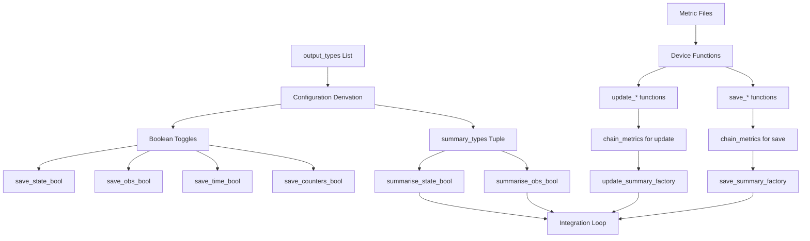

# Summary Metrics Integration in all_in_one.py - Overview

## User Stories

### Story 1: Complete Summary Metrics Coverage
**As a** developer using the all_in_one.py debug script for NVIDIA profiling,  
**I want** ALL 18+ summary metrics implemented inline matching verbatim package code,  
**So that** the debug script provides complete parity with production for profiling analysis.

**Acceptance Criteria:**
- All 18+ summary metric device functions (update and save) are inline in all_in_one.py
- Each metric device function is a word-for-word exact match with its source in `src/cubie/outputhandling/summarymetrics/`
- Metrics include: mean, max, min, rms, std, mean_std, mean_std_rms, std_rms, extrema, peaks, negative_peaks, max_magnitude, dxdt_max, dxdt_min, dxdt_extrema, d2xdt2_max, d2xdt2_min, d2xdt2_extrema
- No metric is missing or only partially implemented

### Story 2: Verbatim Chaining Factory Functions
**As a** developer debugging integration loops with the profiler,  
**I want** the chaining factory functions to be exact verbatim copies of package source,  
**So that** the behavior matches production code exactly for meaningful profiling.

**Acceptance Criteria:**
- `do_nothing()` from update_summaries.py (lines 29-61) is copied verbatim
- `chain_metrics()` from update_summaries.py (lines 64-161) is copied verbatim
- `update_summary_factory()` from update_summaries.py (lines 164-280) is copied verbatim
- `do_nothing()` from save_summaries.py (lines 29-60) is copied verbatim
- `chain_metrics()` from save_summaries.py (lines 63-180) is copied verbatim
- `save_summary_factory()` from save_summaries.py (lines 183-326) is copied verbatim
- All function signatures, docstrings, and implementation logic are word-for-word matches

### Story 3: List-Based Configuration System
**As a** developer configuring output types for the debug script,  
**I want** a list-based output configuration system matching the package's `output_config.py`,  
**So that** I can easily enable/disable outputs using the same patterns as production code.

**Acceptance Criteria:**
- Configuration uses an `output_types` list (e.g., `['state', 'mean', 'max']`)
- Boolean toggles are derived from the list exactly as in `output_config.py` lines 818-874
- `save_state_bool`, `save_obs_bool`, `save_time_bool`, `save_counters_bool` are derived
- `summary_types` tuple is extracted from metrics found in output_types
- `summarise_state_bool` and `summarise_obs_bool` are derived from summary_types and save flags
- Derivation logic is a verbatim match with `update_from_outputs_list()` method

## Executive Summary

The all_in_one.py debug script currently has minimal stubs for summary metrics (only mean implemented, with non-verbatim chaining). This task requires completing the integration of ALL summary metrics with exact verbatim matches to package source code, implementing proper chaining factory patterns, and adding list-based configuration.

The implementation must be surgical: copy exact code from package source without any modifications. The debug script is used for NVIDIA profiler analysis, so exact behavioral parity with production code is critical.

## Architecture Overview



## Data Flow: Summary Metrics in Integration Loop

```mermaid
sequenceDiagram
    participant Loop as Integration Loop
    participant Update as update_summaries_inline
    participant Chain as chain_update_metrics
    participant Metrics as Metric Device Functions
    participant Save as save_summaries_inline
    participant SaveChain as chain_save_metrics
    
    Loop->>Update: current_state, buffers, step
    Update->>Chain: For each state variable
    Chain->>Metrics: update_mean, update_max, etc.
    Metrics-->>Chain: Buffer updated
    Chain-->>Update: Complete
    Update-->>Loop: Accumulation done
    
    Note over Loop: Every dt_save interval
    
    Loop->>Save: buffers, outputs, summarise_every
    Save->>SaveChain: For each state variable
    SaveChain->>Metrics: save_mean, save_max, etc.
    Metrics-->>SaveChain: Output written, buffer reset
    SaveChain-->>Save: Complete
    Save-->>Loop: Summary saved
```

## Key Technical Decisions

### Decision 1: Verbatim Copy Strategy
**Rationale:** The all_in_one.py script is a debug solution for NVIDIA profiler that requires inline code. To ensure behavioral parity with production, all device functions and factories must be exact word-for-word copies.

**Implementation:** Use exact copy-paste from source files with no modifications. Include docstrings, comments, and all implementation details exactly as they appear in package source.

### Decision 2: All Metrics Required
**Rationale:** User requirements explicitly state ALL metrics must be implemented, not just a subset. Previous attempts that only added mean were rejected as unacceptable.

**Implementation:** Copy all 18+ metric pairs (update/save) from the summarymetrics directory, ensuring complete coverage of: basic stats (mean, max, min, rms, std), composite stats (mean_std, mean_std_rms, std_rms), extrema tracking (extrema, peaks, negative_peaks, max_magnitude), and derivative tracking (dxdt_max, dxdt_min, dxdt_extrema, d2xdt2_max, d2xdt2_min, d2xdt2_extrema).

### Decision 3: List-Based Configuration
**Rationale:** The package uses a list-based output configuration system that's cleaner and more maintainable than manual boolean flags. The debug script should match this pattern.

**Implementation:** Replace hardcoded boolean flags with derivation from `output_types` list, exactly matching the logic in `update_from_outputs_list()` method (lines 818-874 of output_config.py).

## Expected Impact

### Integration Points
1. **Configuration Section** (lines ~150-160): Replace boolean flags with list-based derivation
2. **Summary Metrics Section** (lines ~3380-3550): Expand from mean-only to all 18+ metrics
3. **Chaining Functions** (new): Add verbatim chaining factory functions
4. **Loop Integration** (existing): No changes needed - current integration pattern is correct

### Buffer Sizing
- Current: 1 slot per variable for mean only
- Required: Dynamic sizing based on `summary_types` configuration
- Each metric has specific buffer_size and output_size requirements
- Total buffer size per variable = sum of all enabled metric buffer sizes

### No Breaking Changes
The existing integration loop code doesn't need modification. The factory functions produce drop-in replacements for the current minimal stubs. The only changes are:
1. Expanding metric device functions
2. Adding factory functions
3. Updating configuration system

## References

### Package Source Files
- `/home/runner/work/cubie/cubie/src/cubie/outputhandling/summarymetrics/*.py` - All 19 metric files
- `/home/runner/work/cubie/cubie/src/cubie/outputhandling/update_summaries.py` - Update chaining
- `/home/runner/work/cubie/cubie/src/cubie/outputhandling/save_summaries.py` - Save chaining
- `/home/runner/work/cubie/cubie/src/cubie/outputhandling/output_config.py` - Configuration logic

### Debug Script
- `/home/runner/work/cubie/cubie/tests/all_in_one.py` - Target file for modifications

### Integration Pattern Reference
- `/home/runner/work/cubie/cubie/src/cubie/integrators/loops/ode_loop.py` - Shows how summaries integrate with loops

## Trade-offs and Alternatives

### Alternative 1: Import from Package
**Rejected:** NVIDIA profiler requires inline code for proper line-level debugging. Importing defeats the purpose of all_in_one.py.

### Alternative 2: Partial Implementation
**Rejected:** User explicitly stated agents may NOT skip tasks and ALL metrics are required.

### Alternative 3: Simplified/Modified Code
**Rejected:** User requires VERBATIM word-for-word matches. Any deviation would break behavioral parity needed for profiling.

## Success Metrics

1. **Completeness:** All 18+ metrics have both update and save device functions inline
2. **Exactness:** Each function is a verbatim match verified by diff/comparison
3. **Functionality:** Configuration derivation produces correct boolean toggles
4. **Integration:** Existing loop code works without modification
5. **No Regressions:** Script continues to function for its intended profiling use case
