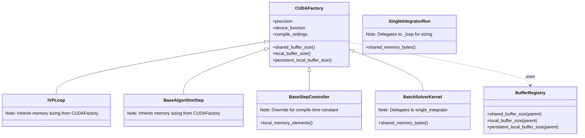

# Consolidate Memory Sizing Properties to Base CUDAFactory Class

## User Stories

### US1: As a CuBIE maintainer, I want a single source of truth for memory sizing
**Story**: As a maintainer of CuBIE, I want memory sizing properties to be consolidated in the base `CUDAFactory` class so that I don't have to maintain duplicate implementations across multiple classes.

**Acceptance Criteria**:
- Three core memory sizing properties exist on the base `CUDAFactory` class
- These properties delegate to the `buffer_registry` singleton
- All CUDAFactory subclasses inherit these properties automatically
- No redundant memory sizing properties exist in subclasses that duplicate base class functionality

### US2: As a CuBIE maintainer, I want child-specific memory properties removed
**Story**: As a maintainer, I want legacy child-specific memory properties (like `loop_local_elements` or `local_memory_elements_controller`) removed from higher-level aggregation classes since the buffer_registry now handles hierarchical memory sizing.

**Acceptance Criteria**:
- `SingleIntegratorRun.local_memory_elements_loop` is removed
- `SingleIntegratorRun.shared_memory_elements_loop` is removed  
- `SingleIntegratorRun.local_memory_elements_controller` is removed
- Tests that reference these deleted properties are updated or removed

### US3: As a CuBIE maintainer, I want consistent naming for memory sizing properties
**Story**: As a maintainer, I want memory sizing property names to be consistent across the codebase, following the pattern used by `buffer_registry`.

**Acceptance Criteria**:
- Properties consistently named: `shared_buffer_size`, `local_buffer_size`, `persistent_local_buffer_size`
- Existing `*_elements` variants either consolidated to new names or removed as redundant

---

## Overview

### Executive Summary

The buffer_registry module now provides centralized memory allocation management for all CUDA factories. However, memory sizing properties remain distributed across multiple classes with redundant implementations. This plan consolidates these properties to the base `CUDAFactory` class, eliminating duplication and establishing a single source of truth.

### Current State

### Proposed State

### Key Technical Decisions

1. **Three core properties on CUDAFactory**:
   - `shared_buffer_size` - delegates to `buffer_registry.shared_buffer_size(self)`
   - `local_buffer_size` - delegates to `buffer_registry.local_buffer_size(self)`
   - `persistent_local_buffer_size` - delegates to `buffer_registry.persistent_local_buffer_size(self)`

2. **Step controller exception**: Step controllers define `local_memory_elements` as an abstract property returning a compile-time constant (e.g., 3 for PID, 2 for PI). This is NOT redundant - it's used by `register_buffers()` to register the buffer with the registry. The buffer_registry then tracks this, and the base class property would return the same value.

3. **Aggregation properties retained**: `SingleIntegratorRun` and `BatchSolverKernel` still need to expose memory sizing for their composed children. These delegate to the appropriate child objects rather than using buffer_registry directly.

4. **Child-specific properties removed**: Properties like `local_memory_elements_loop` and `local_memory_elements_controller` in `SingleIntegratorRun` are legacy and should be removed.

### Data Flow

### Impact on Existing Architecture

- **Minimal breaking changes**: Subclasses that already delegate to buffer_registry will work unchanged
- **Test updates required**: Tests checking for removed properties need updating
- **Naming consistency**: Some properties use `*_elements` naming which differs from `*_buffer_size` in buffer_registry

### Trade-offs Considered

| Approach | Pros | Cons |
|----------|------|------|
| Add properties to CUDAFactory | Single source of truth, automatic inheritance | Requires buffer_registry import in CUDAFactory |
| Keep distributed properties | No changes needed | Continued duplication, maintenance burden |
| Remove all sizing properties | Minimal code | Breaks existing API for consumers |

**Chosen**: Add properties to CUDAFactory with delegation to buffer_registry. This provides clean inheritance while maintaining backward compatibility for consumers.

---

## References

- `src/cubie/buffer_registry.py` - Central buffer management
- `src/cubie/CUDAFactory.py` - Base factory class to be modified
- `tests/batchsolving/test_config_plumbing.py` - Primary plumbing tests
