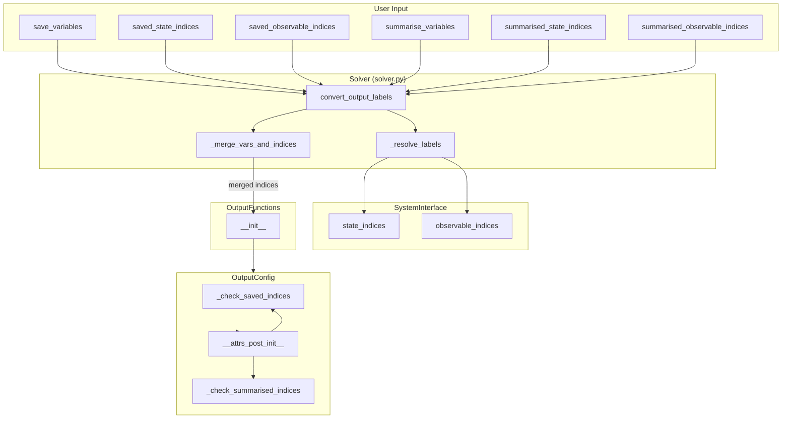
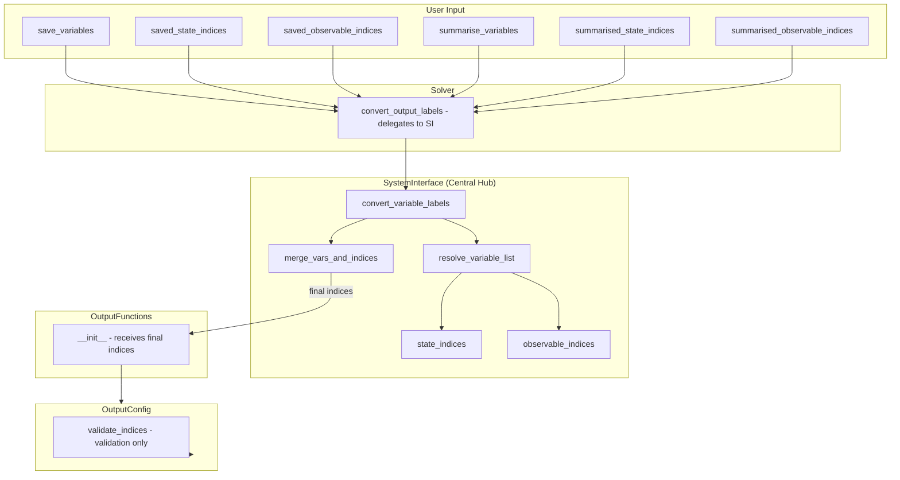

# Variable Interface Consolidation - Human Overview

## User Stories

### US-1: Consistent Variable List Input Handling
**As a** CuBIE user,  
**I want** variable list inputs (`save_variables`, `summarise_variables`, and their index counterparts) to behave consistently across the API,  
**So that** I can predictably control which variables are saved or summarised without unexpected defaults.

**Acceptance Criteria:**
- When I provide `None` for variable lists AND index lists, all variables are selected (default "all" behavior)
- When I provide an empty list `[]` or empty array, no variables are selected (explicit "none" behavior)
- When I provide variables in both label lists and index lists, the union of both is used
- The behavior is consistent whether I use `Solver()`, `solve_ivp()`, or update settings dynamically

### US-2: Single Source of Truth for Variable Resolution
**As a** CuBIE maintainer,  
**I want** variable resolution logic (`_resolve_labels`, `_merge_vars_and_indices`, `convert_output_labels`) to live in a single location within `SystemInterface`,  
**So that** the codebase is easier to maintain and behavior is consistent.

**Acceptance Criteria:**
- All variable label resolution flows through `SystemInterface`
- `Solver` delegates variable handling to `SystemInterface` rather than implementing logic directly
- No duplicate logic exists between `Solver`, `OutputConfig`, or other components
- The API remains backward compatible for existing use cases

### US-3: Clean Data Flow Path
**As a** CuBIE developer,  
**I want** a clear, traceable data flow from user input through to output functions,  
**So that** debugging variable selection issues is straightforward.

**Acceptance Criteria:**
- Each function in the variable resolution path has a unique, well-defined purpose
- Unused or redundant logic is eliminated
- The pathway from user input → solve_ivp → Solver → BatchSolverKernel → SingleIntegratorRun → OutputFunctions → OutputConfig is documented and clean

---

## Overview

### Executive Summary

This consolidation task addresses redundant and inconsistent variable handling logic across CuBIE's batch solving infrastructure. Currently, the pathway from user input to output configuration involves multiple conversion steps distributed across `Solver`, `SystemInterface`, `OutputConfig`, and `OutputFunctions`. The goal is to centralize variable resolution in `SystemInterface` and clarify the responsibilities of each component.

### Current Architecture

### Key Issues Identified

1. **Distributed Logic**: Variable resolution spans `Solver`, `SystemInterface`, and `OutputConfig`
2. **Inconsistent None/Empty Handling**: 
   - `OutputConfig._check_saved_indices()` treats empty arrays as "use all" 
   - `Solver._merge_vars_and_indices()` doesn't distinguish between `None` and empty list
3. **Duplicate Default Logic**: Both `Solver.convert_output_labels()` and `OutputConfig._check_saved_indices()` apply defaults
4. **Unclear Responsibilities**: `SystemInterface` has index lookup methods but no consolidation/union logic

### Proposed Architecture

### Key Technical Decisions

1. **Move resolution logic to SystemInterface**: `_resolve_labels`, `_merge_vars_and_indices`, and `convert_output_labels` become methods on `SystemInterface`

2. **Clarify None vs Empty semantics**:
   - `None` → "use defaults" (all variables when both indices and labels are None)
   - `[]` or empty array → "no variables" (explicit empty selection)
   - Non-empty → use provided values

3. **Simplify OutputConfig**: Remove defaulting logic from `_check_saved_indices()` and `_check_summarised_indices()`. These methods become pure validation.

4. **Solver becomes thin wrapper**: `Solver.convert_output_labels()` delegates entirely to `self.system_interface.convert_variable_labels()`

### Data Flow After Consolidation

| Input State | Label List | Index List | Result |
|-------------|------------|------------|--------|
| Default | `None` | `None` | All indices (full range) |
| Explicit None | `None` | `[]` | Empty array |
| Explicit None | `[]` | `None` | Empty array |
| Partial | `["x"]` | `None` | Indices for `["x"]` only |
| Partial | `None` | `[0, 1]` | `[0, 1]` |
| Union | `["x"]` | `[0, 1]` | Union of resolved "x" and `[0, 1]` |
| Union | `["x", "y"]` | `[0]` | Union of resolved `["x", "y"]` and `[0]` |

### Trade-offs Considered

| Alternative | Pros | Cons | Decision |
|-------------|------|------|----------|
| Keep logic in Solver | Minimal code movement | Continued duplication with OutputConfig | Rejected |
| Move all to OutputConfig | Single location | OutputConfig shouldn't need SystemInterface reference | Rejected |
| **Move to SystemInterface** | Natural fit (knows about labels/indices), clean separation | Requires refactoring Solver | **Chosen** |
| Create new VariableResolver class | Clear SRP | Over-engineering for this scope | Rejected |

### Expected Impact

1. **Code Reduction**: ~40 lines of duplicate logic eliminated
2. **Clarity**: Single source of truth for variable resolution
3. **Testability**: SystemInterface methods can be unit tested in isolation
4. **Maintainability**: Future changes to variable handling only touch one location

### References

- Current `Solver` implementation: `src/cubie/batchsolving/solver.py` lines 292-404
- `SystemInterface`: `src/cubie/batchsolving/SystemInterface.py`
- `OutputConfig`: `src/cubie/outputhandling/output_config.py`
- Related test file: `tests/batchsolving/test_solver.py` lines 806-1050
