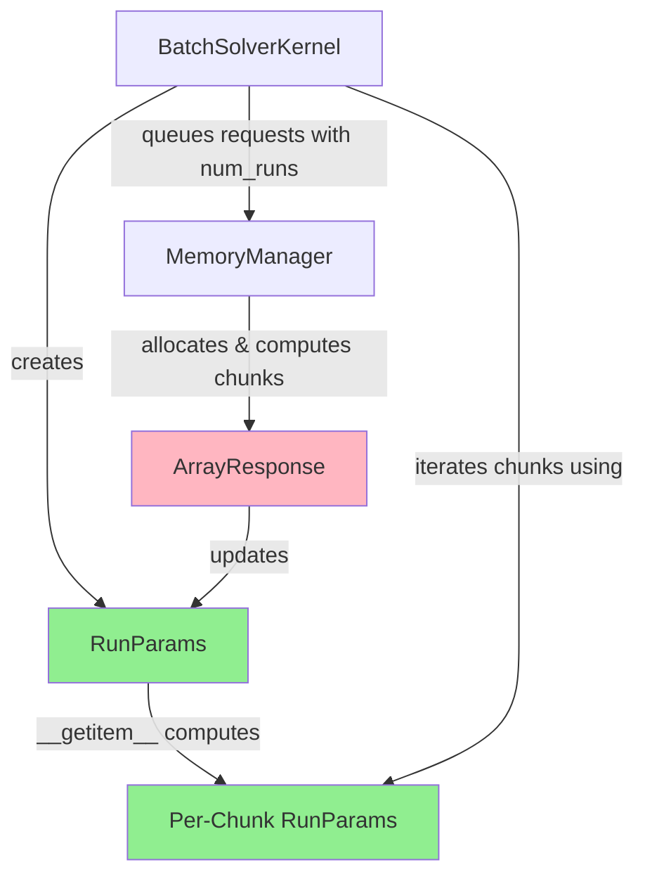
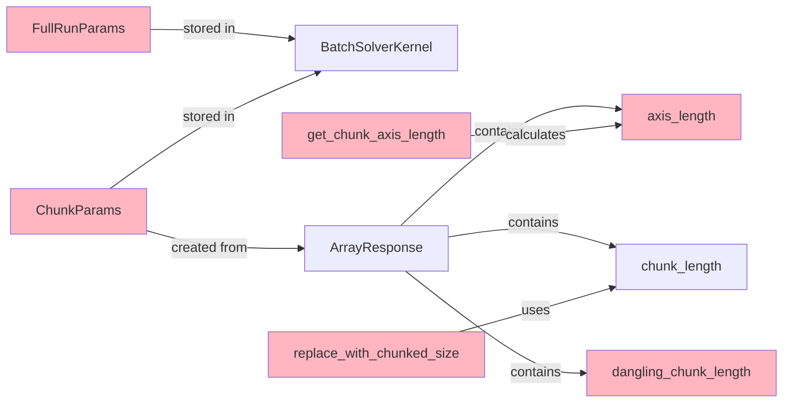
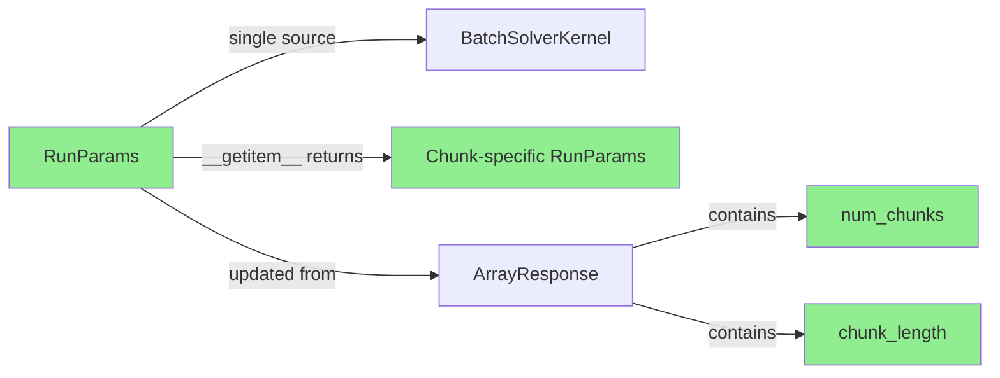
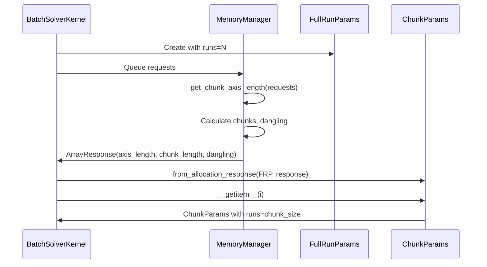
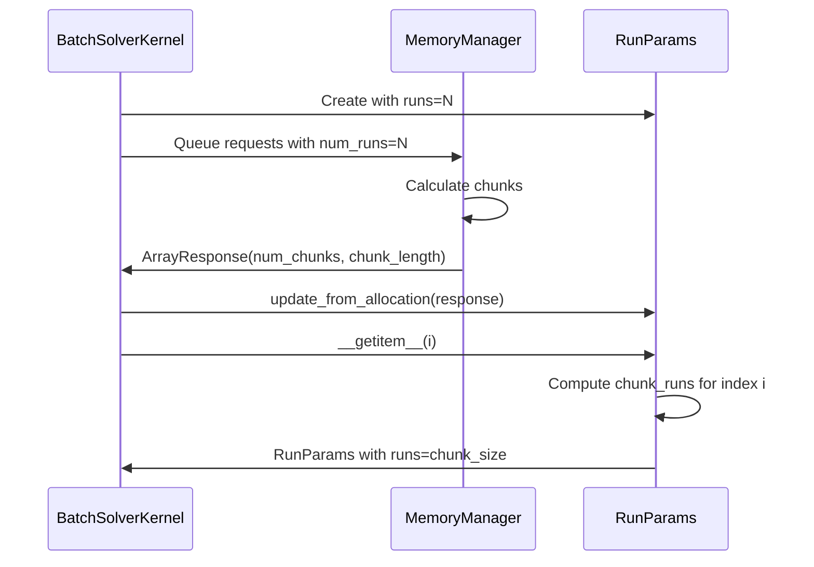

# Continue Chunk Removal Refactoring - Overview

## User Stories

### Story 1: Simplified Run Parameters
**As a** developer maintaining CuBIE's memory management  
**I want** to have a single `RunParams` class that handles both full and chunked execution  
**So that** the codebase is simpler and easier to understand  

**Acceptance Criteria:**
- `RunParams` replaces both `FullRunParams` and `ChunkParams`
- `RunParams` has `__getitem__` logic to return per-chunk parameters
- `RunParams` has a `chunk_length` attribute computed from allocation response
- `RunParams.from_allocation()` updates an existing instance with chunk metadata
- All references to `FullRunParams` and `ChunkParams` are replaced with `RunParams`

### Story 2: Direct Chunk Calculation in RunParams
**As a** memory allocation system  
**I want** chunk length calculations to happen in `RunParams.__getitem__`  
**So that** the memory manager doesn't need to pass dangling length around  

**Acceptance Criteria:**
- `RunParams.__getitem__(index)` computes the correct number of runs for chunk `index`
- Dangling chunk (final chunk) is handled automatically in `__getitem__`
- Memory manager no longer calculates or passes `dangling_chunk_length`
- `ArrayResponse` no longer contains `dangling_chunk_length` field

### Story 3: Simplified ArrayRequest/Response
**As a** memory allocation consumer  
**I want** `ArrayResponse` to only contain the number of runs  
**So that** redundant axis_length calculations are eliminated  

**Acceptance Criteria:**
- `ArrayResponse.axis_length` is removed (was always equal to `num_runs`)
- Memory manager receives `num_runs` directly where needed
- Array managers compute shapes using `num_runs` from solver context
- No logic depends on separate `axis_length` vs `num_runs` distinction

### Story 4: Cleaned Up Memory Manager Methods
**As a** developer working with the memory manager  
**I want** redundant helper methods to be removed or consolidated  
**So that** the allocation chain is straightforward  

**Acceptance Criteria:**
- `get_chunk_axis_length()` is removed (replaced by direct `num_runs` access)
- `replace_with_chunked_size()` is removed or consolidated into chunked shape computation
- `compute_per_chunk_slice()` is evaluated and either kept, consolidated, or removed based on actual usage patterns
- Memory manager allocation flow is simplified and easier to trace

## Overview

### Executive Summary

This refactoring continues the removal of time-axis chunking from CuBIE by eliminating redundant parameter passing and simplifying the chunking architecture. After removing time-axis chunking, the system now only chunks along the **run axis**, making several data structures and helper methods unnecessary.

The key insight is that `axis_length` is always identical to `num_runs` (the number of runs in the batch), and the chunking parameters can be managed more elegantly by consolidating `FullRunParams` and `ChunkParams` into a single `RunParams` class that knows how to compute its own per-chunk values.

### Architecture Diagram



### Current State (Before Refactoring)



### Target State (After Refactoring)



### Key Technical Decisions

#### Decision 1: Consolidate FullRunParams and ChunkParams into RunParams
**Rationale:** These classes serve the same conceptual purpose (describing run parameters) and differ only in whether chunking has been applied. A single class with optional chunking metadata is clearer.

**Implementation:** RunParams will have:
- Core parameters: `duration`, `warmup`, `t0`, `runs` (total runs)
- Chunking metadata: `num_chunks`, `chunk_length` (set after allocation)
- `__getitem__(index)` method to compute per-chunk runs

#### Decision 2: Move chunk length calculation into RunParams
**Rationale:** The dangling chunk calculation is a simple formula based on `chunk_length` and `num_chunks`. It doesn't need to be pre-computed and passed through `ArrayResponse`.

**Implementation:** `RunParams.__getitem__(i)` will:
```python
if i == num_chunks - 1:
    # Last chunk gets remaining runs
    chunk_runs = total_runs - (num_chunks - 1) * chunk_length
else:
    chunk_runs = chunk_length
return evolve(self, runs=chunk_runs)
```

#### Decision 3: Remove axis_length from ArrayResponse
**Rationale:** `axis_length` was the length of the chunkable axis (time or run). Now that only run-axis chunking exists, this is always equal to `num_runs`, which the solver already knows.

**Trade-off:** Memory manager won't store this redundant information, but consumers will need to access `num_runs` from their solver context.

#### Decision 4: Evaluate compute_per_chunk_slice() for retention
**Rationale:** This method generates slice functions for extracting per-chunk views. It may still be valuable for chunked transfers, or it might be replaceable with simpler inline logic.

**Research Required:** Review actual usage in `BaseArrayManager` and chunked transfer logic to determine if the abstraction provides value or can be simplified.

### Expected Impact on Architecture

**Components Modified:**
- `src/cubie/batchsolving/BatchSolverKernel.py` - Use RunParams only
- `src/cubie/memory/array_requests.py` - Simplify ArrayResponse
- `src/cubie/memory/mem_manager.py` - Remove helper methods, simplify allocation
- `src/cubie/batchsolving/arrays/BaseArrayManager.py` - Update chunking logic
- `src/cubie/batchsolving/arrays/BatchInputArrays.py` - Update to use new pattern
- `src/cubie/batchsolving/arrays/BatchOutputArrays.py` - Update to use new pattern

**New Patterns:**
- RunParams is updated in-place by `_on_allocation()` callback
- RunParams computes per-chunk values lazily via `__getitem__`
- Number of runs passed explicitly to memory manager allocation queue

**Removed Complexity:**
- No separate FullRunParams vs ChunkParams distinction
- No dangling_chunk_length pre-computation
- No axis_length calculation separate from num_runs
- Fewer memory manager helper methods in allocation chain

### Integration Points

**Before:**
```python
# BatchSolverKernel initialization
self.full_run_params = FullRunParams(duration=0, warmup=0, t0=0, runs=1)
self.chunk_params = ChunkParams(duration=0, warmup=0, t0=0, runs=0)

# On allocation callback
self.chunk_params = ChunkParams.from_allocation_response(
    full_params=self.full_run_params,
    alloc_response=response
)

# Usage
chunk_params = self.chunk_params[i]
```

**After:**
```python
# BatchSolverKernel initialization
self.run_params = RunParams(duration=0, warmup=0, t0=0, runs=1)

# On allocation callback  
self.run_params.update_from_allocation(response)

# Usage
chunk_params = self.run_params[i]
```

### Edge Cases

1. **Single chunk (no chunking):** RunParams should handle `num_chunks=1` gracefully
2. **Exact division:** When `total_runs % chunk_length == 0`, last chunk is normal size
3. **Unallocated state:** RunParams before allocation should have sensible defaults
4. **Access out of bounds:** `__getitem__` should validate index < num_chunks

### Research Findings

**From codebase analysis:**
- Current chunking is **only** along run axis (not time axis)
- `axis_length` is always extracted from arrays with "run" in stride_order
- `get_chunk_axis_length()` always returns the run-axis dimension
- `replace_with_chunked_size()` only modifies the "run" dimension
- `compute_per_chunk_slice()` generates functions that slice the "run" axis

**Repository context:**
- Branch `copilot/remove-chunking-time-axis` already exists
- Previous commit removed time-axis chunking and stride_order noise
- Architecture uses attrs classes for data containers
- Memory manager uses allocation hooks to notify of chunk decisions

## Mermaid: Data Flow Before and After

### Current Flow (Before)


### Target Flow (After)


## Performance Considerations

This refactoring focuses on **code simplicity and correctness**, not performance optimization. The changes should be performance-neutral:

- Removed pre-computation of dangling_chunk_length is negligible (simple arithmetic)
- Lazy computation in `__getitem__` happens once per chunk iteration (minimal overhead)
- Fewer data structures reduces memory footprint slightly

No performance-based tests or metrics are required for validation.

---

*This overview provides architectural context for the detailed implementation plan in `agent_plan.md`*
