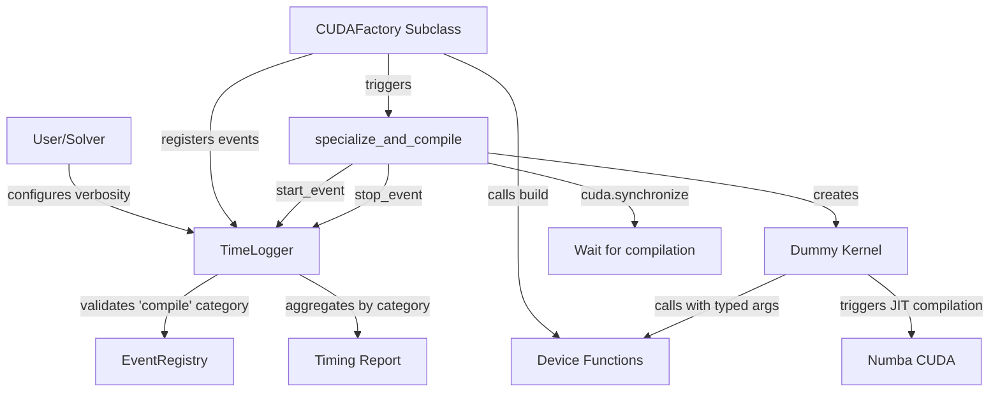
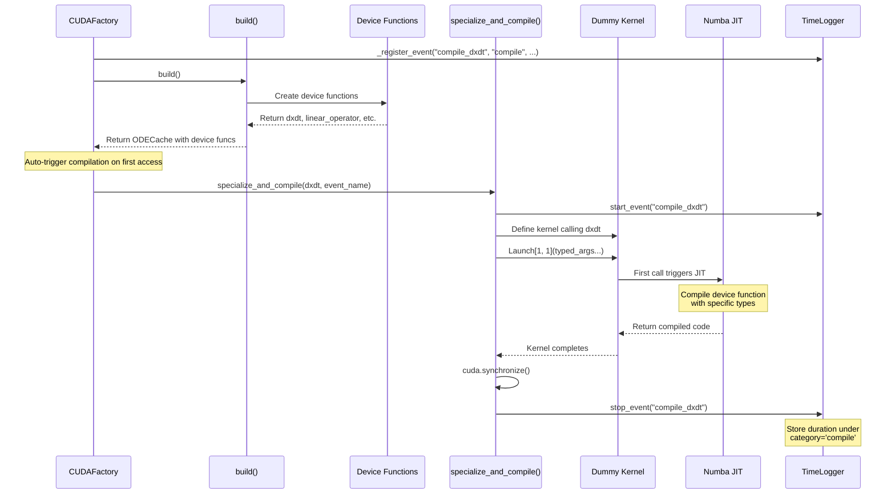
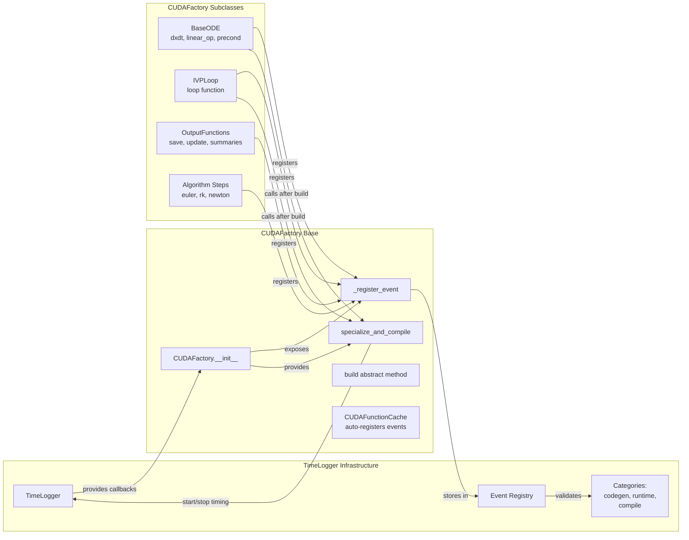

# CUDA Compilation Timing - Human Overview

## User Stories

### Story 1: Visibility Into CUDA Compilation Time
**As a** CuBIE user initializing a solver with a complex ODE system  
**I want** to see how long CUDA device function compilation takes  
**So that** I understand what's happening during the first run and can identify compilation bottlenecks

**Acceptance Criteria:**
- Each CUDA device function compilation is timed and reported separately
- Compilation time appears under category "compile" in timing reports
- User can see compilation duration at default verbosity level
- Compilation events are properly categorized and aggregated with other timing data
- TimeLogger supports exactly three categories: 'codegen', 'runtime', 'compile'

### Story 2: Per-Device-Function Timing Resolution
**As a** CuBIE developer optimizing compilation performance  
**I want** to see individual compilation times for each device function (dxdt, linear_operator, etc.)  
**So that** I can identify which components take longest to compile

**Acceptance Criteria:**
- Each device function gets its own timing event (e.g., "compile_dxdt", "compile_linear_operator")
- Event descriptions clearly identify what was compiled
- Verbose mode shows breakdown by device function
- Default mode shows aggregate compilation time across all device functions

### Story 3: Automatic Specialization and Timing
**As a** CuBIE developer  
**I want** compilation timing to happen automatically without manual intervention  
**So that** I don't need to remember to call specialized compilation methods

**Acceptance Criteria:**
- Compilation timing triggers automatically when device functions are accessed
- Timing happens on first specialized compilation (when types are known)
- Subsequent calls use cached compiled versions (no re-timing)
- Minimal performance overhead when timing is disabled
- All CUDAFactory subclasses use CUDAFunctionCache for their cache attrs classes
- Event registration happens automatically via cache introspection

## Executive Summary

This feature adds CUDA compilation timing to CuBIE's existing time logging infrastructure. CUDA device functions in CuBIE are compiled just-in-time (JIT) by Numba when first called with specific types. Currently, this compilation time is invisible to users, contributing to the "click, wait, hope" problem.

The solution introduces:
1. A "compile" category in the TimeLogger (removing 'build' category which was an alias)
2. A `CUDAFunctionCache` base attrs class that auto-registers timing events for device functions
3. A `specialize_and_compile()` method in CUDAFactory to trigger and time compilation
4. Automatic event registration via cache attribute introspection
5. A dummy kernel pattern that calls device functions with minimal overhead to trigger compilation
6. Mandatory cache creation for all CUDAFactory subclasses (removing `_device_function` direct storage)

## Architecture Diagram



## Data Flow Diagram



## Component Interaction Flow



## Key Technical Decisions

### 1. Replace "build" Category with "compile" in TimeLogger
**Decision:** Remove 'build' category and use only 'codegen', 'runtime', 'compile'  
**Rationale:**
- The 'build' category was functionally an alias for 'compile' 
- CUDA compilation is distinct from code generation (codegen)
- Three clear categories improve conceptual clarity
- 'compile' specifically refers to JIT compilation of device functions
- Enables filtering and aggregation by compilation events without confusion

### 2. Dummy Kernel Pattern for Compilation Triggering
**Decision:** Create a minimal CUDA kernel that calls the device function with properly typed arguments  
**Rationale:**
- Numba CUDA device functions only compile when called with specific types
- Device functions cannot be called directly from Python
- Kernel provides execution context for device function specialization
- Minimal overhead: single thread, minimal operations, returns immediately
- Pattern is reusable across all CUDAFactory subclasses

### 3. Parameter Introspection from Device Functions
**Decision:** Use `inspect.signature(device_func.py_func)` to determine parameter count and create appropriately sized dummy arguments  
**Rationale:**
- Device functions have varying signatures (dxdt vs linear_operator vs preconditioner)
- Cannot hardcode parameter lists without breaking generality
- Python function introspection provides parameter names and count
- Enables generic implementation in CUDAFactory base class
- Falls back gracefully if introspection unavailable

### 4. Minimal Dummy Arguments
**Decision:** Pass minimal-sized arrays and scalars to dummy kernel to reduce compilation overhead  
**Rationale:**
- Compilation time should measure JIT cost, not data transfer
- Small arrays (single element where possible) minimize memory allocation
- Scalar arguments use precision from factory settings
- Constants already captured in closure don't need realistic values
- Goal is triggering compilation, not testing correctness

### 5. Single-Threaded Dummy Kernel
**Decision:** Launch dummy kernel with grid size [1, 1] and block size 1  
**Rationale:**
- Compilation timing is independent of thread count
- Minimizes execution time after compilation
- Reduces resource consumption during timing
- Ensures kernel completes quickly after synchronization
- Avoids contention with actual solver execution

### 6. Automatic Invocation on Property Access
**Decision:** Call `specialize_and_compile()` automatically in CUDAFactory `_build()` after creating device functions  
**Rationale:**
- Makes compilation timing transparent to users
- Compilation happens on first access (same as current behavior)
- No API changes required for existing code
- Timing overhead only occurs once (results are cached)
- Aligns with CUDAFactory caching philosophy

### 7. CUDAFunctionCache Base Class for Auto-Registration
**Decision:** Create a `CUDAFunctionCache` base attrs class that introspects its attributes and auto-registers timing events  
**Rationale:**
- Eliminates manual event registration in each CUDAFactory subclass
- Ensures consistency between cache field names and event names
- Leverages attrs introspection to automatically discover device functions
- Reduces boilerplate and potential for registration errors
- Centralizes event registration logic in one place

### 8. Mandatory Cache for All CUDAFactory Subclasses
**Decision:** Remove `_device_function` attribute; all subclasses must return attrs cache from `build()`  
**Rationale:**
- Simplifies CUDAFactory internals (single code path)
- Enables uniform auto-registration via CUDAFunctionCache
- Even single-function factories create a cache with one field
- `device_function` property becomes a convenience accessor via `get_cached_output()`
- Consistent pattern across all CUDAFactory subclasses

### 9. Investigation of Parameter Customization
**Decision:** Research whether we can pass variable-length arguments to kernel without unpacking in signature  
**Rationale:**
- Numba CUDA prohibits `*args` unpacking in kernel signatures
- However, `*args` in signature itself works (stores as tuple)
- Can pass fixed signature with variable content based on introspection
- Alternative: dynamically generate kernel function with correct signature
- Recommendation: Use signature introspection with fixed-size arrays per parameter type

## Expected Impact on Existing Architecture

### Changes to TimeLogger
- Replace category validation from `{'codegen', 'build', 'runtime', 'compile'}` to `{'codegen', 'runtime', 'compile'}`
- Remove 'build' category (was an alias for compile)
- Update error messages to reflect three categories
- No changes to event registration, storage, or reporting logic
- Breaking change: existing 'build' events must be changed to 'compile'

### Changes to CUDAFactory Base Class
- Add `CUDAFunctionCache` base attrs class with auto-registration
- Add `specialize_and_compile(device_function, event_name)` method
- Remove `_device_function` attribute storage (use cache only)
- Modify `device_function` property to call `get_cached_output('device_function')`
- Modify `_build()` to always expect attrs cache, introspect and time device functions
- Compilation timing happens once per cache invalidation

### Changes to CUDAFactory Subclasses
- All cache attrs classes must inherit from `CUDAFunctionCache`
- Event registration happens automatically via `CUDAFunctionCache.__attrs_post_init__`
- Event names follow pattern: `compile_{field_name}`
- Descriptions follow pattern: `"Compilation time for {field_name}"`
- Single-function factories create cache with `device_function` field
- No manual event registration needed

### Integration Points
- **BaseODE**: `ODECache` inherits from `CUDAFunctionCache`, auto-registers events for all fields
- **IVPLoop**: Create simple cache class inheriting `CUDAFunctionCache` with `device_function` field
- **OutputFunctions**: `OutputFunctionCache` inherits from `CUDAFunctionCache`
- **SingleIntegratorRunCore**: Create cache class with `device_function` field
- Algorithm steps, controllers, metrics: Create caches as needed for compilation timing

## Trade-offs and Alternatives Considered

### Alternative: Manual Compilation Triggering
**Rejected because:**
- Requires users to call compilation methods explicitly
- Easy to forget, leading to inconsistent timing data
- Defeats purpose of transparent performance monitoring
- Adds API surface and complexity

### Alternative: Decorator-Based Compilation Timing
**Rejected because:**
- Device functions are returned from `build()`, not decorated at definition
- Numba decorators cannot be nested with timing decorators
- Would require wrapping every device function creation site
- Less flexible than explicit timing calls

### Alternative: Time on First Kernel Launch
**Rejected because:**
- First actual kernel launch includes data transfer, initialization, etc.
- Cannot isolate compilation time from execution time
- Timing would include solver setup overhead
- Less useful for performance analysis

### Alternative: Separate Compilation Method on CUDAFactory
**Considered but modified:**
- Initial idea: Add `compile_device_functions()` method users call
- Modified to: Automatic invocation in `_build()`
- Keeps transparency while enabling reuse across subclasses

### Trade-off: Compilation Overhead
**Accepted overhead:**
- Single kernel launch per device function (milliseconds)
- Array allocation for dummy arguments (small, short-lived)
- Synchronization wait for compilation (unavoidable, being measured)
- Only happens once per cache invalidation

**Mitigation:**
- Overhead only incurred when timing is enabled
- Can be disabled by setting verbosity to None
- Results are cached, so overhead amortized over lifetime
- Dummy kernel minimizes execution time after compilation

## Feasibility Investigation: Parameter Customization

### Research Question
Can we customize the parameters list without unpacking `*args` in the kernel call signature?

### Findings

#### Numba CUDA Constraints
1. **Kernel signatures support `*args`**: You can write `def kernel(*args)` and it compiles
2. **Cannot unpack in call**: You cannot do `kernel[grid, block](*my_tuple)`
3. **Fixed call signature required**: Must pass explicit arguments: `kernel[grid, block](arg1, arg2, arg3)`

#### Solutions

**Option 1: Signature Introspection + Dynamic Arguments**
```python
import inspect

def specialize_and_compile(self, device_func, event_name):
    sig = inspect.signature(device_func.py_func)
    num_params = len(sig.parameters)
    
    # Create appropriately sized dummy args based on param count
    args = create_dummy_args(num_params, self.precision)
    
    # Define kernel with fixed signature matching param count
    kernel = create_kernel_for_signature(device_func, num_params)
    
    # Launch with unpacked args
    kernel[1, 1](*args)
```

**Option 2: Exec-Based Dynamic Kernel Generation**
```python
def create_specialized_kernel(device_func, param_names):
    # Dynamically generate kernel source with correct signature
    sig_str = ', '.join(param_names)
    kernel_src = f"""
@cuda.jit
def specialized_kernel({sig_str}):
    if cuda.grid(1) == 0:
        device_func({sig_str})
"""
    exec_globals = {'cuda': cuda, 'device_func': device_func}
    exec(kernel_src, exec_globals)
    return exec_globals['specialized_kernel']
```

**Option 3: Fixed Maximum Parameters**
```python
@cuda.jit
def dummy_kernel(p1, p2, p3, p4, p5, p6, p7, p8):
    if cuda.grid(1) == 0:
        # Call device_func with subset of params
        # Use conditional logic based on device_func.param_count
        pass
```

### Recommendation
**Use Option 1 with signature introspection**

**Rationale:**
- Balances generality with simplicity
- Avoids exec/eval for code generation
- Type information available from device function
- Can infer array vs scalar from parameter analysis
- Cleaner than hardcoded maximum parameters

**Implementation approach:**
1. Introspect device function signature to get parameter count
2. Create minimal dummy arguments (1-element arrays, zero scalars)
3. Generate kernel definition programmatically or use template
4. Launch kernel with properly typed arguments
5. Synchronize and measure duration

## References to Research

### Numba CUDA Device Function Compilation
- **CUDADispatcher type**: Numba returns `numba.cuda.dispatcher.CUDADispatcher` for `@cuda.jit(device=True)` functions
- **py_func attribute**: Contains original Python function, accessible for introspection
- **Signature access**: `inspect.signature(device_func.py_func)` provides parameter information
- **Specialization**: Compilation triggered on first call with specific types
- **Caching**: Numba caches compiled versions per type signature

### CUDAFactory Pattern in CuBIE
Reviewed all CUDAFactory subclasses:
- **BaseODE** (`src/cubie/odesystems/baseODE.py`): Returns ODECache with dxdt + helpers
- **IVPLoop** (`src/cubie/integrators/loops/ode_loop.py`): Returns single loop function
- **OutputFunctions** (`src/cubie/outputhandling/output_functions.py`): Returns OutputFunctionCache with three functions
- **SingleIntegratorRunCore** (`src/cubie/integrators/SingleIntegratorRunCore.py`): Returns compiled loop function
- **Algorithm steps**: Return StepCache with device function
- **Controllers**: Return device function directly
- **Metrics**: Return tuple of (update_func, save_func)

Common pattern: `build()` returns either:
1. Single device function (controllers, some algorithms)
2. attrs class cache with multiple device functions (BaseODE, OutputFunctions)

### Timing Integration Points
From existing time logger infrastructure:
- TimeLogger validates categories in `_register_event()`
- Current categories: `{'codegen', 'build', 'runtime'}`
- CUDAFactory subclasses access callbacks via `self._register_event`, `self._timing_start`, `self._timing_stop`
- Events registered in `__init__`, timing happens in `build()` and related methods

### CUDA Synchronization
- `cuda.synchronize()` blocks until all GPU operations complete
- Required after kernel launch to ensure compilation finished before stopping timer
- Minimal overhead compared to compilation time (microseconds vs milliseconds)
- Ensures accurate timing of JIT compilation phase
