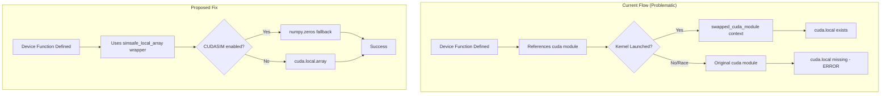
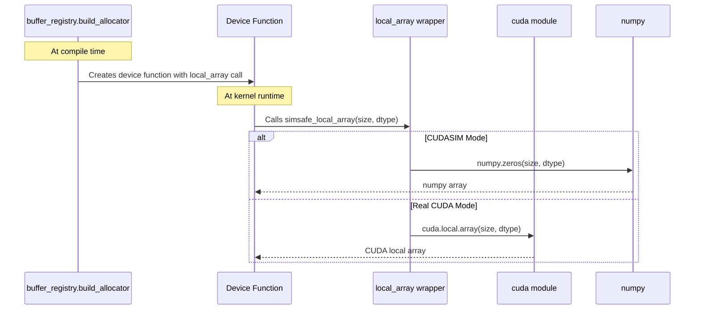

# CUDA Local Array CUDASIM Fix - Overview

## User Stories

### US-1: Consistent Test Execution in CUDASIM Mode
**As a** CuBIE developer  
**I want** tests to pass consistently when running with `NUMBA_ENABLE_CUDASIM=1`  
**So that** I can develop and test on systems without NVIDIA GPUs

**Acceptance Criteria:**
- All tests in `test_solver.py` and `test_solveresult.py` pass 100% of the time in CUDASIM mode
- No `AttributeError: module 'numba.cuda' has no attribute 'local'` errors occur
- Tests remain compatible with real CUDA mode (no regressions)

### US-2: Deterministic Device Function Behavior
**As a** CuBIE developer  
**I want** device functions using `cuda.local.array` to behave deterministically  
**So that** test flakiness is eliminated

**Acceptance Criteria:**
- Device functions that allocate local arrays work correctly in all test runs
- No timing-dependent or import-order-dependent failures
- The fix does not introduce performance regressions in CUDA mode

---

## Executive Summary

The CI is failing intermittently in CUDASIM mode due to an `AttributeError` when accessing `cuda.local.array`. This is a race condition related to how Numba's CUDA simulator handles module-level `cuda` references inside device functions.

### Root Cause Analysis

When Numba's CUDA simulator runs a kernel, it uses a context manager (`swapped_cuda_module`) to temporarily replace the global `cuda` module reference with a fake version (`FakeCUDAModule`) that provides `local`, `shared`, `const`, and other CUDA-specific attributes.

The intermittent failure occurs because:

1. **Device functions are defined at module import time** with a reference to the global `cuda` module
2. **The `swapped_cuda_module` only swaps the global in the function's `__globals__`** dictionary
3. **If multiple threads/contexts are active**, or if the swap doesn't complete before the device function executes, the original `cuda` module (which lacks `local`) is used instead

The flaky nature arises from:
- Python's import caching and module initialization order
- Thread timing in the CUDA simulator
- GC and reference counting behavior

### Solution Strategy

**Replace direct `cuda.local.array` calls with a CUDASIM-safe wrapper pattern.**

Rather than trying to fix Numba's internal module swapping (which would be fragile and could break with Numba updates), the solution ensures that local array allocations work regardless of whether the module swap has occurred.

---

## Architecture Diagram

---

## Component Interactions

---

## Key Technical Decisions

### Decision 1: Wrapper Function vs Module Patching

**Chosen:** Wrapper function approach  
**Rationale:**
- Module patching could interfere with Numba's internal operations
- Wrapper functions are explicit and self-documenting
- Wrapper approach aligns with existing `cuda_simsafe.py` patterns
- Previous attempt to add a `local` object to `cuda_simsafe.py` failed in CUDA mode

### Decision 2: Compile-time vs Runtime Detection

**Chosen:** Compile-time detection using `CUDA_SIMULATION` constant  
**Rationale:**
- The `CUDA_SIMULATION` flag is already set at module import time
- Avoids runtime overhead in the critical path
- Matches existing patterns in `cuda_simsafe.py`

### Decision 3: Implementation Location

**Chosen:** Add helper in `cuda_simsafe.py`, update call sites  
**Rationale:**
- `cuda_simsafe.py` is the canonical location for CUDA simulator compatibility
- Centralizes the fix for future maintenance
- Minimal changes required at call sites

---

## Affected Files

| File | Change Type | Description |
|------|-------------|-------------|
| `src/cubie/cuda_simsafe.py` | Modified | Add `local_array` wrapper function |
| `src/cubie/buffer_registry.py` | Modified | Use wrapper in `build_allocator` |
| `src/cubie/batchsolving/BatchSolverKernel.py` | Modified | Use wrapper in kernel |
| `src/cubie/integrators/loops/ode_loop.py` | Modified | Use wrapper in loop |
| `src/cubie/integrators/matrix_free_solvers/newton_krylov.py` | Modified | Use wrapper in solver |
| `src/cubie/integrators/algorithms/generic_rosenbrock_w.py` | Modified | Use wrapper in step |

---

## Trade-offs and Alternatives Considered

### Alternative 1: Thread-Local Module Reference
**Rejected:** Would require significant changes to how device functions capture closures, high risk of introducing new bugs.

### Alternative 2: Lazy Module Import Inside Device Functions
**Rejected:** Numba's JIT compilation doesn't handle dynamic imports well inside device functions.

### Alternative 3: Pre-execute Module Swap Detection
**Rejected:** Adds runtime overhead and doesn't address the root cause.

### Alternative 4: Upstream Fix to Numba
**Rejected for now:** Would take time to implement and get merged. The wrapper approach provides an immediate fix that doesn't depend on Numba changes.

---

## Expected Impact

### Benefits
- Eliminates intermittent CUDASIM test failures
- Improves developer experience on non-GPU systems
- No performance impact in real CUDA mode (compile-time branching)

### Risks
- Low: The wrapper pattern is well-established in the codebase
- Minimal code changes at each call site

---

## References

- [Numba CUDA Simulator Source](https://github.com/numba/numba/tree/main/numba/cuda/simulator)
- Existing `cuda_simsafe.py` patterns for `selp`, `activemask`, `all_sync`, etc.
- Issue reproduction: Tests fail ~1 in 3 runs in CUDASIM mode with `cuda.local.array` AttributeError
