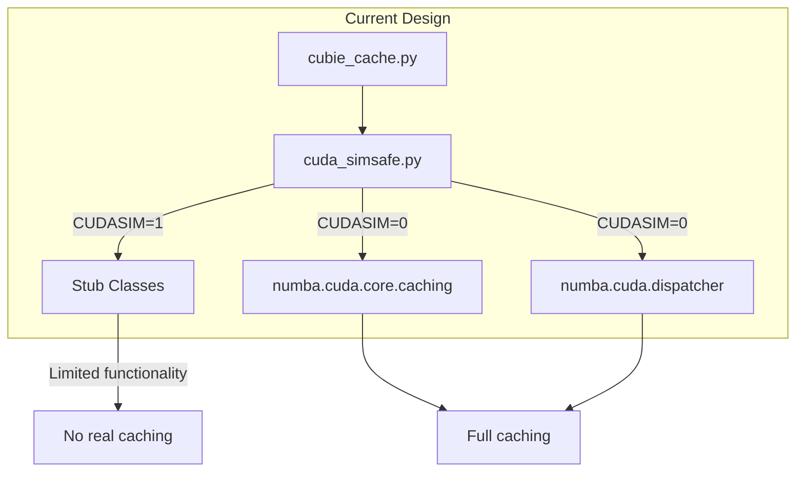
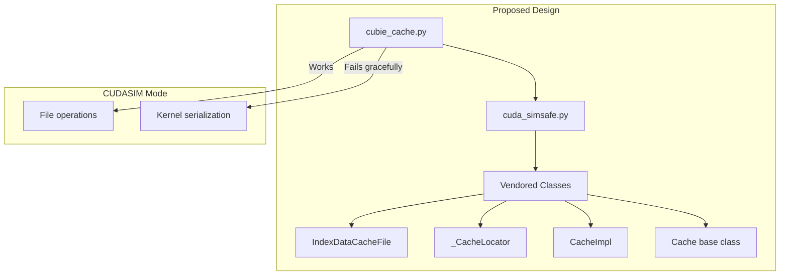
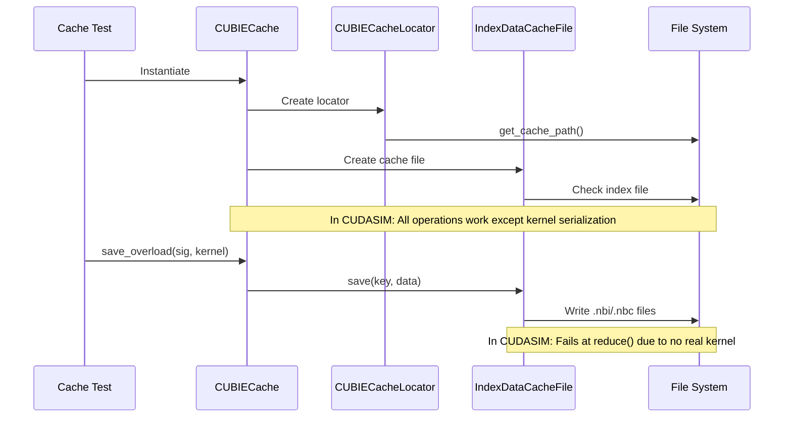

# CuBIE Caching Module CUDASIM Compatibility Refactor

## User Stories

### User Story 1: CI Test Coverage for Caching Logic
**As a** CuBIE developer  
**I want** cache tests to run under CUDASIM mode in CI  
**So that** I can verify caching logic is correct without requiring GPU hardware

**Acceptance Criteria:**
- Cache tests execute in CUDASIM mode without import errors
- Tests marked `nocudasim` on cache functionality are removed
- Tests that fail because no compiled file is created in CUDASIM mode are expected failures (left failing for user review)
- CI pipeline runs cache tests successfully

### User Story 2: Simplified Caching Module Architecture
**As a** CuBIE maintainer  
**I want** the caching module to use vendored numba classes instead of CUDASIM stubs  
**So that** the codebase is simpler and easier to maintain

**Acceptance Criteria:**
- CUDASIM stubs in `cuda_simsafe.py` are replaced with vendored numba classes
- Vendored classes are marked with comment indicating vendor date (2026-01-11)
- The caching module provides a wrapper over numba-cuda's caching system
- Import failures in CUDASIM mode are resolved

### User Story 3: Functional Cache Operations in CUDASIM
**As a** CuBIE user running tests without GPU  
**I want** cache infrastructure classes to be instantiable and their methods callable  
**So that** the code paths are exercised even without real CUDA compilation

**Acceptance Criteria:**
- `CUBIECacheLocator`, `CUBIECacheImpl`, and `CUBIECache` can be instantiated
- File system operations (path creation, cache eviction) work in CUDASIM mode
- Only the actual serialization of compiled kernels fails (expected in CUDASIM)

---

## Executive Summary

The CuBIE caching module needs refactoring to achieve CUDASIM compatibility for CI testing. The current approach uses stub classes in `cuda_simsafe.py` to handle imports that fail in CUDASIM mode. The new approach will vendor the necessary numba-cuda caching classes directly, allowing the real caching infrastructure to be tested.

## Current Architecture

## Proposed Architecture

## Data Flow

## Key Technical Decisions

### 1. Vendor numba-cuda Classes Instead of Stubs

**Decision**: Vendor `IndexDataCacheFile`, `_CacheLocator`, `CacheImpl`, and `Cache` base class from numba-cuda.

**Rationale**:
- These classes are mostly filesystem operations, not CUDA-dependent
- Vendoring allows tests to exercise real cache logic
- Only the kernel serialization (`reduce`/`rebuild`) is truly CUDA-dependent

### 2. Selective Import Handling

**Decision**: Import only `dumps` from `numba.cuda.serialize` with fallback to pickle.

**Rationale**:
- `numba.cuda.serialize` may not be available in CUDASIM
- Fallback to standard pickle allows tests to run
- The serialized format only matters for real CUDA kernels

### 3. Remove CUDASIM Check in `create_cache`

**Decision**: Remove the early return for CUDASIM in `create_cache()`, but keep it returning None when caching is disabled.

**Rationale**:
- Allows cache infrastructure to be exercised in tests
- Tests can then verify correct behavior up until kernel serialization

## Trade-offs and Alternatives

| Approach | Pros | Cons |
|----------|------|------|
| **Vendor classes (chosen)** | Tests real logic, simpler module | Must track numba-cuda updates |
| **Keep stubs** | No vendoring overhead | Tests don't exercise real logic |
| **Mock imports at test time** | No production code changes | Complex test setup, fragile |

## Expected Impact on Existing Architecture

1. **cuda_simsafe.py**: Remove stub classes for caching, add vendored classes
2. **cubie_cache.py**: Simplify by removing conditional logic for CUDASIM stubs
3. **test_cubie_cache.py**: Remove `nocudasim` markers, expect some tests to fail gracefully

## References

- Numba-CUDA caching module: `active_plans/numba_cuda_caching.py`
- Numba-CUDA dispatcher caching: `active_plans/numba_cuda_dispatcher.py`
- Current CuBIE cache: `src/cubie/cubie_cache.py`
- CUDASIM compatibility: `src/cubie/cuda_simsafe.py`
