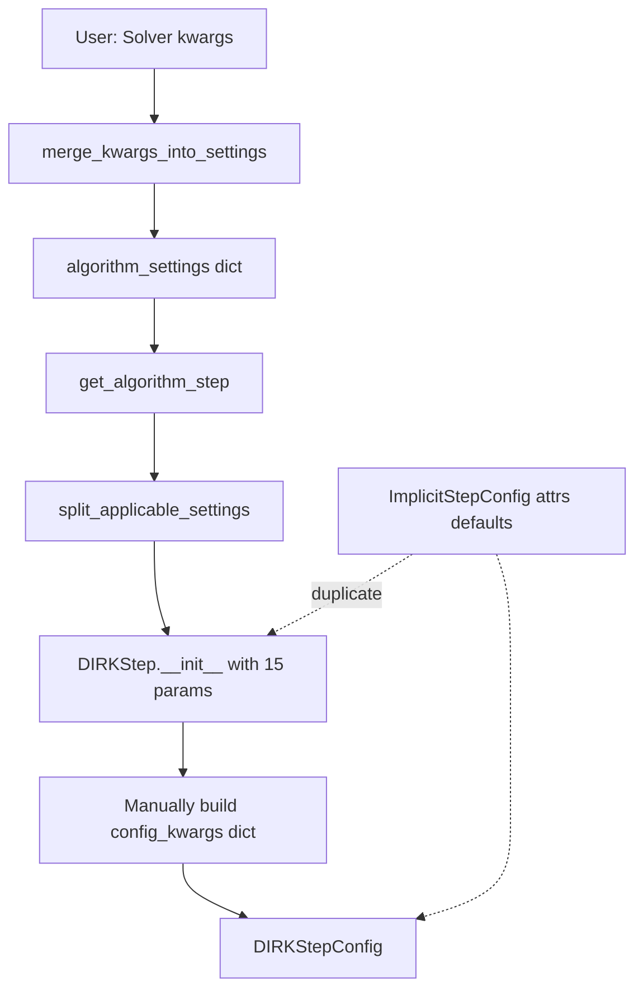
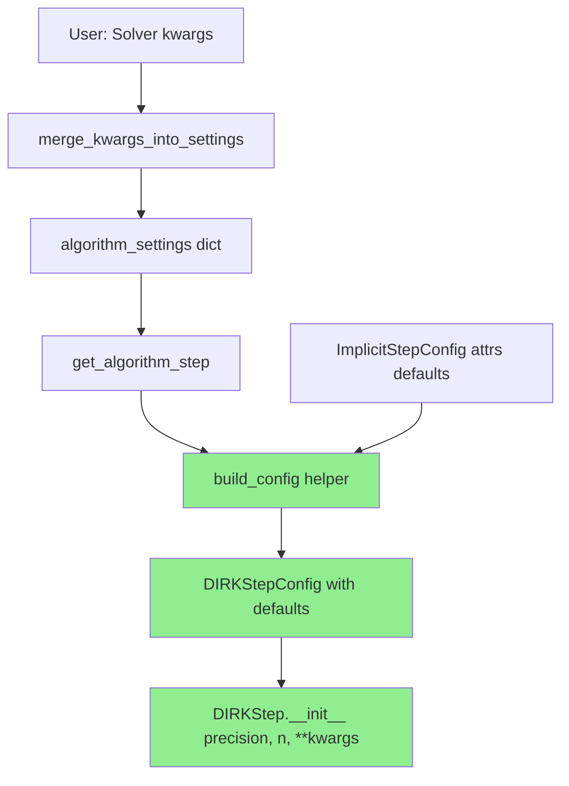
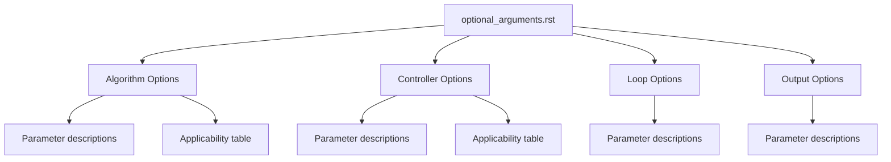

# Default Parameter Rationalization - Overview

## User Stories

### User Story 1: Simplified Component Initialization
**As a** developer working on cubie's integrator components  
**I want** to understand where default parameter values come from  
**So that** I can easily reason about the configuration cascade and modify defaults when needed

**Acceptance Criteria:**
- Default parameter values are defined once in a single, discoverable location (the attrs config class)
- No duplicate default definitions exist across init functions and config classes
- Init function signatures contain only required parameters (no optional parameters with defaults)
- Optional parameters can be overridden by kwargs at higher levels

**Success Metrics:**
- Init functions are shorter and more focused on business logic
- Configuration flow is traceable from attrs defaults → init overrides
- Code reviews identify parameter defaults immediately without searching

### User Story 2: Maintainable Configuration Classes
**As a** maintainer updating default parameter values  
**I want** default values to be defined in attrs config classes  
**So that** I only need to change them in one place

**Acceptance Criteria:**
- All optional parameters have defaults defined in attrs config classes (e.g., `ImplicitStepConfig`, `DIRKStepConfig`)
- Init functions accept only explicit overrides (no defaults in signature)
- The `split_applicable_settings` utility correctly filters kwargs against init signatures
- Updated defaults propagate automatically to all consumers

**Success Metrics:**
- Single source of truth for each parameter default
- No "default drift" where different components assume different defaults
- Reduced lines of code in init functions

### User Story 3: Clean Kwargs Propagation
**As a** user of the Solver API  
**I want** to override specific integration parameters via kwargs  
**So that** I can customize behavior without constructing full settings dictionaries

**Acceptance Criteria:**
- Kwargs at Solver level override algorithm defaults
- Algorithm defaults override config class defaults
- No manual dictionary merging required in application code
- `merge_kwargs_into_settings` handles the cascade transparently

**Success Metrics:**
- Users can pass `krylov_tolerance=1e-8` to Solver and it reaches the algorithm
- No need to construct intermediate settings dicts for simple overrides
- Clear warning when duplicate keys exist

### User Story 4: Comprehensive Optional Arguments Documentation
**As a** user of the Solver API  
**I want** a complete reference guide to all optional parameters  
**So that** I can understand what I can customize and how each parameter affects solver behavior

**Acceptance Criteria:**
- An RST file exists in the user guide documenting all optional arguments
- Parameters are organized by category: Algorithm, Controller, Loop, Output
- Each parameter has a plain-language description (technical but avoiding jargon)
- Applicability tables show which algorithms/controllers each parameter applies to
- Descriptions explain what the parameter controls and why it matters

**Success Metrics:**
- Users can find any optional parameter and understand its purpose
- No need to read source code to understand parameter behavior
- Clear indication of which algorithms support which parameters

## Overview

The current parameter default system in cubie has evolved organically, resulting in:
- **Dual default sources**: Both attrs config classes AND init functions define defaults
- **Large init signatures**: Functions like `DIRKStep.__init__` have 15+ optional parameters
- **Scattered defaults**: Same parameter has defaults in multiple places
- **Manual merging**: Code like `controller_settings.update(step_control_settings)` throughout

This technical debt hurts readability and maintainability.

## Solution Architecture

### Current State



**Problems:**
- Step 6-7: Init builds dict from params that came from a dict
- Step F: 15 optional params duplicate config class defaults
- Steps F→G→H: Unnecessary parameter passing

### Proposed State - Option B: Helper Function with Required/Optional Split



**Benefits:**
- Single source of truth: attrs config class
- Clear separation of required vs optional parameters
- Users don't need to construct config objects
- Helper function reduces verbosity of current pattern
- All parameters settable at top-level Solver

### Key Technical Decisions

#### Decision 1: Where Defaults Live
**Choice**: Attrs config classes (e.g., `ImplicitStepConfig`, `DIRKStepConfig`)  
**Rationale**: 
- Already have validators and converters
- Natural fit for CUDAFactory pattern (config is compile_settings)
- attrs provides `fields()` for introspection

#### Decision 2: Init Signature Pattern
**Before:**
```python
def __init__(self, precision, n, dxdt_function=None, 
             krylov_tolerance=1e-6, max_linear_iters=10, ...):
    config = ImplicitStepConfig(
        precision=precision, n=n, dxdt_function=dxdt_function,
        krylov_tolerance=krylov_tolerance, ...
    )
```

**After (Option A - Recommended):**
```python
def __init__(self, config, **overrides):
    if overrides:
        config = attrs.evolve(config, **overrides)
```

**After (Option B - Explicit Required):**
```python
def __init__(self, precision, n, **kwargs):
    config = build_config(
        ImplicitStepConfig, 
        required={'precision': precision, 'n': n},
        **kwargs
    )
```

#### Decision 3: Factory Function Role
**Current**: `get_algorithm_step` filters kwargs, then passes to init  
**Proposed**: Factory creates config object with defaults, then instantiates

```python
def get_algorithm_step(precision, settings, **kwargs):
    algorithm_settings = {**settings, **kwargs}
    algorithm_type, tableau = resolve_alias(algorithm_settings.pop('algorithm'))
    
    # Get config class from algorithm type
    config_class = algorithm_type.CONFIG_CLASS
    
    # Build config with defaults + overrides
    config = build_config_from_settings(
        config_class,
        precision=precision,
        settings=algorithm_settings,
        tableau=tableau
    )
    
    # Pass only config
    return algorithm_type(config)
```

## Options Considered

### Option A: Attrs-First with Config Object (Recommended)

**Pattern:**
```python
@attrs.define
class DIRKStepConfig(ImplicitStepConfig):
    tableau: DIRKTableau = attrs.field(default=DEFAULT_DIRK_TABLEAU)
    stage_increment_location: str = attrs.field(default='local')
    # ... all parameters with defaults

class DIRKStep(ODEImplicitStep):
    CONFIG_CLASS = DIRKStepConfig
    
    def __init__(self, config: DIRKStepConfig, **overrides):
        if overrides:
            config = attrs.evolve(config, **overrides)
        super().__init__(config, self._get_defaults(config))
```

**Pros:**
- Cleanest: one line init for most cases
- attrs.evolve is pythonic and well-documented
- Config object is already used for compile_settings
- Easy to test: construct config, check defaults

**Cons:**
- Requires callers to construct config objects (but factory handles this)
- Slight learning curve for attrs.evolve

### Option B: Helper Function with Required/Optional Split

**Pattern:**
```python
def build_config(config_class, required, **optional):
    """Build config with defaults, requiring specific parameters."""
    defaults = {
        field.name: field.default 
        for field in attrs.fields(config_class)
        if field.default != attrs.NOTHING
    }
    merged = {**defaults, **required, **optional}
    return config_class(**merged)

class DIRKStep(ODEImplicitStep):
    def __init__(self, precision, n, **kwargs):
        config = build_config(
            DIRKStepConfig,
            required={'precision': precision, 'n': n},
            **kwargs
        )
        super().__init__(config, self._get_defaults(config))
```

**Pros:**
- Clear separation of required vs optional
- Helper can validate required params exist
- Familiar pattern for Python developers

**Cons:**
- Still need to list required params in init signature
- Helper function is one more abstraction
- Less standard than attrs.evolve

### Option C: Dataclass-style with Keyword-Only

**Pattern:**
```python
@attrs.define
class DIRKStepConfig(ImplicitStepConfig):
    # All fields have defaults
    tableau: DIRKTableau = DEFAULT_DIRK_TABLEAU
    stage_increment_location: str = 'local'

class DIRKStep(ODEImplicitStep):
    def __init__(self, *, precision, n, **kwargs):
        # Use factory function to merge defaults
        config = make_config(
            DIRKStepConfig, 
            precision=precision, 
            n=n, 
            **kwargs
        )
        super().__init__(config, self._get_defaults(config))
```

**Pros:**
- Keyword-only args prevent positional confusion
- Still allows required parameters in signature
- Compatible with existing split_applicable_settings

**Cons:**
- Requires new `make_config` helper
- Init signature still lists required params
- Doesn't fully leverage attrs capabilities

### Option D: Status Quo with Documentation

**Pattern:**
- Keep current structure
- Add comments documenting default sources
- Create DEFAULTS.md listing all parameters

**Pros:**
- Zero implementation risk
- No refactoring needed

**Cons:**
- Doesn't solve the readability problem
- Documentation will drift from code
- Still have duplicate defaults

## Recommendation: Option B (User Selected)

**Rationale:**
1. **No config construction required**: Users instantiate objects directly without building config
2. **Clear required vs optional**: Init signatures show what's mandatory
3. **Reduces verbosity**: Helper function replaces repetitive `if param is not None:` checks
4. **Improves current pattern**: Algorithm files already use this flow but it's too verbose
5. **Top-level settable**: All params can be set at Solver level and propagate down

**Current Pattern (Verbose):**
```python
def __init__(self, precision, n, krylov_tolerance=None, max_linear_iters=None, ...):
    config_kwargs = {"precision": precision, "n": n}
    if krylov_tolerance is not None:
        config_kwargs["krylov_tolerance"] = krylov_tolerance
    if max_linear_iters is not None:
        config_kwargs["max_linear_iters"] = max_linear_iters
    # ... 10 more of these ...
    config = ImplicitStepConfig(**config_kwargs)
```

**New Pattern (Clean):**
```python
def __init__(self, precision, n, **kwargs):
    config = build_config(
        ImplicitStepConfig,
        required={'precision': precision, 'n': n},
        **kwargs
    )
```

**Implementation phases:**
1. Create `build_config` helper in `_utils.py`
2. Update algorithm init functions to use helper
3. Update controller init functions to use helper
4. Update loop and output function init functions
5. Update factory functions to pass through kwargs
6. Update tests
7. Remove obsolete code

**Non-goals:**
- Backwards compatibility (breaking changes expected during development)
- Performance optimization (focus on readability)

## Expected Impact

**Code volume:**
- Init functions: -30 to -50 lines each
- Total: ~500 lines removed

**Affected modules:**
- `integrators/algorithms/*.py` (8 files)
- `integrators/step_control/*.py` (5 files)
- `integrators/loops/ode_loop.py`
- `outputhandling/output_functions.py`
- `memory/mem_manager.py`

**Test updates:**
- Factory function tests: add config construction tests
- Init tests: switch to config-based construction
- No changes to integration tests (behavior unchanged)

## Documentation Deliverable

### Optional Arguments Guide

A comprehensive RST file (`docs/source/user_guide/optional_arguments.rst`) documenting all optional parameters available through `solver.solve()`.



### Document Structure

1. **Introduction**: Brief explanation of how optional arguments flow from Solver to components

2. **Algorithm Options Section**:
   - Heading describing algorithm configuration
   - Each parameter with plain-language description
   - Table showing which algorithms support each parameter (✓/✗)

3. **Controller Options Section**:
   - Heading describing step-size control
   - Each parameter with plain-language description
   - Table showing which controllers support each parameter

4. **Loop Options Section**:
   - Heading describing integration loop settings
   - Each parameter with description

5. **Output Options Section**:
   - Heading describing output handling settings
   - Each parameter with description

### Description Style Guidelines

Descriptions should be:
- **Technical but accessible**: Explain what the parameter controls without computer science jargon
- **Contextual**: Explain why the parameter matters and when to adjust it
- **Concrete**: Use examples where helpful

**Example** (for `newton_tolerance`):
> The tolerance for the Newton solver to exit. In each implicit step, a 
> Newton-Krylov solver runs iteratively, trying to converge on a state that 
> minimizes the difference between the proposed next state and what the 
> derivative equations predict. When the sum of squared differences falls 
> below this tolerance, the iteration exits.
>
> This differs from `atol` and `rtol` which control step acceptance based on 
> estimated truncation error. The Newton tolerance controls how closely the 
> implicit solution matches the expected relationship between states.

### Implementation Approach

During code refactoring phases:
1. Agents collect parameter information into a draft section of agent_plan.md
2. Short dicts mapping parameter names to brief notes
3. Final documentation task assembles these into proper RST format
4. Descriptions expanded to full plain-language explanations
