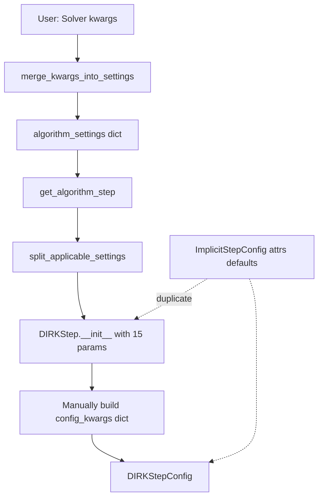
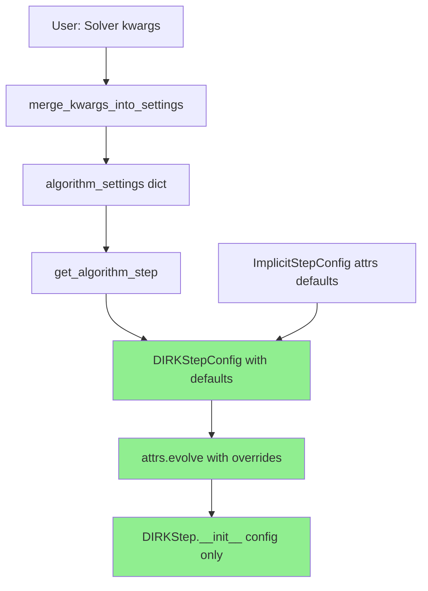

# Default Parameter Rationalization - Overview

## User Stories

### User Story 1: Simplified Component Initialization
**As a** developer working on cubie's integrator components  
**I want** to understand where default parameter values come from  
**So that** I can easily reason about the configuration cascade and modify defaults when needed

**Acceptance Criteria:**
- Default parameter values are defined once in a single, discoverable location (the attrs config class)
- No duplicate default definitions exist across init functions and config classes
- Init function signatures contain only required parameters (no optional parameters with defaults)
- Optional parameters can be overridden by kwargs at higher levels

**Success Metrics:**
- Init functions are shorter and more focused on business logic
- Configuration flow is traceable from attrs defaults → init overrides
- Code reviews identify parameter defaults immediately without searching

### User Story 2: Maintainable Configuration Classes
**As a** maintainer updating default parameter values  
**I want** default values to be defined in attrs config classes  
**So that** I only need to change them in one place

**Acceptance Criteria:**
- All optional parameters have defaults defined in attrs config classes (e.g., `ImplicitStepConfig`, `DIRKStepConfig`)
- Init functions accept only explicit overrides (no defaults in signature)
- The `split_applicable_settings` utility correctly filters kwargs against init signatures
- Updated defaults propagate automatically to all consumers

**Success Metrics:**
- Single source of truth for each parameter default
- No "default drift" where different components assume different defaults
- Reduced lines of code in init functions

### User Story 3: Clean Kwargs Propagation
**As a** user of the Solver API  
**I want** to override specific integration parameters via kwargs  
**So that** I can customize behavior without constructing full settings dictionaries

**Acceptance Criteria:**
- Kwargs at Solver level override algorithm defaults
- Algorithm defaults override config class defaults
- No manual dictionary merging required in application code
- `merge_kwargs_into_settings` handles the cascade transparently

**Success Metrics:**
- Users can pass `krylov_tolerance=1e-8` to Solver and it reaches the algorithm
- No need to construct intermediate settings dicts for simple overrides
- Clear warning when duplicate keys exist

## Overview

The current parameter default system in cubie has evolved organically, resulting in:
- **Dual default sources**: Both attrs config classes AND init functions define defaults
- **Large init signatures**: Functions like `DIRKStep.__init__` have 15+ optional parameters
- **Scattered defaults**: Same parameter has defaults in multiple places
- **Manual merging**: Code like `controller_settings.update(step_control_settings)` throughout

This technical debt hurts readability and maintainability.

## Solution Architecture

### Current State



**Problems:**
- Step 6-7: Init builds dict from params that came from a dict
- Step F: 15 optional params duplicate config class defaults
- Steps F→G→H: Unnecessary parameter passing

### Proposed State - Option A: Attrs-First



**Benefits:**
- Single source of truth: attrs config class
- Smaller init signatures: only required params
- No manual dict construction
- Uses attrs.evolve for clean overrides

### Key Technical Decisions

#### Decision 1: Where Defaults Live
**Choice**: Attrs config classes (e.g., `ImplicitStepConfig`, `DIRKStepConfig`)  
**Rationale**: 
- Already have validators and converters
- Natural fit for CUDAFactory pattern (config is compile_settings)
- attrs provides `fields()` for introspection

#### Decision 2: Init Signature Pattern
**Before:**
```python
def __init__(self, precision, n, dxdt_function=None, 
             krylov_tolerance=1e-6, max_linear_iters=10, ...):
    config = ImplicitStepConfig(
        precision=precision, n=n, dxdt_function=dxdt_function,
        krylov_tolerance=krylov_tolerance, ...
    )
```

**After (Option A - Recommended):**
```python
def __init__(self, config, **overrides):
    if overrides:
        config = attrs.evolve(config, **overrides)
```

**After (Option B - Explicit Required):**
```python
def __init__(self, precision, n, **kwargs):
    config = build_config(
        ImplicitStepConfig, 
        required={'precision': precision, 'n': n},
        **kwargs
    )
```

#### Decision 3: Factory Function Role
**Current**: `get_algorithm_step` filters kwargs, then passes to init  
**Proposed**: Factory creates config object with defaults, then instantiates

```python
def get_algorithm_step(precision, settings, **kwargs):
    algorithm_settings = {**settings, **kwargs}
    algorithm_type, tableau = resolve_alias(algorithm_settings.pop('algorithm'))
    
    # Get config class from algorithm type
    config_class = algorithm_type.CONFIG_CLASS
    
    # Build config with defaults + overrides
    config = build_config_from_settings(
        config_class,
        precision=precision,
        settings=algorithm_settings,
        tableau=tableau
    )
    
    # Pass only config
    return algorithm_type(config)
```

## Options Considered

### Option A: Attrs-First with Config Object (Recommended)

**Pattern:**
```python
@attrs.define
class DIRKStepConfig(ImplicitStepConfig):
    tableau: DIRKTableau = attrs.field(default=DEFAULT_DIRK_TABLEAU)
    stage_increment_location: str = attrs.field(default='local')
    # ... all parameters with defaults

class DIRKStep(ODEImplicitStep):
    CONFIG_CLASS = DIRKStepConfig
    
    def __init__(self, config: DIRKStepConfig, **overrides):
        if overrides:
            config = attrs.evolve(config, **overrides)
        super().__init__(config, self._get_defaults(config))
```

**Pros:**
- Cleanest: one line init for most cases
- attrs.evolve is pythonic and well-documented
- Config object is already used for compile_settings
- Easy to test: construct config, check defaults

**Cons:**
- Requires callers to construct config objects (but factory handles this)
- Slight learning curve for attrs.evolve

### Option B: Helper Function with Required/Optional Split

**Pattern:**
```python
def build_config(config_class, required, **optional):
    """Build config with defaults, requiring specific parameters."""
    defaults = {
        field.name: field.default 
        for field in attrs.fields(config_class)
        if field.default != attrs.NOTHING
    }
    merged = {**defaults, **required, **optional}
    return config_class(**merged)

class DIRKStep(ODEImplicitStep):
    def __init__(self, precision, n, **kwargs):
        config = build_config(
            DIRKStepConfig,
            required={'precision': precision, 'n': n},
            **kwargs
        )
        super().__init__(config, self._get_defaults(config))
```

**Pros:**
- Clear separation of required vs optional
- Helper can validate required params exist
- Familiar pattern for Python developers

**Cons:**
- Still need to list required params in init signature
- Helper function is one more abstraction
- Less standard than attrs.evolve

### Option C: Dataclass-style with Keyword-Only

**Pattern:**
```python
@attrs.define
class DIRKStepConfig(ImplicitStepConfig):
    # All fields have defaults
    tableau: DIRKTableau = DEFAULT_DIRK_TABLEAU
    stage_increment_location: str = 'local'

class DIRKStep(ODEImplicitStep):
    def __init__(self, *, precision, n, **kwargs):
        # Use factory function to merge defaults
        config = make_config(
            DIRKStepConfig, 
            precision=precision, 
            n=n, 
            **kwargs
        )
        super().__init__(config, self._get_defaults(config))
```

**Pros:**
- Keyword-only args prevent positional confusion
- Still allows required parameters in signature
- Compatible with existing split_applicable_settings

**Cons:**
- Requires new `make_config` helper
- Init signature still lists required params
- Doesn't fully leverage attrs capabilities

### Option D: Status Quo with Documentation

**Pattern:**
- Keep current structure
- Add comments documenting default sources
- Create DEFAULTS.md listing all parameters

**Pros:**
- Zero implementation risk
- No refactoring needed

**Cons:**
- Doesn't solve the readability problem
- Documentation will drift from code
- Still have duplicate defaults

## Recommendation: Option A

**Rationale:**
1. **Pythonic**: attrs.evolve is standard pattern for immutable updates
2. **Minimal changes**: Mostly affects init signatures
3. **Testable**: Easy to verify defaults in config tests
4. **Extensible**: Pattern scales to new algorithms
5. **Consistent**: Aligns with CUDAFactory compile_settings pattern

**Implementation phases:**
1. Add `CONFIG_CLASS` class attribute to all algorithm steps
2. Create `build_config_from_settings` helper in `_utils.py`
3. Refactor factory functions (`get_algorithm_step`, `get_controller`)
4. Simplify init functions to accept config + overrides
5. Remove optional parameters from init signatures
6. Update tests to use config objects

**Non-goals:**
- Backwards compatibility (breaking changes expected during development)
- Performance optimization (focus on readability)

## Expected Impact

**Code volume:**
- Init functions: -30 to -50 lines each
- Total: ~500 lines removed

**Affected modules:**
- `integrators/algorithms/*.py` (8 files)
- `integrators/step_control/*.py` (5 files)
- `integrators/loops/ode_loop.py`
- `outputhandling/output_functions.py`
- `memory/mem_manager.py`

**Test updates:**
- Factory function tests: add config construction tests
- Init tests: switch to config-based construction
- No changes to integration tests (behavior unchanged)
