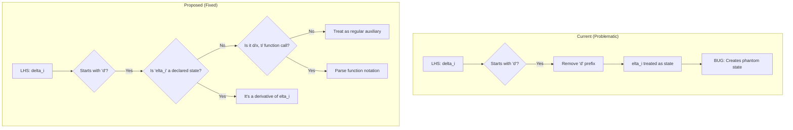
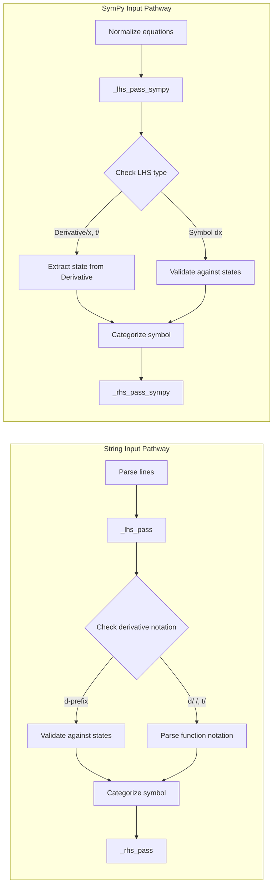

# Derivative Notation System Redesign

## User Stories

### US-1: Unambiguous Variable Naming
**As a** CuBIE user defining ODE systems  
**I want** my auxiliary variable names like `delta_i` to not be misinterpreted as derivatives  
**So that** I can use natural, descriptive variable names without worrying about reserved prefixes

**Acceptance Criteria:**
- Variables starting with "d" followed by non-state names are treated as regular auxiliaries
- Only explicitly declared states (or derivatives in function notation) become state derivatives
- Existing systems using `dx = ...` notation continue to work as before
- Parser provides clear error messages when ambiguity is detected

### US-2: Intuitive Derivative Notation for New Users
**As a** user coming from MATLAB, SciPy, or Julia  
**I want** derivative notation that feels familiar  
**So that** I can define ODEs without learning an unfamiliar syntax

**Acceptance Criteria:**
- Users can write `dx = ...` (classic style) when `x` is a declared state
- Users can write `d(x, t) = ...` (function notation) for explicit derivatives
- Users can use `Derivative(x, t)` in SymPy input (already supported)
- Documentation provides clear guidance on available notation styles

### US-3: Clear Error Messages
**As a** user who makes a typo or notation mistake  
**I want** helpful error messages that explain what went wrong  
**So that** I can quickly fix my ODE definitions

**Acceptance Criteria:**
- Parser explains when a "d"-prefixed symbol doesn't match a known state
- Suggestions are provided for likely intended symbols
- Warning issued when `d<name>` matches a state but user may have intended auxiliary

---

## Executive Summary

The current derivative identification system uses a simple heuristic: any LHS 
symbol starting with "d" is treated as a derivative of the remaining characters.
This causes `delta_i = x + y` to be misinterpreted as `d(elta_i)/dt`, which is
a poor user experience.

### Recommended Solution: Context-Aware "d" Prefix

The most minimal and backwards-compatible solution is to **only treat `dX` as 
a derivative when `X` is a known state variable**. This eliminates the ambiguity
while preserving the concise `dx = ...` syntax that users find natural.

Additionally, we'll add support for **explicit function notation `d(x, t)`** as
an unambiguous alternative that users can opt into.

---

## Architecture Overview

---

## Key Technical Decisions

### Decision 1: State-Aware "d" Prefix Interpretation

**Rationale:** The simplest fix with maximum backwards compatibility. When we see
`dX` on the LHS, we only treat it as a derivative if `X` is in the declared
states. Otherwise, it's an auxiliary.

**Trade-offs:**
- ✅ Zero breaking changes for valid existing code
- ✅ Minimal implementation complexity
- ✅ Natural mental model: "d-prefix means derivative of that state"
- ⚠️ Requires states to be declared (or inferred in non-strict mode first)

### Decision 2: Optional Function Notation `d(x, t)`

**Rationale:** Provides an unambiguous explicit syntax for users who want clarity.
This notation is familiar to CellML users and mathematically standard.

**Trade-offs:**
- ✅ Completely unambiguous - no false positives possible
- ✅ Familiar to mathematicians and CellML users
- ✅ Works even when state isn't declared (helpful in non-strict mode)
- ⚠️ Slightly more verbose than plain `dx`

### Decision 3: Reserve `t` as Time Symbol

**Rationale:** Already done - `TIME_SYMBOL = sp.Symbol("t", real=True)` exists.
We document this reservation clearly and use it in the `d(x, t)` notation.

---

## Implementation Impact

### Files Modified

| File | Change Type | Description |
|------|-------------|-------------|
| `parser.py` | Major | Update `_lhs_pass` and `_lhs_pass_sympy` with state-aware logic |
| `parser.py` | Minor | Add regex pattern for `d(x, t)` function notation |
| `test_parser.py` | Addition | Tests for new notation handling |

### Complexity Assessment

- **Lines of Code:** ~50-100 lines changed in parser
- **Risk Level:** Low - isolated to parsing layer
- **Breaking Changes:** None for valid existing code

---

## Research Findings

### Other Libraries' Approaches

1. **SciPy solve_ivp:** Uses function signature `def f(t, y)` - derivatives are
   implicit from the return value. Not directly applicable to symbolic input.

2. **SymPy dsolve:** Uses canonical `Derivative(y, x)` notation. Already supported
   in CuBIE's SymPy input pathway.

3. **Julia DifferentialEquations.jl:** Uses `@ode_def` macro with `du = ...`
   notation, similar to CuBIE's current approach but within a macro context
   that has explicit state tracking.

4. **CellML:** Uses explicit `Derivative(state, time)` - CuBIE already handles
   this correctly in the CellML import pathway.

5. **MATLAB:** Uses `dxdt = ...` notation in function definitions, with states
   passed as input array `x`. The "dt" suffix is common in MATLAB tutorials.

### User Background Considerations

- **MATLAB users:** Familiar with `dx = ...` or `dxdt = ...` notation
- **SciPy users:** Expect function-based interface (out of scope for symbolic)
- **Julia users:** Accustomed to explicit state declarations with `du[1] = ...`
- **Physicists/Engineers:** Comfortable with `d(x)/dt` or `ẋ` notation

Our hybrid approach (state-aware d-prefix + optional function notation)
accommodates all these backgrounds.

---

## Success Metrics

1. **Backwards Compatibility:** All existing tests pass without modification
2. **Bug Resolution:** `delta_i = x + y` correctly creates an auxiliary
3. **User Experience:** New error messages are helpful and actionable
4. **Documentation:** Clear guidance on notation options in docstrings
