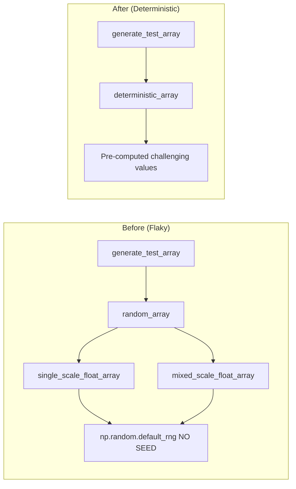
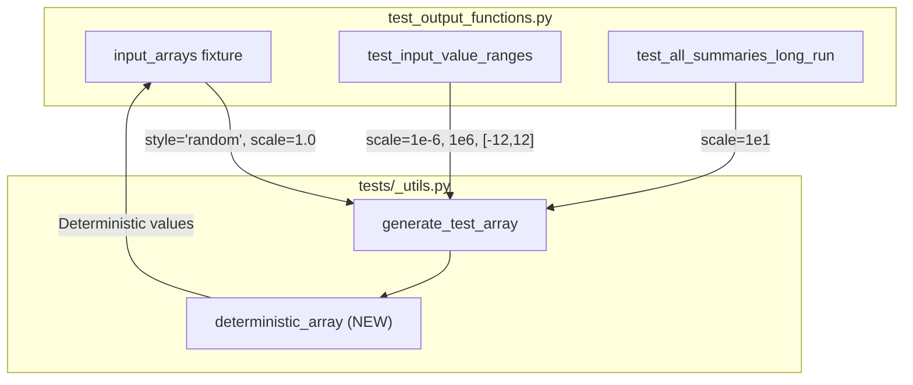

# Deterministic Test Fixtures: Human Overview

## User Stories

### US-1: Eliminate Test Flakiness
**As a** developer running the test suite  
**I want** tests in `test_output_functions.py` to produce consistent results  
**So that** I can trust test failures indicate real bugs, not random variation

**Acceptance Criteria:**
- Tests pass consistently across multiple runs
- No random number generation without explicit seeds in test fixtures
- Test arrays are deterministic and reproducible

### US-2: Reduce Test Infrastructure Complexity
**As a** maintainer of the test suite  
**I want** unused random generation infrastructure removed  
**So that** the codebase is cleaner and easier to understand

**Acceptance Criteria:**
- Unused functions (`random_array`, `single_scale_float_array`, `mixed_scale_float_array`) are removed from `tests/_utils.py`
- Unused file `tests/odesystems/_utils.py` is removed entirely
- `generate_test_array` function is simplified or removed

### US-3: Maintain Numerical Challenge
**As a** tester ensuring numerical correctness  
**I want** replacement test arrays to still exercise edge cases  
**So that** tests remain effective at catching numerical bugs

**Acceptance Criteria:**
- Test arrays include wide dynamic range (small and large values)
- Test arrays include edge cases (near-zero, negative values)
- Test arrays expose potential precision issues (values spanning multiple orders of magnitude)

---

## Overview

### Problem Statement
The tests in `test_output_functions.py` use randomly generated input arrays via `generate_test_array()` with the `"random"` style. This causes flaky test behavior because:
1. Random values are generated without a seed (`np.random.default_rng()`)
2. Different runs produce different values, leading to inconsistent test results

### Solution Approach
Replace random array generation with deterministic arrays that are:
1. **Reproducible** - Same values every run
2. **Numerically challenging** - Cover wide dynamic range, edge cases
3. **Minimal** - No complex infrastructure needed

### Data Flow: Test Array Generation

### Key Technical Decisions

1. **Replace "random" style with deterministic generation**
   - Use mathematically constructed arrays with known challenging properties
   - Include values like: 1e-15, 1e-6, 1e-1, 1.0, 1e6, 1e15, π, e, negative values
   - Pattern values across array dimensions for reproducibility

2. **Remove unused infrastructure**
   - Delete `random_array()`, `single_scale_float_array()`, `mixed_scale_float_array()`
   - Delete entire `tests/odesystems/_utils.py` file (all functions unused)
   - Keep `generate_test_array()` for interface compatibility, but change implementation

3. **Preserve test parameterization interface**
   - Keep `scale` parameter in fixture overrides for compatibility
   - Interpret scale as guidance for value range, not randomness

### Files to Modify

| File | Action |
|------|--------|
| `tests/_utils.py` | Replace random functions with deterministic generation |
| `tests/odesystems/_utils.py` | **DELETE** - all functions are unused |
| `tests/outputhandling/test_output_functions.py` | No changes needed (interface preserved) |

### Trade-offs Considered

| Approach | Pros | Cons | Decision |
|----------|------|------|----------|
| Seeded random | Simple change, keeps "randomness" | Still need seed management, less predictable for debugging | ❌ |
| Hardcoded arrays | Maximum predictability | Less flexible, harder to maintain | ❌ |
| **Deterministic generator** | Predictable, flexible, self-documenting | Slightly more code | ✅ |

### Expected Impact

- **Test reliability**: Flaky tests become deterministic
- **Code reduction**: ~200 lines removed (unused infrastructure)
- **Maintainability**: Simpler test utilities, easier to understand
- **Test coverage**: Maintained - still exercises numerical edge cases
