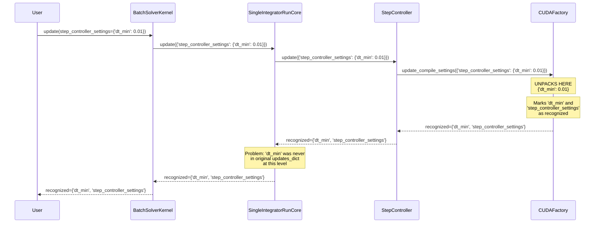
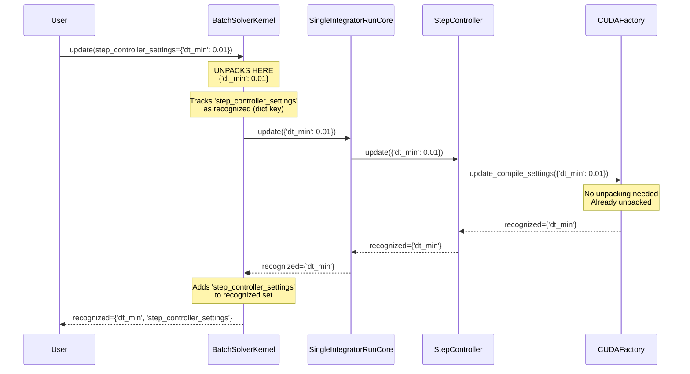

# Dict Unpacking Fix - Human Overview

## User Stories

### Story 1: Correct Parameter Recognition
**As a** CuBIE user  
**I want** dict parameter unpacking to correctly track which parameters were recognized by which components  
**So that** I receive accurate feedback about unrecognized parameters

**Acceptance Criteria:**
- When I pass `update(step_controller_settings={'dt_min': 0.01})`, the dict key 'step_controller_settings' is marked as recognized
- The unpacked contents ('dt_min') are only marked as recognized if the target component actually processes them
- If I pass an invalid parameter inside a dict value (e.g., `step_controller_settings={'invalid_param': 123}`), I get a clear error message
- The behavior is consistent across all update() methods in the call chain (BatchSolverKernel, SingleIntegratorRunCore, IVPLoop)

### Story 2: Maintain Backward Compatibility
**As a** CuBIE developer  
**I want** the fix to preserve existing update() behavior  
**So that** existing tests and user code continue to work

**Acceptance Criteria:**
- All existing tests pass without modification
- Direct parameter passing (e.g., `update(dt_min=0.01)`) continues to work exactly as before
- Mixed dict and direct parameters work correctly
- Silent mode still suppresses errors appropriately

### Story 3: Clear Separation of Concerns
**As a** CuBIE maintainer  
**I want** dict unpacking logic to be centralized and clear  
**So that** the update system is maintainable and debuggable

**Acceptance Criteria:**
- Dict unpacking happens at a single, well-defined point in the update chain
- Recognition tracking is transparent and follows the call hierarchy
- Code comments explain the unpacking and recognition flow

## Overview

The current implementation unpacks dict values at the leaf level (`CUDAFactory.update_compile_settings`), which causes incorrect parameter recognition tracking. When a dict value is unpacked, its contents are marked as recognized even though intermediate update() methods in the call chain never received those parameters in their original form.

### Current Problem Flow

The issue: 'dt_min' gets marked as recognized at all levels, but it was only present after unpacking at the leaf. This violates the contract that update() methods should only recognize parameters they actually receive.

### Proposed Solution Flow

The fix: Unpacking happens at the entry points (top-level update() methods) before distributing to sub-components. The dict keys are tracked separately and marked as recognized at the unpacking level.

## Key Technical Decisions

### Decision 1: Unpack at Top-Level update() Methods
**Rationale:** Each update() method that distributes to sub-components should unpack dict values before distribution. This ensures that sub-components receive the actual parameters they're expected to process, not nested dicts.

**Affected Methods:**
- `BatchSolverKernel.update()` (line 667)
- `SingleIntegratorRunCore.update()` (line 370)
- `IVPLoop.update()` (line 1490)

**Implementation:** Reuse the existing `_unpack_dict_values()` method from CUDAFactory by extracting it to a shared utility function.

### Decision 2: Track Dict Keys Separately
**Rationale:** When a dict value is unpacked, the original dict key should be marked as recognized by the unpacking method, while the unpacked contents should be marked as recognized only if sub-components actually process them.

**Implementation:** Each update() method that unpacks will:
1. Call unpack helper to get unpacked dict and set of unpacked keys
2. Add unpacked keys to its recognized set immediately
3. Distribute unpacked dict to sub-components
4. Merge sub-component recognized sets with its own

### Decision 3: Remove Unpacking from CUDAFactory
**Rationale:** Since unpacking now happens at higher levels, `CUDAFactory.update_compile_settings()` should no longer unpack dict values. This simplifies the leaf behavior and ensures correct recognition tracking.

**Implementation:** Remove `_unpack_dict_values()` call from `CUDAFactory.update_compile_settings()`. Keep the helper method as it will be moved to a shared location.

## Expected Impact

### Minimal Changes Required
- Extract `_unpack_dict_values()` to shared utility (likely `_utils.py`)
- Modify 3 update() methods to call unpacking helper at start
- Remove unpacking from `CUDAFactory.update_compile_settings()`
- Adjust recognition tracking in the 3 update() methods

### No Breaking Changes Expected
- All existing tests should pass
- User-facing API remains identical
- Only internal behavior changes (parameter recognition tracking)

## Trade-offs and Alternatives Considered

### Alternative A: Keep Unpacking in CUDAFactory, Fix Recognition
**Pros:** Minimal code changes, unpacking stays at one location  
**Cons:** Complex recognition tracking logic, harder to debug, violates update() contract  
**Decision:** Rejected - violates principle that update() should only recognize parameters it receives

### Alternative B: Unpack at Every Level
**Pros:** Most flexible, each level can decide what to unpack  
**Cons:** Redundant unpacking, higher maintenance burden, inconsistent behavior  
**Decision:** Rejected - unnecessary complexity

### Alternative C: Chosen Solution - Unpack at Top Levels
**Pros:** Clear separation of concerns, correct recognition tracking, minimal changes  
**Cons:** Requires updating 3 methods, repeated unpacking logic  
**Decision:** Accepted - best balance of correctness and maintainability

## Validation Strategy

### Unit Tests
- Test unpacking at each level independently
- Test mixed dict and direct parameters
- Test nested dicts (dict containing dict)
- Test error handling for invalid parameters in dicts

### Integration Tests
- Test full update chain from BatchSolverKernel to leaf components
- Test silent mode behavior
- Test recognition tracking through entire chain

### Regression Tests
- All existing update tests must pass unchanged
- Specifically verify test_update_compile_settings_unpack_* tests still pass
