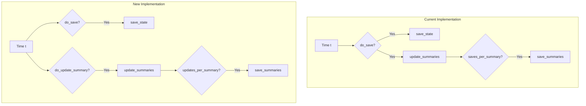

# Summary Update Timing Decoupling

## User Stories

### Story 1: Summary-Only Output with Appropriate Update Intervals
**As a** CuBIE user running large-scale batch simulations
**I want to** generate summary statistics without saving full time-domain data
**So that** I can efficiently analyze millions of IVPs using only aggregate metrics

**Acceptance Criteria:**
- Can run simulations with `dt_update_summaries` independent of `dt_save`
- Summary metrics are updated at `dt_update_summaries` intervals
- `dt_update_summaries` must divide evenly into `dt_summarise` (validated)
- Default behavior (`dt_update_summaries = dt_save`) maintains backward compatibility
- Summary calculations remain mathematically correct with configurable update cadence

### Story 2: Flexible Summary Timing Configuration
**As a** CuBIE user configuring simulation outputs
**I want to** control how frequently summary metrics are updated independently from save cadence
**So that** I can optimize memory usage and computational efficiency for my specific use case

**Acceptance Criteria:**
- `dt_update_summaries` parameter available in ODELoopConfig
- Can set `dt_update_summaries` to values different from `dt_save`
- Validation errors occur when `dt_update_summaries` doesn't divide `dt_summarise`
- Loop correctly determines when to update summaries based on `dt_update_summaries`
- `updates_per_summary` calculated correctly as `dt_summarise / dt_update_summaries`

### Story 3: Decoupled Save and Summary Update Logic
**As a** CuBIE developer maintaining the integration loop
**I want to** separate the concerns of saving outputs and updating summaries
**So that** the code is more maintainable and the logic is clearer

**Acceptance Criteria:**
- `do_save` and `do_update_summary` are separate boolean flags in the loop
- `update_summaries` called when `do_update_summary` is True (not just when `do_save` is True)
- `save_summaries` receives `updates_per_summary` (not `saves_per_summary`)
- Code clearly distinguishes between save timing and summary update timing
- Existing tests continue to pass with default settings

## Overview

### Executive Summary

This feature decouples the timing of summary metric updates from the timing of state saves in CuBIE's integration loop. Currently, summary metrics are updated every time a state is saved (`dt_save` interval), and summaries are persisted every N saves. This creates a logical inconsistency when users want summary-only outputs where conceptually `dt_save` approaches zero but summary updates should occur at a reasonable cadence.

The solution introduces a new `dt_update_summaries` parameter that controls when summary metrics are updated, separate from `dt_save`. This parameter defaults to `dt_save` to maintain backward compatibility but can be set independently to enable efficient summary-only workflows.

### Architecture Diagram



### Data Flow

```mermaid
sequenceDiagram
    participant Loop as IVPLoop
    participant Time as Time Check
    participant Update as update_summaries
    participant Save as save_summaries
    
    Loop->>Time: Check current time
    Time->>Time: t >= next_update_summary?
    alt Update Summary
        Time->>Update: Call update_summaries
        Update->>Update: Accumulate metrics
        Update->>Update: Increment update_idx
    end
    
    Time->>Time: update_idx % updates_per_summary == 0?
    alt Save Summary
        Time->>Save: Call save_summaries
        Save->>Save: Write to output
        Save->>Save: Reset buffers
        Save->>Save: Increment summary_idx
    end
```

### Key Technical Decisions

1. **New Parameter: `dt_update_summaries`**
   - Controls the interval at which summary metrics are updated
   - Defaults to `dt_save` for backward compatibility
   - Must be an integer divisor of `dt_summarise` (validated)
   - Stored with leading underscore in attrs classes, exposed via property

2. **Separate Update Logic**
   - Introduce `do_update_summary` boolean flag separate from `do_save`
   - Track `next_update_summary` time independent of `next_save`
   - Calculate `updates_per_summary = dt_summarise / dt_update_summaries`
   - Pass `updates_per_summary` to `save_summaries` instead of `saves_per_summary`

3. **Fixed-Step Mode Handling**
   - In fixed-step mode, calculate `steps_per_update` similar to `steps_per_save`
   - Use counter-based logic: `do_update_summary = (update_counter % steps_per_update) == 0`
   - Reset counter after each summary update

4. **Validation Strategy**
   - Add validator to ensure `dt_update_summaries > 0`
   - Add validator to ensure `dt_summarise % dt_update_summaries == 0` (integer divisor)
   - Validation occurs at ODELoopConfig initialization

### Expected Impact

**Benefits:**
- Enables efficient summary-only output mode for large-scale simulations
- Separates concerns of state persistence and metric accumulation
- Provides finer control over computational/memory tradeoffs
- Maintains backward compatibility with existing code

**No Breaking Changes:**
- Default `dt_update_summaries = dt_save` preserves current behavior
- All existing tests should pass without modification
- API additions are optional parameters

**Performance Considerations:**
- May reduce computational overhead when `dt_update_summaries > dt_save`
- No performance penalty when using default settings
- Additional conditional check in main loop (negligible overhead)

### Research Findings

**Current Implementation Analysis:**
- In `ode_loop.py` lines 534-554: `update_summaries` is called inside `if do_save` block
- Line 488: `saves_per_summary = config.saves_per_summary` computed as `dt_summarise // dt_save`
- Line 541: Summary check uses `(save_idx + 1) % saves_per_summary == 0`
- In fixed-step mode (lines 434-438): `do_save` determined by step counter

**Dependencies:**
- `ODELoopConfig` in `ode_loop_config.py`: Central configuration for loop settings
- `OutputConfig` in `output_config.py`: May need to store `dt_update_summaries` if exposed to output system
- `update_summaries` factory in `update_summaries.py`: Receives `current_step` parameter
- `save_summaries` factory in `save_summaries.py`: Receives `summarise_every` parameter

**Integration Points:**
- IVPLoop initialization: Accept `dt_update_summaries` parameter
- ODELoopConfig: Store and validate `dt_update_summaries`
- Main loop logic: Add `do_update_summary` calculation and separate update tracking
- Summary counter: Track updates instead of saves

### Trade-offs and Alternatives

**Chosen Approach: Explicit `dt_update_summaries` Parameter**
- ✅ Clear, explicit control
- ✅ Easy to understand and validate
- ✅ Backward compatible
- ❌ Adds another configuration parameter

**Alternative 1: Automatic Calculation**
- Calculate `dt_update_summaries` automatically based on `dt_summarise`
- ❌ Less flexible
- ❌ Hides important configuration from user
- ✅ Fewer parameters

**Alternative 2: Percentage-Based Updates**
- Specify updates as percentage of summary interval
- ❌ Less intuitive
- ❌ More complex validation
- ✅ Could be more natural for some users

**Alternative 3: Decouple Completely with Separate Counter**
- Track summary updates independently of all other timing
- ❌ More complex
- ❌ Potential for timing inconsistencies
- ✅ Maximum flexibility

