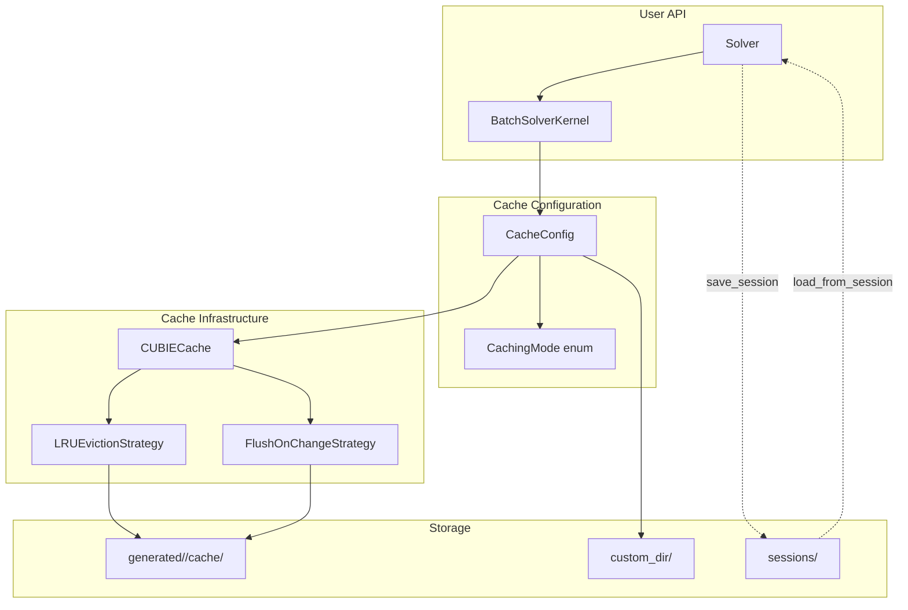
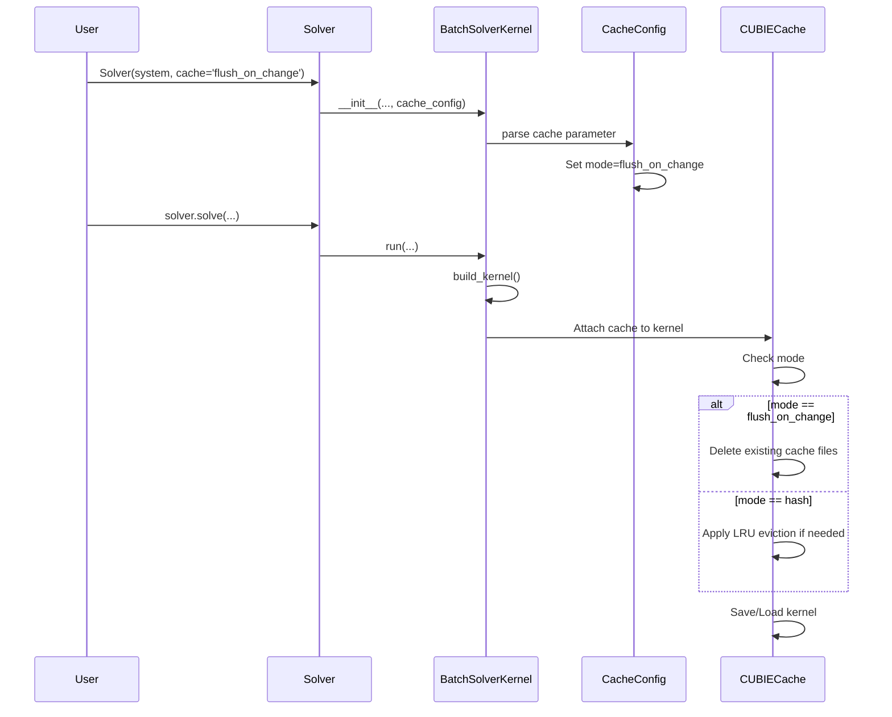

# Enhanced File-Based Caching for BatchSolverKernel

## User Stories

### US-1: LRU Cache Eviction
**As a** CuBIE user running many parameter sweeps  
**I want** the cache to automatically evict old entries when it grows too large  
**So that** disk space is managed without manual intervention  

**Acceptance Criteria:**
- Cache entries are evicted when count exceeds configurable limit (default 10)
- Least recently accessed files are evicted first
- Eviction limit is configurable via BatchSolverKernel parameter
- Eviction occurs transparently during cache operations

### US-2: Flush-on-Change Caching Mode
**As a** developer in a CI/CD environment  
**I want** a caching mode that only keeps the current configuration cached  
**So that** disk usage is minimal and predictable  

**Acceptance Criteria:**
- New `caching_mode` parameter supports 'hash' (default) and 'flush_on_change'
- 'flush_on_change' deletes all cache files when settings change
- Integrates with CUDAFactory's existing `_invalidate_cache()` mechanism
- Mode can be changed at runtime via update()

### US-3: Enhanced Cache Keyword in BatchSolverKernel
**As a** user configuring the solver  
**I want** a unified `cache` parameter that accepts multiple input types  
**So that** cache configuration is intuitive and flexible  

**Acceptance Criteria:**
- `cache=True` (default): Enable caching with hash mode
- `cache=False`: Disable caching entirely
- `cache='flush_on_change'`: Enable caching with flush mode
- `cache=Path('/custom/dir')`: Enable caching with custom directory

### US-4: set_cache_dir Method
**As a** user who needs to change cache location after construction  
**I want** a method to override the cache directory  
**So that** I can redirect cache files without recreating the solver  

**Acceptance Criteria:**
- `set_cache_dir(path)` method available on BatchSolverKernel
- Calling method invalidates existing cache
- Subsequent builds use new directory
- Works with both absolute and relative paths

### US-5: Cache Methods on Solver
**As a** high-level API user  
**I want** cache control methods exposed through the Solver class  
**So that** I don't need to access the internal kernel object  

**Acceptance Criteria:**
- Solver exposes cache configuration properties
- Solver exposes `set_cache_dir(path)` method
- Cache statistics accessible through Solver

### US-6: Session Save/Load
**As a** researcher with long-running experiments  
**I want** to save and restore solver configurations by name  
**So that** I can resume work across Python sessions  

**Acceptance Criteria:**
- `save_session(solver, name)` function in cubie module
- `load_from_session(name)` function in cubie module
- Sessions store compile_settings objects
- Cached compiled functions named after session

---

## Overview

This feature enhances CuBIE's existing file-based caching infrastructure with
eviction strategies, flexible configuration, and session persistence.

### Architecture Overview

### Data Flow: Cache Operations

### Key Technical Decisions

1. **LRU via File Access Times**: Use filesystem mtime/atime for LRU ordering
   rather than maintaining a separate index. This keeps implementation simple
   and robust across process restarts.

2. **CacheConfig Attrs Class**: Centralize all cache configuration in a single
   attrs class within BatchSolverConfig. This follows CuBIE's pattern of using
   attrs for compile-critical settings.

3. **Session Storage Location**: Sessions stored in `generated/sessions/` to
   co-locate with other generated artifacts. Uses pickle for compile_settings
   serialization.

4. **Backwards Compatible API**: The enhanced `cache` parameter accepts the
   existing `True`/`False` values, so existing code continues to work.

### Trade-offs

| Decision | Benefit | Cost |
|----------|---------|------|
| File mtime for LRU | Simple, survives restarts | Less precise than in-memory LRU |
| Cache per init | No cross-instance conflicts | Slightly more disk usage |
| Pickle for sessions | Simple serialization | Not human-readable |

### References

- Existing implementation: `src/cubie/cubie_cache.py`
- numba-cuda caching: `.github/active_plans/explore-caching/core/caching.py`
- Strategy analysis: `.github/active_plans/file_caching_batchsolverkernel/caching_strategy_comparison.md`
