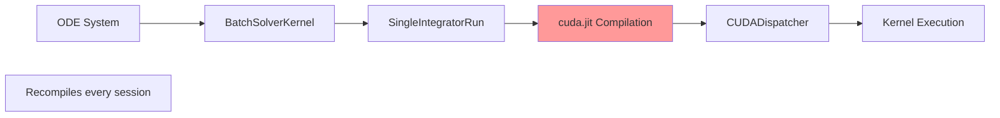
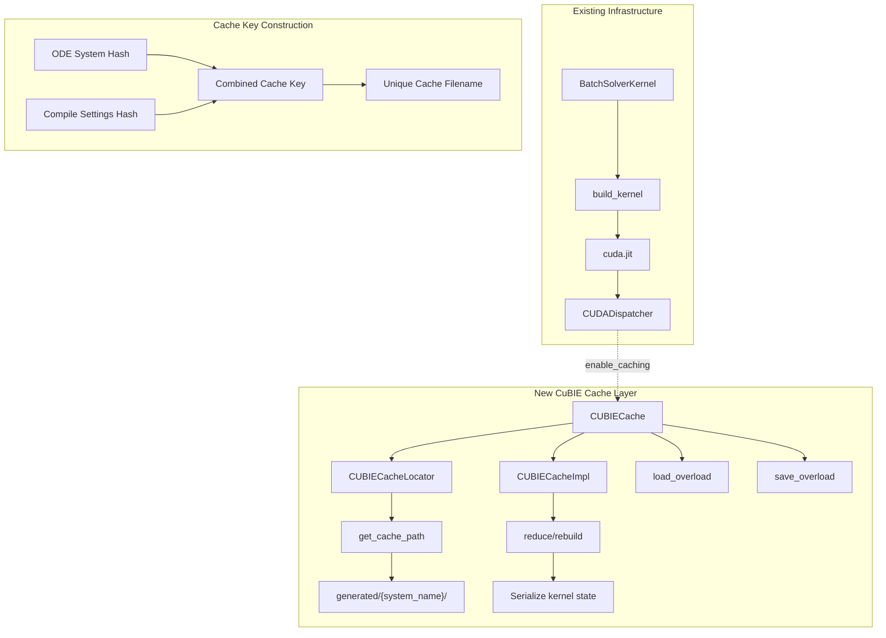
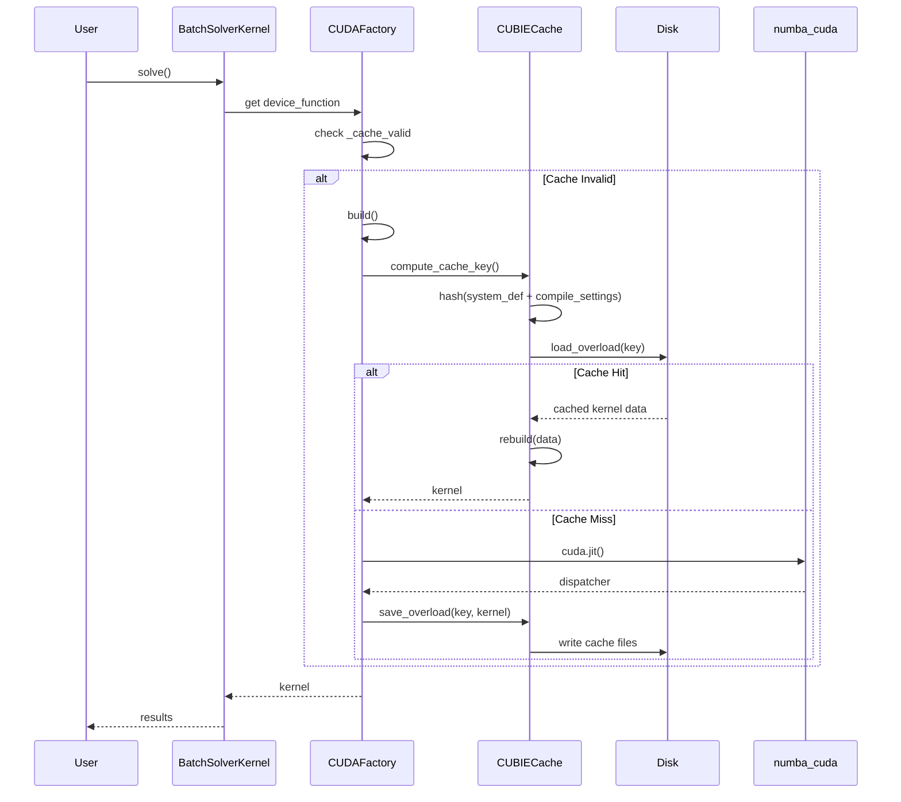

# File-Based Caching for BatchSolverKernel

## User Stories

### US-1: As a CuBIE user, I want compiled kernels to persist across Python sessions
**Description**: When I run the same ODE system with identical compile settings,
I want to avoid recompilation by loading a previously cached kernel from disk.

**Acceptance Criteria**:
- [ ] First run compiles and saves the kernel to a cache file
- [ ] Subsequent runs with identical settings load the cached kernel
- [ ] Cache files are stored in `generated/<system_name>/` directory
- [ ] Cache hit/miss can be observed via debug logging

### US-2: As a CuBIE user, I want automatic cache invalidation when settings change
**Description**: When I modify compile settings (precision, algorithm, tolerances,
etc.), the cache should automatically detect the change and recompile.

**Acceptance Criteria**:
- [ ] Changing any compile_settings attribute invalidates the cache
- [ ] Cache key includes hash of ODE system definition
- [ ] Cache key includes hash of all compile_settings up the factory chain
- [ ] Stale cache files do not cause incorrect behaviour

### US-3: As a developer, I want a clean, idiomatic integration with numba-cuda
**Description**: The caching solution should follow numba-cuda patterns and
integrate cleanly without monkey-patching or invasive modifications.

**Acceptance Criteria**:
- [ ] Custom cache uses numba-cuda's caching infrastructure
- [ ] Solution subclasses appropriate numba-cuda classes
- [ ] No modifications to numba-cuda source required
- [ ] Solution follows CuBIE's existing architectural patterns

---

## Executive Summary

This exploration designs a file-based caching mechanism for `BatchSolverKernel`
that persists compiled CUDA kernels to disk. The goal is to eliminate startup
compilation time for repeated runs of the same ODE system with identical
settings.

### Current State



The current implementation has two levels of caching:
1. **Codegen caching** (in `ODEFile`): Symbolic code generation is cached to
   `generated/<system_name>.py` files
2. **In-memory caching** (in `CUDAFactory._cache`): Compiled device functions
   are cached per-session, invalidated when compile_settings change

Missing: **File-based caching of compiled kernels** between Python sessions.

### Proposed Architecture



### Key Design Decisions

1. **Subclass numba-cuda's caching infrastructure** rather than implementing
   from scratch. This leverages tested serialization and file-handling logic.

2. **Custom CacheLocator** to redirect cache files to `generated/<system_name>/`
   instead of `__pycache__`.

3. **Composite cache key** incorporating:
   - ODE system hash (from `hash_system_definition`)
   - Serialized compile_settings attrs classes
   - Numba version and CUDA architecture

4. **Integration via dispatcher attachment** - attach the custom cache to the
   CUDADispatcher in `CUDAFactory.build()` rather than creating custom
   decorators.

---

## Data Flow Diagram



---

## Research Findings

### numba-cuda Caching Architecture

From analysis of the provided context files:

1. **CacheImpl** (`core/caching.py`): Abstract base providing:
   - `reduce(data)` → serialize kernel to storable form
   - `rebuild(target_context, data)` → deserialize from stored form
   - `check_cachable(data)` → determine if kernel can be cached
   - `_locator_classes` → list of locator classes to try

2. **Cache** (`core/caching.py`): Driver class providing:
   - `load_overload(sig, target_context)` → load cached kernel
   - `save_overload(sig, data)` → save kernel to cache
   - `_index_key(sig, codegen)` → compute cache key from signature + bytecode

3. **CacheLocator** (`core/caching.py`): Determines cache file location:
   - `get_cache_path()` → directory for cache files
   - `get_source_stamp()` → freshness indicator for invalidation
   - `get_disambiguator()` → string to differentiate similar functions

4. **CUDADispatcher** (`dispatcher.py`):
   - `enable_caching()` → attaches a `CUDACache` instance
   - `_cache` attribute holds the active cache (default `NullCache`)

### Integration Points

Two viable approaches:

**Option A: Attach cache to dispatcher in CUDAFactory.build()**
```python
def build_kernel(self):
    @cuda.jit(...)
    def integration_kernel(...):
        ...
    
    # Attach custom cache
    integration_kernel._cache = CUBIECache(
        self.system,
        self.compile_settings
    )
    return integration_kernel
```

**Option B: Create custom jit decorator**
```python
def cubie_jit(system, compile_settings, **kwargs):
    def decorator(func):
        disp = cuda.jit(**kwargs)(func)
        disp._cache = CUBIECache(system, compile_settings)
        disp.enable_caching()
        return disp
    return decorator
```

**Recommendation**: Option A is cleaner and less invasive.

---

## Trade-offs and Alternatives

### Alternative 1: Use numba's built-in caching
**Pros**: Zero implementation effort
**Cons**: Cache goes to `__pycache__`, no custom key construction, no system-
aware invalidation

### Alternative 2: Custom serialization without numba infrastructure
**Pros**: Full control over format
**Cons**: Must reimplement serialization, lose tested numba code

### Alternative 3 (Selected): Subclass numba-cuda caching classes
**Pros**: Leverages tested infrastructure, clean integration
**Cons**: Depends on numba-cuda internals (may break on updates)

---

## Expected Impact on Existing Architecture

1. **CUDAFactory**: Minimal changes - may need to pass system info to build()
2. **BatchSolverKernel**: Add cache attachment in build_kernel()
3. **New files**: `cubie_cache.py` containing custom cache classes
4. **ODEFile**: Leverage existing `GENERATED_DIR` for cache location

### Risk Mitigation

- Cache is optional; system works without it if loading fails
- Version numba in cache key to handle API changes
- Graceful fallback to recompilation on cache corruption
