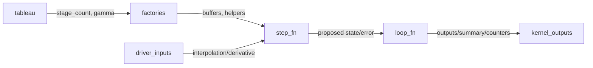

# FIRK and Rosenbrock parity in all_in_one.py

## User Stories

1. As a CuBIE developer, I want the FIRK factories inside `tests/all_in_one.py`
   to mirror the production `generic_firk` logic (stage counts, buffers, and
   coupled solver wiring) so that lineinfo debugging reflects real FIRK
   behaviour for any tableau.
   - Acceptance: Stage counts derive from the selected tableau; solver helpers
     and buffer sizing use the flattened `stage_count * n` dimension; driver
     handling and error estimates align with production defaults; no placeholder
     FIRK stage residual or operator logic remains.
   - Success metrics: FIRK path in `all_in_one.py` compiles without manual
     stubbing, accepts any registered FIRK tableau, and produces the same
     buffer/solver layout as `generic_firk` for matching inputs.

2. As a CuBIE developer, I want the Rosenbrock factories in `tests/all_in_one.py`
   to match `generic_rosenbrock_w`, including time-derivative and cached
   auxiliary helpers, so that debugging follows production control flow.
   - Acceptance: Linear solver uses cached Jacobian helpers; time-derivative
     factory mirrors module behaviour; cached auxiliary sizing matches tableau
     and helper outputs; placeholders exist only for system helper codegen
     (Jacobian/time-derivative generation) that mirrors solver helper modules.
   - Success metrics: Rosenbrock path builds without ad-hoc placeholders,
     accepts any registered Rosenbrock tableau, and exposes the same buffers
     and helper hooks as `generic_rosenbrock_w`.

3. As a developer running the unified debug kernel, I need `all_in_one.py` to
   wire FIRK and Rosenbrock paths identically to the module pipeline (loop,
   controller, output, and memory layout) so debug runs exercise the same code
   paths as production.
   - Acceptance: Shared/local buffer flags, controller defaults, output sizing,
     and loop wiring match module expectations for all algorithm types; driver
     interpolation and derivatives integrate with both FIRK and Rosenbrock
     flows; no missing parameters when toggling between algorithm types.
   - Success metrics: Switching algorithm_type between ERK, DIRK, FIRK, and
     Rosenbrock requires only tableau selection; compiled kernel launches
     without additional manual fixes; saved outputs and counters follow the
     same shapes and stride rules as the batch solver.

## Overview

The all-in-one debug script must align its FIRK and Rosenbrock implementations
with their module counterparts (`generic_firk.py`, `generic_rosenbrock_w.py`).
Key gaps today are FIRK stage aggregation (n_stage handling) and Rosenbrock
time-derivative/Jacobian helpers, which are currently stubbed or simplified.
The plan is to replicate module behaviour inside `tests/all_in_one.py` so
lineinfo debugging matches production, leaving placeholders only for system
solver-helper codegen (Jacobian/time-derivative generation) that mirrors the
production codegen interface.

### Architecture snapshot

```mermaid
flowchart TD
    cfg[Config: algorithm_type, tableau, precision, memory flags]
    sys[System codegen: dxdt, observables, solver helpers]
    firk[FIRK factories: n-stage buffers, coupled Newton/Krylov]
    ros[Rosenbrock factories: cached Jacobian helpers, time derivative]
    ctrl[Controller factories (fixed / PID)]
    step[Step function (per algorithm)]
    loop[IVP loop builder]
    kernel[integration_kernel launch]

    cfg --> sys --> firk
    cfg --> sys --> ros
    cfg --> ctrl
    firk --> step
    ros --> step
    step --> loop --> kernel
```

### Data flow highlights



### Key decisions

- Mirror module factories: replicate FIRK n-stage solver wiring and Rosenbrock
  cached-Jacobian/time-derivative helpers instead of ad-hoc placeholders.
- Preserve codegen boundaries: only system helper generation (Jacobian/time
  derivative) remains placeholder-style but must follow production interfaces.
- Maintain memory/layout parity: buffer sizing, shared/local toggles, and loop
  stride rules must match module `BufferSettings` and loop composition.
- Reuse tableau registries: keep registry-driven selection identical to module
  registries to avoid divergence when tableaus change.

### Trade-offs and alternatives

- Directly importing module factories would reduce duplication but defeat the
  lineinfo goal; duplicating logic keeps debugging aligned at the device level.
- Keeping helper codegen as placeholders avoids entangling symbolic pipelines
  while still matching interfaces; full codegen embedding would be heavier.

### Expected impact

- Debug runs for FIRK and Rosenbrock will exercise the same solver setup and
  buffer layouts as production, improving traceability of GPU issues.
- Aligning helper hooks reduces divergence risk when changing tableaus or
  controller defaults.
- Minimal impact on other algorithms; ERK and DIRK remain unchanged but benefit
  from consistent loop/controller wiring.
