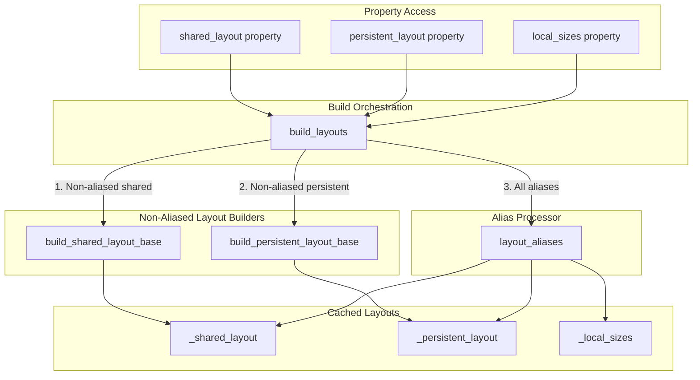
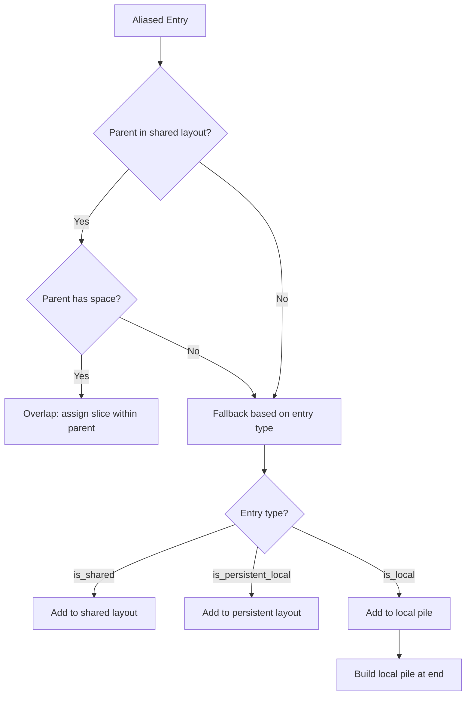

# Buffer Aliasing Logic Refactor - Human Overview

## User Stories

### US-1: Deterministic Layout Building Order
**As a** CuBIE developer building CUDA device functions  
**I want** buffer layouts to be computed in a consistent, deterministic order  
**So that** buffer slice assignments are predictable regardless of which property is accessed first

**Acceptance Criteria:**
- [x] All layout building follows the same sequence every time
- [x] Accessing `shared_layout`, `persistent_layout`, or `local_sizes` in any order produces identical results
- [x] No hidden side effects based on access order

### US-2: Centralized Aliasing Logic
**As a** CuBIE maintainer  
**I want** aliasing logic consolidated in a single method  
**So that** cross-type and cross-location aliasing rules are consistent and maintainable

**Acceptance Criteria:**
- [x] All aliasing decisions made in one dedicated method (`layout_aliases`)
- [x] Aliasing logic removed from individual layout builders
- [x] Clear documentation of aliasing rules and fallback behavior

### US-3: Correct Parent-Child Memory Overlap
**As a** CuBIE user configuring buffer aliasing  
**I want** child buffers to correctly overlap their shared parent when space permits  
**So that** I can reuse memory efficiently with predictable behavior

**Acceptance Criteria:**
- [x] When parent is shared with space: child overlaps within parent
- [x] When parent is shared without space: child allocated separately in appropriate memory
- [x] When parent is not shared: child falls back to its declared location
- [x] Aliased entries that cannot alias correctly fall back to appropriate memory based on their own `is_shared`/`is_persistent_local`/`is_local` flags

### US-4: Proper Fallback for Cross-Location Aliases
**As a** CuBIE developer using cross-location aliasing  
**I want** aliased buffers to fallback correctly when parent location doesn't match  
**So that** memory allocation is correct regardless of parent buffer location

**Acceptance Criteria:**
- [x] Aliased entry with `is_shared=True` aliasing a local parent → allocated in shared layout
- [x] Aliased entry with `is_persistent_local=True` → allocated in persistent layout
- [x] Aliased entry with `is_local=True` → allocated as local buffer
- [x] Local buffers never added to shared or persistent layouts

---

## Executive Summary

The current `BufferGroup` class has duplicated aliasing logic embedded in `build_shared_layout()` and `build_persistent_layout()`. This creates several problems:

1. **Order Dependency**: The outcome of layout building can vary depending on which property is accessed first, because `_alias_consumption` state is shared across methods
2. **Code Duplication**: Similar aliasing logic is repeated in multiple methods
3. **Incomplete Fallback**: When aliasing fails (parent too small or wrong location), fallback allocation may not handle all cases correctly

The solution introduces:
1. A new `build_layouts()` method that ensures consistent ordering
2. A new `layout_aliases()` method that centralizes all aliasing decisions
3. Clear separation: layout builders handle only non-aliased entries; aliasing happens in one place

---

## Architecture Overview

---

## Data Flow for Aliasing

---

## Key Technical Decisions

### 1. Single Entry Point for Layout Building
All layout access goes through `build_layouts()`, ensuring the three-phase process always executes in order:
1. Build non-aliased shared buffers
2. Build non-aliased persistent buffers  
3. Process all aliased entries via `layout_aliases()`

### 2. Aliasing Resolution Priority
When processing an aliased entry, check in this order:
1. **Can alias shared parent with space?** → Overlap within parent's shared slice
2. **Entry is shared?** → Allocate in shared layout (fallback)
3. **Entry is persistent local?** → Allocate in persistent layout
4. **Entry is local?** → Add to local pile (collected at end)

### 3. Local Pile Processing
Non-persistent local buffers are collected during alias processing and "built" at the end of `layout_aliases()` rather than having a separate layout. This is because local buffers don't have slices—they use `cuda.local.array()` which just needs a size.

### 4. Alias Consumption Tracking
The `_alias_consumption` dict tracks how much of each parent buffer has been consumed by child aliases. This is cleared at the start of `build_layouts()` and populated as aliases are processed.

---

## Expected Impact on Existing Architecture

### Modified Methods
- `build_shared_layout()` → renamed to internal helper or removed
- `build_persistent_layout()` → renamed to internal helper or removed
- `build_local_sizes()` → logic moved into `layout_aliases()` and `build_layouts()`
- Property accessors updated to call `build_layouts()` instead of individual builders

### New Methods
- `build_layouts()` - Orchestrates the three-phase build process
- `layout_aliases()` - Handles all aliased buffer resolution

### Preserved Behavior
- `CUDABuffer` class unchanged
- `BufferRegistry` singleton unchanged (delegates to BufferGroup)
- Allocator generation via `build_allocator()` unchanged
- Registration and update methods unchanged

---

## Trade-offs Considered

### Option A: Keep Separate Build Methods (Rejected)
- **Pro**: Minimal code changes
- **Con**: Order dependency remains; aliasing logic still duplicated

### Option B: Single Unified Build Method (Rejected)
- **Pro**: Simplest architecture
- **Con**: Monolithic method harder to test and maintain

### Option C: Orchestrated Multi-Phase Build (Selected)
- **Pro**: Clear separation of concerns; testable phases
- **Pro**: Single entry point eliminates order dependency
- **Con**: Slightly more code; internal helpers may seem redundant

---

## References

- Current implementation: `src/cubie/buffer_registry.py` lines 145-548
- Buffer allocation pattern: `.github/context/cubie_internal_structure.md`
- Test file: `tests/test_buffer_registry.py`
