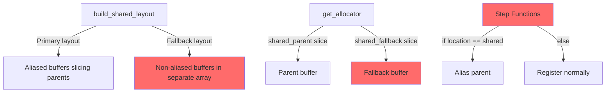
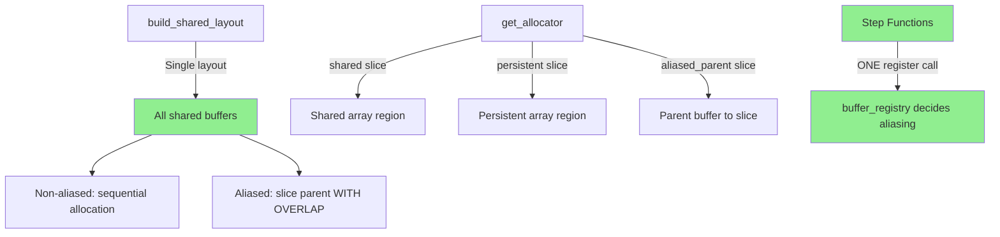
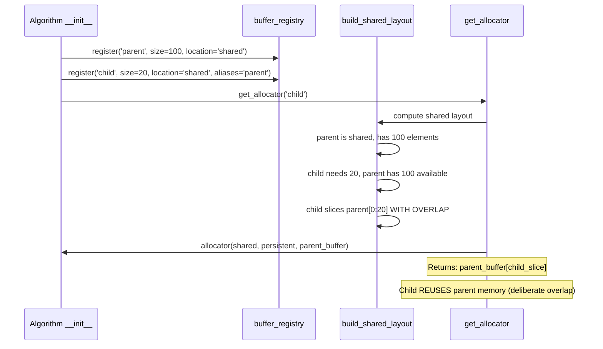
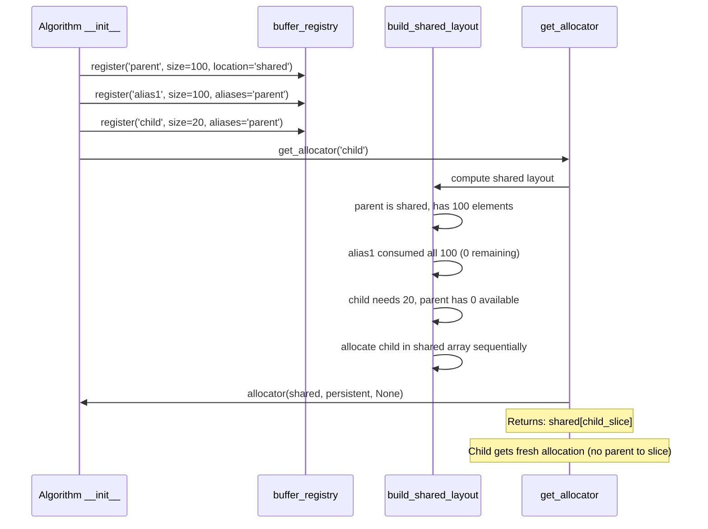
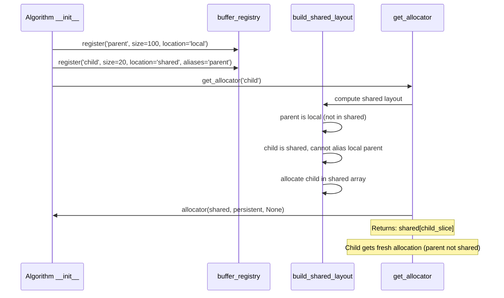

# Buffer Aliasing Implementation Rework - Human Overview

## User Stories

### Story 1: Correct Buffer Aliasing Semantics
**As a** CuBIE developer maintaining GPU memory efficiency  
**I want** aliased buffers to deliberately overlap their parent buffers when the parent is shared  
**So that** memory reuse maximizes GPU efficiency by sharing buffers with disjoint lifetimes  

**Acceptance Criteria:**
- When parent is shared AND has space: child slices parent buffer WITH OVERLAP (reuses parent's memory)
- When parent is shared BUT lacks space: child gets fresh allocation from combined shared array
- When parent is local: child gets fresh allocation from combined shared array (if child is shared)
- All aliasing logic resides in `buffer_registry` module only
- No manual aliasing checks in algorithm step functions
- Allocator receives correct buffer reference for each scenario

### Story 2: Simplified Allocator Signature
**As a** CuBIE developer working with CUDA device functions  
**I want** allocator parameters to clearly express their purpose  
**So that** the code is self-documenting and maintainable  

**Acceptance Criteria:**
- First parameter: `shared` (the combined shared memory array)
- Second parameter: `persistent` (the persistent local memory array)
- Third parameter: `aliased_parent` (the parent buffer being aliased, or None)
- Parameter names are descriptive and accurate
- No "fallback" terminology (there's ONE shared array, not two)
- All 49+ allocator call sites updated to new signature

### Story 3: Unified Shared Memory Layout
**As a** GPU programmer understanding memory allocation  
**I want** a single shared memory layout that tracks consumption  
**So that** I can reason about memory usage without confusion  

**Acceptance Criteria:**
- Single `shared` array allocated in device code
- Layout computation tracks which buffers alias parents vs allocate fresh
- Aliased buffers slice their parent WITH OVERLAP (reusing parent memory)
- Fresh allocations placed sequentially in shared array
- No separate "primary" and "fallback" layouts (single unified layout)
- Parent consumption tracking prevents over-aliasing

### Story 4: Clean Algorithm Step Functions
**As a** developer implementing integration algorithms  
**I want** to register each buffer exactly once with clear intent  
**So that** step function code focuses on algorithm logic, not memory management  

**Acceptance Criteria:**
- Each buffer registered with ONE call to `buffer_registry.register()`
- No conditional registration based on location checks
- No manual if/else logic deciding whether to alias
- Registry handles all aliasing decisions internally
- Algorithm code simply requests buffers by name

## Executive Summary

The current three-parameter allocator implementation fundamentally misunderstands buffer aliasing. Code review revealed critical semantic errors:

**Problem 1: Wrong Parameter Names**
- Current: `(shared_parent, persistent_parent, shared_fallback)`
- Correct: `(shared, persistent, aliased_parent)`
- The third parameter should be the parent buffer being aliased (or None), not a "fallback shared array"

**Problem 2: Misunderstanding Aliasing**
- Current implementation treats aliasing as "avoiding overlap"
- Correct behavior: Aliasing DELIBERATELY OVERLAPS to reuse memory
- Purpose: Share memory between buffers with disjoint lifetimes (parent done when child starts)

**Problem 3: Manual Aliasing Logic**
- Current: Step functions have if/else checks deciding whether to alias
- Correct: ALL aliasing logic in `buffer_registry`, algorithms just register buffers

**Problem 4: Confusing "Fallback" Concept**
- Current: Tracks two layouts (primary for aliased, fallback for non-aliased)
- Correct: Single shared array with sequential allocation (aliases consume parent, others get fresh space)

## Architectural Overview

### Current (Incorrect) Architecture

**Issues:**
- Two separate layouts confuse single shared array reality
- "Fallback" implies secondary allocation when it's just the same shared array
- Manual if/else in step functions duplicates registry logic

### Target (Correct) Architecture

**Improvements:**
- Single unified shared layout
- Registry makes all aliasing decisions
- Step functions have clean, single register() calls
- Parameters clearly express intent

## Data Flow: Correct Aliasing Semantics

### Scenario 1: Parent Shared, Child Shared, Has Space

### Scenario 2: Parent Shared, Child Shared, No Space

### Scenario 3: Parent Local, Child Shared

## Key Technical Decisions

### Decision 1: Rename Third Parameter to aliased_parent
**Rationale:** The parameter should be the parent buffer to slice, not a "fallback" array. When aliasing succeeds, child slices this parent. When aliasing fails or parent is local, this is None.

**Impact:** Self-documenting code, clear intent, no "fallback" confusion.

### Decision 2: Single Shared Layout
**Rationale:** There is ONE shared array in CUDA device code. Tracking two "layouts" implies two arrays, which is wrong. Track consumption of parents to manage which buffers alias vs allocate fresh.

**Impact:** Simplified logic, easier to reason about, matches CUDA reality.

### Decision 3: Remove Manual Aliasing from Step Functions
**Rationale:** Algorithm step functions currently have conditional registration logic checking locations. This duplicates registry logic and creates maintenance burden.

**Impact:** Cleaner algorithm code, single source of truth for aliasing decisions, better separation of concerns.

### Decision 4: Deliberate Overlap is Correct
**Rationale:** The purpose of aliasing is to REUSE memory. Child buffer deliberately overlaps parent buffer because parent is no longer needed when child is used. This is the intended behavior, not a bug.

**Impact:** Correct memory reuse semantics, maximum GPU efficiency.

## Implementation Plan Summary

### Task Group 1: Rename and Reorder Parameters (15 sites)
- Rename in `build_allocator` signature: `shared_fallback` → `aliased_parent`
- Rename in allocator device function: `shared_fallback` → `aliased_parent`
- Update parameter order: `(shared, persistent, aliased_parent)`
- Update all allocator call sites in `ode_loop.py` and algorithm files

### Task Group 2: Fix build_shared_layout Logic
- Remove "fallback" concept entirely
- Single shared layout with consumption tracking
- For aliased buffers where parent is shared: compute slice WITHIN parent
- For aliased buffers where parent is NOT shared OR no space: allocate in shared array
- Return single layout dict (remove fallback dict)

### Task Group 3: Remove Manual Aliasing Logic
- Remove conditional registration in `generic_dirk.py` (stage_base aliasing)
- Remove conditional registration in `generic_rosenbrock_w.py` (stage_cache aliasing)
- Each buffer gets ONE register() call with appropriate aliases parameter

### Task Group 4: Fix get_allocator Arguments
- For non-aliased shared buffers: pass (shared_slice, None, None)
- For non-aliased persistent buffers: pass (None, persistent_slice, None)
- For aliased buffers where parent is shared: pass (None, None, parent_slice)
- For aliased buffers where parent is NOT shared: pass (shared_slice, None, None)

## Expected Impact

### Files Requiring Changes
1. **buffer_registry.py** - Core aliasing logic, parameter renaming
2. **ode_loop.py** - Allocator call sites (16 calls)
3. **generic_dirk.py** - Remove manual aliasing, fix register() calls
4. **generic_rosenbrock_w.py** - Remove manual aliasing, fix register() calls
5. **All algorithm files** - Update allocator call sites (if any)

### Breaking Changes
- None for user-facing API
- Internal allocator signature changes (not user-facing)

### Tests to Update
- `test_buffer_registry.py` - Update aliasing test expectations
- Algorithm tests - Verify aliasing behavior remains correct
- Integration tests - Ensure no regressions

## Trade-offs and Alternatives

### Alternative 1: Keep Current Three-Parameter Design (REJECTED)
- **Pro:** No parameter renaming required
- **Con:** Wrong semantics, confusing "fallback" concept, incorrect aliasing

### Alternative 2: Two-Parameter Design (REJECTED)
- **Pro:** Simpler signature
- **Con:** Cannot handle cross-location aliasing (parent local, child shared)

### Alternative 3: Four-Parameter Design (REJECTED)
- **Pro:** Maximum flexibility
- **Con:** Over-complicated, unnecessary parameters

### Selected Solution: Corrected Three-Parameter Design
- **Pro:** Correct semantics, handles all scenarios, clear intent
- **Con:** Requires updating 49+ call sites (one-time cost)

## References

### Code Review Feedback
The original three-parameter implementation was based on a misunderstanding:
- Aliasing should DELIBERATELY OVERLAP parent buffers
- Third parameter should be the parent being aliased, not a "fallback array"
- Single shared array, not two separate layouts
- All aliasing logic should be in registry, not scattered in step functions

### CUDA Memory Model
- Shared memory is per-block, allocated at kernel launch
- One `cuda.shared.array()` call creates THE shared array for the block
- Slicing this array is zero-cost (just pointer arithmetic)
- Overlapping slices are intentional for memory reuse

### Previous Implementation (buffer_allocation_refactor_fixes)
The previous plan introduced the three-parameter design but with wrong semantics. This plan corrects those semantics while keeping the three-parameter structure.
