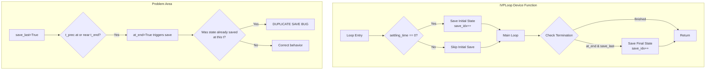

# Bug Fix: Extra State Save Issue

## User Stories

### User Story 1: Consistent Save Behavior
**As a** CuBIE user running integrations with default timing parameters  
**I want** the loop to save exactly the expected number of state snapshots  
**So that** my output arrays have the correct dimensions and don't contain duplicate final states

**Acceptance Criteria:**
- When `save_every` is None and `save_last` is True, exactly one state is saved at t=0 and one at t_end
- When `save_every` is specified with `save_last=False`, states are saved only at regular intervals
- When both `save_every` and `save_last` are active, the final save is not duplicated when t_end coincides with a regular save point

### User Story 2: Consistent Summary Behavior  
**As a** CuBIE user requesting summary metrics with mixed timing configurations  
**I want** summaries to be collected without duplication  
**So that** my summary output arrays have the correct dimensions

**Acceptance Criteria:**
- When `summarise_regularly=True` and `summarise_last=True`, no duplicate summary is written when the final step coincides with a regular summary point
- Summary metrics are accumulated correctly across the integration duration
- The `save_summaries` function is called the expected number of times

### User Story 3: Test Isolation for Timing State
**As a** developer running CuBIE test suites  
**I want** tests to be isolated from timing state set by previous tests  
**So that** tests produce consistent results regardless of execution order

**Acceptance Criteria:**
- Tests that use default timing parameters are not affected by explicitly-set timing from earlier tests
- The `_user_timing` dictionary is properly reset between test session parameter sets
- Session-scoped fixtures don't carry over timing state inappropriately

---

## Executive Summary

This bug fix addresses an extra state save occurring under specific conditions after a refactor of the IVPLoop device function and loop exit logic. The issue manifests as:

1. **Double save at end**: When `save_last=True` (triggered by no `save_every` parameter), the loop saves an extra state before termination
2. **Combination issue**: When `summarise_regularly=True` and `summarise_last=True` are both active, there may be duplicate summary writes
3. **Test order sensitivity**: The `_user_timing` dictionary in `SingleIntegratorRun` persists across session-scoped fixtures, causing timing parameters from explicit tests to affect subsequent implicit tests

## Architecture Overview



## Key Technical Decisions

### Issue 1: Extra State Save Logic

The root cause appears to be in the loop exit logic around lines 600-607 and 631-632 of `ode_loop.py`:

```python
if save_last or summarise_last:
    at_end = bool_(t_prec <= t_end) & finished
    finished = finished &~ at_end
```

The condition `t_prec <= t_end` combined with `finished` may cause `at_end` to fire when the loop has already saved the final state through regular save logic.

**Proposed Fix**: Add tracking to prevent double-saves when `save_regularly` and `save_last` are both active and the final save point coincides with the loop end.

### Issue 2: Summary Combination Issue

When `summarise_regularly=True` and `summarise_last=True`, the existing logic at lines 813-815:
```python
save_summary_now = (
    (update_idx % samples_per_summary == int32(0))
    or (summarise_last and at_end)
)
```

This may cause double summary writes when both conditions are true simultaneously.

**Proposed Fix**: Ensure `summarise_last` only triggers when `summarise_regularly` hasn't already saved at that point.

### Issue 3: Test Order Timing Leak

The `_user_timing` dictionary in `SingleIntegratorRunCore` (lines 180-184):
```python
self._user_timing = {
    "save_every": None,
    "summarise_every": None,
    "sample_summaries_every": None,
}
```

This is set during `__init__` but may persist across session-scoped fixtures with the same parameter sets.

**Proposed Fix**: 
- Add fixture-level reset of `_user_timing` before tests that don't specify explicit timing
- OR modify the fixture instantiation to ensure clean timing state

## Affected Files

| File | Change Type | Description |
|------|-------------|-------------|
| `src/cubie/integrators/loops/ode_loop.py` | Logic Fix | Modify loop exit and save logic to prevent duplicates |
| `tests/conftest.py` | Test Infrastructure | Reset `_user_timing` in appropriate fixtures |

## Trade-offs Considered

1. **Explicit tracking vs. conditional logic**: Adding explicit "already_saved_final" tracking is cleaner but adds state; conditional logic is more complex but stateless
2. **Fixture-level reset vs. function-level**: Session fixtures are faster but require careful state management; function-scoped fixtures are slower but cleaner
3. **Breaking change to save counts**: Existing code depending on the buggy behavior may need updates

## Expected Impact

- **Performance**: Minimal - only affects loop termination logic
- **API**: No breaking changes to public API
- **Test suite**: Some tests may need updated expectations for save counts
