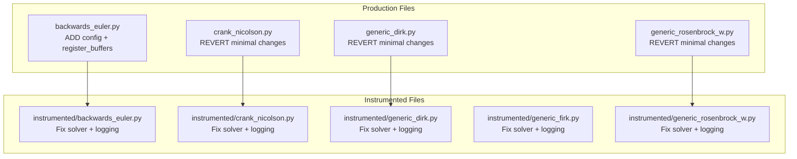

# Fix Instrumented Algorithms Plan

## User Stories

### Story 1: Revert Production Over-Changes
**As a** CuBIE developer  
**I want** production algorithm files to remain unchanged (except for backwards_euler enhancements)  
**So that** the production code remains stable and only backwards_euler gets the new buffer location configuration feature

**Acceptance Criteria:**
- Production `generic_dirk.py`, `crank_nicolson.py`, `generic_rosenbrock_w.py` match their original state from commit fd158dd
- Production `backwards_euler.py` has:
  - New `BackwardsEulerStepConfig` class with buffer location parameter
  - Updated `__init__` to accept location parameter
  - New `register_buffers()` method following DIRK pattern
  - `get_child_allocators` called in `build_step()`

### Story 2: Instrumented Solvers Correctly Instantiated
**As a** test developer  
**I want** instrumented algorithms to create instrumented solver instances  
**So that** I can capture logging arrays during solver iterations

**Acceptance Criteria:**
- Instrumented algorithms call `super().__init__()` to get base class functionality
- Instrumented algorithms override `self.solver` with instrumented versions in `build_implicit_helpers()`
- Instrumented solvers receive the same operator/preconditioner/residual functions as production

### Story 3: Logging Arrays Passed to Instrumented Solvers
**As a** test developer  
**I want** logging arrays passed to instrumented solver calls  
**So that** I can capture iteration state for debugging and validation

**Acceptance Criteria:**
- Instrumented step functions include logging array parameters
- Solver calls in instrumented algorithms pass logging arrays to instrumented solvers
- Logging arrays are populated during solver execution

## Overview

### Problem
Previous changes were over-eager, modifying production files unnecessarily and breaking the instrumented test files by removing logging array parameters from solver calls.

### Solution

### Key Technical Decisions

1. **Production files should be minimal changes**: Only backwards_euler.py needs new functionality (buffer location config). Other files need only minor corrections to get_child_allocators naming.

2. **Instrumented algorithms override solver in build_implicit_helpers()**: This allows the base class ODEImplicitStep to handle initial setup, then instrumented versions can replace with instrumented solvers.

3. **Logging arrays must be passed to solver calls**: The instrumented solvers have extended signatures that accept logging arrays.

### Trade-offs Considered

- **Direct solver instantiation in __init__** vs **override in build_implicit_helpers()**: 
  - Chose override in build_implicit_helpers() because it allows base class to set up initial state and configuration, then instrumented version can replace with instrumented solver once helper functions are available.

## References

- Original instrumented files from commit fd158dd show correct pattern
- ODEImplicitStep.build_implicit_helpers() sets up solver with operator/preconditioner/residual
- InstrumentedNewtonKrylov and InstrumentedLinearSolver extend base solver signatures with logging parameters
