# Fix Instrumented Algorithm Solver Instantiation

## User Stories

### US1: Instrumented Algorithms Follow Production Patterns
**As a** developer testing implicit integration algorithms  
**I want** instrumented algorithm files to be verbatim copies of production with only logging added  
**So that** tests accurately validate production behavior without introducing discrepancies

**Acceptance Criteria:**
- Instrumented `__init__` methods are EXACT copies of production
- Instrumented `build_implicit_helpers()` methods follow the same pattern as production (using `self.solver.update()` and `self.update_compile_settings()`)
- No custom solver instantiation in instrumented `__init__` methods
- InstrumentedLinearSolver and InstrumentedNewtonKrylov accept the same parameters as their production counterparts

### US2: Solver Replacement at Build Time
**As a** developer  
**I want** instrumented solvers to be swapped in during `build_implicit_helpers()`, not in `__init__`  
**So that** the solver hierarchy is correctly established by the parent class first

**Acceptance Criteria:**
- Parent `ODEImplicitStep.__init__()` creates production solvers as normal
- Instrumented versions replace `self.solver` in `build_implicit_helpers()` after calling `self.solver.update()`
- Instrumented solvers copy settings from the existing production solver

## Overview

The instrumented algorithm test files have diverged from production patterns. The key issues are:

1. **InstrumentedLinearSolver/InstrumentedNewtonKrylov Init Mismatch**: These classes accept a `config` object in their `__init__`, but should accept the same parameters as their production parent classes (`precision`, `n`, `linear_solver`, etc.).

2. **Incorrect Solver Creation in Algorithm `__init__`**: Several instrumented files create new solver instances directly in `__init__` with custom parameters, which doesn't match production.

3. **Custom `build_implicit_helpers()` implementations**: Some files override this method and create entirely new solver instances instead of following the production pattern of using `self.solver.update()`.

## Architecture

```mermaid
graph TD
    subgraph Production
        A[ODEImplicitStep.__init__] --> B[Creates LinearSolver + NewtonKrylov]
        B --> C[build_implicit_helpers]
        C --> D[self.solver.update - sets operator/residual/preconditioner]
        D --> E[self.update_compile_settings - sets solver_function]
    end
    
    subgraph Instrumented - CORRECT Pattern
        A2[Instrumented.__init__] --> B2[Calls super.__init__ - EXACTLY like production]
        B2 --> C2[build_implicit_helpers - EXACTLY like production first]
        C2 --> D2[self.solver.update - same as production]
        D2 --> E2[Replace self.solver with InstrumentedNewtonKrylov]
        E2 --> F2[self.update_compile_settings - sets solver_function]
    end
    
    subgraph Instrumented - WRONG Pattern
        X[Instrumented.__init__] --> Y[Creates InstrumentedNewtonKrylov with wrong params]
        Y --> Z[TypeError: unexpected keyword argument]
    end
```

## Files to Fix

| File | Issue |
|------|-------|
| `instrumented/matrix_free_solvers.py` | `InstrumentedLinearSolver.__init__` accepts config object instead of individual params |
| `instrumented/backwards_euler.py` | Has custom `build_implicit_helpers()` that creates solver incorrectly |
| `instrumented/crank_nicolson.py` | Has custom `build_implicit_helpers()` that creates solver incorrectly |
| `instrumented/generic_dirk.py` | Creates InstrumentedNewtonKrylov in `__init__` with wrong params |
| `instrumented/generic_firk.py` | Uses `_replace_with_instrumented_solvers()` with wrong params |
| `instrumented/generic_rosenbrock_w.py` | Creates InstrumentedLinearSolver incorrectly in `build_implicit_helpers()` |

## Key Fix Pattern

1. **Update InstrumentedLinearSolver and InstrumentedNewtonKrylov** to accept the same signature as their parent classes
2. **Remove custom solver creation** from instrumented algorithm `__init__` methods
3. **In `build_implicit_helpers()`**: Follow production pattern exactly, then wrap with instrumented version

## Expected Outcome

All instrumented files should be verbatim copies of production files with:
- Same `__init__` structure and calls
- Same `build_implicit_helpers()` pattern with instrumented solver replacement at the end
- Logging arrays added only to `build_step()` and device functions
