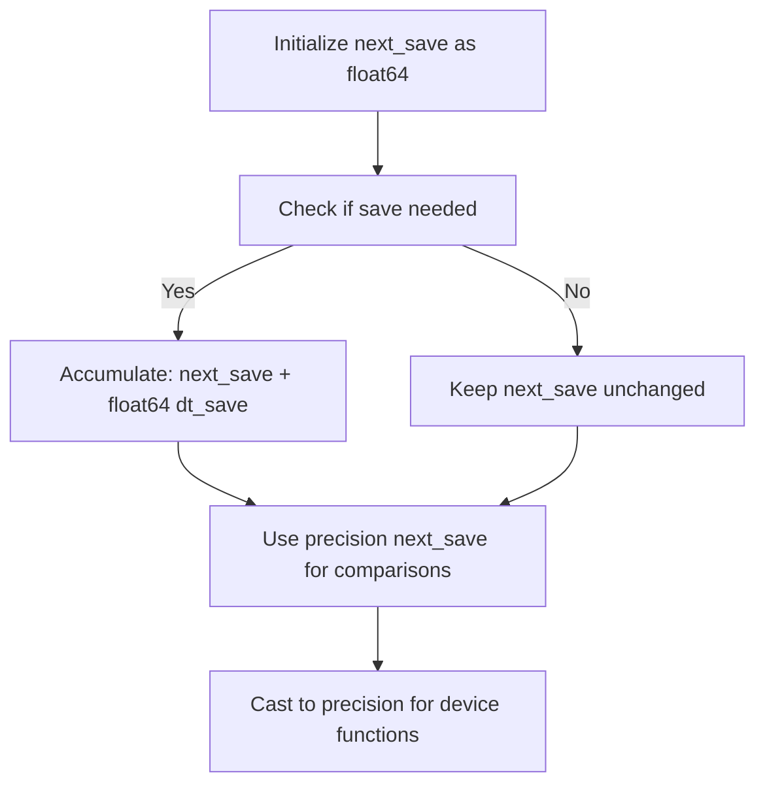
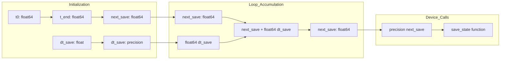

# Fix Loop Time Accumulation Precision Mismatch

## User Stories

### User Story 1: Accurate Time Accumulation
**As a** CuBIE user  
**I want** the GPU integration loop to accumulate time consistently with the CPU reference implementation  
**So that** my GPU results match CPU reference results within expected tolerances

**Acceptance Criteria:**
- GPU loop and CPU reference loop use identical type arithmetic for time accumulation
- `test_run` tests in `test_SolverKernel.py` pass with matching state values
- Time arrays continue to match between GPU and CPU implementations
- Maximum absolute difference in state values is within tolerance (< 0.001)
- Maximum relative difference in state values is within tolerance (< 0.01)

### User Story 2: Consistent Type Handling
**As a** CuBIE developer  
**I want** time-related variables to follow documented precision rules  
**So that** floating-point accumulation errors are minimized and predictable

**Acceptance Criteria:**
- All time accumulation uses `float64` type consistently
- Intervals (`dt_save`, `dt_summarise`) remain in "precision" type as specified
- Type casts to precision occur only when needed for device function calls
- No implicit type mixing in arithmetic operations
- Code comments clearly document the type handling strategy

### User Story 3: Loop Exit Consistency
**As a** CuBIE user  
**I want** the loop exit condition to work correctly with the time accumulation logic  
**So that** integrations complete at the expected time without premature termination

**Acceptance Criteria:**
- Loop exits when `next_save > t_end` as intended
- Final save point is captured correctly
- No off-by-one errors in save indices
- Duration and warmup settings are respected

## Overview

### Problem Summary

The GPU integration loop in `ode_loop.py` has a type mismatch in time accumulation that causes numerical divergence from the CPU reference implementation. The issue occurs at line 529:

```python
next_save = selp(do_save, next_save + dt_save, next_save)
```

Where:
- `next_save` is implicitly `float64` (initialized from `t_end` on line 375)
- `dt_save` is `precision` type (cast on line 206)

This causes mixed-precision arithmetic, leading to accumulated floating-point errors that differ from the CPU reference loop, which properly uses:

```python
next_save_time = next_save_time + np.float64(dt_save)
```

### Root Cause

The problem stems from inconsistent type handling for time accumulation:

1. **Initialization**: `next_save` starts as `float64` (line 375-378)
2. **Accumulation**: `dt_save` is added as `precision` type (line 529)
3. **Result**: Mixed-precision arithmetic produces different rounding behavior than pure `float64` operations

This violates the documented precision rules:
- Time should accrue in `float64`
- Intervals stay in "precision" type
- Cast accrued time back to precision before doing math with it

### Impact

Currently causing test failures in `test_SolverKernel.test_run`:
- Time arrays match correctly
- State arrays diverge with ~1% relative error
- 75% of state elements mismatched (54/72)

### Solution Approach

Convert `dt_save` to `float64` when accumulating `next_save`, matching the CPU reference implementation and the documented precision handling rules.



### Data Flow Diagram



### Technical Decision

**Chosen Approach**: Cast `dt_save` to `float64` when accumulating `next_save`

**Rationale**:
- Matches CPU reference implementation exactly
- Follows documented precision rules (time accrues in float64)
- Minimal code change (single line modification)
- No performance impact (cast happens only on save, not every step)
- Maintains backward compatibility

**Alternatives Considered**:

1. **Change `next_save` to precision type**: Would require changing loop exit condition logic and introduce precision loss in time accumulation
2. **Add epsilon to comparisons**: Explicitly forbidden by user requirements; masks the underlying issue
3. **Change CPU reference to match GPU**: Would introduce the same bug in both implementations

### Expected Behavior After Fix

1. `next_save` accumulates in pure `float64` arithmetic
2. GPU and CPU implementations use identical type handling
3. Floating-point rounding behavior matches exactly
4. State arrays converge within expected tolerances
5. All `test_run` tests pass

### References

- Related to Issue #153: "bug: save cadence, fixed-step timing potentially incorrect"
- Issue #153 specifically mentions "slight mismatch in CPU and device clamping to the 'next save' time"
- Recent commit d5b0250: "fix: match loop exit condition in cpu reference"
