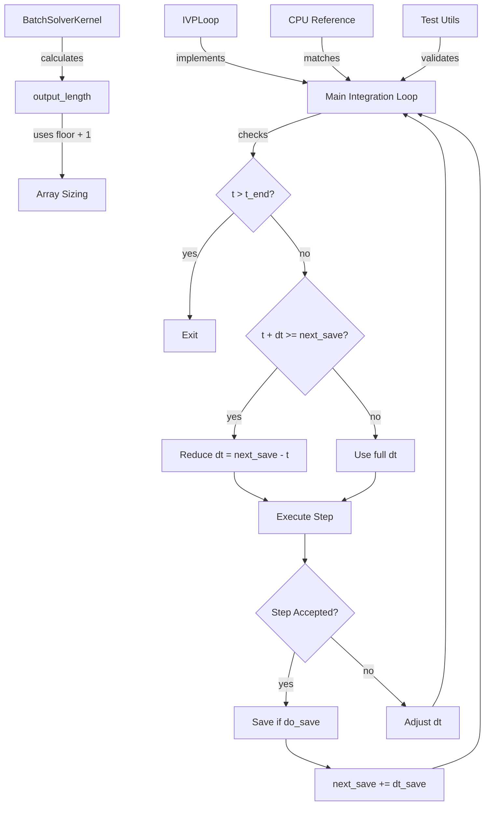

# Fix Loop Timing and Precision Setting Issues

## User Stories

### User Story 1: Correct Output Array Sizing
**As a** CuBIE user integrating ODEs/SDEs  
**I want** output arrays sized using `floor(duration/dt_save) + 1`  
**So that** the array size accurately represents the number of saves from t0 to t_end

**Acceptance Criteria:**
- Output length calculation uses `np.floor()` instead of `np.round()`
- The `+1` accounts for both initial state (at t0 or settling_time) and all subsequent saves up to t_end
- Arrays are never undersized, causing index out-of-bounds errors
- Arrays are not oversized, wasting GPU memory

**Success Metrics:**
- All tests pass with the new calculation
- GPU integration produces correct number of output samples matching CPU reference

---

### User Story 2: Time-Based Loop Exit
**As a** CuBIE user running integrations  
**I want** loops to exit when `t > t_end`  
**So that** the integration completes at the correct endpoint without relying on step counting

**Acceptance Criteria:**
- Loop termination condition checks `t > t_end` as primary exit criterion
- No loops use fixed step counts to determine when to exit
- Both adaptive and fixed-step controllers respect time-based exit
- Integration completes within expected time bounds

**Success Metrics:**
- Final integration time `t` is within one reduced step of `t_end`
- No premature or late exits due to step count mismatches

---

### User Story 3: Time-Based Save Logic
**As a** CuBIE user collecting integration outputs  
**I want** saves to occur by comparing `t` with `next_save` in all cases  
**So that** outputs are saved at consistent time intervals regardless of controller type

**Acceptance Criteria:**
- Adaptive controllers: Save when `t + dt >= next_save`, reduce step to exactly hit `next_save`
- Fixed-step controllers: Save when `t + dt >= next_save`, accepting reduced steps occasionally
- Remove all `steps_per_save` and `fixed_steps_per_save` logic
- After each save, `next_save` increments by `dt_save`

**Success Metrics:**
- Saved timestamps match expected intervals within numerical precision
- Fixed-step controllers can take reduced steps when necessary
- CPU reference and GPU implementation produce aligned save times

---

### User Story 4: Consistent Test Infrastructure
**As a** CuBIE developer  
**I want** test fixtures and CPU references to match the new loop timing logic  
**So that** validation tests accurately verify GPU implementations

**Acceptance Criteria:**
- `tests/_utils.py` uses `floor() + 1` for array sizing
- `tests/integrators/cpu_reference/loops.py` implements time-based save logic matching GPU
- `conftest.py` timing fixtures align with new calculations
- All timing-related test utilities updated consistently

**Success Metrics:**
- CPU reference outputs match GPU outputs within tolerance
- Tests validate correct timing behavior for all controller types

---

## Overview

This feature fixes fundamental flaws in loop timing and array sizing that currently use `np.round()` or `np.ceil()` with fixed step counting logic. The current approach creates timing mismatches between expected and actual save points, potential array size issues, and inconsistencies between adaptive and fixed-step controllers.

### Executive Summary

**Current Problems:**
1. Output arrays sized with `np.round(duration/dt_save) + 1` - incorrect rounding can cause off-by-one errors
2. Fixed-step controllers use `steps_per_save` counting instead of time comparison
3. Loops may exit based on array filling rather than time reaching `t_end`
4. Inconsistency between how adaptive vs fixed controllers determine when to save

**Solution:**
1. Change output length to `int(np.floor(duration/dt_save)) + 1`
2. All controllers check `t + dt >= next_save` to determine when to save
3. Fixed-step controllers accept reduced steps when approaching save points
4. Loops exit when `t > t_end`, not when arrays fill
5. Update all tests and CPU references to match

### Architecture Diagram



### Data Flow: Loop Timing Changes

```mermaid
sequenceDiagram
    participant BSK as BatchSolverKernel
    participant Loop as IVPLoop
    participant Ctrl as StepController
    participant Algo as Algorithm
    
    BSK->>BSK: output_length = floor(duration/dt_save) + 1
    BSK->>Loop: Allocate arrays[output_length]
    Loop->>Loop: next_save = t0 (or t0 + warmup)
    Loop->>Loop: t = t0
    
    loop Until t > t_end
        Loop->>Loop: do_save = (t + dt >= next_save)
        alt do_save
            Loop->>Loop: dt_eff = next_save - t
        else
            Loop->>Loop: dt_eff = dt
        end
        
        Loop->>Algo: step(dt_eff)
        Algo-->>Loop: status, proposal
        
        alt Adaptive
            Loop->>Ctrl: propose_dt(error)
            Ctrl-->>Loop: accept, new_dt
        else Fixed
            Loop->>Loop: accept = True
        end
        
        alt accept and do_save
            Loop->>Loop: Save outputs at t
            Loop->>Loop: next_save += dt_save
        end
        
        Loop->>Loop: t += dt_eff (if accepted)
    end
    
    Loop-->>BSK: Integration complete
```

### Key Technical Decisions

#### 1. Floor Instead of Round
**Rationale:** `floor()` ensures we never underestimate the number of saves needed. The loop exits when `t > t_end`, so it will naturally save at all expected points plus the final point.

**Trade-off:** May allocate one extra element in some cases, but guarantees correctness.

#### 2. Unified Save Logic
**Rationale:** Having different logic for adaptive vs fixed-step controllers creates maintenance burden and potential bugs. Time comparison is the fundamental criterion.

**Trade-off:** Fixed-step controllers will occasionally take reduced steps (when approaching save points), but this simplifies logic significantly and is algorithmically acceptable.

#### 3. Time-Based Exit Condition
**Rationale:** The loop should exit based on physical time, not array capacity. Arrays should be sized appropriately to hold all outputs, not dictate when integration stops.

**Trade-off:** Requires careful array sizing calculation, but makes loop semantics clearer and more robust.

### Impact on Existing Architecture

**Files Requiring Changes:**
- `src/cubie/batchsolving/BatchSolverKernel.py` - output_length, warmup_length, summaries_length calculations
- `src/cubie/integrators/loops/ode_loop.py` - remove steps_per_save logic, implement unified time-based save checks
- `tests/integrators/cpu_reference/loops.py` - update CPU reference to match new GPU logic
- `tests/integrators/cpu_reference/cpu_utils.py` - may need timing utilities updated
- `tests/_utils.py` - update array sizing calculations
- `tests/conftest.py` - verify fixture timing calculations align
- `docs/source/examples/controller_step_analysis.py` - update example code

**Backward Compatibility:**
- No backward compatibility maintained - this is a bug fix
- Results will change slightly for cases where rounding caused off-by-one issues
- Test golden outputs may need regeneration

**Memory Implications:**
- May allocate slightly more memory in edge cases (1 extra element per array)
- Overall memory footprint essentially unchanged
- Improved correctness prevents potential buffer overruns

### Research Findings

From code inspection, the problematic patterns occur in:

1. **BatchSolverKernel.py line 891:** `np.round()` for output_length
2. **BatchSolverKernel.py line 917:** `np.ceil()` for warmup_length (may be correct as-is)
3. **BatchSolverKernel.py line 904:** `np.ceil()` for summaries_length (likely correct - different semantics)
4. **ode_loop.py line 209:** `steps_per_save` calculation for fixed-step mode
5. **ode_loop.py line 440:** Fixed-step save logic using modulo step counting
6. **cpu_reference/loops.py line 123:** CPU reference uses `np.round()`
7. **cpu_reference/loops.py line 150:** CPU reference uses `fixed_steps_per_save`
8. **tests/_utils.py line 605:** Test utility uses `np.round()`
9. **tests/_utils.py line 620:** Test utility uses `np.ceil()` for summaries (likely correct)

The summaries calculations using `ceil()` are likely correct because summaries represent intervals, not point-in-time samples. The issue emphasizes this distinction in the docstrings.

### Alternatives Considered

**Alternative 1: Keep ceil() but adjust loop exit logic**
- Rejected: Doesn't address fundamental timing mismatch
- ceil() oversizes arrays in some cases
- Still doesn't solve fixed-step counting issue

**Alternative 2: Use round() but exit when array fills**
- Rejected: Inverts the dependency (array size should serve timing, not control it)
- Makes reasoning about integration endpoint difficult
- Can miss the true t_end in rounding edge cases

**Alternative 3: Keep separate logic for adaptive vs fixed-step**
- Rejected: Increases complexity and maintenance burden
- Fixed-step controllers can handle reduced steps without performance penalty
- Unified logic is clearer and more maintainable
