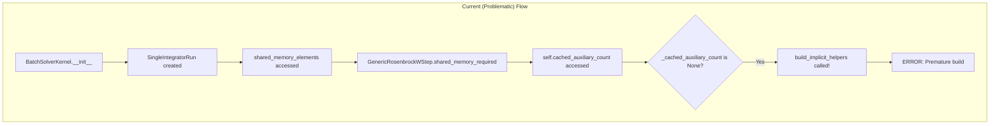
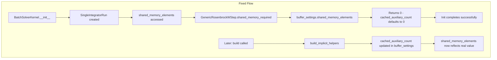

# Fix Rosenbrock BatchSolver Instantiation Circular Dependency

## User Stories

### US1: Rosenbrock Solver Instantiation Without Premature Build
**As a** CuBIE user  
**I want to** instantiate a Rosenbrock solver (e.g., `cubie.solver(system, algorithm='ode23s')`)  
**So that** the solver is configured without triggering a build at init time

**Acceptance Criteria:**
- Calling `cubie.solver(system, algorithm='ode23s')` succeeds without error
- No `build_implicit_helpers()` call occurs during `BatchSolverKernel.__init__`
- The `shared_memory_required` property returns a valid default (0) before build
- After the solver is built, `shared_memory_required` reflects the actual value

### US2: Shared Memory Calculation Follows Live-Value Pattern
**As a** CuBIE developer  
**I want** the shared memory calculation to follow the live-value-fetching pattern  
**So that** memory requirements are correctly computed after build completes

**Acceptance Criteria:**
- `GenericRosenbrockWStep.shared_memory_required` delegates to buffer_settings
- The buffer_settings.shared_memory_elements property handles the calculation
- When `cached_auxiliary_count` is updated in buffer_settings, subsequent access reflects the new value
- No circular dependency between `shared_memory_required` and `cached_auxiliary_count`

---

## Executive Summary

This plan addresses a circular dependency in the Rosenbrock solver instantiation path. The issue causes `build_implicit_helpers()` to be invoked prematurely during `BatchSolverKernel.__init__`, violating CuBIE's lazy compilation design.

The fix aligns `GenericRosenbrockWStep.shared_memory_required` with the pattern already used by `GenericERKStep`, delegating to `buffer_settings.shared_memory_elements` instead of directly calculating using `cached_auxiliary_count`.

---

## Data Flow Diagram

---

## Key Technical Decision

**Decision:** Change `GenericRosenbrockWStep.shared_memory_required` to delegate to `compile_settings.buffer_settings.shared_memory_elements`

**Rationale:**
1. This matches the pattern used by `GenericERKStep` (line 810)
2. `RosenbrockBufferSettings.cached_auxiliary_count` already defaults to 0
3. The `RosenbrockBufferSettings.shared_memory_elements` property already handles the calculation correctly
4. After build, `cached_auxiliary_count` is updated in buffer_settings, so subsequent access returns the correct value

**Trade-off Considered:**
- Could modify `cached_auxiliary_count` property to not trigger build → Rejected because it would return potentially incorrect 0 value without indication
- Could add `_cached_auxiliary_count_or_zero` property → Rejected as it adds complexity and doesn't follow existing patterns

---

## Expected Impact on Architecture

**Minimal impact:**
- Single property change in `GenericRosenbrockWStep`
- No interface changes
- No behavior changes after build completes
- Consistent with existing `GenericERKStep` implementation

---

## References

- Issue describes circular dependency chain clearly
- GenericERKStep.shared_memory_required (line 808-810) serves as reference pattern
- RosenbrockBufferSettings.shared_memory_elements (line 158-171) already implements the calculation with proper defaults
