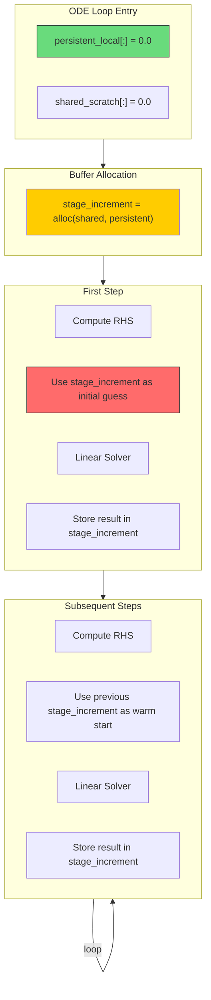

# Fix Rosenbrock Solver Flaky Test Errors

## User Stories

### US-1: Reliable Test Execution
**As a** developer running CI pipelines  
**I want** the Rosenbrock solver tests to pass consistently  
**So that** I can trust the test results and not investigate false failures

**Acceptance Criteria:**
- Rosenbrock solver tests pass on every CI run (no flaky failures)
- Tests that previously failed intermittently now pass consistently
- No solver error codes returned on the first integration step

### US-2: Correct First-Step Buffer Initialization
**As a** developer using the Rosenbrock-W integrator  
**I want** the linear solver's initial guess buffer to be properly initialized on the first step  
**So that** the solver does not use garbage values that cause convergence failures

**Acceptance Criteria:**
- The `stage_increment` buffer contains zeros on the first step (valid initial guess)
- Subsequent steps can still use the previous step's solution as an initial guess (warm-start optimization preserved)
- The fix does not zero the buffer on every step (performance preserved)

## Overview

### Executive Summary

The Rosenbrock-W solver experiences intermittent test failures due to uninitialized buffer values used as an initial guess for the linear solver on the first integration step. The `stage_increment` buffer aliases `stage_store` and persists between steps to enable warm-starting, but on the **first** step, this buffer contains garbage data because no previous step has populated it.

The fix involves marking the `stage_increment` buffer as `persistent=True` so it is allocated from the pre-zeroed persistent local memory array, eliminating uninitialized data without adding per-step zeroing overhead.

### Architecture Diagram



### Current Problem Flow

```mermaid
sequenceDiagram
    participant Loop as ODE Loop
    participant Rosenbrock as Rosenbrock Step
    participant LinearSolver as Linear Solver
    participant Buffer as stage_increment

    Note over Loop,Buffer: Loop Entry - Buffers NOT zeroed (local allocation)
    
    Loop->>Rosenbrock: step(first_step=True, ...)
    Rosenbrock->>Buffer: Read stage_increment as initial guess
    Note over Buffer: Contains GARBAGE values!
    Buffer-->>LinearSolver: garbage initial guess
    LinearSolver->>LinearSolver: Iterate with bad starting point
    LinearSolver-->>Rosenbrock: May fail to converge (flaky)
    Rosenbrock-->>Loop: Error code OR incorrect result
```

### Solution Flow

```mermaid
sequenceDiagram
    participant Loop as ODE Loop
    participant Rosenbrock as Rosenbrock Step
    participant LinearSolver as Linear Solver
    participant Buffer as stage_increment

    Note over Loop,Buffer: Loop Entry - persistent_local[:] = 0.0
    Note over Buffer: Buffer allocated from persistent_local → ZEROED
    
    Loop->>Rosenbrock: step(first_step=True, ...)
    Rosenbrock->>Buffer: Read stage_increment as initial guess
    Note over Buffer: Contains ZEROS (valid guess)
    Buffer-->>LinearSolver: zero initial guess
    LinearSolver->>LinearSolver: Converges normally
    Rosenbrock->>Buffer: Store solution for next step
    LinearSolver-->>Rosenbrock: Success
    Rosenbrock-->>Loop: Status 0
```

### Key Technical Decision

**Why `persistent=True` instead of `zero=True`?**

| Approach | First Step | Subsequent Steps | Performance |
|----------|------------|------------------|-------------|
| `zero=True` | ✅ Zeroed | ❌ Zeroed (loses warm-start) | ❌ Extra zeroing each step |
| `persistent=True` | ✅ Zeroed (from persistent_local) | ✅ Retains previous value | ✅ No per-step overhead |

The `persistent=True` flag causes the buffer to be sliced from `persistent_local`, which is zeroed once at loop entry. This means:
1. First step sees zeros (valid initial guess)
2. Subsequent steps see the previous solution (warm-start preserved)
3. No additional zeroing overhead per step

### Trade-offs Considered

1. **Alternative: Zero on `first_step_flag`**
   - Pro: Minimal code change
   - Con: Adds conditional branching to CUDA device code (warp divergence)
   - Con: Requires passing `first_step_flag` deeper into buffer initialization

2. **Alternative: Use `zero=True` in allocator**
   - Pro: Simple to implement
   - Con: Destroys warm-start benefit on every step
   - Con: Performance regression

3. **Chosen: `persistent=True` in buffer registration**
   - Pro: Uses existing infrastructure correctly
   - Pro: Preserves warm-start optimization
   - Pro: No per-step overhead
   - Con: Slightly larger persistent_local memory footprint

### Expected Impact on Existing Architecture

- **Minimal code change**: Only the `register_buffers()` method in `generic_rosenbrock_w.py` needs modification
- **No interface changes**: The fix is internal to buffer allocation
- **No breaking changes**: Behavior is identical except first-step buffer is now properly initialized
- **Memory impact**: `stage_increment` (size `n`) moves from local to persistent_local, increasing persistent_local size by `n` elements

### References

- Buffer allocation pattern: `src/cubie/buffer_registry.py` lines 75-142 (build_allocator)
- Persistent local zeroing: `src/cubie/integrators/loops/ode_loop.py` lines 448-449
- Current stage_increment registration: `src/cubie/integrators/algorithms/generic_rosenbrock_w.py` lines 268-274
- Linear solver initial guess usage: `src/cubie/integrators/algorithms/generic_rosenbrock_w.py` line 526
