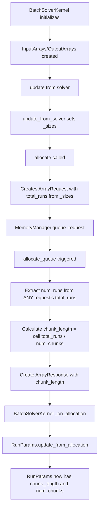
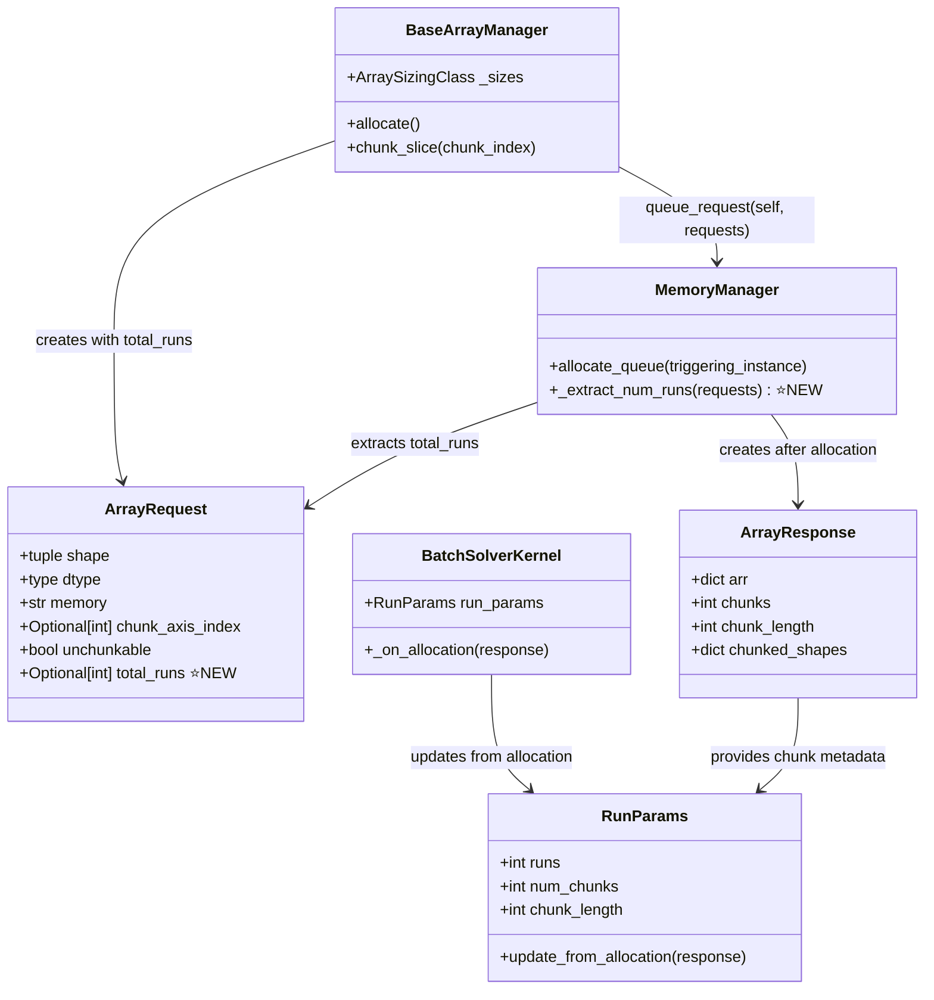

# Fix Test Failures: Chunking and ArrayRequest Architecture

## User Stories

### Story 1: Array Request Contains Total Runs
**As a** memory manager  
**I want** ArrayRequest to contain the total number of runs  
**So that** I can determine chunking parameters without coupling to specific array manager implementations  

**Acceptance Criteria:**
- ArrayRequest has a `total_runs` attribute
- ArrayRequest validates that `total_runs` is a positive integer when provided
- Memory manager uses `ArrayRequest.total_runs` instead of `triggering_instance.run_params.runs`
- Array managers (InputArrays, OutputArrays, BaseArrayManager) pass `total_runs` when creating ArrayRequest instances
- Tests for ArrayRequest creation with total_runs pass
- All tests that previously failed with "AttributeError: 'OutputArrays' object has no attribute 'run_params'" now pass

### Story 2: Chunk Slicing Returns Correct Shapes
**As an** array manager  
**I want** the chunk_slice method to return correctly sized chunks  
**So that** I can process batches in manageable memory chunks  

**Acceptance Criteria:**
- chunk_slice returns chunks of size `chunk_length` for non-final chunks
- chunk_slice returns the remaining elements for the final chunk
- chunk_slice correctly applies slicing to the specified axis index
- Tests verify that sliced arrays have expected shapes (e.g., `(10, 5, 25)` not `(10, 5, 100)`)
- All chunk slice tests in test_basearraymanager.py pass

### Story 3: ArrayResponse Contains Calculated Chunk Length
**As a** batch solver kernel  
**I want** ArrayResponse to contain the calculated chunk_length  
**So that** I can coordinate chunk processing across multiple runs  

**Acceptance Criteria:**
- ArrayResponse.chunk_length is calculated as `ceil(num_runs / num_chunks)` during allocation
- RunParams.update_from_allocation correctly extracts chunk_length from ArrayResponse
- Tests verify chunk_length equals expected values (e.g., 25 for 100 runs / 4 chunks)
- All runparams tests pass

## Overview

This plan fixes critical test failures in the memory management and chunking subsystem. The failures stem from architectural issues where:

1. **Memory manager couples to array manager internals** - accessing `run_params` attribute directly
2. **Chunk slicing logic is incomplete** - doesn't properly compute chunk boundaries
3. **Chunk metadata isn't properly propagated** - ArrayResponse doesn't calculate chunk_length

### Architecture Changes

#### Before: Brittle Coupling
```
MemoryManager.allocate_queue()
    └─> triggering_instance.run_params.runs  ❌ Brittle attribute access
    └─> Computes chunk_length
    └─> Creates ArrayResponse(chunk_length=...)
```

#### After: Clean Information Flow
```
ArrayManager.allocate()
    └─> Creates ArrayRequest(total_runs=self._sizes.runs)  ✅ Request carries info
    
MemoryManager.allocate_queue()
    └─> Extracts num_runs from any ArrayRequest  ✅ Decoupled from instance type
    └─> Computes chunk_length
    └─> Creates ArrayResponse(chunk_length=...)
    
BatchSolverKernel._on_allocation()
    └─> run_params.update_from_allocation(response)  ✅ Updates from response
```

### Data Flow Diagram



### Key Technical Decisions

#### Decision 1: Add total_runs to ArrayRequest (Not array managers)
**Rationale**: 
- ArrayRequest is the contract between array managers and memory manager
- Memory manager shouldn't know about specific manager types (InputArrays, OutputArrays)
- Request contains all information needed for allocation decision
- Cleaner separation of concerns

**Alternative Considered**: Add run_params attribute to all array managers
- **Rejected**: Creates coupling, requires every manager to have run_params
- Would need to pass run_params during initialization
- Memory manager code becomes brittle (what if new manager types don't have run_params?)

#### Decision 2: Make total_runs Optional with Default None
**Rationale**:
- Some arrays (e.g., driver_coefficients) aren't chunked along run axis
- Legacy code may not immediately provide total_runs
- Memory manager can detect missing total_runs and handle gracefully

#### Decision 3: Extract num_runs from First Available Request
**Rationale**:
- All requests in a stream group should have same total_runs
- Memory manager can iterate through requests to find first with total_runs
- Enables validation: verify all requests have consistent total_runs

### Integration Points

1. **ArrayRequest** (memory module)
   - Add `total_runs: Optional[int]` field with validator
   - Update docstrings

2. **BaseArrayManager.allocate()** 
   - Modify ArrayRequest creation to include `total_runs=self._sizes.runs`
   - Requires access to run count from sizing metadata

3. **BatchOutputSizes and BatchInputSizes**
   - These sizing classes should expose `runs` attribute
   - Already track run counts for array shape calculation

4. **MemoryManager.allocate_queue()**
   - Replace `num_runs = triggering_instance.run_params.runs`
   - With extraction from ArrayRequest: `num_runs = self._extract_num_runs(queued_requests)`
   - Add helper method `_extract_num_runs(requests_dict)`

5. **BaseArrayManager.chunk_slice()**
   - Fix slice endpoint calculation for non-final chunks
   - Currently: end is None for all chunks except explicitly set
   - Should be: end = start + chunk_length for non-final chunks

### Expected Impact on Architecture

**Memory Subsystem**:
- ✅ Decouples memory manager from specific instance types
- ✅ Makes ArrayRequest the single source of truth for allocation parameters
- ✅ Enables future extension (different manager types don't need run_params)

**Array Management**:
- ✅ Managers remain focused on array lifecycle (create, transfer, delete)
- ✅ Sizing information flows through proper channels (sizing classes → requests)
- ✅ No new attributes needed on manager classes

**Testing**:
- ✅ Fixes 35+ test failures across multiple test files
- ✅ Enables comprehensive chunking tests without mocking
- ✅ More robust against refactoring (less brittle coupling)

### Trade-offs Considered

**Option A**: Keep run_params access, add attribute to managers
- ❌ Creates coupling between manager and kernel
- ❌ Every manager type needs run_params
- ❌ Harder to test in isolation

**Option B**: Pass num_runs as parameter to allocate() [Selected Alternative]
- ✅ Clean separation: ArrayRequest carries the information
- ✅ Memory manager doesn't need to know instance types
- ✅ Testable: can verify requests contain correct total_runs
- ⚠️ Requires modification to sizing classes to expose runs

### Mermaid Component Interaction



### Research Findings

From `.github/active_plans/dangling_chunk_removal/test_results.md`:
- **8+ failures** from missing run_params attribute (line mem_manager.py:1203)
- **12+ failures** from chunking logic errors
- **20+ failures** cascading from above issues

From issue #438 ("chunking fails when VRAM is limited"):
- Chunking implementation has regressed
- No comprehensive tests for chunked execution
- Errors manifest as stride mismatches and shape incompatibilities

From code analysis:
- BatchSolverKernel has run_params and updates it in _on_allocation callback
- Array managers (InputArrays, OutputArrays) do NOT have run_params
- Memory manager currently assumes all instances have run_params (incorrect)
- BatchInputSizes and BatchOutputSizes track runs for shaping but don't expose it cleanly

### Success Metrics

**Primary**:
- All 35+ identified test failures pass
- No new test failures introduced
- Tests run without timeout (performance maintained)

**Secondary**:
- Memory manager code is clearer and more maintainable
- ArrayRequest serves as complete specification for allocation
- Future array manager types don't need run_params attribute
