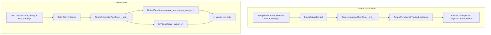
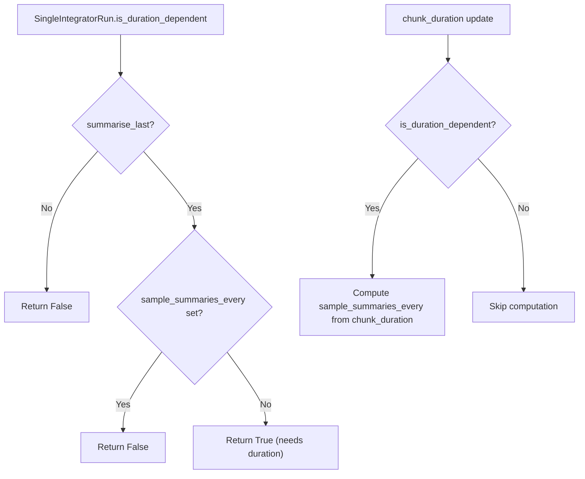

# Fix Timing Issues - Human Overview

## User Stories

### US1: Correct OutputFunctions API Usage
**As a** developer using CuBIE
**I want** `OutputFunctions` to only accept `sample_summaries_every` (not `save_every`)
**So that** timing parameters are correctly separated between output functions and loop configuration

**Acceptance Criteria:**
- All instantiations of `OutputFunctions` pass `sample_summaries_every` instead of `save_every`
- Test `test_all_lower_plumbing` passes without the error about unexpected keyword argument `save_every`
- API usage is consistent throughout the codebase

### US2: Duration-Dependent Loop Detection
**As a** developer configuring an integrator run
**I want** `SingleIntegratorRun` to expose an `is_duration_dependent` property
**So that** consuming code can check if the loop function is compile-dependent on duration before updating chunk_duration

**Acceptance Criteria:**
- `SingleIntegratorRun.is_duration_dependent` property exists
- Returns `True` when the loop function is compile-dependent on duration (i.e., when `summarise_last` is True and no explicit `sample_summaries_every` was provided)
- The `chunk_duration` update is gated by this check
- Loop values are updated with the updates dict once before checking (to ensure new timing parameters are in place)

### US3: Sentinel Duration for NaN Prevention
**As a** user running integrations
**I want** the system to use a sentinel duration value during initialization when duration-dependent
**So that** NaN errors do not occur from None values being processed during loop initialization

**Acceptance Criteria:**
- If `is_duration_dependent` is True, a sentinel duration is applied early in the init process
- NaN errors are avoided during loop compilation and initialization
- The sentinel is replaced with real duration before execution

### US4: Remove Sentinel Values from Loop Properties
**As a** developer maintaining CuBIE
**I want** sentinel values (like 2^30 for `samples_per_summary`) removed from loop properties
**So that** the codebase is cleaner and doesn't rely on magic numbers that may cause confusion

**Acceptance Criteria:**
- The 2^30 sentinel value in `samples_per_summary` is removed or handled differently
- Loop properties return appropriate values without sentinel workarounds
- Any other sentinel values added for timing are removed

---

## Architectural Overview

### Key Separation of Concerns

| Parameter | Belongs To | Purpose |
|-----------|-----------|---------|
| `save_every` | `IVPLoop` / loop_settings | Time interval between state saves |
| `summarise_every` | `IVPLoop` / loop_settings | Time interval between summary outputs |
| `sample_summaries_every` | `OutputFunctions` / output_settings | Time interval for sampling summary metrics |

### Duration Dependency Detection

---

## Technical Decisions

### Decision 1: Remove `save_every` from test output_settings
The test `test_all_lower_plumbing` incorrectly passes `save_every` in `output_settings`. This should be removed since `save_every` is a loop setting, not an output function setting. The test already correctly passes it in `loop_settings`.

### Decision 2: Property-based duration dependency detection
Adding `is_duration_dependent` as a property allows:
- Lazy evaluation based on current loop config state
- Clean integration with existing property-based patterns in `SingleIntegratorRun`
- Easy conditional gating of `chunk_duration` processing

### Decision 3: Sentinel handling for NaN prevention
Rather than using magic sentinel values in properties, the initialization process should:
- Apply a temporary sentinel duration value early during init when duration-dependent
- This prevents NaN values from propagating through calculations
- The sentinel is replaced with the actual duration when `.run()` is called

### Decision 4: Remove `samples_per_summary` sentinel
The current code returns `2**30` as a sentinel when in `summarise_last` mode. This should be:
- Returned as `None` instead, consistent with other None-returning properties
- Calling code should handle `None` explicitly rather than relying on a large sentinel value

---

## Impact Assessment

### Files to Modify
1. `tests/batchsolving/test_SolverKernel.py` - Remove `save_every` from output_settings
2. `src/cubie/integrators/SingleIntegratorRun.py` - Add `is_duration_dependent` property
3. `src/cubie/integrators/SingleIntegratorRunCore.py` - Gate chunk_duration update, add sentinel duration init
4. `src/cubie/integrators/loops/ode_loop_config.py` - Remove 2^30 sentinel from `samples_per_summary`
5. `src/cubie/integrators/loops/ode_loop.py` - Handle `None` for `samples_per_summary` correctly

### Risk: Low
- Changes are surgical and focused on the specific issues
- No architectural changes required
- Backward compatibility maintained (public API unchanged)

---

## References

- Issue context: Timing parameter separation between OutputFunctions and IVPLoop
- Related: `ALL_OUTPUT_FUNCTION_PARAMETERS` in `output_functions.py` (does not include `save_every`)
- Related: `ALL_LOOP_SETTINGS` in `ode_loop.py` (includes `save_every`)
