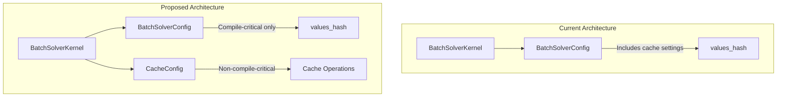
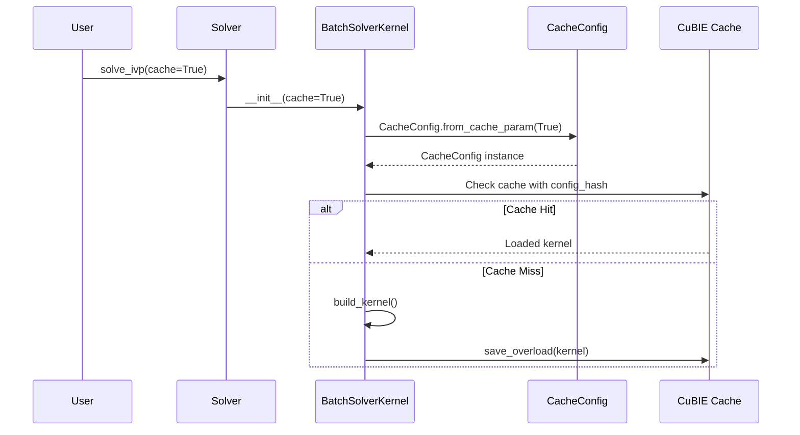

# Improve Caching Implementation

## User Stories

### US-1: Decontaminate Cache Settings from Compile-Critical Configuration
**As a** CuBIE developer  
**I want** cache settings separated from compile-critical kernel parameters  
**So that** changing cache behavior doesn't trigger unnecessary kernel recompilation

**Acceptance Criteria:**
- [x] A new `CacheConfig` attrs class exists to hold cache-related settings
- [x] `CacheConfig` has a `from_cache_param()` classmethod that parses cache arguments
- [x] Cache parsing logic (`_parse_cache_param`) is encapsulated within `CacheConfig`
- [x] `BatchSolverKernel` uses `CacheConfig` for cache configuration
- [x] Cache settings do not affect `BatchSolverConfig.values_hash` (no cache invalidation when only cache settings change)

### US-2: CUDASIM Compatibility for Cache Testing
**As a** CuBIE developer  
**I want** cache infrastructure to work in CUDASIM mode  
**So that** I can test hashing, paths, file creation, and cleanup without a GPU

**Acceptance Criteria:**
- [x] Core cache operations (hashing, path generation, file I/O) work without CUDA intrinsics
- [x] Appropriate dummy objects exist in `cuda_simsafe.py` for cache-related functionality (not needed - CacheConfig uses pure Python)
- [x] Cache tests can run with `NUMBA_ENABLE_CUDASIM=1`
- [x] Tests exist that verify cache behavior in simulation mode

### US-3: Numba-Native Functionality Preservation
**As a** CuBIE developer  
**I want** CuBIE's caching to leverage numba-cuda's caching infrastructure  
**So that** we minimize custom code and benefit from upstream improvements

**Acceptance Criteria:**
- [x] CuBIE wraps/extends numba-cuda's `_Cache`, `CacheImpl`, or `IndexDataCacheFile` where appropriate
- [x] Custom behavior is limited to CuBIE-specific needs (no py_func requirement, custom locator)
- [ ] Source stamps, index files, and data files follow numba-cuda patterns (future work for actual caching implementation)
- [ ] Serialization uses numba's serialization utilities where possible (future work for actual caching implementation)

### US-4: PR Review Comments Addressed
**As a** CuBIE maintainer  
**I want** all PR review comments on caching implementation addressed  
**So that** the code meets project quality standards

**Acceptance Criteria:**
- [x] All review comments are resolved or discussed (no review comments found)
- [x] Code follows CuBIE conventions per `.github/copilot-instructions.md`

---

## Executive Summary

This implementation improves CuBIE's kernel caching infrastructure by:

1. **Separating concerns**: Cache configuration is moved out of `BatchSolverConfig` (compile-critical settings) into a dedicated `CacheConfig` class
2. **Enabling CUDASIM testing**: Cache operations are made CUDA-independent where possible
3. **Aligning with numba-cuda**: Patterns from numba-cuda's `caching.py` and `dispatcher.py` are adopted

## Architecture Overview

## Data Flow: Cache Key Generation

## Key Technical Decisions

### 1. CacheConfig as Separate Configuration Class
- **Decision**: Create `CacheConfig` as an attrs class separate from `CUDAFactoryConfig`
- **Rationale**: Cache settings (enabled/disabled, path, etc.) don't affect kernel compilation output, so they shouldn't trigger rebuild
- **Trade-off**: Adds a new class but provides cleaner separation of concerns

### 2. CUDASIM-Safe Cache Operations
- **Decision**: Move cache file operations to be CUDA-independent
- **Rationale**: File I/O, hashing, and path generation don't require CUDA
- **Implementation**: Add minimal stubs to `cuda_simsafe.py` only for truly CUDA-dependent operations

### 3. Wrapping vs. Extending numba-cuda Caching
- **Decision**: Wrap `IndexDataCacheFile` pattern, customize locator and impl
- **Rationale**: numba-cuda's `Cache` requires `py_func` which CuBIE doesn't have; CuBIE generates kernels dynamically
- **Implementation**: Create `CuBIECacheImpl` that follows `CacheImpl` pattern but uses `config_hash` instead of function metadata

## References

- numba-cuda `caching.py`: Provides `_Cache`, `Cache`, `IndexDataCacheFile`, `_CacheLocator`, `CacheImpl` base patterns
- numba-cuda `dispatcher.py`: Shows `CUDACacheImpl`, `_Kernel._reduce_states()`, `_rebuild()` serialization patterns
- CuBIE `CUDAFactory.py`: Current cache invalidation and `values_hash` infrastructure
- CuBIE `BatchSolverConfig.py`: Current compile-critical settings

## Expected Impact

| Component | Change Type | Impact |
|-----------|-------------|--------|
| `BatchSolverKernel` | Refactor | Uses CacheConfig, cleaner cache handling |
| `BatchSolverConfig` | Simplify | No longer holds cache-related state |
| `CacheConfig` (new) | Add | New class for cache configuration |
| `cuda_simsafe.py` | Extend | Add cache-related stubs for CUDASIM |
| Tests | Add | New tests for cache operations in CUDASIM |
