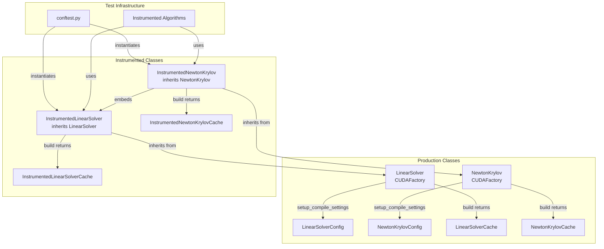
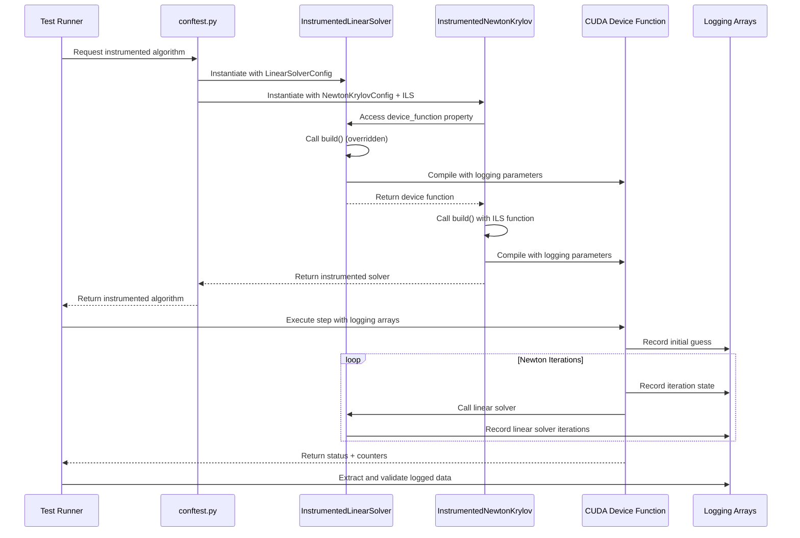

# Instrumented Matrix-Free Solvers Migration

## User Stories

### Story 1: Convert Instrumented Linear Solver to CUDAFactory Pattern
**As a** developer debugging linear solver convergence issues  
**I want** an instrumented LinearSolver that works with the new CUDAFactory architecture  
**So that** I can trace iteration-by-iteration solver behavior in tests without maintaining separate factory functions

**Acceptance Criteria:**
- InstrumentedLinearSolver inherits from LinearSolver
- Overrides build() to add logging for initial guesses, iteration guesses, residuals, squared norms, and preconditioned vectors
- Logging arrays are hard-coded as cuda.local.array() without buffer_registry registration
- Maintains both cached and non-cached variants matching production signatures
- Works with existing test infrastructure in tests/integrators/algorithms/instrumented/

### Story 2: Convert Instrumented Newton-Krylov Solver to CUDAFactory Pattern
**As a** developer debugging Newton-Krylov convergence issues  
**I want** an instrumented NewtonKrylov solver that works with the new CUDAFactory architecture  
**So that** I can trace Newton iteration progress, backtracking behavior, and embedded linear solver performance

**Acceptance Criteria:**
- InstrumentedNewtonKrylov inherits from NewtonKrylov
- Overrides build() to add logging for Newton initial guesses, iteration guesses, residuals, squared norms, iteration scales, and embedded linear solver arrays
- Logging arrays are hard-coded as cuda.local.array() without buffer_registry registration
- Device function signature matches production plus logging array parameters
- Integrates with InstrumentedLinearSolver for nested instrumentation

### Story 3: Update Test Infrastructure to Use New Classes
**As a** test developer  
**I want** the instrumented algorithm tests to use the new CUDAFactory-based instrumented solvers  
**So that** test code stays synchronized with production architecture patterns

**Acceptance Criteria:**
- conftest.py instantiates InstrumentedLinearSolver and InstrumentedNewtonKrylov instead of calling factory functions
- Instrumented algorithm classes (BackwardsEulerStep, etc.) use new solver class instances
- Device function call signatures updated to include logging array parameters
- All existing tests pass with new implementation
- No changes to logging array shapes or data captured

## Executive Summary

This architectural change migrates instrumented matrix-free solvers from factory functions to CUDAFactory subclasses, aligning test infrastructure with the production architecture established in the recent refactoring. The change preserves all logging functionality while simplifying the codebase by reusing production infrastructure.

**Key Technical Decision:** Hard-code logging buffers as cuda.local.array() instead of using buffer_registry. This avoids complexity in the test-only instrumentation layer and keeps logging arrays completely separate from production buffer management.

## System Architecture



## Data Flow



## Component Architecture

### InstrumentedLinearSolver

**Location:** `tests/integrators/algorithms/instrumented/matrix_free_solvers.py`

**Inheritance:** Inherits from `cubie.integrators.matrix_free_solvers.linear_solver.LinearSolver`

**Config:** Reuses `LinearSolverConfig` from production

**Cache Class:** New `InstrumentedLinearSolverCache` attrs class containing:
- `linear_solver`: Compiled device function with logging signature

**Overridden Methods:**
- `build()` - Returns InstrumentedLinearSolverCache with instrumented device function

**Device Function Signatures:**

For non-cached variant:
```python
def linear_solver(
    state, parameters, drivers, base_state,
    t, h, a_ij, rhs, x, shared, krylov_iters_out,
    # Logging parameters added:
    slot_index,
    linear_initial_guesses,
    linear_iteration_guesses,
    linear_residuals,
    linear_squared_norms,
    linear_preconditioned_vectors,
)
```

For cached variant:
```python
def linear_solver_cached(
    state, parameters, drivers, base_state, cached_aux,
    t, h, a_ij, rhs, x, shared, krylov_iters_out,
    # Logging parameters added:
    slot_index,
    linear_initial_guesses,
    linear_iteration_guesses,
    linear_residuals,
    linear_squared_norms,
    linear_preconditioned_vectors,
)
```

**Logging Buffer Management:**
- All logging arrays allocated as `cuda.local.array()` within device function
- No buffer_registry registration
- Shapes and dtypes match existing instrumented factories

### InstrumentedNewtonKrylov

**Location:** `tests/integrators/algorithms/instrumented/matrix_free_solvers.py`

**Inheritance:** Inherits from `cubie.integrators.matrix_free_solvers.newton_krylov.NewtonKrylov`

**Config:** Requires `NewtonKrylovConfig` with `linear_solver` field set to `InstrumentedLinearSolver` instance

**Cache Class:** New `InstrumentedNewtonKrylovCache` attrs class containing:
- `newton_krylov_solver`: Compiled device function with logging signature

**Overridden Methods:**
- `build()` - Returns InstrumentedNewtonKrylovCache with instrumented device function

**Device Function Signature:**
```python
def newton_krylov_solver(
    stage_increment, parameters, drivers,
    t, h, a_ij, base_state, shared_scratch, counters,
    # Logging parameters added:
    stage_index,
    newton_initial_guesses,
    newton_iteration_guesses,
    newton_residuals,
    newton_squared_norms,
    newton_iteration_scale,
    linear_initial_guesses,
    linear_iteration_guesses,
    linear_residuals,
    linear_squared_norms,
    linear_preconditioned_vectors,
)
```

**Integration with InstrumentedLinearSolver:**
- Accesses `linear_solver.device_function` during build()
- Passes logging arrays to embedded linear solver calls
- Computes linear solver slot indices as `stage_index * max_iters + iter_slot`

## Key Technical Decisions

### 1. Inheritance vs Composition
**Decision:** Use inheritance (subclass production classes)  
**Rationale:** 
- Reuses all config/cache infrastructure
- Automatic compatibility with config validation
- Minimal code duplication
- Clear relationship in test vs production code

### 2. Logging Buffer Allocation
**Decision:** Hard-code as cuda.local.array(), don't use buffer_registry  
**Rationale:**
- Test-only code doesn't need production memory management
- Avoids polluting buffer_registry with test artifacts
- Simpler implementation (no registration/deregistration)
- Logging arrays are already small (per-iteration snapshots)
- Follows user instruction explicitly

### 3. Cache Class Structure
**Decision:** Create separate InstrumentedLinearSolverCache and InstrumentedNewtonKrylovCache  
**Rationale:**
- Maintains attrs class pattern from production
- Type safety for device function signatures
- Clear distinction in cached outputs

### 4. Device Function Signature Extension
**Decision:** Add logging parameters as trailing parameters  
**Rationale:**
- Minimal disruption to existing parameter order
- Easy to pass logging arrays from calling code
- Clear separation of production vs logging concerns

## Integration Points

### Test Configuration (conftest.py)
**Current:** Calls `inst_linear_solver_factory()` and `inst_newton_krylov_solver_factory()`  
**Target:** Instantiates `InstrumentedLinearSolver(config)` and `InstrumentedNewtonKrylov(config)`

**Changes Required:**
1. Import new classes from matrix_free_solvers module
2. Create LinearSolverConfig instances with appropriate settings
3. Create NewtonKrylovConfig with linear_solver set to InstrumentedLinearSolver instance
4. Access device functions via properties, not direct build() calls

### Instrumented Algorithm Classes
**Files:**
- `backwards_euler.py`
- `backwards_euler_predict_correct.py`
- `crank_nicolson.py`
- `generic_dirk.py`
- `generic_firk.py`
- `generic_rosenbrock_w.py`

**Changes Required:**
1. Update constructor to accept solver instances instead of device functions
2. Update device function calls to include logging array parameters
3. Ensure logging array slicing matches new slot_index calculations

### Logging Array Allocation
**Current:** Allocated in test fixtures, passed to device functions  
**Target:** Same allocation pattern, adjusted signatures

**No changes required** - logging arrays remain host-allocated and device-accessible

## Expected Behavior

### Compilation Flow
1. Test creates InstrumentedLinearSolver with LinearSolverConfig
2. Test creates InstrumentedNewtonKrylov with NewtonKrylovConfig + InstrumentedLinearSolver
3. Test accesses `.device_function` properties
4. First access triggers build(), compiles instrumented device functions
5. Subsequent accesses return cached functions

### Runtime Flow
1. Instrumented algorithm device function receives logging arrays
2. Newton solver records initial guess
3. Each Newton iteration:
   - Records iteration state (guess, residual, norm)
   - Calls embedded linear solver with logging arrays
   - Linear solver records its iterations
   - Records backtracking scale factor
4. Host code extracts and validates logged data

### Logging Consistency
All logged data matches existing instrumented factory output:
- Array shapes unchanged
- Data types unchanged (precision-dependent)
- Indexing patterns preserved
- Status codes identical

## Trade-offs and Alternatives

### Alternative 1: Composition Instead of Inheritance
**Rejected** because:
- Would require duplicating config validation logic
- More complex to maintain parallel implementations
- Breaks "is-a" relationship (instrumented solver IS a solver)

### Alternative 2: Buffer Registry Integration
**Rejected** because:
- Adds complexity for test-only functionality
- Logging buffers don't need sophisticated memory management
- User explicitly requested hard-coded local arrays
- Production buffer_registry designed for runtime-variable buffers

### Alternative 3: Separate Module for Instrumented Classes
**Rejected** because:
- Already exists in tests/ hierarchy
- Test-only code belongs in tests/
- No benefit from src/ location for debugging tools

## Impact on Existing Architecture

### Positive Impacts
- Test code aligned with production patterns
- Reduced maintenance burden (no duplicate factory logic)
- Better type safety through config classes
- Clearer separation of production vs debugging tools

### Minimal Changes Required
- Test infrastructure updates (conftest.py)
- Instrumented algorithm call signatures
- No changes to production code
- No changes to logging array shapes/types

### No Performance Impact
- Instrumented solvers only used in specific test scenarios
- No effect on production performance
- Logging overhead unchanged from current implementation

## References

### Production Implementation
- `src/cubie/integrators/matrix_free_solvers/linear_solver.py`
- `src/cubie/integrators/matrix_free_solvers/newton_krylov.py`

### Current Instrumented Implementation
- `tests/integrators/algorithms/instrumented/matrix_free_solvers.py`

### Test Infrastructure
- `tests/integrators/algorithms/instrumented/conftest.py`
- `tests/integrators/algorithms/instrumented/test_instrumented.py`

### Related Patterns
- CUDAFactory base class: `src/cubie/CUDAFactory.py`
- Buffer registry: `src/cubie/buffer_registry.py`
- Other instrumented algorithms in `tests/integrators/algorithms/instrumented/`
