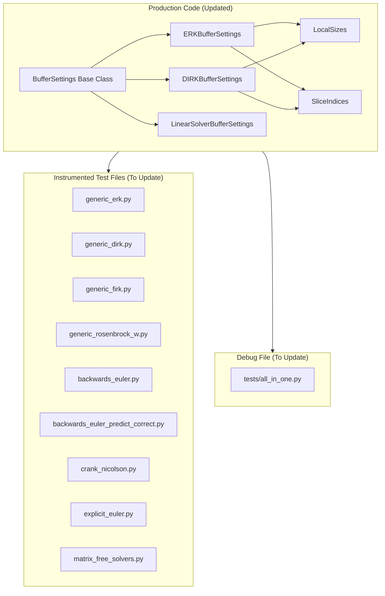
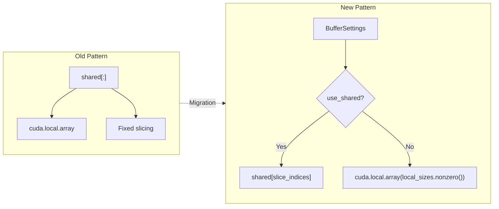

# Instrumented Test Files Update - Human Overview

## User Stories

### US-1: Developer Needs Accurate Instrumented Tests
**As a** CuBIE developer  
**I want** the instrumented test files to match the refactored production code structure  
**So that** I can reliably debug and diagnose integration algorithm behavior using the instrumented versions.

**Acceptance Criteria:**
- Instrumented files use the same memory allocation patterns as production (BufferSettings)
- Instrumented files use same shared/local memory slicing as production (LocalSizes, SliceIndices)
- Device function signatures match production code (array contiguity specifiers)
- Computational logic and instruction ordering matches production
- Tests in `test_instrumented.py` continue passing

### US-2: Consistent Memory Configuration Interface
**As a** developer testing memory location optimizations  
**I want** the instrumented versions to support the same `BufferSettings` interface  
**So that** I can test different shared/local memory configurations in debug mode.

**Acceptance Criteria:**
- ERKBufferSettings, DIRKBufferSettings patterns available in instrumented versions
- Local/shared memory selection works identically to production
- Persistent local storage for FSAL caching works correctly

### US-3: Debug File Coherence
**As a** developer doing low-level CUDA debugging  
**I want** `tests/all_in_one.py` to reflect current production patterns  
**So that** lineinfo debugging produces accurate source mappings.

**Acceptance Criteria:**
- Buffer allocation patterns match production code
- Step function logic matches current algorithm implementations
- Configuration options align with current production capabilities

---

## Executive Summary

The repository underwent a major refactor introducing `BufferSettings`, `LocalSizes`, and `SliceIndices` classes for selective allocation between shared and local memory in CUDA kernels. The production algorithm files now use these patterns, but the instrumented test files and `all_in_one.py` debug file still use the old memory allocation approach.

This plan addresses updating all instrumented test files and the debug file to match the new production architecture while preserving their diagnostic instrumentation capabilities.

---

## Architecture Overview

---

## Key Technical Decisions

### 1. Buffer Allocation Pattern Migration

**Decision:** Instrumented files will adopt the same `BufferSettings` pattern as production, with selective shared/local allocation using compile-time flags.

**Rationale:**
- Ensures instrumented behavior matches production exactly
- Enables testing of different memory configurations in debug mode
- Maintains architectural consistency across codebase

### 2. Signature Alignment with Array Contiguity

**Decision:** Update all device function signatures to use contiguous array specifiers (`[::1]`, `[:, ::1]`, `[:, :, ::1]`) matching production code.

**Rationale:**
- Numba generates more efficient code with explicit contiguity
- Prevents potential type mismatches between production and instrumented kernels
- Aligns with PEP8/style guidelines in AGENTS.md

### 3. Preserve Instrumentation Arrays

**Decision:** Keep all existing instrumentation output arrays (residuals, jacobian_updates, stage_states, etc.) but update their integration points.

**Rationale:**
- Instrumentation is the core value of these files
- Only the memory management and buffer allocation changes
- Logging points remain at same computational stages

---

## Data Flow Changes

---

## Trade-offs and Alternatives

### Alternative 1: Minimal Signature Updates Only
**Rejected.** Would leave structural differences that could cause subtle behavioral divergence.

### Alternative 2: Remove Instrumented Files
**Rejected.** Instrumentation provides critical debugging capability for implicit solver development.

### Alternative 3: Auto-generate Instrumented from Production
**Future consideration.** Currently too complex due to instrumentation insertion points.

---

## Impact on Existing Architecture

| Component | Impact Level | Notes |
|-----------|--------------|-------|
| test_instrumented.py | Low | No changes needed if signatures match |
| conftest.py | Low | May need BufferSettings imports |
| CPU reference | None | Separate implementation |
| Production code | None | Reference only |

---

## Files to Modify

### High Priority (Core Algorithm Files)
1. `tests/integrators/algorithms/instrumented/generic_erk.py`
2. `tests/integrators/algorithms/instrumented/generic_dirk.py`
3. `tests/integrators/algorithms/instrumented/matrix_free_solvers.py`

### Medium Priority (Other Algorithms)
4. `tests/integrators/algorithms/instrumented/generic_firk.py`
5. `tests/integrators/algorithms/instrumented/generic_rosenbrock_w.py`
6. `tests/integrators/algorithms/instrumented/backwards_euler.py` (partially done)
7. `tests/integrators/algorithms/instrumented/backwards_euler_predict_correct.py`
8. `tests/integrators/algorithms/instrumented/crank_nicolson.py`
9. `tests/integrators/algorithms/instrumented/explicit_euler.py`

### Lower Priority (Debug File)
10. `tests/all_in_one.py`

---

## References

- Production BufferSettings: `src/cubie/BufferSettings.py`
- Production ERK: `src/cubie/integrators/algorithms/generic_erk.py`
- Production DIRK: `src/cubie/integrators/algorithms/generic_dirk.py`
- Production Linear Solver: `src/cubie/integrators/matrix_free_solvers/linear_solver.py`
- Internal Structure: `.github/context/cubie_internal_structure.md`
