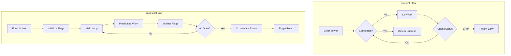
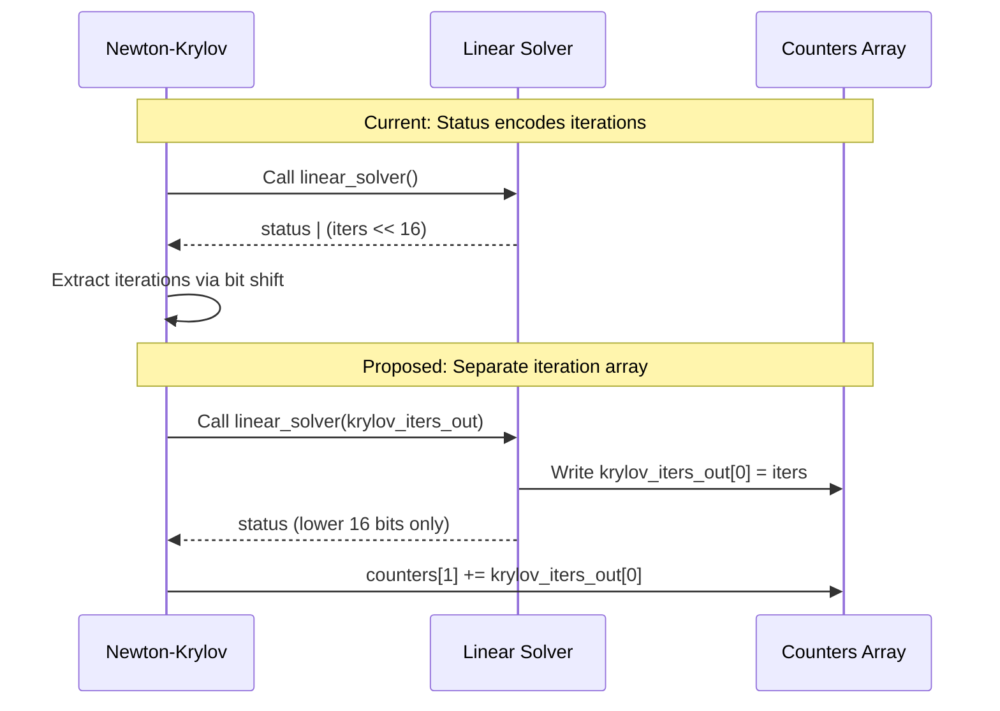

# Krylov Solver and Newton-Krylov Loop Rework

## User Stories

### US-1: Reduce Dynamic Branching in Krylov Solver
**As a** GPU performance engineer  
**I want** the linear Krylov solver to use predicated commits instead of conditional branching  
**So that** warp efficiency improves and stall waits are reduced

**Acceptance Criteria:**
- Loop control uses boolean flags (`converged`) rather than status codes
- Status codes accumulate via OR operations; final status returned at single exit point
- Converged threads opt out of work using predicated assignments (`selp`)
- Function has exactly one return statement

### US-2: Reduce Dynamic Branching in Newton-Krylov Solver
**As a** GPU performance engineer  
**I want** the Newton-Krylov solver to use predicated commits instead of conditional branching  
**So that** warp efficiency improves and stall waits are reduced

**Acceptance Criteria:**
- Loop control uses boolean flags (`converged`, `has_error`) rather than `status = -1` pattern
- Status codes accumulate via OR; returned at single exit point
- Errored/converged threads opt out of work using predicated assignments
- Function has exactly one return statement
- Iteration count is passed separately from status (via counters array)

### US-3: Separate Iteration Count from Status Codes
**As a** solver developer  
**I want** Newton and Krylov iteration counts tracked separately from status codes  
**So that** the status return value is not overloaded with iteration data

**Acceptance Criteria:**
- Krylov loop receives a single-element array to write its iteration count
- Newton loop writes iteration counts to the existing `counters` array argument
- Status codes use only lower 16 bits for outcome codes
- Upper 16 bits no longer encode iteration count in returned status

### US-4: Consistent Implementation Across All Code Locations
**As a** developer maintaining the codebase  
**I want** all solver implementations (source, instrumented, all_in_one) to be consistent  
**So that** debugging and testing use identical logic

**Acceptance Criteria:**
- Source files are the canonical implementation
- Instrumented versions add only logging, no functional changes
- all_in_one.py inline factories match source logic exactly
- Changes propagate to all three locations

---

## Executive Summary

This rework targets CUDA device code in the matrix-free solver subsystem to reduce dynamic indexing, conditional branching, and resulting stall waits. The primary changes involve:

1. **Control flow restructuring**: Replace status-code-based loop control with boolean flags
2. **Single exit points**: Eliminate multiple `return` statements inside loops
3. **Predicated commits**: Use `selp()` for value assignments instead of `if/else` branches
4. **Iteration tracking separation**: Pass iteration counts via dedicated arrays rather than encoding in status bits

---

## Architectural Overview



---

## Data Flow Changes

### Iteration Count Separation



---

## Key Technical Decisions

### 1. Boolean-Based Loop Control

**Rationale**: Using `status = -1` as the "active" sentinel creates dynamic branching. Boolean flags allow compile-time optimization and predicated execution.

**Pattern**:
```python
# Before
status = -1
for _ in range(max_iters):
    if status >= 0:
        break
    # work...
    if condition:
        status = 0

# After  
converged = False
has_error = False
for _ in range(max_iters):
    if all_sync(mask, converged or has_error):
        break
    # predicated work...
    converged = converged or (acc <= tol_squared)
```

### 2. Status Code Accumulation

**Rationale**: Setting status codes should not affect loop control. Errors are remembered but don't cause early exit.

**Pattern**:
```python
# Accumulate all error conditions
final_status = int32(0)
if krylov_failed:
    final_status |= int32(4)
if newton_backtrack_failed:
    final_status |= int32(1)  
if newton_max_iters:
    final_status |= int32(2)
return final_status
```

### 3. Predicated Commits for Converged Threads

**Rationale**: Converged threads should not execute expensive operations but must not branch away from the warp.

**Pattern**:
```python
# Compute always, commit conditionally
delta_scale = scale - scale_applied
delta_scale = selp(active, delta_scale, typed_zero)
for i in range(n):
    stage_increment[i] += delta_scale * delta[i]
```

---

## Trade-offs and Alternatives Considered

| Approach | Pros | Cons | Decision |
|----------|------|------|----------|
| Keep status-as-control | Familiar pattern | Dynamic branching | Rejected |
| Warp-divergent early exit | Simple code | Stall waits | Rejected |
| Predicated commits | Warp uniform | Slightly more ops | **Selected** |
| Status accumulation | Single exit | More bit ops | **Selected** |

---

## Impact on Existing Architecture

### Files Affected
1. `src/cubie/integrators/matrix_free_solvers/linear_solver.py`
2. `src/cubie/integrators/matrix_free_solvers/newton_krylov.py`
3. `tests/integrators/algorithms/instrumented/matrix_free_solvers.py`
4. `tests/all_in_one.py`

### Caller Impact
- Algorithms calling `newton_krylov_solver_factory` must provide a counters array
- Iteration counts no longer extracted from status via bit shifts
- Status codes remain in lower 16 bits but upper 16 bits will be zero

### Backwards Compatibility
- Breaking change: callers extracting iterations from status will get 0
- This is acceptable per AGENTS.md (development phase, no backwards compatibility)

---

## Additional CUDA Optimization Proposals

*These are proposed for user review and are NOT part of the first-pass implementation:*

### Proposal A: Loop Unrolling Hints
Add `#pragma unroll` equivalent via Numba's loop unrolling for the inner vector operations (n-element loops) when n is small and known at compile time.

### Proposal B: Warp-Uniform Branching for Backtracking
The backtracking loop could use a warp-ballot approach to determine if any thread in the warp needs more backtracking, allowing uniform early exit.

### Proposal C: Shared Memory for Solver Scratch
When `buffer_settings` configures shared memory usage, the solver scratch buffers (delta, residual) could be placed in shared memory to reduce register pressure.

### Proposal D: Fused Norm Computation
The squared-norm accumulation loops could use warp-level reductions (`__shfl_down_sync` via Numba) for faster convergence checks.

---

## References

- CuBIE Internal Structure: `.github/context/cubie_internal_structure.md`
- CUDA Best Practices: "Prefer predicated commit over conditional branching"
- Issue #329: Memory location heuristics (related to shared vs local decisions)
