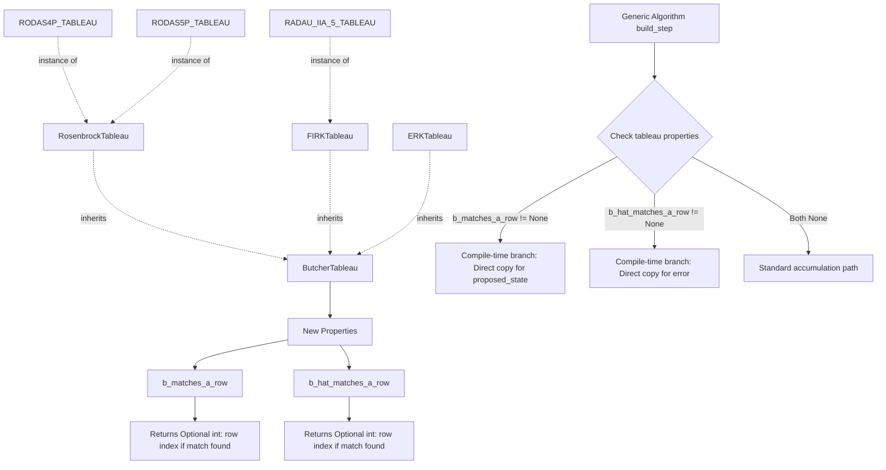
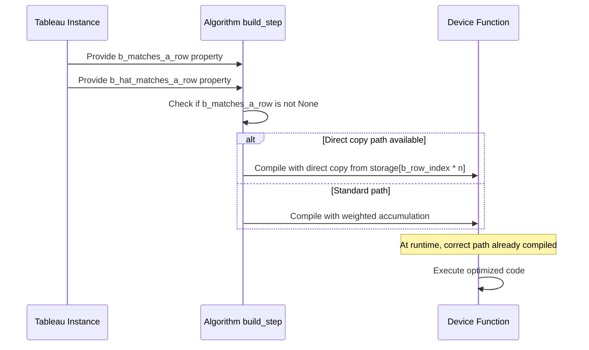

# Last-Step Caching Optimization for RODAS*P and RadauIIA5

## Executive Summary

This feature implements a compile-time optimization for specific Runge-Kutta tableaus where the final stage weights exactly match a row in the coupling matrix. Currently applies to RODAS4P, RODAS5P, and RadauIIA5 methods.

### The Optimization

In standard Runge-Kutta methods, both the proposed state and error estimate are computed via weighted accumulation:
```
proposed = state + dt * Σ(b[i] * k[i])
error = dt * Σ(d[i] * k[i]) where d[i] = b[i] - b_hat[i]
```

For RODAS*P methods, the last row of the `a` matrix equals `b`, meaning the last stage increment already contains the exact combination needed for the proposed state. Similarly, when the second-to-last row equals `b_hat`, it contains the embedded error estimate. This allows:
```
proposed = state + dt * k[last]  // Direct copy instead of accumulation
error = dt * k[second_last]      // Direct copy when applicable
```

### Computational Impact

- **Reduction in operations**: Eliminates (stage_count - 1) multiplications and additions per state variable when row equality is detected
- **Affected methods**: RODAS4P, RODAS5P, RadauIIA5, and any future tableaus with this property
- **Accuracy**: Numerically identical results (within floating-point precision)

## Architecture Diagram



## Data Flow



## Technical Decisions

### 1. Property-Based Detection (Chosen)
**Rationale**: Automatic, extensible, no hard-coding of tableau names
- Tableau base class provides `b_matches_a_row` and `b_hat_matches_a_row` properties
- Returns `Optional[int]` with matching row index or None
- Algorithms check properties at compile time

**Alternatives Considered**:
- Hard-coded tableau names: Rejected (not extensible)
- Runtime checks: Rejected (overhead on every step)
- Separate algorithm classes: Rejected (code duplication)

### 2. Tolerance for Floating-Point Comparison
**Decision**: Use `1e-15` absolute tolerance for row equality checks
**Rationale**: Tableaus are defined with exact constants or simple arithmetic; tighter than computation error but loose enough for decimal representations

### 3. FSAL vs Last-Step Caching
**Clarification**: These are distinct properties
- **FSAL (First Same As Last)**: Last stage of step N can be reused as first stage of step N+1
  - Requires: `c[0] == 0.0`, `c[-1] == 1.0`, `a[0][0] == 0.0`
- **Last-Step Caching**: Last stage increment equals final solution weights
  - Requires: `a[-1]` equals `b`
  
RODAS*P methods have last-step caching but NOT FSAL (FSAL requires explicit methods, RODAS is implicit).

### 4. Implementation Scope
**Affected Files**:
- `src/cubie/integrators/algorithms/base_algorithm_step.py`: Add properties to ButcherTableau
- `src/cubie/integrators/algorithms/generic_rosenbrock_w.py`: Use properties in step compilation
- `src/cubie/integrators/algorithms/generic_firk.py`: Use properties in step compilation
- `src/cubie/integrators/algorithms/generic_erk.py`: Use properties in step compilation
- `src/cubie/integrators/algorithms/generic_dirk.py`: Use properties in step compilation
- `tests/integrators/algorithms/instrumented/generic_rosenbrock_w.py`: Update instrumented version
- `tests/integrators/algorithms/instrumented/generic_firk.py`: Update instrumented version
- `tests/integrators/algorithms/instrumented/generic_erk.py`: Update instrumented version
- `tests/integrators/algorithms/instrumented/generic_dirk.py`: Update instrumented version

**Not Affected**:
- No changes to tableau definitions (already correct)
- No changes to public API
- No changes to memory management or output handling

## Integration Points

### With Existing Codebase

1. **ButcherTableau** (base_algorithm_step.py)
   - Add row comparison logic
   - Return row indices for direct access

2. **Generic Algorithms** (generic_rosenbrock_w.py, generic_firk.py)
   - Check tableau properties in `build_step()`
   - Generate compile-time branches using Numba's constant folding
   - Access `stage_store[row_index * n : (row_index + 1) * n]` for direct copy

3. **Testing**
   - Validate against existing CPU reference implementations
   - Verify numerical equivalence with standard path
   - Test all affected tableaus (RODAS4P, RODAS5P, RadauIIA5)

## Edge Cases

1. **No embedded error estimate**: Only optimize proposed_state, error path unchanged
2. **Partial match**: If only `b` matches (not `b_hat`), only optimize proposed_state
3. **Multiple matching rows**: Use last matching row (most likely to be last stage)
4. **Padding in tableau rows**: Compare only up to stage_count elements

## Research Findings

### Mathematical Background

From issue #163:
> RODAS*P tableaus have equal error weights to the rows of the A matrix, allowing them to be pulled straight out without reweighting.

This is a property of Rosenbrock-W methods where stiffly accurate tableaus (L-stable) have the last stage as the solution. The mathematical justification:

For a Rosenbrock-W method:
```
k_i = f(y_n + Σ a_ij k_j, t_n + c_i h) + (1/h) Σ C_ij k_j + γ_i J k_i
```

When the tableau is stiffly accurate, the last row of `a` forms the solution weights `b`, meaning:
```
y_{n+1} = y_n + Σ b_i k_i = y_n + k_s (where s is last stage)
```

This is exactly what we have in storage after computing all stages.

### References

- SciML/OrdinaryDiffEq.jl implementations confirm this structure for RODAS methods
- RadauIIA methods are collocation methods where the last collocation point is at t=1
- Literature: Hairer & Wanner "Solving Ordinary Differential Equations II" discusses L-stable Rosenbrock methods

## Expected Impact

### Positive
- **Performance**: Measurable speedup for common stiff solvers
- **Correctness**: Rigorous FSAL/last-step-caching distinction
- **Extensibility**: Automatic application to future tableaus

### Risks
- **Minimal**: Optimization is purely computational, no algorithmic changes
- **Testing burden**: Must verify numerical equivalence across all affected tableaus
- **Maintenance**: Additional logic in compilation path (mitigated by clear property design)

## Trade-offs

**Chosen**: Property-based automatic optimization
- ✅ Extensible to future tableaus
- ✅ No code duplication
- ✅ Compile-time decision (zero runtime overhead)
- ⚠️ Slightly more complex compilation logic

**Not Chosen**: Manual optimization per tableau
- ❌ Requires hard-coding tableau names
- ❌ Not extensible
- ✅ Simpler to implement initially
