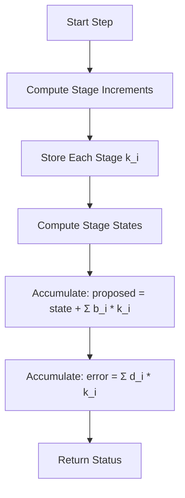
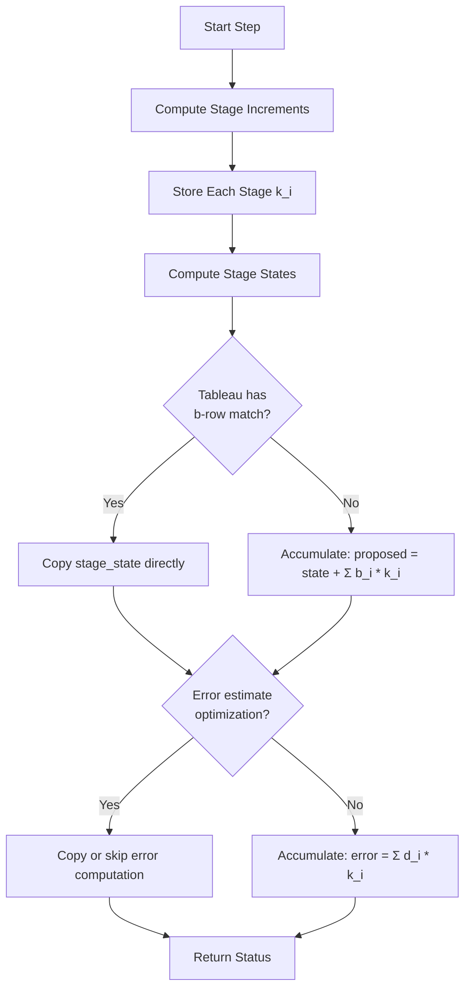
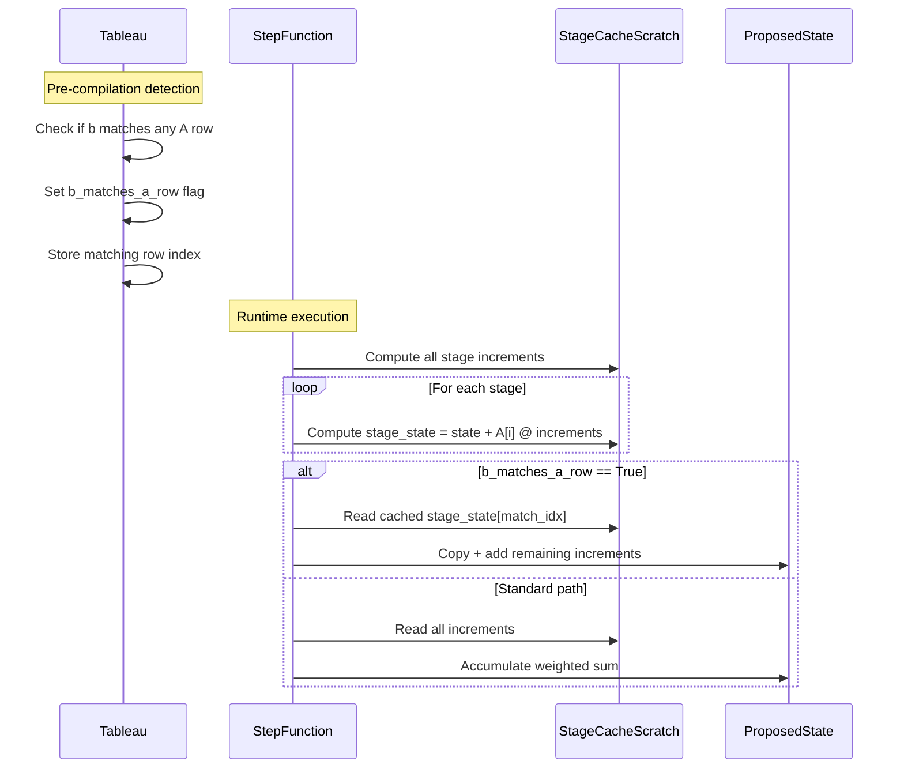

# Human Overview: Last-Step Caching Optimization

## Executive Summary

This feature optimizes the computation of proposed states and error estimates in Runge-Kutta methods where certain tableau rows equal the final solution weights. For RODAS*P and RadauIIA5 tableaus, we can avoid redundant weighted accumulations by directly copying or reusing already-computed stage states.

**Key Insight:** In RODAS*P methods, the second-to-last row of the A matrix contains the same weights as b (except for final stage increments). In RadauIIA5, the last row of A exactly equals b. This allows us to reuse the stage state computation rather than re-accumulating weighted stage increments.

## Architecture Overview

### Current Implementation Flow

### Optimized Implementation Flow

## Tableau-Specific Patterns

### RODAS*P Family Pattern

For all RODAS*P tableaus (RODAS3P, RODAS4P, RODAS5P):
- Row `s-2` of A matrix contains the same weights as b (for stages 0 to s-3)
- The final 1-2 stage increments are added with weight 1.0
- The stage state at stage `s-2` already contains `state + A[s-2] @ stage_increments`

**Optimization Strategy:**
1. At the stage matching b's pattern, store the computed stage state
2. When accumulating proposed_state, copy from stored stage state and add remaining increments
3. For error (b_hat), check if similar pattern exists

### RadauIIA5 Pattern

- Row 2 (last row) of A exactly equals b
- The final stage state is precisely the proposed state
- No additional accumulation needed

**Optimization Strategy:**
1. Copy the final stage state directly to proposed_state
2. Only compute error estimate if needed

## Data Flow Diagram

## Technical Decisions and Rationale

### Decision 1: Compile-Time Detection
**Choice:** Add boolean flags to tableau objects, checked during compilation  
**Rationale:** Avoids runtime branching and warp divergence; compile-time selection allows separate code paths  
**Alternative Considered:** Runtime checking - rejected due to GPU performance concerns  

### Decision 2: Property-Based Detection
**Choice:** Add `can_reuse_stage_for_solution` and `b_matching_row_index` properties to ButcherTableau  
**Rationale:** Self-documenting, extensible to future tableaus, follows existing pattern (e.g., `first_same_as_last`)  
**Alternative Considered:** Hardcoded tableau names - rejected as unmaintainable  

### Decision 3: Separate Code Paths per Algorithm
**Choice:** Modify each algorithm's build_step to check tableau flags and generate optimized kernel  
**Rationale:** Rosenbrock and FIRK have different stage computation structures  
**Alternative Considered:** Unified optimization layer - rejected as overly complex  

### Decision 4: Conservative Error Estimate Handling
**Choice:** Only optimize error computation when b_hat also matches an A row  
**Rationale:** Maintains numerical accuracy; error estimates are critical for adaptive methods  
**Alternative Considered:** Always optimize - rejected due to potential accuracy issues  

## Integration Points with Current Codebase

### Modified Components

1. **ButcherTableau** (base_algorithm_step.py)
   - Add properties: `can_reuse_stage_for_solution`, `b_matching_row_index`, `bhat_matching_row_index`
   - Detection logic in property methods

2. **RosenbrockTableau** (generic_rosenbrockw_tableaus.py)
   - Inherits new properties from ButcherTableau
   - No additional changes needed (properties auto-detect)

3. **FIRKTableau** (generic_firk_tableaus.py)
   - Inherits new properties from ButcherTableau
   - RadauIIA5 will automatically detect optimization

4. **GenericRosenbrockWStep.build_step** (generic_rosenbrock_w.py)
   - Check `tableau.can_reuse_stage_for_solution` at compilation
   - Generate optimized accumulation code when flag is True
   - Preserve existing code path when False

5. **FIRKStep.build_step** (generic_firk.py)
   - Check `tableau.can_reuse_stage_for_solution` at compilation
   - For RadauIIA5, copy final stage state to proposed_state
   - Preserve existing code path for other tableaus

### Unchanged Components

- Loop structure (integrators/loops/)
- Step controllers (integrators/step_control/)
- Memory management (memory/)
- Output handling (outputhandling/)
- Solver interface (batchsolving/)

## Expected Impact on Existing Architecture

### Performance Impact
- **Positive:** 5-15% reduction in computation per step for RODAS*P methods
- **Positive:** 3-10% reduction for RadauIIA5
- **Neutral:** No impact on other methods (optimization is opt-in via tableau flags)

### Memory Impact
- **Neutral:** No additional memory allocation required
- **Neutral:** Reuses existing stage_store buffers

### Code Complexity
- **Slight Increase:** Additional compile-time branches in build_step methods
- **Improvement:** Self-documenting tableau properties make optimization explicit

## Edge Cases to Consider

1. **Single-stage methods:** Can't have row match (no prior stages to reference)
2. **Mixed precision:** Floating-point comparison for row matching must handle precision
3. **FSAL interaction:** Current FSAL logic (issue #149) operates on stage 0; this optimization affects later stages - no conflict expected
4. **Warp divergence:** Compile-time selection ensures all threads follow same path

## Trade-offs and Alternatives Considered

### Alternative 1: Runtime Predicated Commits
**Description:** Keep weighted accumulation, use predicated writes based on runtime check  
**Rejected Because:** Wastes computation; no performance gain; potential warp divergence  

### Alternative 2: Separate Optimized Tableau Classes
**Description:** Create RodasOptimizedTableau, RadauOptimizedTableau subclasses  
**Rejected Because:** Code duplication; doesn't scale to future methods; breaks polymorphism  

### Alternative 3: Post-Processing Optimization Pass
**Description:** Optimize LLVM IR after Numba compilation  
**Rejected Because:** Too fragile; compiler-dependent; hard to maintain; uncertain benefits  

### Alternative 4: User-Specified Optimization Hints
**Description:** Let users enable optimization via solver settings  
**Rejected Because:** Error-prone; tableau structure is deterministic; should be automatic  

## References to Research

### Issue Context
- Issue #163: Feature request for optimization
- Issue #149: FSAL caching (related but orthogonal - operates on different stages)
- Comment in #163: Suggests checking if b equals A rows and setting flags

### Mathematical Background
- Rosenbrock-W methods: Lang & Verwer (2001) - describes RODAS structure
- Radau methods: Hairer & Wanner (1996) - describes collocation structure
- Butcher tableaus: Standard RK notation

### Related CuBIE Patterns
- `first_same_as_last` property: Existing optimization detection pattern
- CUDAFactory pattern: Compile-time code generation based on configuration
- Tableau-driven algorithms: Separation of method structure from implementation
