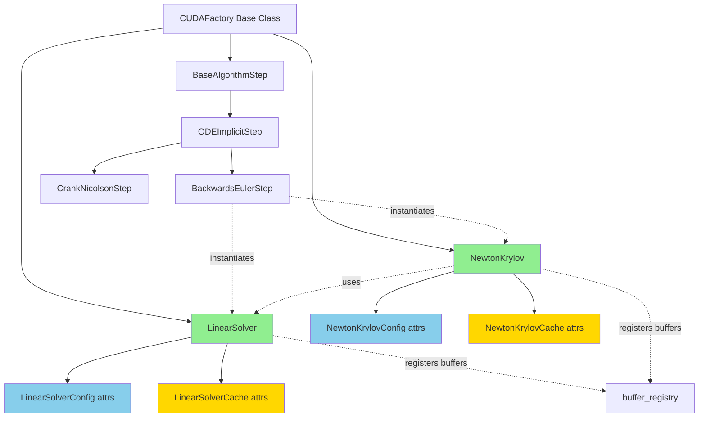
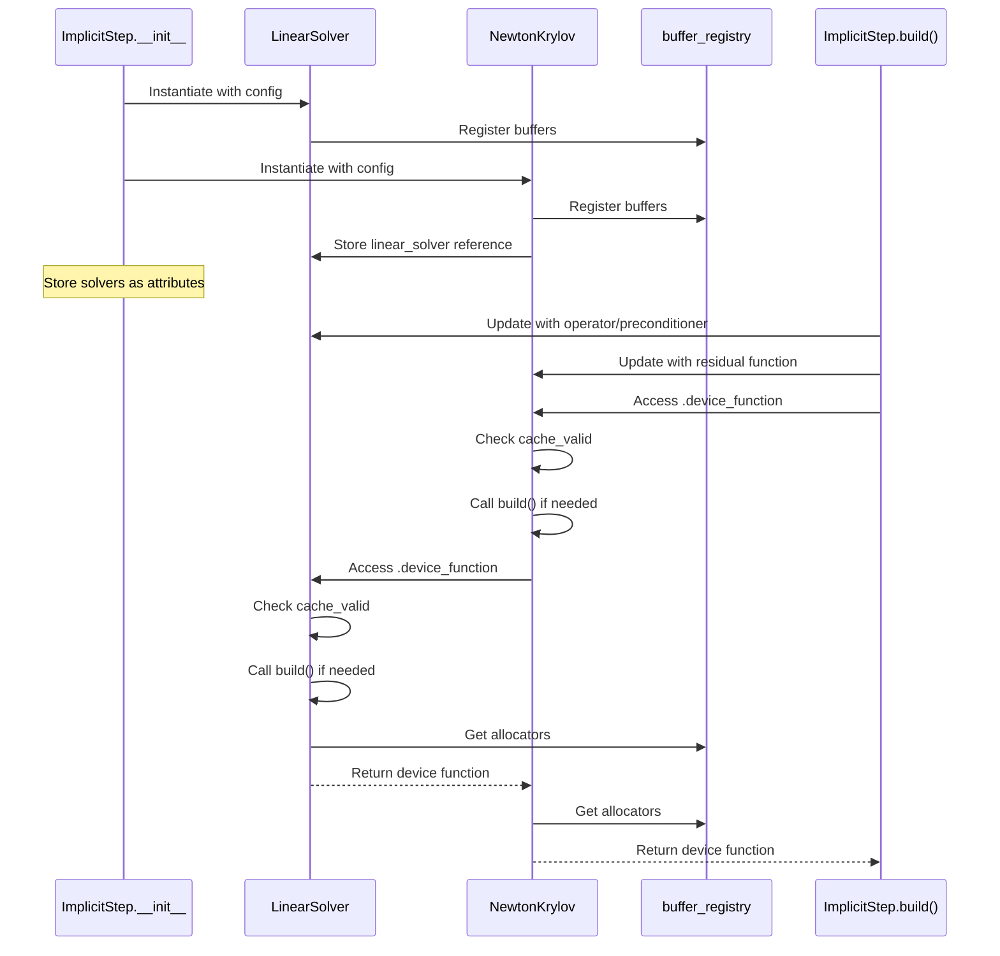

# Linear and Newton-Krylov Solver Factory Refactor

## User Stories

### US1: As a developer, I want linear_solver to be a CUDAFactory subclass
**Story**: As a CuBIE developer, I want `linear_solver` to follow the same CUDAFactory pattern as algorithm steps, so that the codebase has a consistent architecture and cache management strategy.

**Acceptance Criteria**:
- `LinearSolverConfig` attrs class exists with all compile-time parameters
- `LinearSolverCache` attrs class exists to hold device functions
- `LinearSolver` CUDAFactory subclass implements `build()` method
- All compile-time parameters (operator, n, precision, preconditioner, correction_type, tolerance, max_iters, buffer locations) are stored in config
- Config uses attrs validators for parameter validation
- Device function accessible via `.device_function` property
- Cache invalidation works automatically when config changes
- Both cached and non-cached variants supported through config flag

### US2: As a developer, I want newton_krylov to be a CUDAFactory subclass
**Story**: As a CuBIE developer, I want `newton_krylov_solver` to follow the same CUDAFactory pattern as algorithm steps, so that the codebase has a consistent architecture and cache management strategy.

**Acceptance Criteria**:
- `NewtonKrylovConfig` attrs class exists with all compile-time parameters
- `NewtonKrylovCache` attrs class exists to hold device function
- `NewtonKrylov` CUDAFactory subclass implements `build()` method
- All compile-time parameters (residual_function, linear_solver, n, tolerance, max_iters, precision, damping, max_backtracks, buffer locations) are stored in config
- Config uses attrs validators for parameter validation
- Device function accessible via `.device_function` property
- Cache invalidation works automatically when config changes
- `linear_solver` parameter in config accepts LinearSolver instance

### US3: As an implicit algorithm developer, I want to instantiate solvers in __init__
**Story**: As a developer implementing implicit algorithms, I want to instantiate solver objects in `__init__` and request their device functions during `build()`, so that solver configuration is clear and solvers can be updated independently.

**Acceptance Criteria**:
- Implicit algorithm steps instantiate LinearSolver in `__init__`
- Implicit algorithm steps instantiate NewtonKrylov in `__init__`
- Solvers are stored as instance attributes
- During `build()`, solvers are updated with required device functions
- Device functions accessed via `.device_function` property
- No direct calls to factory functions

### US4: As a test developer, I want fixtures that instantiate solver objects
**Story**: As a test developer, I want pytest fixtures that instantiate LinearSolver and NewtonKrylov objects using settings dictionaries, so that tests use real objects instead of calling factory functions.

**Acceptance Criteria**:
- `linear_solver` fixture instantiates LinearSolver with `solver_settings`
- `newton_krylov_solver` fixture instantiates NewtonKrylov with `solver_settings`
- Fixtures support indirect parameterization
- Fixtures draw helpers from `system_setup` fixture
- Tests use solver instances instead of factory function calls
- All existing test logic preserved

### US5: As a developer, I want buffer management integrated with buffer_registry
**Story**: As a developer, I want LinearSolver and NewtonKrylov to register their buffers with the centralized buffer_registry, so that buffer allocation follows the same pattern as other components.

**Acceptance Criteria**:
- LinearSolver registers buffers during `__init__`
- NewtonKrylov registers buffers during `__init__`
- Buffer allocators obtained from registry during `build()`
- Buffer locations configurable via config (shared/local)
- Existing buffer_registry integration patterns followed

## Overview

### Executive Summary

This refactor converts `linear_solver_factory` and `newton_krylov_solver_factory` from plain factory functions into CUDAFactory subclasses (`LinearSolver` and `NewtonKrylov`). This change brings these components into architectural alignment with the rest of the package, enabling consistent cache management, configuration handling, and buffer registration.

The refactor follows the established pattern seen in `BaseAlgorithmStep` and its subclasses, where:
1. Configuration is stored in attrs classes with validators
2. Cached outputs are stored in attrs cache classes
3. The `build()` method compiles device functions
4. Properties provide access to cached outputs
5. Buffer management integrates with the central buffer_registry

### Architecture Diagram

### Data Flow Diagram

### Key Technical Decisions

#### 1. Config Classes Hold All Compile-Time Parameters

**Decision**: All parameters that affect compilation (operator, residual, n, precision, tolerances, buffer locations) must be stored in config attrs classes.

**Rationale**: This enables automatic cache invalidation when any parameter changes. The CUDAFactory base class compares old and new config objects to detect changes.

**Implementation**: Config classes use attrs validators from `cubie._utils` (e.g., `gttype_validator`, `inrangetype_validator`) for parameter validation.

#### 2. Cached vs Non-Cached Linear Solver Unified

**Decision**: Instead of separate factory functions, use a single `LinearSolver` class with a `use_cached_auxiliaries` config flag.

**Rationale**: Reduces code duplication and makes the difference explicit in configuration rather than requiring different function calls.

**Implementation**: `build()` method uses conditional logic based on `use_cached_auxiliaries` flag to generate appropriate device function signature.

#### 3. Buffer Management via buffer_registry

**Decision**: Use the existing `buffer_registry` singleton for all buffer allocation, following the pattern already established in the current factory functions.

**Rationale**: Maintains consistency with existing buffer management. The current factory functions already use buffer_registry, so this is a continuation of the same pattern.

**Implementation**: Register buffers in `__init__`, get allocators in `build()`, pass factory instance as `factory` parameter.

#### 4. LinearSolver Instance Stored in NewtonKrylov Config

**Decision**: NewtonKrylovConfig stores a reference to the LinearSolver instance, not just its device function.

**Rationale**: Enables NewtonKrylov to invalidate its cache when LinearSolver configuration changes. Also provides access to LinearSolver's buffer requirements for coordinating shared memory allocation.

**Implementation**: Config field `linear_solver: Optional[LinearSolver]` with custom validator checking for CUDAFactory subclass.

#### 5. Implicit Steps Instantiate Solvers in __init__

**Decision**: Implicit algorithm steps create LinearSolver and NewtonKrylov instances during `__init__`, update them with device functions (operator, residual, preconditioner) during `build()`, then access `.device_function`.

**Rationale**: Separates solver configuration (done once) from solver compilation (done on demand). Enables solvers to be updated independently of the algorithm step.

**Implementation**: Store solvers as `self._linear_solver` and `self._newton_solver` attributes.

### Research Findings

1. **BaseAlgorithmStep Pattern**: Examined `base_algorithm_step.py` and found the standard pattern:
   - Config class inherits from attrs-decorated base
   - Cache class inherits from CUDAFunctionCache
   - Factory class inherits from CUDAFactory
   - `build()` returns cache instance

2. **ImplicitStep Current Usage**: Examined `ode_implicitstep.py` and found:
   - Current implementation calls factory functions directly in `build_implicit_helpers()`
   - Parameters extracted from config and passed as arguments
   - No solver state maintained between builds
   - Buffer sizes computed inline

3. **Buffer Registry Integration**: Found existing pattern in `linear_solver.py`:
   - Buffers registered with unique names per factory
   - Allocators retrieved during device function compilation
   - Factory instance passed as context identifier

4. **Test Fixture Patterns**: Examined `tests/conftest.py` and found:
   - Fixtures use indirect parameterization with settings dicts
   - System fixtures provide helpers (operator, residual, preconditioner)
   - Fixtures instantiate real objects, not mocks

### Trade-offs and Alternatives Considered

#### Alternative 1: Keep Factory Functions, Add Wrapper Classes

**Pros**: Minimal code changes, backward compatible
**Cons**: Doesn't achieve architectural consistency, two ways to do the same thing
**Decision**: Rejected - defeats the purpose of the refactor

#### Alternative 2: Move Buffer Management Into Solver Classes

**Pros**: Self-contained buffer management
**Cons**: Breaks from established buffer_registry pattern, complicates memory planning
**Decision**: Rejected - maintain consistency with existing architecture

#### Alternative 3: Pass Device Functions to Config at Instantiation

**Pros**: Simple initialization
**Cons**: Device functions not available until system is built, prevents early instantiation
**Decision**: Rejected - config should hold compile settings, not runtime artifacts

### Expected Impact on Existing Architecture

**Positive Impacts**:
- Unified architecture across all CUDA-generating components
- Automatic cache invalidation for solver configuration changes
- Clearer separation of configuration and compilation
- Easier to add new solver types following the same pattern
- Better integration with buffer_registry for memory planning

**Areas Requiring Changes**:
- All implicit algorithm steps must update `build_implicit_helpers()`
- Test fixtures need restructuring to instantiate objects
- Instrumented test versions need corresponding updates

**No Impact**:
- External API (users don't call these functions directly)
- Explicit algorithm steps
- Output handling, memory management, batch solving
- ODE system definitions
