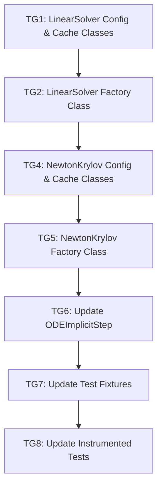

# Implementation Task List
# Feature: Linear and Newton-Krylov Solver Factory Refactor
# Plan Reference: .github/active_plans/linear_newton_factory_refactor/agent_plan.md

## Task Dependencies Graph



## Task Group 1: LinearSolver Config and Cache Classes - SEQUENTIAL
**Status**: [ ]
**Dependencies**: None

**Required Context**:
- File: src/cubie/integrators/algorithms/base_algorithm_step.py (lines 33-139) - Pattern for BaseStepConfig
- File: src/cubie/CUDAFactory.py (lines 18-48) - CUDAFunctionCache pattern
- File: src/cubie/_utils.py (lines 1-200) - Validators and precision handling
- File: src/cubie/integrators/matrix_free_solvers/linear_solver.py (lines 19-95) - Current factory function parameters

**Input Validation Required**:
- `n`: getype_validator(int, 1) - Must be positive integer
- `precision`: precision_validator - Must be in ALLOWED_PRECISIONS
- `correction_type`: validators.in_(["steepest_descent", "minimal_residual"]) - Must be valid strategy
- `_tolerance`: gttype_validator(float, 0) - Must be positive float
- `max_iters`: inrangetype_validator(int, 1, 32767) - Must be in valid range
- `preconditioned_vec_location`: validators.in_(["local", "shared"]) - Must be valid location
- `temp_location`: validators.in_(["local", "shared"]) - Must be valid location
- `operator_apply`: validators.optional(is_device_validator) - Must be device function or None
- `preconditioner`: validators.optional(is_device_validator) - Must be device function or None

**Tasks**:

1. **Create LinearSolverConfig attrs class**
   - File: src/cubie/integrators/matrix_free_solvers/linear_solver.py
   - Action: Create new class
   - Details:
     ```python
     @attrs.define
     class LinearSolverConfig:
         """Configuration for LinearSolver compilation.
         
         Attributes
         ----------
         precision : PrecisionDType
             Numerical precision for computations.
         n : int
             Length of residual and search-direction vectors.
         operator_apply : Optional[Callable]
             Device function applying operator F @ v.
         preconditioner : Optional[Callable]
             Device function for approximate inverse preconditioner.
         correction_type : str
             Line-search strategy ('steepest_descent' or 'minimal_residual').
         _tolerance : float
             Target on squared residual norm for convergence.
         max_iters : int
             Maximum iterations permitted.
         preconditioned_vec_location : str
             Memory location for preconditioned_vec buffer ('local' or 'shared').
         temp_location : str
             Memory location for temp buffer ('local' or 'shared').
         use_cached_auxiliaries : bool
             Whether to use cached auxiliary arrays (determines signature).
         """
         
         precision: PrecisionDType = attrs.field(
             converter=precision_converter,
             validator=precision_validator
         )
         n: int = attrs.field(validator=getype_validator(int, 1))
         operator_apply: Optional[Callable] = attrs.field(
             default=None,
             validator=validators.optional(is_device_validator)
         )
         preconditioner: Optional[Callable] = attrs.field(
             default=None,
             validator=validators.optional(is_device_validator)
         )
         correction_type: str = attrs.field(
             default="minimal_residual",
             validator=validators.in_(["steepest_descent", "minimal_residual"])
         )
         _tolerance: float = attrs.field(
             default=1e-6,
             validator=gttype_validator(float, 0)
         )
         max_iters: int = attrs.field(
             default=100,
             validator=inrangetype_validator(int, 1, 32767)
         )
         preconditioned_vec_location: str = attrs.field(
             default='local',
             validator=validators.in_(["local", "shared"])
         )
         temp_location: str = attrs.field(
             default='local',
             validator=validators.in_(["local", "shared"])
         )
         use_cached_auxiliaries: bool = attrs.field(default=False)
         
         @property
         def tolerance(self) -> float:
             """Return tolerance in configured precision."""
             return self.precision(self._tolerance)
         
         @property
         def numba_precision(self) -> type:
             """Return Numba type for precision."""
             return from_dtype(np.dtype(self.precision))
         
         @property
         def simsafe_precision(self) -> type:
             """Return CUDA-sim-safe type for precision."""
             return simsafe_dtype(np.dtype(self.precision))
         
         @property
         def settings_dict(self) -> dict:
             """Return configuration fields as dictionary."""
             return {
                 'precision': self.precision,
                 'n': self.n,
                 'operator_apply': self.operator_apply,
                 'preconditioner': self.preconditioner,
                 'correction_type': self.correction_type,
                 'tolerance': self.tolerance,
                 'max_iters': self.max_iters,
                 'preconditioned_vec_location': self.preconditioned_vec_location,
                 'temp_location': self.temp_location,
                 'use_cached_auxiliaries': self.use_cached_auxiliaries,
             }
     ```
   - Edge cases: 
     - operator_apply and preconditioner can be None at instantiation
     - tolerance must be squared when used in device function
     - use_cached_auxiliaries flag determines device function signature
   - Integration: Follows BaseStepConfig pattern from base_algorithm_step.py

2. **Create LinearSolverCache attrs class**
   - File: src/cubie/integrators/matrix_free_solvers/linear_solver.py
   - Action: Create new class
   - Details:
     ```python
     @attrs.define
     class LinearSolverCache(CUDAFunctionCache):
         """Cache container for LinearSolver outputs.
         
         Attributes
         ----------
         linear_solver : Callable
             Compiled CUDA device function for linear solving.
         """
         
         linear_solver: Callable = attrs.field(
             validator=is_device_validator
         )
     ```
   - Edge cases: None - simple container
   - Integration: Inherits from CUDAFunctionCache, follows StepCache pattern

**Outcomes**: 
[Empty - to be filled by taskmaster agent]

---

## Task Group 2: LinearSolver Factory Class - SEQUENTIAL
**Status**: [ ]
**Dependencies**: Task Group 1

**Required Context**:
- File: src/cubie/CUDAFactory.py (lines 1-300) - CUDAFactory base class methods
- File: src/cubie/integrators/matrix_free_solvers/linear_solver.py (lines 19-253) - Current factory function implementation
- File: src/cubie/buffer_registry.py (lines 1-100) - Buffer registration pattern
- File: src/cubie/integrators/algorithms/base_algorithm_step.py (lines 140-250) - BaseAlgorithmStep factory pattern

**Input Validation Required**:
None - validation happens in config class

**Tasks**:

1. **Create LinearSolver class skeleton**
   - File: src/cubie/integrators/matrix_free_solvers/linear_solver.py
   - Action: Create new class
   - Details:
     ```python
     class LinearSolver(CUDAFactory):
         """Factory for preconditioned linear solver device functions.
         
         Implements steepest-descent or minimal-residual iterations
         without forming Jacobian matrices explicitly.
         """
         
         def __init__(self, config: LinearSolverConfig) -> None:
             """Initialize LinearSolver with configuration.
             
             Parameters
             ----------
             config : LinearSolverConfig
                 Configuration containing all compile-time parameters.
             """
             super().__init__()
             self.setup_compile_settings(config)
             
             # Register buffers with buffer_registry
             # Buffer names depend on use_cached_auxiliaries flag
             if config.use_cached_auxiliaries:
                 buffer_registry.register(
                     'lin_cached_preconditioned_vec',
                     self,
                     config.n,
                     config.preconditioned_vec_location,
                     precision=config.precision
                 )
                 buffer_registry.register(
                     'lin_cached_temp',
                     self,
                     config.n,
                     config.temp_location,
                     precision=config.precision
                 )
             else:
                 buffer_registry.register(
                     'lin_preconditioned_vec',
                     self,
                     config.n,
                     config.preconditioned_vec_location,
                     precision=config.precision
                 )
                 buffer_registry.register(
                     'lin_temp',
                     self,
                     config.n,
                     config.temp_location,
                     precision=config.precision
                 )
     ```
   - Edge cases:
     - Different buffer names for cached vs non-cached variants
     - self passed as factory parameter to buffer_registry
   - Integration: Inherits from CUDAFactory, registers buffers immediately

2. **Implement LinearSolver.build() method**
   - File: src/cubie/integrators/matrix_free_solvers/linear_solver.py
   - Action: Create new method
   - Details:
     ```python
     def build(self) -> LinearSolverCache:
         """Compile linear solver device function.
         
         Returns
         -------
         LinearSolverCache
             Container with compiled linear_solver device function.
         
         Raises
         ------
         ValueError
             If operator_apply is None when build() is called.
         """
         config = self.compile_settings
         
         # Validate required device functions are set
         if config.operator_apply is None:
             raise ValueError(
                 "operator_apply must be set before building LinearSolver"
             )
         
         # Extract parameters from config
         operator_apply = config.operator_apply
         preconditioner = config.preconditioner
         n = config.n
         correction_type = config.correction_type
         tolerance = config.tolerance
         max_iters = config.max_iters
         precision = config.precision
         use_cached_auxiliaries = config.use_cached_auxiliaries
         
         # Compute flags for correction type
         sd_flag = correction_type == "steepest_descent"
         mr_flag = correction_type == "minimal_residual"
         preconditioned = preconditioner is not None
         
         # Convert types for device function
         n_val = int32(n)
         max_iters_val = int32(max_iters)
         precision_numba = from_dtype(np.dtype(precision))
         typed_zero = precision_numba(0.0)
         tol_squared = precision_numba(tolerance * tolerance)
         
         # Get allocators from buffer_registry
         if use_cached_auxiliaries:
             alloc_precond = buffer_registry.get_allocator(
                 'lin_cached_preconditioned_vec', self
             )
             alloc_temp = buffer_registry.get_allocator(
                 'lin_cached_temp', self
             )
         else:
             alloc_precond = buffer_registry.get_allocator(
                 'lin_preconditioned_vec', self
             )
             alloc_temp = buffer_registry.get_allocator('lin_temp', self)
         
         # Define device function with appropriate signature
         if use_cached_auxiliaries:
             # [COPY device function from linear_solver_cached_factory]
             # (lines 331-434 from current implementation)
             @cuda.jit(device=True, **compile_kwargs)
             def linear_solver_cached(...):
                 # Implementation here
                 pass
             
             return LinearSolverCache(linear_solver=linear_solver_cached)
         else:
             # [COPY device function from linear_solver_factory]
             # (lines 103-251 from current implementation)
             @cuda.jit(device=True, inline=True, **compile_kwargs)
             def linear_solver(...):
                 # Implementation here
                 pass
             
             return LinearSolverCache(linear_solver=linear_solver)
     ```
   - Edge cases:
     - Must raise informative error if operator_apply is None
     - Signature differs based on use_cached_auxiliaries flag
     - All compile-time constants captured in closure
     - Buffer allocators retrieved after registration in __init__
   - Integration: Returns LinearSolverCache instance, follows CUDAFactory pattern

3. **Implement LinearSolver.update() method**
   - File: src/cubie/integrators/matrix_free_solvers/linear_solver.py
   - Action: Create new method
   - Details:
     ```python
     def update(
         self,
         updates_dict: Optional[Dict[str, Any]] = None,
         silent: bool = False,
         **kwargs
     ) -> Set[str]:
         """Update compile settings and invalidate cache if changed.
         
         Parameters
         ----------
         updates_dict : dict, optional
             Dictionary of settings to update.
         silent : bool, default False
             If True, suppress warnings about unrecognized keys.
         **kwargs
             Additional settings as keyword arguments.
         
         Returns
         -------
         set
             Set of recognized parameter names that were updated.
         """
         return self.update_compile_settings(
             updates_dict=updates_dict,
             silent=silent,
             **kwargs
         )
     ```
   - Edge cases: None - delegates to base class
   - Integration: Follows standard CUDAFactory update pattern

4. **Implement LinearSolver properties**
   - File: src/cubie/integrators/matrix_free_solvers/linear_solver.py
   - Action: Create new methods
   - Details:
     ```python
     @property
     def device_function(self) -> Callable:
         """Return cached linear solver device function."""
         return self.get_cached_output("linear_solver")
     
     @property
     def precision(self) -> PrecisionDType:
         """Return configured precision."""
         return self.compile_settings.precision
     
     @property
     def n(self) -> int:
         """Return vector size."""
         return self.compile_settings.n
     
     @property
     def correction_type(self) -> str:
         """Return correction strategy."""
         return self.compile_settings.correction_type
     
     @property
     def tolerance(self) -> float:
         """Return convergence tolerance."""
         return self.compile_settings.tolerance
     
     @property
     def max_iters(self) -> int:
         """Return maximum iterations."""
         return self.compile_settings.max_iters
     
     @property
     def use_cached_auxiliaries(self) -> bool:
         """Return whether cached auxiliaries are used."""
         return self.compile_settings.use_cached_auxiliaries
     
     @property
     def shared_buffer_size(self) -> int:
         """Return total shared memory elements required."""
         return buffer_registry.shared_buffer_size(self)
     
     @property
     def local_buffer_size(self) -> int:
         """Return total local memory elements required."""
         return buffer_registry.local_buffer_size(self)
     ```
   - Edge cases: None - straightforward property accessors
   - Integration: Provides read-only access to config, follows CUDAFactory pattern

5. **Add imports to linear_solver.py**
   - File: src/cubie/integrators/matrix_free_solvers/linear_solver.py
   - Action: Modify imports section
   - Details:
     ```python
     # Add these imports at top of file:
     from typing import Callable, Optional, Set, Dict, Any
     import attrs
     from attrs import validators
     from cubie._utils import (
         PrecisionDType,
         getype_validator,
         gttype_validator,
         inrangetype_validator,
         is_device_validator,
         precision_converter,
         precision_validator,
     )
     from cubie.CUDAFactory import CUDAFactory, CUDAFunctionCache
     from cubie.cuda_simsafe import from_dtype as simsafe_dtype
     import numba
     
     # Existing imports remain:
     # from numba import cuda, int32, from_dtype
     # import numpy as np
     # from cubie.buffer_registry import buffer_registry
     # from cubie.cuda_simsafe import activemask, all_sync, compile_kwargs, selp
     ```
   - Edge cases: None - straightforward imports
   - Integration: Adds necessary dependencies for attrs and CUDAFactory

6. **Mark factory functions as deprecated**
   - File: src/cubie/integrators/matrix_free_solvers/linear_solver.py
   - Action: Add deprecation warnings
   - Details:
     ```python
     import warnings
     
     def linear_solver_factory(...):
         """[Keep existing docstring]"""
         warnings.warn(
             "linear_solver_factory is deprecated. Use LinearSolver class instead.",
             DeprecationWarning,
             stacklevel=2
         )
         # Keep existing implementation for now
     
     def linear_solver_cached_factory(...):
         """[Keep existing docstring]"""
         warnings.warn(
             "linear_solver_cached_factory is deprecated. Use LinearSolver "
             "with use_cached_auxiliaries=True instead.",
             DeprecationWarning,
             stacklevel=2
         )
         # Keep existing implementation for now
     ```
   - Edge cases: None - non-breaking deprecation
   - Integration: Maintains backward compatibility while encouraging migration

**Outcomes**: 
[Empty - to be filled by taskmaster agent]

---

## Task Group 3: Update __init__.py Exports - PARALLEL
**Status**: [ ]
**Dependencies**: Task Group 2

**Required Context**:
- File: src/cubie/integrators/matrix_free_solvers/__init__.py (entire file)

**Input Validation Required**:
None

**Tasks**:

1. **Add LinearSolver exports to __init__.py**
   - File: src/cubie/integrators/matrix_free_solvers/__init__.py
   - Action: Modify exports
   - Details:
     ```python
     # Add to existing exports:
     from cubie.integrators.matrix_free_solvers.linear_solver import (
         LinearSolver,
         LinearSolverConfig,
         LinearSolverCache,
         linear_solver_factory,  # Keep for backward compatibility
         linear_solver_cached_factory,  # Keep for backward compatibility
     )
     
     __all__ = [
         'LinearSolver',
         'LinearSolverConfig',
         'LinearSolverCache',
         'linear_solver_factory',
         'linear_solver_cached_factory',
         # ... existing exports
     ]
     ```
   - Edge cases: None - standard export pattern
   - Integration: Makes new classes publicly available

**Outcomes**: 
[Empty - to be filled by taskmaster agent]

---

## Task Group 4: NewtonKrylov Config and Cache Classes - SEQUENTIAL
**Status**: [ ]
**Dependencies**: Task Group 2

**Required Context**:
- File: src/cubie/integrators/matrix_free_solvers/newton_krylov.py (lines 18-316) - Current factory function
- File: src/cubie/integrators/matrix_free_solvers/linear_solver.py (LinearSolver class from TG2)
- File: src/cubie/_utils.py (lines 1-200) - Validators

**Input Validation Required**:
- `n`: getype_validator(int, 1) - Must be positive integer
- `precision`: precision_validator - Must be in ALLOWED_PRECISIONS
- `_tolerance`: gttype_validator(float, 0) - Must be positive float
- `max_iters`: inrangetype_validator(int, 1, 32767) - Must be in valid range
- `_damping`: inrangetype_validator(float, 0, 1) - Must be in (0, 1]
- `max_backtracks`: inrangetype_validator(int, 1, 32767) - Must be in valid range
- `residual_function`: validators.optional(is_device_validator) - Must be device function or None
- `linear_solver`: validators.optional(validators.instance_of(LinearSolver)) - Must be LinearSolver or None
- All location parameters: validators.in_(["local", "shared"]) - Must be valid locations

**Tasks**:

1. **Create NewtonKrylovConfig attrs class**
   - File: src/cubie/integrators/matrix_free_solvers/newton_krylov.py
   - Action: Create new class
   - Details:
     ```python
     @attrs.define
     class NewtonKrylovConfig:
         """Configuration for NewtonKrylov solver compilation.
         
         Attributes
         ----------
         precision : PrecisionDType
             Numerical precision for computations.
         n : int
             Size of state vectors.
         residual_function : Optional[Callable]
             Device function evaluating residuals.
         linear_solver : Optional[LinearSolver]
             LinearSolver instance for solving linear systems.
         _tolerance : float
             Residual norm threshold for convergence.
         max_iters : int
             Maximum Newton iterations permitted.
         _damping : float
             Step shrink factor for backtracking.
         max_backtracks : int
             Maximum damping attempts per Newton step.
         delta_location : str
             Memory location for delta buffer.
         residual_location : str
             Memory location for residual buffer.
         residual_temp_location : str
             Memory location for residual_temp buffer.
         stage_base_bt_location : str
             Memory location for stage_base_bt buffer.
         """
         
         precision: PrecisionDType = attrs.field(
             converter=precision_converter,
             validator=precision_validator
         )
         n: int = attrs.field(validator=getype_validator(int, 1))
         residual_function: Optional[Callable] = attrs.field(
             default=None,
             validator=validators.optional(is_device_validator)
         )
         linear_solver: Optional['LinearSolver'] = attrs.field(
             default=None,
             validator=validators.optional(
                 validators.instance_of(LinearSolver)
             )
         )
         _tolerance: float = attrs.field(
             default=1e-3,
             validator=gttype_validator(float, 0)
         )
         max_iters: int = attrs.field(
             default=100,
             validator=inrangetype_validator(int, 1, 32767)
         )
         _damping: float = attrs.field(
             default=0.5,
             validator=inrangetype_validator(float, 0, 1)
         )
         max_backtracks: int = attrs.field(
             default=8,
             validator=inrangetype_validator(int, 1, 32767)
         )
         delta_location: str = attrs.field(
             default='local',
             validator=validators.in_(["local", "shared"])
         )
         residual_location: str = attrs.field(
             default='local',
             validator=validators.in_(["local", "shared"])
         )
         residual_temp_location: str = attrs.field(
             default='local',
             validator=validators.in_(["local", "shared"])
         )
         stage_base_bt_location: str = attrs.field(
             default='local',
             validator=validators.in_(["local", "shared"])
         )
         
         def __attrs_post_init__(self):
             """Validate precision consistency with linear_solver."""
             if self.linear_solver is not None:
                 if self.linear_solver.precision != self.precision:
                     raise ValueError(
                         f"NewtonKrylov precision ({self.precision}) must match "
                         f"LinearSolver precision ({self.linear_solver.precision})"
                     )
         
         @property
         def tolerance(self) -> float:
             """Return tolerance in configured precision."""
             return self.precision(self._tolerance)
         
         @property
         def damping(self) -> float:
             """Return damping factor in configured precision."""
             return self.precision(self._damping)
         
         @property
         def numba_precision(self) -> type:
             """Return Numba type for precision."""
             return from_dtype(np.dtype(self.precision))
         
         @property
         def simsafe_precision(self) -> type:
             """Return CUDA-sim-safe type for precision."""
             return simsafe_dtype(np.dtype(self.precision))
         
         @property
         def settings_dict(self) -> dict:
             """Return configuration fields as dictionary."""
             return {
                 'precision': self.precision,
                 'n': self.n,
                 'residual_function': self.residual_function,
                 'linear_solver': self.linear_solver,
                 'tolerance': self.tolerance,
                 'max_iters': self.max_iters,
                 'damping': self.damping,
                 'max_backtracks': self.max_backtracks,
                 'delta_location': self.delta_location,
                 'residual_location': self.residual_location,
                 'residual_temp_location': self.residual_temp_location,
                 'stage_base_bt_location': self.stage_base_bt_location,
             }
     ```
   - Edge cases:
     - Validates precision consistency with LinearSolver in __attrs_post_init__
     - linear_solver can be None at instantiation but required before build
     - Forward reference for LinearSolver type hint
   - Integration: Similar to LinearSolverConfig, adds precision validation

2. **Create NewtonKrylovCache attrs class**
   - File: src/cubie/integrators/matrix_free_solvers/newton_krylov.py
   - Action: Create new class
   - Details:
     ```python
     @attrs.define
     class NewtonKrylovCache(CUDAFunctionCache):
         """Cache container for NewtonKrylov outputs.
         
         Attributes
         ----------
         newton_krylov_solver : Callable
             Compiled CUDA device function for Newton-Krylov solving.
         """
         
         newton_krylov_solver: Callable = attrs.field(
             validator=is_device_validator
         )
     ```
   - Edge cases: None - simple container
   - Integration: Inherits from CUDAFunctionCache

**Outcomes**: 
[Empty - to be filled by taskmaster agent]

---

## Task Group 5: NewtonKrylov Factory Class - SEQUENTIAL
**Status**: [ ]
**Dependencies**: Task Group 4

**Required Context**:
- File: src/cubie/integrators/matrix_free_solvers/newton_krylov.py (lines 18-316) - Current implementation
- File: src/cubie/buffer_registry.py (lines 1-100) - Buffer registration
- File: src/cubie/integrators/matrix_free_solvers/linear_solver.py (LinearSolver class)

**Input Validation Required**:
None - validation in config class

**Tasks**:

1. **Create NewtonKrylov class skeleton**
   - File: src/cubie/integrators/matrix_free_solvers/newton_krylov.py
   - Action: Create new class
   - Details:
     ```python
     class NewtonKrylov(CUDAFactory):
         """Factory for Newton-Krylov solver device functions.
         
         Implements damped Newton iteration using a matrix-free
         linear solver for the correction equation.
         """
         
         def __init__(self, config: NewtonKrylovConfig) -> None:
             """Initialize NewtonKrylov with configuration.
             
             Parameters
             ----------
             config : NewtonKrylovConfig
                 Configuration containing all compile-time parameters.
             """
             super().__init__()
             self.setup_compile_settings(config)
             
             # Register buffers with buffer_registry
             buffer_registry.register(
                 'newton_delta',
                 self,
                 config.n,
                 config.delta_location,
                 precision=config.precision
             )
             buffer_registry.register(
                 'newton_residual',
                 self,
                 config.n,
                 config.residual_location,
                 precision=config.precision
             )
             buffer_registry.register(
                 'newton_residual_temp',
                 self,
                 config.n,
                 config.residual_temp_location,
                 precision=config.precision
             )
             buffer_registry.register(
                 'newton_stage_base_bt',
                 self,
                 config.n,
                 config.stage_base_bt_location,
                 precision=config.precision
             )
     ```
   - Edge cases: self passed as factory parameter
   - Integration: Registers Newton buffers, separate from LinearSolver buffers

2. **Implement NewtonKrylov.build() method**
   - File: src/cubie/integrators/matrix_free_solvers/newton_krylov.py
   - Action: Create new method
   - Details:
     ```python
     def build(self) -> NewtonKrylovCache:
         """Compile Newton-Krylov solver device function.
         
         Returns
         -------
         NewtonKrylovCache
             Container with compiled newton_krylov_solver device function.
         
         Raises
         ------
         ValueError
             If residual_function or linear_solver is None when build() is called.
         """
         config = self.compile_settings
         
         # Validate required components are set
         if config.residual_function is None:
             raise ValueError(
                 "residual_function must be set before building NewtonKrylov"
             )
         if config.linear_solver is None:
             raise ValueError(
                 "linear_solver must be set before building NewtonKrylov"
             )
         
         # Extract parameters from config
         residual_function = config.residual_function
         linear_solver = config.linear_solver
         n = config.n
         tolerance = config.tolerance
         max_iters = config.max_iters
         damping = config.damping
         max_backtracks = config.max_backtracks
         precision = config.precision
         
         # Get linear solver device function (may trigger LinearSolver.build())
         linear_solver_fn = linear_solver.device_function
         
         # Convert types for device function
         precision_dtype = np.dtype(precision)
         numba_precision = from_dtype(precision_dtype)
         tol_squared = numba_precision(tolerance * tolerance)
         typed_zero = numba_precision(0.0)
         typed_one = numba_precision(1.0)
         typed_damping = numba_precision(damping)
         n_val = int32(n)
         max_iters_val = int32(max_iters)
         max_backtracks_val = int32(max_backtracks + 1)
         
         # Get allocators from buffer_registry
         alloc_delta = buffer_registry.get_allocator('newton_delta', self)
         alloc_residual = buffer_registry.get_allocator('newton_residual', self)
         alloc_residual_temp = buffer_registry.get_allocator(
             'newton_residual_temp', self
         )
         alloc_stage_base_bt = buffer_registry.get_allocator(
             'newton_stage_base_bt', self
         )
         
         # [COPY device function from newton_krylov_solver_factory]
         # (lines 126-315 from current implementation)
         # NOTE: Must compute lin_start using buffer_registry.shared_buffer_size(self)
         @cuda.jit(device=True, inline=True, **compile_kwargs)
         def newton_krylov_solver(...):
             # Allocate Newton buffers
             delta = alloc_delta(shared_scratch, shared_scratch)
             residual = alloc_residual(shared_scratch, shared_scratch)
             residual_temp = alloc_residual_temp(shared_scratch, shared_scratch)
             stage_base_bt = alloc_stage_base_bt(shared_scratch, shared_scratch)
             
             # Compute linear solver shared buffer offset
             lin_start = buffer_registry.shared_buffer_size(self)
             lin_shared = shared_scratch[lin_start:]
             
             # Rest of implementation from lines 186-313
             # ...
         
         return NewtonKrylovCache(newton_krylov_solver=newton_krylov_solver)
     ```
   - Edge cases:
     - Must raise informative errors if residual_function or linear_solver is None
     - Accessing linear_solver.device_function may trigger LinearSolver.build()
     - lin_start computed using buffer_registry.shared_buffer_size(self) for Newton buffers only
     - All compile-time constants captured in closure
   - Integration: Accesses LinearSolver through property, computes shared buffer offset

3. **Implement NewtonKrylov.update() method**
   - File: src/cubie/integrators/matrix_free_solvers/newton_krylov.py
   - Action: Create new method
   - Details:
     ```python
     def update(
         self,
         updates_dict: Optional[Dict[str, Any]] = None,
         silent: bool = False,
         **kwargs
     ) -> Set[str]:
         """Update compile settings and invalidate cache if changed.
         
         Parameters
         ----------
         updates_dict : dict, optional
             Dictionary of settings to update.
         silent : bool, default False
             If True, suppress warnings about unrecognized keys.
         **kwargs
             Additional settings as keyword arguments.
         
         Returns
         -------
         set
             Set of recognized parameter names that were updated.
         
         Notes
         -----
         If linear_solver is updated, cache is invalidated even if
         the LinearSolver instance reference hasn't changed, because
         the LinearSolver's internal state may have changed.
         """
         # Check if linear_solver settings changed
         # This is handled automatically by attrs comparison in
         # update_compile_settings, so we just delegate
         return self.update_compile_settings(
             updates_dict=updates_dict,
             silent=silent,
             **kwargs
         )
     ```
   - Edge cases:
     - LinearSolver changes detected by attrs comparison
     - Cache invalidation propagates automatically
   - Integration: Delegates to base class, relies on attrs comparison

4. **Implement NewtonKrylov properties**
   - File: src/cubie/integrators/matrix_free_solvers/newton_krylov.py
   - Action: Create new methods
   - Details:
     ```python
     @property
     def device_function(self) -> Callable:
         """Return cached Newton-Krylov solver device function."""
         return self.get_cached_output("newton_krylov_solver")
     
     @property
     def precision(self) -> PrecisionDType:
         """Return configured precision."""
         return self.compile_settings.precision
     
     @property
     def n(self) -> int:
         """Return vector size."""
         return self.compile_settings.n
     
     @property
     def tolerance(self) -> float:
         """Return convergence tolerance."""
         return self.compile_settings.tolerance
     
     @property
     def max_iters(self) -> int:
         """Return maximum Newton iterations."""
         return self.compile_settings.max_iters
     
     @property
     def damping(self) -> float:
         """Return damping factor."""
         return self.compile_settings.damping
     
     @property
     def max_backtracks(self) -> int:
         """Return maximum backtracking steps."""
         return self.compile_settings.max_backtracks
     
     @property
     def linear_solver(self) -> Optional['LinearSolver']:
         """Return nested LinearSolver instance."""
         return self.compile_settings.linear_solver
     
     @property
     def shared_buffer_size(self) -> int:
         """Return total shared memory elements required.
         
         Includes both Newton buffers and nested LinearSolver buffers.
         """
         newton_size = buffer_registry.shared_buffer_size(self)
         if self.compile_settings.linear_solver is not None:
             linear_size = self.compile_settings.linear_solver.shared_buffer_size
         else:
             linear_size = 0
         return newton_size + linear_size
     
     @property
     def local_buffer_size(self) -> int:
         """Return total local memory elements required.
         
         Includes both Newton buffers and nested LinearSolver buffers.
         """
         newton_size = buffer_registry.local_buffer_size(self)
         if self.compile_settings.linear_solver is not None:
             linear_size = self.compile_settings.linear_solver.local_buffer_size
         else:
             linear_size = 0
         return newton_size + linear_size
     ```
   - Edge cases:
     - shared_buffer_size and local_buffer_size aggregate Newton + LinearSolver sizes
     - linear_solver property may return None if not yet configured
   - Integration: Provides comprehensive buffer size calculation

5. **Add imports to newton_krylov.py**
   - File: src/cubie/integrators/matrix_free_solvers/newton_krylov.py
   - Action: Modify imports section
   - Details:
     ```python
     # Add these imports:
     from typing import Callable, Optional, Set, Dict, Any
     import attrs
     from attrs import validators
     from cubie._utils import (
         PrecisionDType,
         getype_validator,
         gttype_validator,
         inrangetype_validator,
         is_device_validator,
         precision_converter,
         precision_validator,
     )
     from cubie.CUDAFactory import CUDAFactory, CUDAFunctionCache
     from cubie.cuda_simsafe import from_dtype as simsafe_dtype
     import numba
     
     # Update this import:
     from cubie.integrators.matrix_free_solvers.linear_solver import LinearSolver
     
     # Remove this import:
     # from cubie.integrators.matrix_free_solvers import linear_solver_factory
     
     # Keep existing imports:
     # from numba import cuda, int32, from_dtype
     # import numpy as np
     # from cubie._utils import ALLOWED_PRECISIONS, PrecisionDType
     # from cubie.buffer_registry import buffer_registry
     # from cubie.cuda_simsafe import activemask, all_sync, selp, any_sync, compile_kwargs
     ```
   - Edge cases: None
   - Integration: Imports LinearSolver class instead of factory function

6. **Mark factory function as deprecated**
   - File: src/cubie/integrators/matrix_free_solvers/newton_krylov.py
   - Action: Add deprecation warning
   - Details:
     ```python
     import warnings
     
     def newton_krylov_solver_factory(...):
         """[Keep existing docstring]"""
         warnings.warn(
             "newton_krylov_solver_factory is deprecated. Use NewtonKrylov class instead.",
             DeprecationWarning,
             stacklevel=2
         )
         # Keep existing implementation for now
     ```
   - Edge cases: None
   - Integration: Maintains backward compatibility

7. **Add NewtonKrylov exports to __init__.py**
   - File: src/cubie/integrators/matrix_free_solvers/__init__.py
   - Action: Modify exports
   - Details:
     ```python
     from cubie.integrators.matrix_free_solvers.newton_krylov import (
         NewtonKrylov,
         NewtonKrylovConfig,
         NewtonKrylovCache,
         newton_krylov_solver_factory,  # Keep for backward compatibility
     )
     
     __all__ = [
         # ... existing exports
         'NewtonKrylov',
         'NewtonKrylovConfig',
         'NewtonKrylovCache',
         'newton_krylov_solver_factory',
     ]
     ```
   - Edge cases: None
   - Integration: Makes new classes publicly available

**Outcomes**: 
[Empty - to be filled by taskmaster agent]

---

## Task Group 6: Update ODEImplicitStep - SEQUENTIAL
**Status**: [ ]
**Dependencies**: Task Group 5

**Required Context**:
- File: src/cubie/integrators/algorithms/ode_implicitstep.py (entire file) - Current implementation
- File: src/cubie/integrators/matrix_free_solvers/linear_solver.py (LinearSolver class)
- File: src/cubie/integrators/matrix_free_solvers/newton_krylov.py (NewtonKrylov class)

**Input Validation Required**:
None - validation in solver config classes

**Tasks**:

1. **Update ODEImplicitStep imports**
   - File: src/cubie/integrators/algorithms/ode_implicitstep.py
   - Action: Modify import statements
   - Details:
     ```python
     # Replace these imports:
     # from cubie.integrators.matrix_free_solvers import (
     #     linear_solver_factory,
     #     newton_krylov_solver_factory,
     # )
     
     # With:
     from cubie.integrators.matrix_free_solvers.linear_solver import (
         LinearSolver,
         LinearSolverConfig,
     )
     from cubie.integrators.matrix_free_solvers.newton_krylov import (
         NewtonKrylov,
         NewtonKrylovConfig,
     )
     ```
   - Edge cases: None
   - Integration: Imports classes instead of factory functions

2. **Add solver instantiation to ODEImplicitStep.__init__**
   - File: src/cubie/integrators/algorithms/ode_implicitstep.py
   - Action: Modify __init__ method (lines 144-158)
   - Details:
     ```python
     def __init__(self,
                  config: ImplicitStepConfig,
                  _controller_defaults: StepControlDefaults) -> None:
         """Initialise the implicit step with its configuration.
         
         Parameters
         ----------
         config
             Configuration describing the implicit step.
         _controller_defaults
            Per-algorithm default runtime collaborators, such as step
            controllers and matrix-free solvers.
         """
         
         super().__init__(config, _controller_defaults)
         
         # Create LinearSolver instance
         linear_config = LinearSolverConfig(
             precision=config.precision,
             n=config.n,
             correction_type=config.linear_correction_type,
             tolerance=config.krylov_tolerance,
             max_iters=config.max_linear_iters,
             # operator_apply and preconditioner set later in build()
             # Buffer locations default to 'local'
         )
         self._linear_solver = LinearSolver(linear_config)
         
         # Create NewtonKrylov instance
         newton_config = NewtonKrylovConfig(
             precision=config.precision,
             n=config.n,
             linear_solver=self._linear_solver,
             tolerance=config.newton_tolerance,
             max_iters=config.max_newton_iters,
             damping=config.newton_damping,
             max_backtracks=config.newton_max_backtracks,
             # residual_function set later in build()
             # Buffer locations default to 'local'
         )
         self._newton_solver = NewtonKrylov(newton_config)
     ```
   - Edge cases:
     - Solvers created with partial configuration
     - operator_apply, preconditioner, and residual_function set during build()
     - Buffer locations use defaults (all 'local')
   - Integration: Solvers stored as instance attributes, initialized once

3. **Update ODEImplicitStep.build_implicit_helpers() method**
   - File: src/cubie/integrators/algorithms/ode_implicitstep.py
   - Action: Modify method (lines 226-293)
   - Details:
     ```python
     def build_implicit_helpers(self) -> Callable:
         """Construct the nonlinear solver chain used by implicit methods.
         
         Returns
         -------
         Callable
             Nonlinear solver function compiled for the configured implicit
             scheme.
         """
         
         config = self.compile_settings
         beta = config.beta
         gamma = config.gamma
         mass = config.M
         preconditioner_order = config.preconditioner_order
         
         get_fn = config.get_solver_helper_fn
         
         # Get device functions from ODE system
         preconditioner = get_fn(
             'neumann_preconditioner',
             beta=beta,
             gamma=gamma,
             mass=mass,
             preconditioner_order=preconditioner_order
         )
         residual = get_fn(
             'stage_residual',
             beta=beta,
             gamma=gamma,
             mass=mass,
             preconditioner_order=preconditioner_order
         )
         operator = get_fn(
             'linear_operator',
             beta=beta,
             gamma=gamma,
             mass=mass,
             preconditioner_order=preconditioner_order
         )
         
         # Update LinearSolver with device functions
         self._linear_solver.update(
             operator_apply=operator,
             preconditioner=preconditioner,
         )
         
         # Update NewtonKrylov with device function
         self._newton_solver.update(
             residual_function=residual,
         )
         
         # Return Newton solver device function
         return self._newton_solver.device_function
     ```
   - Edge cases:
     - update() calls invalidate cache if parameters changed
     - Accessing device_function property triggers build() if needed
     - Operator, preconditioner, and residual are system-dependent
   - Integration: Updates solvers with system-specific device functions, returns compiled solver

4. **Update ODEImplicitStep.solver_shared_elements property**
   - File: src/cubie/integrators/algorithms/ode_implicitstep.py
   - Action: Modify property (lines 295-299)
   - Details:
     ```python
     @property
     def solver_shared_elements(self) -> int:
         """Return shared scratch dedicated to the Newton--Krylov solver."""
         
         # Return total shared size from NewtonKrylov (includes LinearSolver)
         return self._newton_solver.shared_buffer_size
     ```
   - Edge cases: Aggregates Newton + LinearSolver shared sizes
   - Integration: Uses NewtonKrylov property that computes total size

**Outcomes**: 
[Empty - to be filled by taskmaster agent]

---

## Task Group 7: Update Test Fixtures - PARALLEL
**Status**: [ ]
**Dependencies**: Task Group 6

**Required Context**:
- File: tests/integrators/matrix_free_solvers/conftest.py (entire file) - Current fixtures
- File: tests/integrators/matrix_free_solvers/test_linear_solver.py (lines 69-81) - solver_device fixture
- File: tests/integrators/matrix_free_solvers/test_newton_krylov.py (entire file) - Newton tests

**Input Validation Required**:
None - test fixtures

**Tasks**:

1. **Create linear_solver_instance fixture**
   - File: tests/integrators/matrix_free_solvers/conftest.py
   - Action: Add new fixture
   - Details:
     ```python
     @pytest.fixture(scope="function")
     def linear_solver_instance(request, system_setup, precision):
         """Instantiate LinearSolver with settings from system_setup.
         
         Parameters
         ----------
         request : pytest.FixtureRequest
             Provides indirect overrides via param.
         system_setup : dict
             System configuration with operator, preconditioner, etc.
         precision : np.dtype
             Numerical precision for solver.
         
         Returns
         -------
         LinearSolver
             Configured solver instance ready for use in tests.
         """
         from cubie.integrators.matrix_free_solvers.linear_solver import (
             LinearSolver,
             LinearSolverConfig,
         )
         
         # Extract defaults from system_setup
         n = system_setup['n']
         operator = system_setup['operator']
         
         # Get preconditioner if needed (order from request.param or default)
         overrides = getattr(request, 'param', {})
         precond_order = overrides.get('preconditioner_order', 1)
         if precond_order == 0:
             preconditioner = None
         else:
             preconditioner = system_setup['preconditioner'](precond_order)
         
         # Build config with defaults and overrides
         config_dict = {
             'precision': precision,
             'n': n,
             'operator_apply': operator,
             'preconditioner': preconditioner,
             'correction_type': overrides.get('correction_type', 'minimal_residual'),
             'tolerance': overrides.get('tolerance', 1e-8),
             'max_iters': overrides.get('max_iters', 1000),
         }
         
         config = LinearSolverConfig(**config_dict)
         return LinearSolver(config)
     ```
   - Edge cases:
     - Indirect parameterization via request.param
     - preconditioner_order=0 means no preconditioner
     - Defaults match current test expectations
   - Integration: Replaces direct factory function calls in tests

2. **Create newton_solver_instance fixture**
   - File: tests/integrators/matrix_free_solvers/conftest.py
   - Action: Add new fixture
   - Details:
     ```python
     @pytest.fixture(scope="function")
     def newton_solver_instance(request, linear_solver_instance, system_setup, precision):
         """Instantiate NewtonKrylov with LinearSolver and settings.
         
         Parameters
         ----------
         request : pytest.FixtureRequest
             Provides indirect overrides via param.
         linear_solver_instance : LinearSolver
             Configured linear solver.
         system_setup : dict
             System configuration with residual function, etc.
         precision : np.dtype
             Numerical precision for solver.
         
         Returns
         -------
         NewtonKrylov
             Configured Newton-Krylov solver instance.
         """
         from cubie.integrators.matrix_free_solvers.newton_krylov import (
             NewtonKrylov,
             NewtonKrylovConfig,
         )
         
         # Extract defaults
         n = system_setup['n']
         residual = system_setup['residual']
         
         # Get overrides
         overrides = getattr(request, 'param', {})
         
         # Build config
         config = NewtonKrylovConfig(
             precision=precision,
             n=n,
             residual_function=residual,
             linear_solver=linear_solver_instance,
             tolerance=overrides.get('tolerance', 1e-6),
             max_iters=overrides.get('max_iters', 100),
             damping=overrides.get('damping', 0.5),
             max_backtracks=overrides.get('max_backtracks', 8),
         )
         
         return NewtonKrylov(config)
     ```
   - Edge cases:
     - Depends on linear_solver_instance fixture
     - Indirect parameterization supported
   - Integration: Creates full solver chain for Newton tests

3. **Update test_linear_solver.py solver_device fixture**
   - File: tests/integrators/matrix_free_solvers/test_linear_solver.py
   - Action: Modify fixture (lines 69-81)
   - Details:
     ```python
     @pytest.fixture(scope="function")
     def solver_device(request, placeholder_operator, precision):
         """Return solver device for the requested correction type."""
         
         from cubie.integrators.matrix_free_solvers.linear_solver import (
             LinearSolver,
             LinearSolverConfig,
         )
         
         config = LinearSolverConfig(
             precision=precision,
             n=3,
             operator_apply=placeholder_operator,
             correction_type=request.param,
             tolerance=1e-12,
             max_iters=32,
         )
         solver = LinearSolver(config)
         return solver.device_function
     ```
   - Edge cases:
     - Returns device_function for backward compatibility with existing tests
     - request.param provides correction_type via indirect parameterization
   - Integration: Minimal change to existing test, uses new class

4. **Update test_linear_solver_symbolic in test_linear_solver.py**
   - File: tests/integrators/matrix_free_solvers/test_linear_solver.py
   - Action: Modify test (lines 122-175)
   - Details:
     ```python
     @pytest.mark.parametrize(
         "system_setup", ["linear", "coupled_linear"], indirect=True
     )
     @pytest.mark.parametrize("correction_type", ["steepest_descent", "minimal_residual"])
     @pytest.mark.parametrize("precond_order", [0, 1, 2])
     def test_linear_solver_symbolic(
         system_setup,
         solver_kernel,
         precision,
         correction_type,
         precond_order,
         tolerance,
     ):
         """Solve systems built from symbolic expressions."""
         
         from cubie.integrators.matrix_free_solvers.linear_solver import (
             LinearSolver,
             LinearSolverConfig,
         )
         
         n = system_setup["n"]
         operator = system_setup["operator"]
         rhs_vec = system_setup["mr_rhs"]
         expected = system_setup["mr_expected"]
         h = system_setup["h"]
         precond = (
             None if precond_order == 0 else system_setup["preconditioner"](precond_order)
         )
         
         config = LinearSolverConfig(
             precision=precision,
             n=n,
             operator_apply=operator,
             preconditioner=precond,
             correction_type=correction_type,
             tolerance=1e-8,
             max_iters=1000,
         )
         solver_instance = LinearSolver(config)
         solver = solver_instance.device_function
         
         kernel = solver_kernel(solver, n, h, precision)
         # Rest of test unchanged
     ```
   - Edge cases: None
   - Integration: Uses LinearSolver instead of factory function

5. **Update test_newton_krylov.py tests**
   - File: tests/integrators/matrix_free_solvers/test_newton_krylov.py
   - Action: Modify all test functions that call factory
   - Details:
     ```python
     # For each test that calls newton_krylov_solver_factory:
     # 1. Import classes at top of function:
     from cubie.integrators.matrix_free_solvers.linear_solver import (
         LinearSolver,
         LinearSolverConfig,
     )
     from cubie.integrators.matrix_free_solvers.newton_krylov import (
         NewtonKrylov,
         NewtonKrylovConfig,
     )
     
     # 2. Replace linear_solver_factory call with LinearSolver instantiation:
     linear_config = LinearSolverConfig(
         precision=precision,
         n=n,
         operator_apply=operator,
         preconditioner=precond,
         correction_type=correction_type,
         tolerance=krylov_tol,
         max_iters=max_krylov,
     )
     linear_solver_instance = LinearSolver(linear_config)
     
     # 3. Replace newton_krylov_solver_factory call with NewtonKrylov:
     newton_config = NewtonKrylovConfig(
         precision=precision,
         n=n,
         residual_function=residual,
         linear_solver=linear_solver_instance,
         tolerance=newton_tol,
         max_iters=max_newton,
         damping=damping,
         max_backtracks=max_bt,
     )
     newton_instance = NewtonKrylov(newton_config)
     solver = newton_instance.device_function
     
     # Rest of test unchanged
     ```
   - Edge cases:
     - Multiple tests to update (identify by grepping for factory calls)
     - Parameters vary by test
   - Integration: Pattern consistent across all Newton tests

**Outcomes**: 
[Empty - to be filled by taskmaster agent]

---

## Task Group 8: Update Instrumented Tests - SEQUENTIAL
**Status**: [ ]
**Dependencies**: Task Group 7

**Required Context**:
- File: tests/integrators/algorithms/instrumented/matrix_free_solvers.py (entire file) - Instrumented versions
- File: src/cubie/integrators/matrix_free_solvers/linear_solver.py (completed LinearSolver class)
- File: src/cubie/integrators/matrix_free_solvers/newton_krylov.py (completed NewtonKrylov class)

**Input Validation Required**:
None - instrumented versions mirror source

**Tasks**:

1. **Replicate LinearSolver device function to instrumented version**
   - File: tests/integrators/algorithms/instrumented/matrix_free_solvers.py
   - Action: Update instrumented_linear_solver_factory
   - Details:
     ```python
     # Find instrumented_linear_solver_factory function
     # Copy device function implementation from LinearSolver.build()
     # Add logging arrays as additional parameters to device function
     # Add snapshot recording at iteration boundaries
     # Keep all logic identical except logging additions
     # Note: Factory function signature remains for test compatibility
     ```
   - Edge cases:
     - Must match both cached and non-cached variants
     - Logging arrays passed as extra parameters
     - No functional changes except logging
   - Integration: Tests depend on instrumented versions having identical behavior

2. **Replicate NewtonKrylov device function to instrumented version**
   - File: tests/integrators/algorithms/instrumented/matrix_free_solvers.py
   - Action: Update instrumented_newton_krylov_factory
   - Details:
     ```python
     # Find instrumented_newton_krylov_factory function
     # Copy device function implementation from NewtonKrylov.build()
     # Add logging arrays for Newton iteration snapshots
     # Add snapshot recording within Newton and backtracking loops
     # Keep all logic identical except logging additions
     ```
   - Edge cases:
     - Instrumented version uses instrumented_linear_solver_factory internally
     - Logging must not change convergence behavior
   - Integration: Enables algorithm validation tests

**Outcomes**: 
[Empty - to be filled by taskmaster agent]

---

## Summary

### Task Dependencies Overview

```
TG1 (Config/Cache) → TG2 (LinearSolver) → TG3 (Exports)
                                        ↓
                                       TG4 (NK Config/Cache) → TG5 (NewtonKrylov)
                                                                       ↓
                                                                      TG6 (ODEImplicitStep)
                                                                       ↓
                                                                      TG7 (Test Fixtures)
                                                                       ↓
                                                                      TG8 (Instrumented)
```

### Parallel Execution Opportunities

- Task Group 3 can run in parallel with Task Group 4
- Individual test file updates in Task Group 7 can run in parallel

### Total Task Groups: 8

### Dependency Chain:
1. **Architecture Layer**: TG1 → TG2 (LinearSolver foundation)
2. **Extension Layer**: TG2 → TG4 → TG5 (NewtonKrylov builds on LinearSolver)
3. **Integration Layer**: TG5 → TG6 (ODEImplicitStep uses both solvers)
4. **Validation Layer**: TG6 → TG7 → TG8 (Tests validate implementation)

### Estimated Complexity

- **High Complexity**: TG2, TG5, TG6 (Core refactoring with device function migration)
- **Medium Complexity**: TG1, TG4, TG7 (Config classes and test updates)
- **Low Complexity**: TG3, TG8 (Exports and instrumented copies)

### Critical Integration Points

1. **Buffer Registry**: LinearSolver and NewtonKrylov must register buffers in __init__ before build()
2. **Cache Invalidation**: NewtonKrylov must detect LinearSolver config changes
3. **Shared Memory**: NewtonKrylov.shared_buffer_size aggregates Newton + LinearSolver sizes
4. **Device Function Signatures**: Cached vs non-cached variants have different signatures
5. **Test Compatibility**: Fixtures must support indirect parameterization pattern

### Validation Criteria

After all tasks complete:
1. All tests in test_linear_solver.py pass
2. All tests in test_newton_krylov.py pass
3. All implicit algorithm tests pass (backwards_euler, crank_nicolson, etc.)
4. Factory functions emit deprecation warnings
5. Buffer sizes computed correctly for nested solvers
6. Cache invalidation works when LinearSolver or NewtonKrylov config changes
7. Instrumented versions match source behavior
