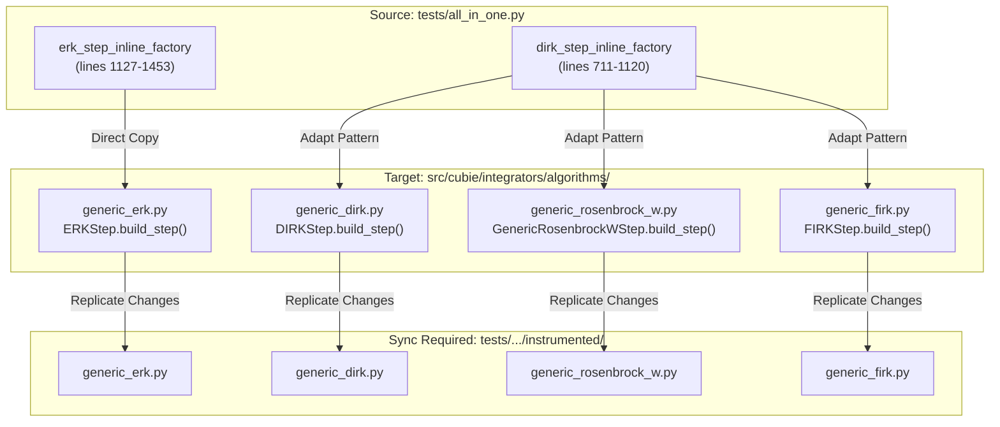
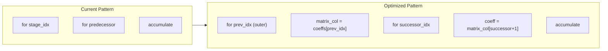
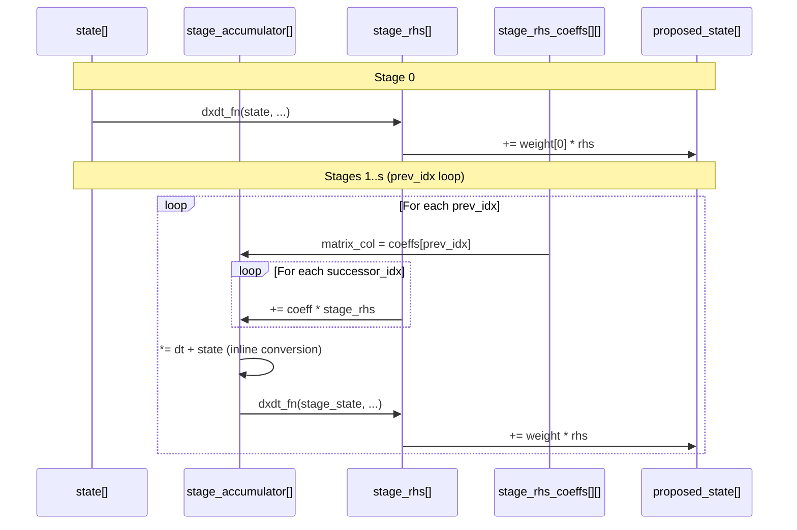

# Loop Optimization Port: Human Overview

## User Stories

### US-1: Port ERK Step Optimized Loop Indexing
**As a** developer using CuBIE  
**I want** the `generic_erk.py` module to use the optimized loop indexing from `all_in_one.py`  
**So that** the CUDA compiler can fully unroll loops and embed constants for maximum GPU performance

**Acceptance Criteria:**
- [ ] `generic_erk.py` contains the exact optimized step function from `all_in_one.py`
- [ ] Loop indexing uses `prev_idx` as outer variable with column-based coefficient access
- [ ] Stage accumulator conversion to state is performed inline
- [ ] Memory allocation patterns (shared vs local) are **unchanged** from current module
- [ ] All existing tests pass

### US-2: Port DIRK Step Optimized Loop Indexing
**As a** developer using CuBIE  
**I want** the `generic_dirk.py` module to use the optimized loop indexing pattern from `all_in_one.py`  
**So that** the CUDA compiler can better unroll the implicit stage loops

**Acceptance Criteria:**
- [ ] Loop arrangement follows optimized pattern from `all_in_one.py`
- [ ] Stage coefficient access uses row-based pattern matching DIRK structure
- [ ] Memory allocation patterns (shared vs local) are **unchanged** from current module
- [ ] All existing tests pass

### US-3: Port Rosenbrock-W Step Optimized Loop Indexing
**As a** developer using CuBIE  
**I want** the `generic_rosenbrock_w.py` module to use similar optimized loop patterns  
**So that** the CUDA compiler can better optimize the linear solver stage loops

**Acceptance Criteria:**
- [ ] Loop arrangement follows similar optimization pattern where applicable
- [ ] Stage coefficient access patterns optimized for compiler unrolling
- [ ] Memory allocation patterns are **unchanged** from current module
- [ ] All existing tests pass

### US-4: Port FIRK Step Optimized Loop Indexing
**As a** developer using CuBIE  
**I want** the `generic_firk.py` module to use similar optimized loop patterns  
**So that** the fully implicit stage loops can be better optimized by the compiler

**Acceptance Criteria:**
- [ ] Loop arrangement follows similar optimization pattern where applicable
- [ ] Stage coefficient access patterns optimized for compiler unrolling
- [ ] Memory allocation patterns are **unchanged** from current module
- [ ] All existing tests pass

---

## Overview

This task ports optimized loop indexing and arrangement patterns from the profiling/debugging file `tests/all_in_one.py` back into the main CuBIE algorithm modules. The optimization enables the CUDA/Numba compiler to fully unroll loops and embed constants, which is particularly effective for explicit Runge-Kutta methods.

## Architecture Diagram

## Key Optimization Pattern

The primary optimization in the ERK step is restructuring the inner loop iteration:

**Key Changes:**
1. **Column-based coefficient access** (ERK): `stage_rhs_coeffs[prev_idx]` enables the compiler to recognize the pattern and unroll
2. **Inverted loop nesting**: The outer loop iterates over predecessor stages, inner over successors
3. **Inline state conversion**: `stage_accumulator[base] = stage_accumulator[base] * dt_scalar + state[idx]`

## Data Flow

## Constraints

1. **Memory allocation unchanged**: Do NOT modify shared vs local memory selection - this is being handled in a separate task
2. **API compatibility**: Maintain all existing function signatures and return values
3. **Style compliance**: PEP8, 79-char lines, type hints in signatures only
4. **Instrumented copies**: Changes must be replicated to `tests/integrators/algorithms/instrumented/`

## Trade-offs Considered

| Approach | Pros | Cons |
|----------|------|------|
| Direct copy from all_in_one.py | Proven optimization, exact match | May include test-specific code |
| Manual adaptation | Cleaner integration | Risk of introducing bugs |
| **Chosen: Hybrid** | Best of both | Requires careful review |

The chosen approach directly copies the ERK step logic from `all_in_one.py` while adapting the pattern for DIRK/Rosenbrock/FIRK methods, excluding memory location selection code.

## Expected Impact

- **ERK methods**: All 7-stage loops (e.g., Dormand-Prince 5(4)) should fully unroll
- **DIRK methods**: Stage loops better structured for partial unrolling
- **Rosenbrock-W**: Linear solver stage loops optimized
- **FIRK methods**: Coupled stage loops better structured

## References

- Optimized ERK: `tests/all_in_one.py` lines 1127-1453
- Optimized DIRK: `tests/all_in_one.py` lines 711-1120
- Architecture doc: `.github/context/cubie_internal_structure.md`
