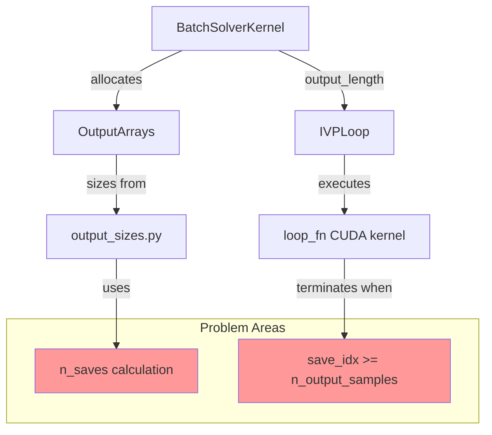
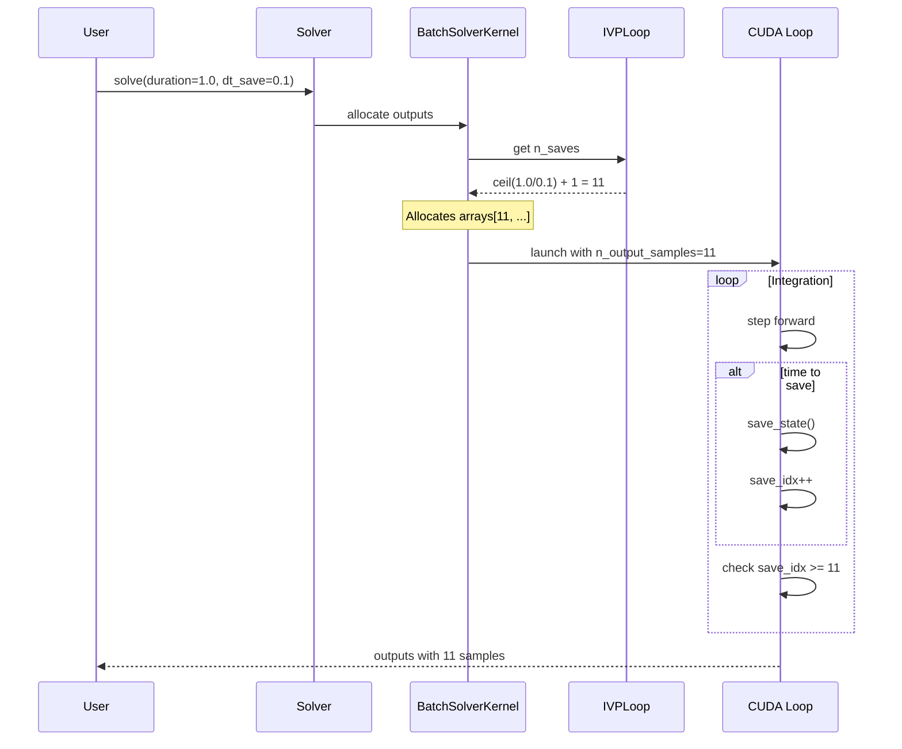

# Loop Termination and Save Counting Fix

## User Stories

### Story 1: Final State Always Saved at t_end
**As a** user performing ODE integration  
**I want** the final state at t=t_end to always be included in the output  
**So that** I can analyze the complete trajectory including the endpoint

**Acceptance Criteria:**
- Integration from t0 to t_end always produces a save at exactly t=t_end
- The last element of the time output array equals t_end (within floating-point precision)
- This behavior is consistent across fixed-step and adaptive algorithms
- Works correctly when settling_time > 0
- Works correctly when duration is an exact multiple of dt_save
- Works correctly when duration is not an exact multiple of dt_save

**Success Metrics:**
- All existing tests pass with new behavior
- New tests validate final state saving across edge cases
- No off-by-one errors in output array sizing

### Story 2: Predictable Save Count Calculation
**As a** developer using CuBIE's internal APIs  
**I want** the number of output samples to be calculated predictably and correctly  
**So that** I can allocate arrays of the correct size without buffer overruns or wasted memory

**Acceptance Criteria:**
- Number of saves calculated as `ceil(duration/dt_save) + 1`
- The +1 accounts for saving both initial state (t=t0) and final state (t=t_end)
- Calculation is consistent between output sizing functions and loop logic
- Works correctly for all combinations of duration, dt_save, and settling_time
- No floating-point rounding issues cause miscounts
- Fixed-step loops correctly allocate for all required saves

**Success Metrics:**
- Array allocation matches actual number of saves performed
- No buffer overruns in output arrays
- No premature loop termination due to undersized arrays
- Memory usage is optimal (no oversized allocations)

### Story 3: Centralized Save Count Logic
**As a** CuBIE maintainer  
**I want** save count calculation to exist in a single authoritative location  
**So that** changes are consistent and bugs don't arise from divergent implementations

**Acceptance Criteria:**
- Save count calculation exists as a method/property on IVPLoop (or ODELoopConfig)
- BatchSolverKernel.output_length delegates to the single source of truth
- output_sizes.py uses the same calculation
- Loop termination condition uses n_output_samples from the centralized calculation
- All consumers of save count derive from the same source

**Success Metrics:**
- No duplicate save count calculations in the codebase
- Changes to save logic require updates in only one location
- Code review reveals clear ownership of save count logic

## Overview

### Current Problem

The CuBIE integration loop has two related issues stemming from time precision improvements:

1. **Premature Loop Termination**: The loop exits when `save_idx >= n_output_samples`, but `n_output_samples` is calculated as `ceil(duration/dt_save)`, which doesn't account for saving the final state at t_end. This causes the loop to terminate before reaching t_end.

2. **Save Count Inconsistency**: The number of saves is calculated using `ceil(duration/dt_save)` in multiple locations (BatchSolverKernel.output_length, output_sizes.py), which:
   - Behaves unpredictably when duration is a near-integer multiple of dt_save due to floating-point rounding
   - Fails to account for the initial save at t=t0 (when settling_time=0)
   - Creates off-by-one errors in array sizing

### Proposed Solution

**Phase 1: Add +1 to Save Count Calculations**
- Modify save count to: `ceil(duration/dt_save) + 1`
- Update all locations that calculate output length
- The +1 accounts for both endpoints: t0 and t_end

**Phase 2: Centralize Save Count Logic**
- Create a method on IVPLoop (or ODELoopConfig) as the single source of truth
- Make BatchSolverKernel.output_length delegate to this method
- Ensure output_sizes.py uses the same calculation
- Update loop to use the centralized n_output_samples

**Phase 3: Handle Final State Saving**
- Ensure loop always saves state at t==t_end
- Use ceiling approach with +1 to guarantee final save
- Add explicit logic to detect final save (t >= t_end - epsilon)

### Architecture Diagrams

### Key Technical Decisions

**Decision 1: Use Ceiling + 1 Approach**
- **Rationale**: Guarantees coverage of endpoints without complex floating-point comparisons
- **Alternative Considered**: Floor-based rounding with explicit t_end check
- **Trade-off**: May produce one extra sample in rare edge cases, but ensures correctness

**Decision 2: Centralize in IVPLoop**
- **Rationale**: IVPLoop owns loop configuration and execution logic
- **Alternative Considered**: Centralize in ODELoopConfig
- **Trade-off**: IVPLoop has access to both config and runtime context

**Decision 3: Keep dt_save in User Precision**
- **Rationale**: Consistent with time precision fix architecture (intervals stay in user precision)
- **Alternative Considered**: Convert dt_save to float64
- **Trade-off**: Maintains boundary between time management (float64) and intervals (precision)

### Expected Impact

**Correctness Improvements:**
- Final state always captured at t=t_end
- No premature loop termination
- Consistent array sizing across all code paths

**Code Quality:**
- Single source of truth for save count
- Reduced code duplication
- Easier to maintain and test

**Performance:**
- Minimal: One additional save per integration (negligible)
- No change to CUDA kernel efficiency
- No additional memory allocations

### Edge Cases Addressed

1. **duration is exact multiple of dt_save**: ceil(10.0/0.1) + 1 = 101 samples (t=0.0 to t=10.0)
2. **duration is near-integer multiple**: ceil(9.999999/0.1) + 1 = 101 samples (robust to rounding)
3. **settling_time > 0**: First save at t=settling_time, last at t=settling_time+duration
4. **settling_time = 0**: First save at t=t0, last at t=t0+duration
5. **Very small dt_save**: Ceiling handles fractional saves correctly
6. **Fixed-step loops**: +1 ensures final state is saved even with step counter logic

### Integration with Existing Code

**Minimal Changes Required:**
- IVPLoop: Add n_saves property/method
- BatchSolverKernel: Update output_length to use IVPLoop calculation
- output_sizes.py: Update to use +1 in calculations
- Loop logic: Use centralized n_output_samples

**No Breaking Changes:**
- User-facing API unchanged
- Algorithms continue to work without modification
- Controllers and output functions unaffected
- Tests may need adjustment for +1 sample

### References to Time Precision Fix

This fix builds on the recent time precision improvements:
- Time variables (t, t_end, duration, settling_time) use float64
- Interval parameters (dt_save) remain in user precision
- Precision boundary enforced at IVPLoop function calls

The save counting logic must respect this architecture:
- Calculate n_saves using float64 duration divided by precision dt_save
- Use float64 for time comparisons (t >= t_end)
- Cast to user precision only when passing to device functions
