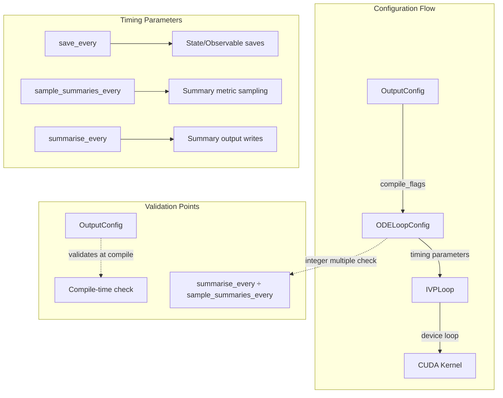

# Loop Timing Refactor: Human Overview

## User Stories

### US-1: Simplified Timing Configuration
**As a** solver user  
**I want** timing parameters that behave sensibly with default values  
**So that** I don't need to specify parameters irrelevant to my output configuration

**Acceptance Criteria:**
- When no state/observable outputs are requested, `save_every` may be None/0
- When no summaries are requested, summary timing parameters don't error
- Timing validation occurs at compile time, not configuration time
- `output_types` controls which timing parameters matter

### US-2: Decoupled Summary Sampling
**As a** researcher running large simulations  
**I want** `sample_summaries_every` independent from `save_every`  
**So that** I can sample summaries more frequently than state saves

**Acceptance Criteria:**
- `sample_summaries_every` can differ from `save_every`
- `summarise_every` must be an integer multiple of `sample_summaries_every`
- If slightly off (within 1%), `summarise_every` is auto-adjusted with warning
- Clear error message when truly incompatible values are provided

### US-3: Flexible Save/Summarise Combinations
**As a** user running long simulations  
**I want** to combine regular saves with end-of-run saves  
**So that** I can save periodically AND capture final state for restarts

**Acceptance Criteria:**
- `save_last` and `save_every` are NOT mutually exclusive
- `summarise_last` and `summarise_every` are NOT mutually exclusive
- Tests validate these can be used together
- Validation logic reflects this flexibility

### US-4: End-of-Run Summarise Logic
**As a** user with `summarise_last=True`  
**I want** summaries collected at simulation end  
**So that** I can get summary statistics without periodic collection

**Acceptance Criteria:**
- `summarise_last` flag causes summary output at final timestep
- Implementation mirrors existing `save_last` pattern in ode_loop.py
- Works correctly with both adaptive and fixed-step controllers

### US-5: Updated CPU Reference Implementation
**As a** test developer  
**I want** the CPU reference to use the new timing parameter names  
**So that** reference tests validate the refactored timing behavior

**Acceptance Criteria:**
- CPU reference uses `save_every`, `summarise_every`, `sample_summaries_every`
- No remaining references to `dt_save`, `dt_summarise` in CPU reference
- Summary generation handles `sample_summaries_every` correctly

---

## Architecture Overview



## Key Technical Decisions

### Decision 1: Remove Sentinel Values
**Rationale:** The current use of sentinel values (0.1, 1.0, 0.1) when all timing parameters are None is confusing. Instead:
- Timing validation should be deferred to compile-time
- OutputCompileFlags determines which timing parameters are relevant
- If outputs requiring saves aren't enabled, save timing doesn't matter

### Decision 2: Replace selp with min for dt_eff
**Rationale:** CUDA hardware has fast-path instructions for min/max operations. Using `min(next_save, next_update_summary)` instead of `selp(next_save < next_update_summary, ...)` improves warp efficiency.

### Decision 3: Remove Aliases in ode_loop.py
**Rationale:** The current pattern:
```python
dt_save = precision(config.save_every)
dt_update_summaries = precision(config.sample_summaries_every)
```
Creates unnecessary indirection. Using `config.save_every` directly in the device code improves readability.

### Decision 4: Tolerant Integer Multiple Validation
**Rationale:** Float precision issues can cause (0.001, 0.5) to appear slightly off from integer multiples. The new approach:
1. If within 1%: auto-adjust `summarise_every` and warn
2. If adjusted: warn with actual computed value
3. If floating-point rounding issue: warn with actual behavior
4. If incompatible (e.g., 0.2, 0.5): clear error with explanation

### Decision 5: Output-Aware Default Timing
**Rationale:** Default timing values make sense only when outputs require them:
- `save_every=None` is valid if no state/observables/time requested
- Summary timing parameters can be None if no summaries requested
- Validation at compile-time based on `compile_flags`

---

## Data Flow for Summary Timing

```mermaid
sequenceDiagram
    participant Config as ODELoopConfig
    participant Loop as IVPLoop.build()
    participant Device as CUDA Device Code

    Config->>Loop: save_every, sample_summaries_every, summarise_every
    Loop->>Loop: samples_per_summary = summarise_every / sample_summaries_every
    Loop->>Device: Compile with timing constants
    
    Note over Device: Integration Loop
    Device->>Device: t_prec + dt_raw >= next_update_summary?
    Device->>Device: update_summaries() called
    Device->>Device: update_idx++
    Device->>Device: if update_idx % samples_per_summary == 0
    Device->>Device: save_summaries() called
```

---

## Impact on Existing Architecture

### Files Changed
| File | Change Type | Description |
|------|-------------|-------------|
| `ode_loop.py` | Logic | Add min(), remove aliases, implement summarise_last |
| `ode_loop_config.py` | Validation | Remove sentinels, tolerant validation |
| `output_config.py` | Defaults | Allow None/0 defaults, compile-time validation |
| `test_config_plumbing.py` | Tests | Add sample_summaries_every checks |
| `test_solveresult.py` | Tests | Consolidate field tests |
| `test_dt_update_summaries_validation.py` | Tests | Adapt after sentinel removal |
| `loops.py` (CPU ref) | Refactor | Update timing parameter names |
| `conftest.py` | Fixtures | Add sample_summaries_every to defaults |

### Breaking Changes
- Sentinel value behavior removed (may change behavior for users relying on defaults)
- Some validation errors may move to compile-time

---

## Trade-offs Considered

### Alternative: Keep Sentinel Values
**Rejected because:** Creates confusion about actual timing behavior. Users seeing `save_every=0.1` when they didn't set it leads to bugs.

### Alternative: Strict Integer Multiple Validation
**Rejected because:** Floating-point precision issues make this overly punitive. Auto-adjustment with warnings is more user-friendly.

### Alternative: Require All Timing Parameters
**Rejected because:** Unnecessary burden when outputs don't need timing (e.g., summaries-only run).

---

## References

- PR #279: Base branch with partial refactor
- PR #454: This completion branch
- Review comments on PR #279: Specific feedback addressed
