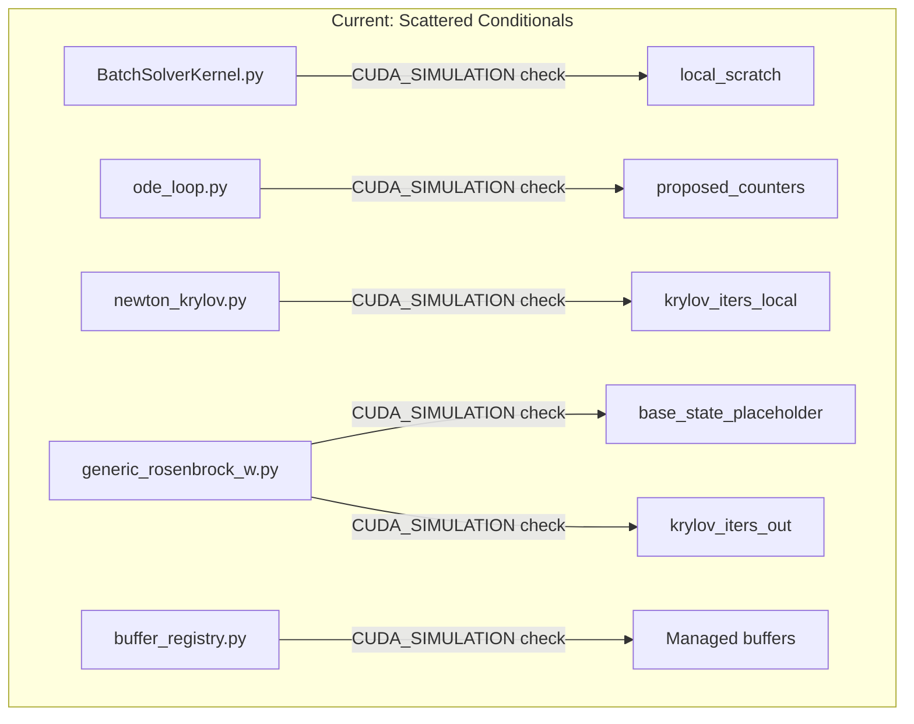
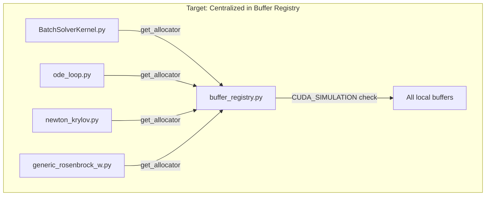
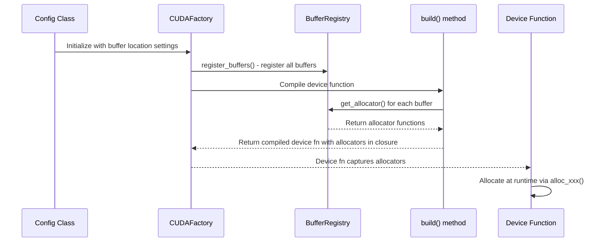

# Managed Buffer Refactor: Human Overview

## User Stories

### US-1: Unified CUDASIM Compatibility
**As a** developer working in CUDASIM mode (CPU-only development)  
**I want** `cuda.local.array` calls to work transparently without compile-time conditionals scattered throughout the codebase  
**So that** I can develop and test on machines without NVIDIA GPUs without encountering AttributeError exceptions

**Acceptance Criteria:**
- All `cuda.local.array` calls in production code work correctly in both CUDA and CUDASIM modes
- The CUDA/CUDASIM compatibility logic exists in a single location (buffer_registry.py)
- No compile-time conditionals (`if CUDA_SIMULATION:`) for local array allocation in any file except buffer_registry.py

### US-2: Consistent Buffer Management Pattern
**As a** maintainer of the CuBIE codebase  
**I want** all thread-local buffers to use the centralized buffer registry system  
**So that** buffer management is consistent, predictable, and follows a single pattern across the entire codebase

**Acceptance Criteria:**
- All local buffers are registered via `buffer_registry.register()` with `default: 'local'` location
- All local buffer allocations use allocators obtained via `buffer_registry.get_allocator()`
- Buffer location can be changed to 'shared' if needed via configuration

### US-3: Maintainable Code Architecture
**As a** future contributor to CuBIE  
**I want** a clear and consistent pattern for allocating thread-local scratch buffers  
**So that** I can easily understand and extend the buffer management system

**Acceptance Criteria:**
- Documentation and code patterns are consistent
- New buffers can be added by following the existing registration pattern
- The refactored code is no more complex than before, preferably simpler

---

## Executive Summary

This refactor consolidates CUDASIM compatibility for `cuda.local.array` into a single location by migrating all hard-coded local array allocations to the managed buffer system. Currently, compile-time conditionals (`if CUDA_SIMULATION:`) are scattered across 4 files to handle the AttributeError that occurs when `cuda.local.array` is called in CUDASIM mode. The solution is to route all local array allocations through the buffer registry, which already has the CUDASIM handling in place.

## Current Architecture

## Files to Modify

| File | Buffer(s) | Current Pattern | Target Pattern |
|------|-----------|-----------------|----------------|
| `BatchSolverKernel.py` | `local_scratch` | inline CUDA_SIMULATION conditional | register + allocator |
| `ode_loop.py` | `proposed_counters` | inline CUDA_SIMULATION conditional | register + allocator |
| `newton_krylov.py` | `krylov_iters_local` | inline CUDA_SIMULATION conditional | register + allocator |
| `generic_rosenbrock_w.py` | `base_state_placeholder`, `krylov_iters_out` | inline CUDA_SIMULATION conditional | register + allocator |

## Key Technical Decisions

### 1. Buffer Location Defaults
All new managed buffers will default to `location='local'` to preserve existing behavior. The buffer registry already handles CUDASIM compatibility for local buffers in `CUDABuffer.build_allocator()`.

### 2. Integer Buffers
Some buffers (e.g., `proposed_counters`, `krylov_iters_local`) are `int32` rather than floating-point. The buffer registry currently uses `precision` for dtype. These small integer buffers will be registered with `precision=np.int32` which requires ensuring the registry's precision validator accepts integer types.

### 3. Non-Factory Contexts
`BatchSolverKernel.build_kernel()` creates the integration kernel inline rather than through a CUDAFactory subclass. The `local_scratch` buffer will need a different registration approach - either:
- Register on the `BatchSolverKernel` instance before kernel compilation
- Pass allocator through from `SingleIntegratorRun`

The preferred approach is to pass through from `SingleIntegratorRun` since it already manages buffer sizing.

### 4. Small Fixed-Size Buffers
Buffers like `proposed_counters` (size 2) and `krylov_iters_local` (size 1) are very small. They will still benefit from the managed pattern for consistency, even though memory savings are negligible.

## Data Flow

## Trade-offs Considered

| Approach | Pros | Cons |
|----------|------|------|
| **Managed buffers (chosen)** | Single source of truth, consistent pattern, configurable locations | Slight complexity for very small buffers |
| **Keep scattered conditionals** | No changes needed | Scattered logic, hard to maintain, violates DRY |
| **Custom local array wrapper** | Simple drop-in replacement | Another abstraction layer, doesn't integrate with buffer registry |

## Expected Impact

- **Reduced code duplication**: Remove 5 instances of CUDA_SIMULATION conditionals
- **Improved maintainability**: Single location for CUDASIM compatibility
- **Consistent patterns**: All buffers follow the same registration pattern
- **Future flexibility**: Buffers can be relocated to shared memory if beneficial
