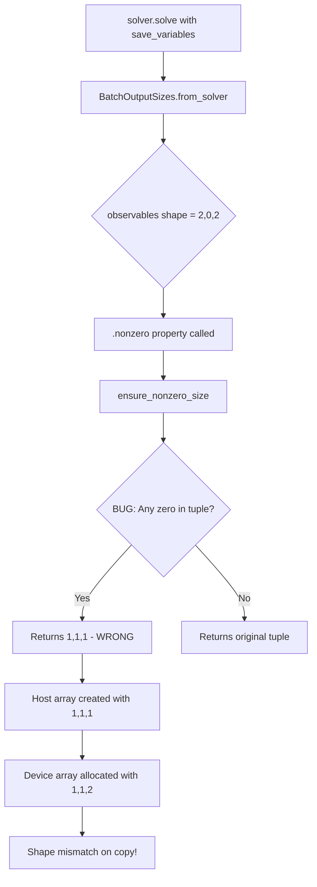
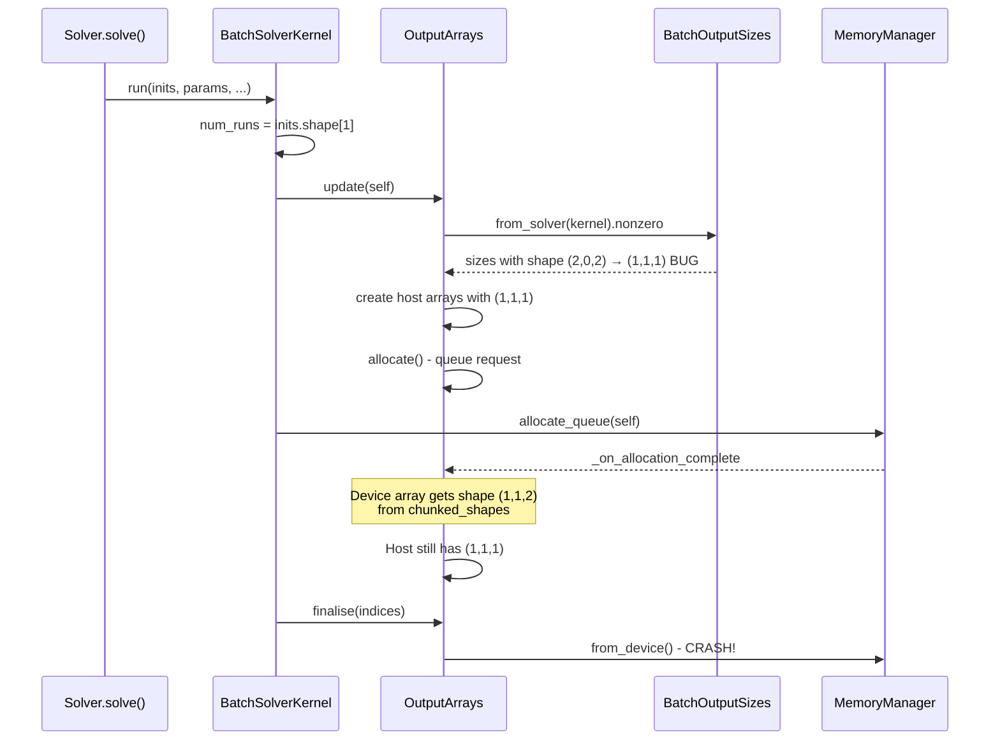

# Memory Refactor Cleanup - Human Overview

## User Stories

### US1: As a developer, I want tests to pass after the memory manager refactor
**Acceptance Criteria:**
- All tests in `tests/memory/test_memmgmt.py` that test valid functionality pass
- Tests for removed functionality are removed or updated to match new APIs
- No collection errors due to invalid test parameters

### US2: As a user, I want solver runs to work correctly when using `save_variables` subset
**Acceptance Criteria:**
- Running `solver.solve()` with `save_variables=['x0']` (subset of states) completes without shape mismatch errors
- Host and device arrays have matching shapes for all output arrays
- The `ensure_nonzero_size` function preserves non-zero dimensions in tuples

### US3: As a maintainer, I want the refactored code to be clean and consistent
**Acceptance Criteria:**
- No duplicate logic or sources of truth for chunking calculations
- Centralized chunking responsibility in memory manager
- Clean separation of concerns between memory manager and array managers

---

## Overview

### Executive Summary

The user has refactored the memory manager to:
1. Remove "single" allocations and "instance" mode
2. Move calculation of chunked shapes/slices into the memory manager
3. Remove many shared-responsibility functions

This cleanup task addresses:
1. **Test failures** from tests that reference removed functions
2. **Shape mismatch bug** in `ensure_nonzero_size` that corrupts array dimensions
3. **Integration rough edges** that may have been missed in the refactor

### Root Cause Analysis

### Data Flow - Array Shape Propagation

### Key Technical Decisions

1. **Fix `ensure_nonzero_size`**: Replace only zero elements, not entire tuple
   - Current: `(2, 0, 2)` → `(1, 1, 1)`  
   - Fixed: `(2, 0, 2)` → `(2, 1, 2)`

2. **Remove obsolete tests**: Delete tests that reference removed methods:
   - `single_request`
   - `get_chunks` 
   - `get_available_single`
   - `get_available_group`
   - `chunk_arrays`
   - `get_chunkable_request_size`
   - `get_total_request_size`
   - `limit_type` parameter

3. **Update remaining tests**: Fix tests that use old method signatures:
   - `compute_chunked_shapes` now takes `chunk_size` instead of `num_chunks`

### Trade-offs Considered

| Approach | Pros | Cons | Decision |
|----------|------|------|----------|
| Fix `ensure_nonzero_size` | Minimal change, fixes root cause | Might affect other code paths | **Selected** |
| Change host array creation timing | Aligns with allocation flow | Large refactor, complex | Rejected |
| Skip zero-dimension arrays | Avoids allocation issues | Loses data, changes behavior | Rejected |

### Expected Impact

- **Test suite**: 15-20 tests to remove/update in `test_memmgmt.py`
- **Bug fix**: 1-line change in `ensure_nonzero_size`
- **Risk**: Low - changes are isolated and well-tested

### References

- User's refactor removed: "single" mode, "instance" mode, `get_chunks`, `single_request`, `chunk_arrays`, etc.
- Memory manager now centralizes chunking via `allocate_queue` and `get_chunk_parameters`
- ArrayResponse includes `chunked_shapes` and `chunked_slices` for array managers
