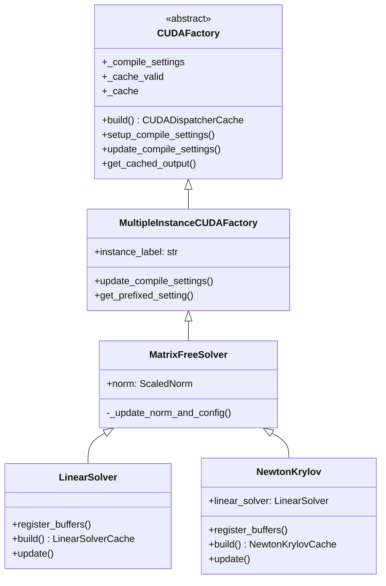
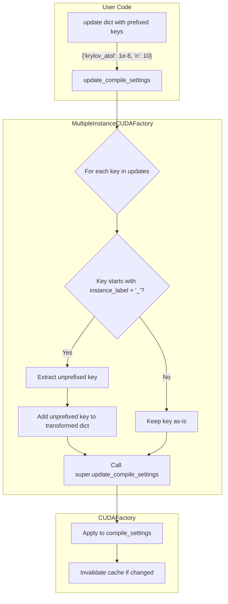

# MultipleInstanceCUDAFactory Refactor Overview

## User Stories

### User Story 1: Centralized Prefix Management for Multi-Instance Factories
**As a** CuBIE developer building matrix-free solvers or norms,
**I want** a base class that automatically handles prefixed configuration keys,
**So that** I can define generic config fields (like `atol`, `max_iters`) without manually stripping prefixes or risking collisions with other components.

**Acceptance Criteria:**
- [ ] A `MultipleInstanceCUDAFactory` base class exists that accepts an `instance_label` parameter
- [ ] The class intercepts `update_compile_settings()` to map prefixed keys (e.g., `krylov_atol`) to unprefixed keys (e.g., `atol`)
- [ ] Subclasses can define generic field names without worrying about namespace collisions
- [ ] The transformation is transparent to the compile settings container

### User Story 2: Simplified Solver Implementation
**As a** CuBIE developer maintaining the LinearSolver and NewtonKrylov classes,
**I want** shared prefix-handling logic in a base class,
**So that** I can remove duplicated boilerplate code and reduce maintenance burden.

**Acceptance Criteria:**
- [ ] `MatrixFreeSolver` inherits from `MultipleInstanceCUDAFactory`
- [ ] Boilerplate prefix-stripping code is removed from `MatrixFreeSolver`, `LinearSolver`, and `NewtonKrylov`
- [ ] The `settings_prefix` attribute is replaced with `instance_label`
- [ ] Existing solver behavior is preserved

### User Story 3: Convenient Prefixed Settings Access
**As a** CuBIE developer using multi-instance factories,
**I want** convenience methods to access prefixed compile settings,
**So that** I can easily read and work with instance-specific configuration values.

**Acceptance Criteria:**
- [ ] A method or property provides easy access to prefixed setting values
- [ ] The convenience API is consistent and intuitive
- [ ] Documentation explains the prefixing mechanism

### User Story 4: Test Coverage with Real Objects
**As a** CuBIE maintainer,
**I want** tests for `MultipleInstanceCUDAFactory` that use real fixtures instead of mocks,
**So that** the tests remain maintainable and accurately reflect production behavior.

**Acceptance Criteria:**
- [ ] Tests are added to `test_CUDAFactory.py`
- [ ] Tests use real `LinearSolver` or similar objects, not mocks
- [ ] Prefix mapping behavior is verified
- [ ] Edge cases (unrecognized keys, partial matches) are tested

---

## Executive Summary

This refactor introduces `MultipleInstanceCUDAFactory`, a new base class that centralizes the pattern of handling prefixed configuration keys for CUDAFactory subclasses that may have multiple instances with distinct configurations. Currently, `MatrixFreeSolver` and its subclasses (`LinearSolver`, `NewtonKrylov`) manually handle prefix stripping in their `update()` methods. This creates duplicated logic and potential for inconsistency.

The new base class will:
1. Accept an `instance_label` parameter (replacing the confusing `settings_prefix` name)
2. Intercept `update_compile_settings()` to automatically map prefixed keys
3. Provide convenience methods for accessing prefixed settings
4. Enable subclasses to focus on their core compilation logic

---

## Architecture Diagram

---

## Data Flow Diagram

---

## Key Technical Decisions

### 1. Naming: `instance_label` vs `settings_prefix`
- **Decision**: Rename `settings_prefix` to `instance_label`
- **Rationale**: The term "settings_prefix" is confusing because it's actually used as a prefix for external update keys, not internal settings. "instance_label" better describes its purpose: labeling which instance a setting belongs to.

### 2. Prefix Transformation Location
- **Decision**: Override `update_compile_settings()` in `MultipleInstanceCUDAFactory`
- **Rationale**: This is the natural interception point where external updates enter the compile settings system. Transforming here ensures all downstream code sees unprefixed keys.

### 3. Copy-Before-Transform Pattern
- **Decision**: Make a copy of the updates dict before transformation
- **Rationale**: Prevents side effects on the caller's dict and allows both prefixed and unprefixed keys to coexist (prefixed takes precedence).

### 4. Testing Strategy
- **Decision**: Use real `LinearSolver` instances in tests, not mocks
- **Rationale**: Per repository guidelines, fixtures with real objects are strongly preferred for maintainability. The solver classes are already well-tested, so using them as test subjects is appropriate.

---

## Trade-offs Considered

| Approach | Pros | Cons | Decision |
|----------|------|------|----------|
| Override `update_compile_settings` | Clean interception, minimal changes to subclasses | Adds complexity to base class | **Chosen** |
| Transform in each subclass's `update()` | No base class changes | Duplicated code, current state | Rejected |
| Use a decorator pattern | Flexible, composable | More complex, unfamiliar pattern | Rejected |

---

## Expected Impact on Architecture

1. **CUDAFactory.py**: Adds ~40-60 lines for the new `MultipleInstanceCUDAFactory` class
2. **base_solver.py**: `MatrixFreeSolver` will inherit from `MultipleInstanceCUDAFactory` instead of `CUDAFactory`; `_extract_prefixed_tolerance` method can be simplified or removed
3. **linear_solver.py**: Remove prefix-handling boilerplate from `update()` method
4. **newton_krylov.py**: Remove prefix-handling boilerplate from `update()` method
5. **test_CUDAFactory.py**: Add ~30-50 lines of new tests using real solver fixtures

---

## References

- Current `MatrixFreeSolver` implementation in `src/cubie/integrators/matrix_free_solvers/base_solver.py`
- CUDAFactory pattern documented in `.github/context/cubie_internal_structure.md`
- Existing test patterns in `tests/test_CUDAFactory.py`
