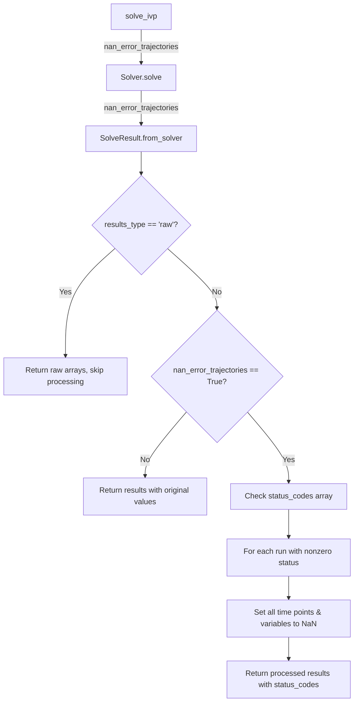
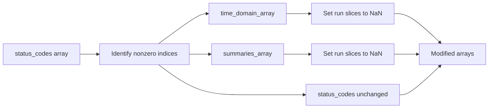

# Feature: Null Out Results with Nonzero Status Returns

## User Stories

### User Story 1: Protect Against Invalid Data
**As a** researcher using CuBIE for batch ODE integration  
**I want** trajectories with solver errors to be automatically marked as invalid  
**So that** I can easily identify and exclude failed runs from my analysis without manually checking status codes

**Acceptance Criteria:**
- When a solver returns a nonzero status code for a run, all output values for that run are set to NaN
- This applies to both time-domain arrays (state, observables) and summary arrays
- The status codes themselves remain accessible for debugging
- The behavior can be controlled via a parameter
- The 'raw' results type bypasses this processing entirely

### User Story 2: Default Safe Behavior
**As a** new CuBIE user  
**I want** invalid data to be automatically nulled out by default  
**So that** I don't accidentally analyze corrupted results from failed solver runs

**Acceptance Criteria:**
- The `nan_error_trajectories` parameter defaults to `True`
- Users can opt-out by explicitly setting `nan_error_trajectories=False`
- Documentation clearly explains this behavior

### User Story 3: Access to Status Information
**As a** CuBIE power user debugging solver failures  
**I want** to access the status codes even when using nan_error_trajectories  
**So that** I can understand why specific runs failed

**Acceptance Criteria:**
- Status codes are included in SolveResult when results_type != 'raw'
- Status codes remain unmodified (not set to NaN)
- The status_codes array shape is (n_runs,) with dtype int32

## Overview

This feature enhances data quality control by automatically marking invalid solver outputs with NaN values. When a solver run encounters an error (indicated by a nonzero status code), the entire trajectory for that run becomes NaN-filled, making it trivial to filter out failed runs in downstream analysis.

### Current Architecture Context

CuBIE's solver pipeline:
1. `solve_ivp()` → convenience wrapper
2. `Solver.solve()` → orchestrates grid building and kernel execution
3. `BatchSolverKernel.run()` → executes CUDA kernel
4. `SolveResult.from_solver()` → packages results

Status codes are already tracked:
- Generated by the integration loop (per-run, shape: `(n_runs,)`)
- Stored in `BatchSolverKernel.status_codes` (via `OutputArrays.status_codes`)
- Available as host arrays after kernel execution
- dtype: `int32`, value: 0 for success, nonzero for various errors

### Proposed Solution

Add `nan_error_trajectories` parameter that flows through:
```
solve_ivp(nan_error_trajectories=True)
  ↓
Solver.solve(nan_error_trajectories=True)
  ↓
SolveResult.from_solver(solver, nan_error_trajectories=True)
  ↓
[NaN processing logic]
```

#### Data Flow Diagram



#### Processing Logic



### Key Technical Decisions

**1. Where to Implement:**
- In `SolveResult.from_solver()` after arrays are assembled but before returning
- This centralizes the logic and keeps it close to result packaging

**2. Default Value:**
- `True` - protects users from invalid data by default
- Power users can disable if they want raw values for debugging

**3. Status Code Handling:**
- Always include status_codes in non-raw results
- Status codes themselves are never modified (remain int32 with original values)

**4. Array Dimension Handling:**
- Use `stride_order.index("run")` to find the run dimension
- Use `slice_variable_dimension()` helper for proper indexing
- Support any stride order configuration

**5. Performance Consideration:**
- NaN assignment is a simple NumPy operation on host arrays
- Minimal overhead compared to GPU kernel execution
- Only processes runs with errors (typically a small fraction)

### Integration Points

1. **solve_ivp()** in `solver.py`:
   - Add `nan_error_trajectories` parameter with default `True`
   - Forward to `Solver.solve()`

2. **Solver.solve()** in `solver.py`:
   - Add `nan_error_trajectories` parameter
   - Forward to `SolveResult.from_solver()`

3. **SolveResult.from_solver()** in `solveresult.py`:
   - Add `nan_error_trajectories` parameter
   - Add status_codes to result when not 'raw'
   - Implement NaN-setting logic for nonzero status runs

4. **SolveResult class** in `solveresult.py`:
   - Add `status_codes` attribute to attrs definition
   - Update properties to expose status_codes

### Trade-offs and Alternatives Considered

**Alternative 1: Process in BatchSolverKernel**
- Rejected: Would require device-side processing, adding complexity
- Current approach does processing on host after transfer

**Alternative 2: Default to False**
- Rejected: Prioritizes safety over convenience for power users
- Default True protects beginners while experts can easily disable

**Alternative 3: Separate status_codes from SolveResult**
- Rejected: Status codes are integral to understanding results
- Including them in SolveResult provides complete information

**Alternative 4: Remove invalid runs entirely**
- Rejected: Would break array indexing and run correspondence
- NaN values preserve structure while clearly marking failures

### Expected Impact on Existing Architecture

**Minimal Breaking Changes:**
- Existing code without `nan_error_trajectories` will get new default behavior (True)
- This is intentional - improves data quality by default
- Users relying on receiving invalid data can explicitly set to False

**No Changes Required To:**
- CUDA kernel compilation or execution
- Memory management or array allocation
- Status code generation or tracking
- Output array structure or shapes

**New Capabilities:**
- Automatic data quality filtering
- Status code accessibility in standard results
- Clear indication of solver failures through NaN markers

### Research Findings

1. **Status Code Infrastructure:** Already complete
   - Tracked in `OutputArrayContainer.status_codes` (shape: `(n_runs,)`, dtype: int32)
   - Generated by integration loop per run
   - Available via `solver.status_codes` property

2. **Array Slicing Utilities:** Available in `_utils.py`
   - `slice_variable_dimension()` handles arbitrary stride orders
   - Can create slices for any dimension configuration

3. **Result Type System:** Well-defined in `SolveResult.from_solver()`
   - 'raw' returns dict of bare arrays
   - Other types return processed SolveResult or derived dicts
   - Clear place to insert NaN-processing logic

4. **Stride Order Flexibility:**
   - System supports configurable stride orders
   - Run dimension index found via `stride_order.index("run")`
   - Implementation must respect any valid ordering

## Next Steps

This plan will be used by the `detailed_implementer` agent to create function-level implementation tasks, which will then be executed by the `taskmaster` agent.
