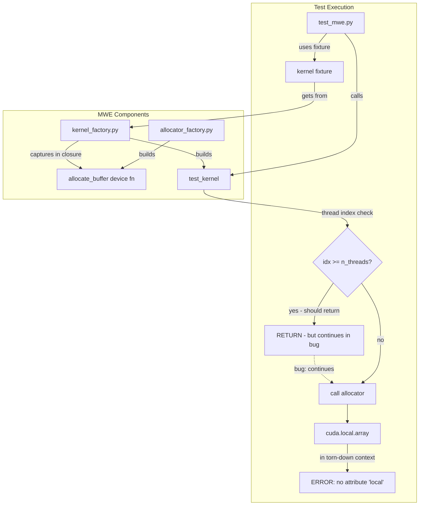
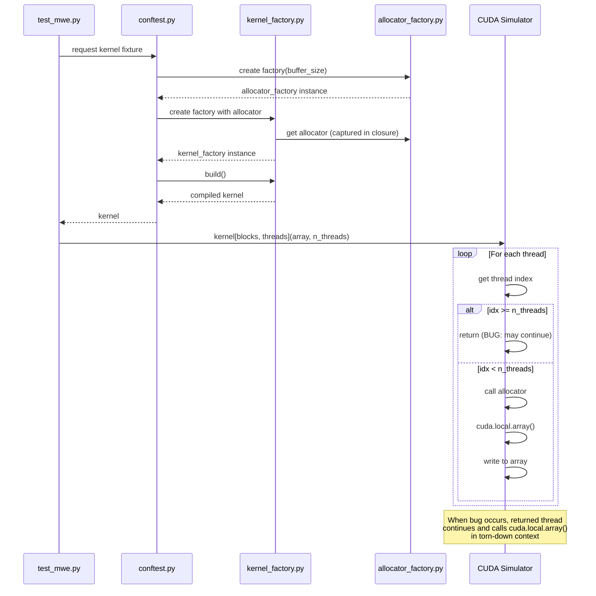

# Numba CUDASIM Bug MWE - Human Overview

## User Stories

### US-1: Create Minimal Working Example for Numba Bug Report
**As a** CuBIE developer  
**I want** a standalone minimal working example (MWE) that demonstrates the CUDASIM flaky test bug  
**So that** I can submit it to the Numba project to help them understand and fix the issue  

**Acceptance Criteria:**
- [ ] MWE runs independently without CuBIE source dependencies
- [ ] MWE demonstrates the `'module numba.cuda has no attribute local'` error
- [ ] MWE is placed in `tests/numba_mwe/` directory
- [ ] MWE follows CuBIE testing conventions (fixtures, no mocks)
- [ ] Running tests multiple times triggers the flaky error

### US-2: Replicate CuBIE's Buffer Allocation Pattern
**As a** Numba bug reporter  
**I want** the MWE to accurately replicate CuBIE's buffer allocation pattern  
**So that** Numba developers can reproduce the exact conditions causing the bug  

**Acceptance Criteria:**
- [ ] Allocator factory returns a device function using `cuda.local.array`
- [ ] Allocator is captured in a closure during kernel factory build
- [ ] Uses `@cuda.jit(device=True, inline=True)` decorator pattern
- [ ] Kernel follows early-return pattern for excess threads

---

## Overview

### Executive Summary

This plan creates a Minimal Working Example (MWE) to demonstrate a flaky bug in Numba's CUDA simulator mode. The bug manifests when threads that should have returned early (due to being outside the requested thread count) continue executing and attempt to call `cuda.local.array()`, which fails because the simulator context has been torn down.

The MWE replicates CuBIE's pattern of:
1. A factory that builds an allocator device function using `cuda.local.array`
2. The allocator being captured in a closure during kernel build
3. Threads that exceed the work count returning early before allocation
4. The flaky error appearing when early-return doesn't work correctly

### Architecture Diagram

### Data Flow

### Key Technical Decisions

1. **Self-contained MWE**: No imports from cubie source code to make the MWE easily shareable with Numba developers

2. **Fixture pattern**: Uses pytest fixtures following CuBIE conventions to demonstrate the issue occurs with standard testing patterns

3. **Multiple tests**: 10-20 similar tests to increase probability of triggering the race condition

4. **Function-scope fixtures**: All fixtures are function-scoped to ensure fresh instances and maximize chance of reproducing

5. **Simple verification**: Each test verifies that the first m elements of an n-element array become 1, keeping assertions simple

### Trade-offs Considered

| Decision | Alternative | Rationale |
|----------|-------------|-----------|
| Function-scoped fixtures | Session-scoped | Flaky bug appears more often with fresh fixture instances |
| 10-20 tests | Fewer tests | More tests increase probability of triggering race condition |
| Simple array verification | Complex assertions | Focus is on reproducing bug, not testing logic |
| Local array always | Shared/persistent options | Bug specifically affects cuda.local.array |

### Expected Impact

This MWE will:
- Provide Numba developers with a reproducible test case
- Help identify whether the issue is in thread teardown, early return handling, or context management
- Enable CuBIE team to track upstream fix progress

### References

- Issue #418: Tests: flaky tests in buffer allocation
- Issue #417: Compat: Py3.10 compatibility broken (closed as not_planned, actually same bug)
- Error pattern: `tid=[0, N, 0]` where N is one above max run index
- Observation: Early-exit threads continue executing past return statement
