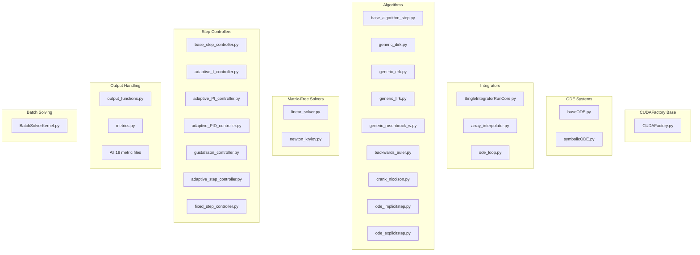

# Import Optimization for CUDAFactory Subclasses

## User Stories

### User Story 1: Faster Compilation Time for Developers
**As a** CuBIE developer,  
**I want** the CUDA kernel compilation to be faster,  
**So that** I can iterate on code changes more quickly during development.

**Acceptance Criteria:**
- All CUDAFactory subclass files use explicit imports instead of whole-module imports
- No functional regression in any existing tests
- Documentation of the rationale for explicit imports added to developer guidelines

### User Story 2: Smaller Captured Scope for Device Functions
**As a** user running batch ODE/SDE integrations,  
**I want** the Numba JIT compilation to process fewer symbols,  
**So that** the first-time compilation overhead is reduced.

**Acceptance Criteria:**
- All `import numpy as np` statements in CUDAFactory subclass files are converted to explicit imports (e.g., `from numpy import float32, float64`)
- All other whole-module imports (e.g., `import attrs`, `import numba`) are converted to explicit imports where they are used within `build()` methods or device function closures
- The captured scope of device functions only includes the specific symbols needed

### User Story 3: Maintainable Import Convention
**As a** future contributor to CuBIE,  
**I want** a clear, documented convention for imports in CUDAFactory-related files,  
**So that** new code follows best practices for minimizing compilation time.

**Acceptance Criteria:**
- Copilot instructions updated with import guidelines for CUDAFactory files
- Clear documentation explaining why explicit imports matter for Numba CUDA compilation

---

## Executive Summary

This optimization addresses long CUDA kernel compilation times by converting whole-module imports to explicit imports in all CUDAFactory subclass files. When Numba JIT-compiles a CUDA device function, it captures the closure scope including all module-level symbols. By using explicit imports (e.g., `from numpy import float32, float64` instead of `import numpy as np`), we reduce the number of symbols in the captured scope, potentially reducing the time Numba spends analyzing and processing these symbols during compilation.

## Architecture Overview

### Current Import Pattern
```python
# Whole-module imports capture entire numpy namespace
import numpy as np
import attrs
import numba

@cuda.jit(device=True)
def device_function(...):
    # Only uses np.float32, but np.* is in scope
    value = np.float32(x)
```

### Proposed Import Pattern
```python
# Explicit imports minimize captured scope
from numpy import float32, float64, zeros
from attrs import define, field

@cuda.jit(device=True)
def device_function(...):
    # Only float32 is captured, not entire numpy namespace
    value = float32(x)
```

## Scope of Changes

### Files Requiring Modification



### Impact Summary

| Component Category | File Count | Primary Imports to Convert |
|-------------------|-----------|---------------------------|
| CUDAFactory Base | 1 | numpy, attrs, numba |
| ODE Systems | 2 | numpy, attrs |
| Integrators Core | 3 | numpy, attrs, numba |
| Algorithm Steps | 9 | numpy, attrs, numba |
| Matrix-Free Solvers | 2 | numpy, attrs, numba |
| Step Controllers | 7 | numpy, attrs, numba |
| Output Handling | 19+ | numpy, attrs |
| Batch Solving | 1 | numpy, attrs, numba |
| **Total** | **44+** | |

## Technical Rationale

### How Numba Captures Scope

When Numba JIT-compiles a function decorated with `@cuda.jit`, it inspects the function's closure to identify all referenced symbols. This includes:

1. **Free variables** - Variables from enclosing scopes
2. **Global references** - Module-level names referenced in the function
3. **Captured closures** - Any nested functions and their scopes

When using `import numpy as np`, the entire `np` namespace object is included in the captured scope. This means Numba must analyze all attributes of the numpy module to determine which ones are actually used.

### Why Explicit Imports Help

With explicit imports like `from numpy import float32, float64`:
- Only the specifically imported symbols are in the module's global namespace
- Numba can resolve these symbols directly without traversing the full numpy module
- The captured scope is smaller and more precise

### Verification Approach

Before implementing changes:
1. Measure baseline compilation time for a representative test case
2. Implement changes in one file as a proof of concept
3. Re-measure compilation time
4. If improvement is verified, proceed with full implementation

## Trade-offs Considered

### Explicit Imports (Recommended)
**Pros:**
- Potentially faster Numba compilation
- Clearer dependency documentation in code
- Easier to identify unused imports
- Smaller captured closure scope

**Cons:**
- More verbose import statements
- Need to add new imports when using additional symbols
- May need to update multiple lines when refactoring

### Alternative: `__all__` Restrictions
**Pros:**
- Less invasive change
- Works at module level

**Cons:**
- Doesn't help with third-party modules (numpy, numba)
- Requires modifying every module in the package

### Decision
Proceed with explicit imports as they provide the clearest benefit for Numba scope capture and align with Python best practices for explicit dependencies.

## References

- [Numba CUDA Python Documentation](https://numba.readthedocs.io/en/stable/cuda/)
- [Python Import System](https://docs.python.org/3/reference/import.html)
- CuBIE Internal Structure: `.github/context/cubie_internal_structure.md`
