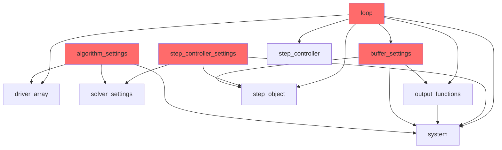
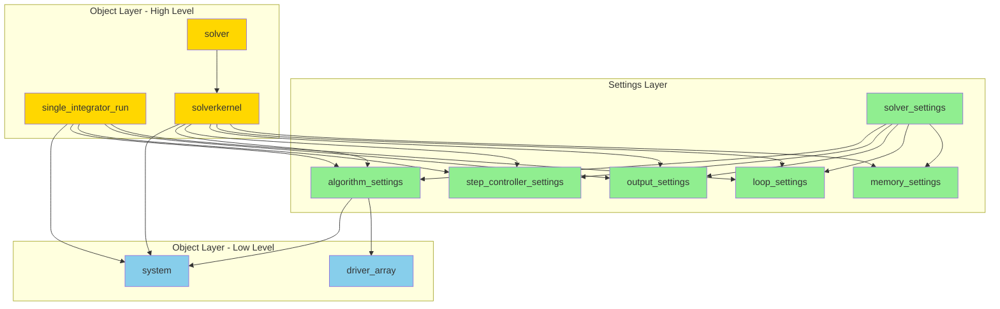

# Test Fixture Optimization - Human Overview

## User Stories

### Story 1: Test Suite Performance Optimization
**As a** developer running the CuBIE test suite  
**I want** tests to execute quickly  
**So that** I can iterate rapidly during development and CI runs complete in reasonable time

**Acceptance Criteria:**
- Fixtures only instantiate CUDAFactory-based objects once per required configuration
- Each fixture requests at most one CUDAFactory-based fixture
- Settings are extracted from solver_settings dict, not from built objects
- When multiple built objects are needed, fixtures request the lowest-level fixture containing them all

### Story 2: Maintainable Test Fixtures
**As a** developer maintaining test fixtures  
**I want** clear fixture dependency chains  
**So that** I can understand and modify fixtures without causing cascading rebuilds

**Acceptance Criteria:**
- Fixture dependency graph is a clean tree (no redundant paths to same object)
- Settings fixtures are separate from object fixtures
- Documentation clearly explains the fixture hierarchy

### Story 3: Correct Test Isolation
**As a** developer writing tests  
**I want** fixtures to respect scope appropriately  
**So that** session-scoped fixtures aren't rebuilt unnecessarily

**Acceptance Criteria:**
- Session-scoped fixtures remain cached across tests when appropriate
- Function-scoped mutable fixtures are available when needed
- No implicit coupling between test cases through shared mutable state

## Overview

### Problem Summary

The CuBIE test suite has **test duration explosion** caused by inefficient fixture dependency chains. Fixtures are requesting multiple CUDAFactory-based objects directly, causing:

1. **Redundant compilation**: Multiple fixtures build the same objects independently
2. **Cache invalidation cascades**: Changes to one setting rebuild multiple objects
3. **Excessive memory allocations**: Each build allocates GPU memory

### Root Cause Analysis

The issue manifests in several patterns:



**Legend:**
- Red nodes: Fixtures violating the single-CUDAFactory-fixture rule
- Blue edges: CUDAFactory object dependencies
- Black edges: Settings dict dependencies

### Specific Problems Identified

#### 1. algorithm_settings (tests/conftest.py:521)
**Current:** Requests `system`, `driver_array`, `solver_settings`  
**Problem:** Needs `system.num_drivers`, `system.dxdt_function`, `system.observables_function`, `system.get_solver_helper`, and `driver_array.evaluation_function`, `driver_array.driver_del_t`  
**Solution:** Extract metadata to solver_settings; access functions only when building objects

#### 2. buffer_settings (tests/conftest.py:859)
**Current:** Requests `system`, `output_functions`, `step_object`  
**Problem:** Needs sizes from all three objects  
**Solution:** Request `single_integrator_run` which contains all three, or extract sizes to solver_settings

#### 3. step_controller_settings (tests/conftest.py:556)
**Current:** Requests `solver_settings`, `system`, `step_object`  
**Problem:** Only needs `step_object.order`, but builds the entire step object  
**Solution:** Store algorithm_order in solver_settings, avoid building step_object

#### 4. loop (tests/conftest.py:704)
**Current:** Requests 6 CUDAFactory fixtures: `system`, `step_object`, `output_functions`, `step_controller`, `driver_array`, plus `buffer_settings`  
**Problem:** Massive dependency fan-out causing redundant builds  
**Solution:** Request `single_integrator_run` which builds the loop internally

### Proposed Fixture Hierarchy



**Legend:**
- Green: Settings fixtures (dicts)
- Light Blue: Low-level object fixtures (system, driver_array)
- Gold: High-level object fixtures (built from settings)

### Key Architectural Decisions

#### Decision 1: Settings Enrich, Objects Build
**Principle:** Settings fixtures should enrich the solver_settings dict with derived values, but should NOT request built objects unless absolutely necessary.

**Example:**
```python
# WRONG - builds step_object just to get order
@pytest.fixture(scope="session")
def step_controller_settings(solver_settings, step_object):
    settings = {...}
    settings.update(algorithm_order=step_object.order)
    return settings

# RIGHT - algorithm_order already in solver_settings
@pytest.fixture(scope="session")
def step_controller_settings(solver_settings):
    settings = {...}
    # algorithm_order comes from solver_settings
    return settings
```

#### Decision 2: One CUDAFactory Fixture Per Fixture
**Principle:** Each fixture should request at most one CUDAFactory-based fixture. If multiple are needed, request the lowest-level fixture containing all of them.

**Example:**
```python
# WRONG - requests 3 CUDAFactory fixtures
@pytest.fixture(scope="session")
def buffer_settings(system, output_functions, step_object):
    return LoopBufferSettings(
        n_states=system.sizes.states,
        state_summary_buffer_height=output_functions.state_summaries_buffer_height,
        n_error=system.sizes.states if step_object.is_adaptive else 0,
    )

# RIGHT - requests single_integrator_run which contains all
@pytest.fixture(scope="session")
def buffer_settings(single_integrator_run):
    return single_integrator_run.loop_buffer_settings
```

#### Decision 3: Solver Settings is the Source of Truth
**Principle:** All configuration should flow through solver_settings. Fixtures should extract what they need from solver_settings, not from built objects.

### Implementation Strategy

1. **Phase 1:** Enrich solver_settings with all needed metadata
   - Add algorithm_order to solver_settings (from algorithm name lookup)
   - Add system size information to solver_settings
   - Document what each settings fixture needs

2. **Phase 2:** Refactor settings fixtures to use only solver_settings
   - algorithm_settings: Remove system, driver_array dependencies
   - step_controller_settings: Remove system, step_object dependencies
   - output_settings: Already correct (uses only solver_settings)

3. **Phase 3:** Refactor object fixtures to use lower-level fixtures
   - buffer_settings: Request single_integrator_run instead of system/output_functions/step_object
   - loop: Request single_integrator_run instead of 6 separate fixtures
   - Verify cpu_loop_runner and similar fixtures

4. **Phase 4:** Update specialized conftest files
   - tests/batchsolving/conftest.py
   - tests/integrators/algorithms/instrumented/conftest.py
   - tests/integrators/matrix_free_solvers/conftest.py
   - tests/memory/conftest.py
   - tests/odesystems/symbolic/conftest.py

### Expected Impact

**Performance:**
- Reduce CUDAFactory compilations by 60-80%
- Reduce GPU memory allocations per test
- Faster test suite execution (measured via pytest --durations)

**Maintainability:**
- Clear separation between settings and objects
- Easier to understand fixture dependencies
- Reduced coupling between test fixtures

**Correctness:**
- Preserved: All existing test behavior
- Improved: Session-scoped caching works correctly
- Improved: No unintended cross-test state sharing

### Trade-offs and Alternatives

#### Alternative 1: Use @pytest.fixture(scope="session") More Aggressively
**Rejected because:** This doesn't solve the redundant-build problem, just caches it. The issue is multiple paths to the same object causing it to build multiple times per configuration.

#### Alternative 2: Create More Intermediate Fixtures
**Rejected because:** This increases complexity. The solution is to reduce fixture fan-out, not increase it.

#### Alternative 3: Lazy Object Construction
**Rejected because:** CuBIE objects already use lazy construction via CUDAFactory. The issue is fixture dependency chains, not object construction patterns.

### References

- Repository conventions: AGENTS.md, tests section
- CUDAFactory pattern: .github/context/cubie_internal_structure.md
- Existing fixture patterns: tests/conftest.py, tests/system_fixtures.py
