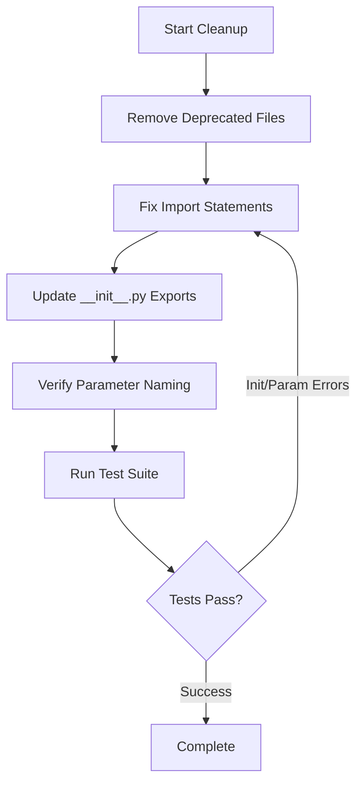
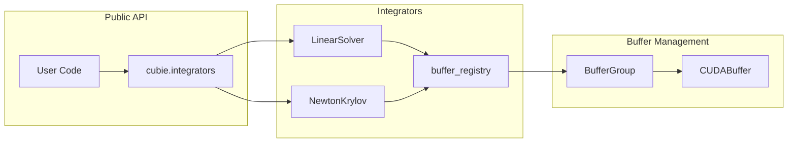

# Post-Refactor Repository Cleanup Plan

## User Stories

### Story 1: Remove Deprecated Compatibility Code
**As a** developer maintaining the CuBIE codebase  
**I want** all backward-compatibility stubs and deprecated files removed  
**So that** the codebase is clean and doesn't contain confusing legacy code

**Acceptance Criteria:**
- BufferSettings.py is removed (currently contains only deprecation notice)
- All deprecated test files (test_buffer_settings.py variants) are removed
- No remaining references to removed files exist in the codebase
- Documentation references to deprecated modules are updated

### Story 2: Fix Broken Imports
**As a** developer running tests or using the library  
**I want** all import statements to reference current, valid module names  
**So that** the code runs without ImportError exceptions

**Acceptance Criteria:**
- `linear_solver_factory` and `newton_krylov_solver_factory` imports are replaced with `LinearSolver` and `NewtonKrylov`
- All `__init__.py` files export the correct, current names
- All test files import valid, non-deprecated classes
- Package imports successfully without errors

### Story 3: Standardize Parameter Naming
**As a** developer or user configuring solvers  
**I want** parameter names to be consistent throughout the codebase  
**So that** configuration is predictable and discoverable

**Acceptance Criteria:**
- Parameter `krylov_tolerance` is spelled consistently (not `kyrlov_tolerance`)
- Buffer location parameters follow consistent naming pattern (`*_location`)
- Parameter sets (ALL_*_PARAMETERS) include all current parameter names
- No duplicate or inconsistent parameter name variants exist

### Story 4: Verify Updated Exports
**As a** developer using the public API  
**I want** new classes and functions to be properly exported  
**So that** I can import them from the appropriate packages

**Acceptance Criteria:**
- `BufferRegistry` and related classes exported from appropriate module
- `LinearSolver` and `NewtonKrylov` exported from integrators.matrix_free_solvers
- `LinearSolverConfig`, `LinearSolverCache`, `NewtonKrylovConfig`, `NewtonKrylovCache` exported
- Old exports (`linear_solver_factory`, `newton_krylov_solver_factory`) removed

### Story 5: Clean Test Suite Execution
**As a** developer running CUDA simulated tests  
**I want** tests to pass without initialization or parameter errors  
**So that** I can validate code changes confidently

**Acceptance Criteria:**
- CUDA_simulated test suite runs without ImportError
- No tests fail due to missing or renamed parameters
- No tests fail due to incorrect class instantiation
- Numerical and memory errors are acceptable (out of scope)

## Overview

### Context
A major refactor converted the buffer allocation system from factory functions to CUDAFactory subclasses. This change affected:
- Matrix-free solvers (linear_solver, newton_krylov)
- Buffer management (BufferSettings → buffer_registry)
- Multiple test files and import statements

### Key Changes Made in Refactor
1. **Factory Functions → CUDAFactory Classes**
   - `linear_solver_factory()` → `LinearSolver` class
   - `newton_krylov_solver_factory()` → `NewtonKrylov` class
   
2. **Buffer Management Refactor**
   - `BufferSettings` module → `buffer_registry` module
   - New `BufferRegistry`, `BufferGroup`, `CUDABuffer` classes
   - Centralized buffer allocation tracking

### Cleanup Required

### Impact Analysis

**Files Requiring Changes:**
1. **Deprecated Files to Remove** (4 files)
   - `src/cubie/BufferSettings.py`
   - `tests/test_buffer_settings.py`
   - `tests/integrators/algorithms/test_buffer_settings.py`
   - `tests/integrators/loops/test_buffer_settings.py`
   - `tests/integrators/matrix_free_solvers/test_buffer_settings.py`
   - `tests/integrators/matrix_free_solvers/test_newton_buffer_settings.py`

2. **Import Fixes Required** (2 critical)
   - `src/cubie/integrators/__init__.py`
   - Any test files importing old factory functions

3. **Parameter Consistency Checks** (search entire codebase)
   - Verify `krylov_tolerance` spelling
   - Check `*_location` parameter patterns
   - Update ALL_*_PARAMETERS sets

### Data Flow After Cleanup

## Expected Outcomes

### Before Cleanup
- ImportError on package import
- Deprecated files present
- Test suite cannot run
- Inconsistent parameter names

### After Cleanup
- Clean package import
- Only current, valid files remain
- Test suite runs (init/param errors fixed)
- Consistent parameter naming throughout

## Technical Decisions

### Decision 1: Complete Removal vs. Stub Files
**Decision:** Remove BufferSettings.py completely  
**Rationale:** The deprecation notice serves no purpose if we're cleaning up. The refactor is complete.  
**Alternative Considered:** Keep stub with import redirect - rejected as it delays cleanup

### Decision 2: Test File Strategy
**Decision:** Remove deprecated test files entirely  
**Rationale:** `test_buffer_registry.py` already exists and tests the new system  
**Alternative Considered:** Update old tests - rejected as duplicating effort

### Decision 3: Import Fix Strategy
**Decision:** Update all imports to use new class names directly  
**Rationale:** Cleaner, more explicit imports. Matches refactored architecture.  
**Alternative Considered:** Create compatibility aliases - rejected as perpetuating old names

## Risk Assessment

### Low Risk
- Removing empty/deprecated files
- Fixing import statements (syntax errors caught immediately)
- Updating __init__.py exports

### Medium Risk  
- Parameter naming consistency (requires thorough search)
- Test suite validation (may uncover additional issues)

### Mitigation
- Run test suite iteratively after each change category
- Use comprehensive grep searches for parameter consistency
- Review git diff before committing each stage
